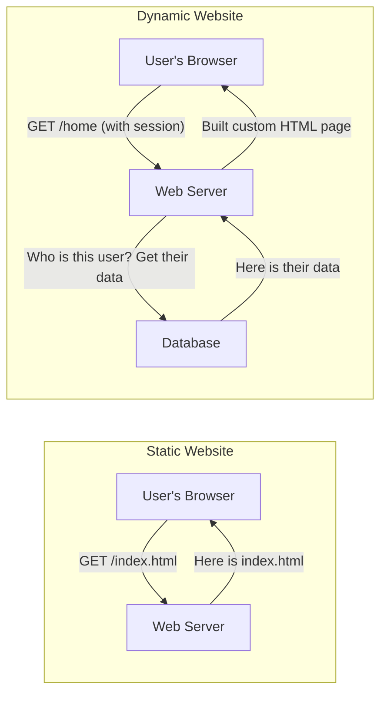
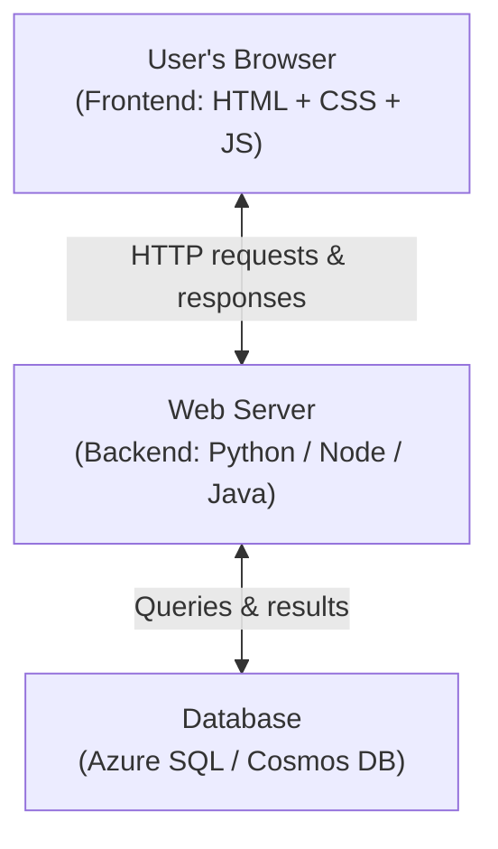
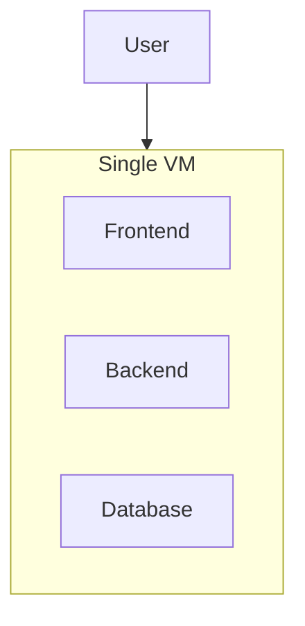
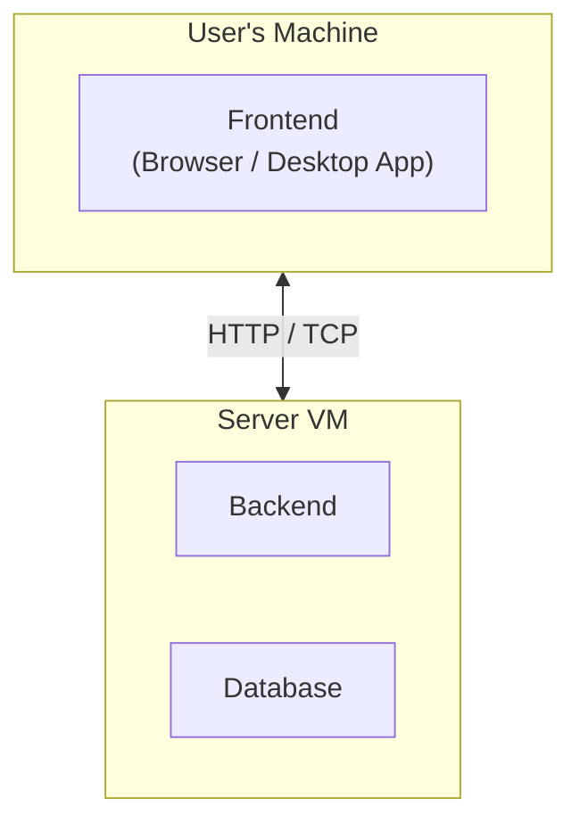
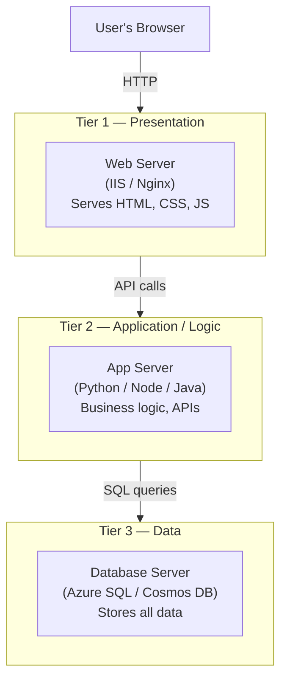

# Day 4 — Web Servers on Azure VMs: Architecture Concepts + IIS & Nginx

**Phase 1 — Compute**

> You've created a VM. You've connected to it. Now let's answer the real question — why do companies rent thousands of VMs in the cloud? Because every website, every app, every API you've ever used is running on a server somewhere. Today you're going to understand how websites actually work from the ground up, and then you're going to host one yourself — on both Windows and Linux — right inside Azure.

---

## What You'll Learn

- What a static website is and what a dynamic website is — and why the difference matters
- What Frontend, Backend, and Database mean in plain English
- What 1-Tier, 2-Tier, and 3-Tier architecture means — and why the industry chose 3-Tier
- What a web server is and what it actually does
- Full walkthrough: hosting a website on a Windows VM using IIS
- Full walkthrough: hosting a website on an Ubuntu VM using Nginx
- How to open port 80 on an Azure VM so the world can reach your site

---

## Part 1 — Core Concepts

### Static vs Dynamic Websites

Before we touch a single server, you need to understand what kind of content a website can serve.

#### Static Website

A **static website** sends the exact same files to every single visitor.

When you visit a static site, the server does one thing: it finds the file you asked for and sends it. No processing, no database query, no logic. Just: *"you asked for index.html, here it is."*

- Built with: HTML, CSS, JavaScript files
- Stored as: plain files on disk
- Examples: a portfolio page, a documentation site, a product landing page

This is exactly what we're going to build today. A simple HTML file sitting on a server, served to anyone who visits the IP address.

#### Dynamic Website

A **dynamic website** generates its content on the fly, based on who you are and what you're doing.

When you log into YouTube, the homepage you see is different from what your friend sees. YouTube's server doesn't have a pre-made HTML file for you — it builds that page in real time by:

1. Checking who you are (your account)
2. Querying the database for your watch history and recommendations
3. Assembling a custom HTML page and sending it back

- Built with: server-side languages (Python, Node.js, Java, C#, PHP) + HTML/CSS/JS
- Needs: a running server process, a database
- Examples: YouTube, Gmail, online banking, e-commerce



> **Where are we today?** Static. One HTML file, one web server, no database. By the time we reach the capstone project, you'll build the full dynamic, 3-tier version.

---

### Frontend, Backend, and Database

These three words come up in every tech job description, every architecture diagram, and every developer conversation. Let's define them clearly once and never confuse them again.

#### Frontend — What the User Sees

The frontend is everything that runs inside the user's browser.

When a page loads, the browser downloads three types of files:

| File type | What it does |
|-----------|--------------|
| HTML | Structure — headings, paragraphs, buttons, forms |
| CSS | Style — colors, fonts, layout, spacing |
| JavaScript | Behavior — clicking buttons, animations, sending data without refreshing |

The browser reads these files and renders what you see on screen. The user's machine does this work — not the server.

**Frontend = runs in the browser = the user's computer does the work.**

#### Backend — The Logic Layer

The backend is the server-side code that the user never sees.

When you click "Place Order" on an e-commerce site, something has to:

- Verify you're logged in
- Check if the item is in stock
- Charge your card
- Update the inventory
- Send a confirmation email

None of that happens in your browser. It happens on a server running backend code. The user just sees the result: *"Your order has been placed."*

Common backend languages: Python, Node.js (JavaScript), Java, C#, PHP, Go, Ruby.

**Backend = runs on a server = business logic, authentication, processing.**

#### Database — Where the Data Lives

The database is the long-term memory of your application.

Every user account, every product listing, every order, every message — it all needs to be stored somewhere and retrieved later. That's the database's job.

The backend talks to the database. The user never talks to the database directly.

Common databases: Azure SQL, PostgreSQL, MySQL (relational) and Cosmos DB, MongoDB (non-relational).

**Database = stores and retrieves data = the application's memory.**



---

### Architecture Tiers — How Applications Are Structured

Now that you understand the three components, let's talk about how you physically organise them. This is called **application architecture**, and the number of tiers describes how many separate layers your app is split across.

#### 1-Tier Architecture (Monolithic)

Everything — frontend, backend, and database — runs on a single machine.



**When you'd use it:** Local development, a tiny personal project, a proof of concept.

**The problem:** That one machine is a single point of failure. If it goes down, everything goes down. You also can't scale one layer without scaling all of them — if your database is fine but your backend is under load, you can't add more backend capacity without duplicating everything.

#### 2-Tier Architecture (Client-Server)

The frontend (client) is separated from the backend and database (server).



**Better than 1-tier:** Multiple clients can connect to one server. The frontend is decoupled.

**Still a problem:** Backend and database are on the same machine. A slow database query blocks your backend. You can't scale them independently.

#### 3-Tier Architecture (The Industry Standard)

Frontend, backend, and database each run on their own separate layer — independently scalable, independently deployable.



**Why every serious company uses 3-tier:**

| Benefit | What it means in practice |
|---------|--------------------------|
| Independent scaling | Your app layer is under load? Add more app servers without touching the database |
| Fault isolation | A bug in the backend doesn't crash the database |
| Security | Database is never directly exposed to the internet |
| Team separation | Frontend team, backend team, and DBA team each own their layer |

> **What we build in the capstone:** A real 3-tier app on Azure — Azure Load Balancer in front, App Service or VM for the backend, and Azure SQL for the database. Everything you're learning in these early days is a building block for that.

---

### What Is a Web Server?

We've been saying "web server" — let's define it precisely.

A **web server** is software that listens for HTTP requests on port 80 (or HTTPS on port 443) and responds by sending files or data back to the browser.

When you type `http://20.40.100.200` into your browser, your browser sends an HTTP GET request to that IP address on port 80. The web server software running on that machine receives the request, finds the appropriate file (usually `index.html`), and sends it back.

**Today we'll use two of the most popular web servers in the world:**

| Web Server | Platform | Market share |
|------------|----------|-------------|
| IIS (Internet Information Services) | Windows | Dominant in enterprise Windows stacks |
| Nginx | Linux | Used by Netflix, Cloudflare, Dropbox — extremely fast |

Both do the same fundamental job. The choice usually comes down to your OS and your team's expertise.

---

## Part 2 — Portal Demo

We're going to create two separate Azure VMs — one Windows, one Ubuntu — install a web server on each, and host a simple HTML page that anyone with the public IP can view.

---

### Setup — Create a Resource Group

**✅ Free Tier**

!!! success "Step 1 — Open Resource Groups"
    In the Azure Portal search bar, type **"Resource groups"** and click the result.

!!! success "Step 2 — Create the resource group"
    Click **"+ Create"** and fill in:

    | Field | Value |
    |-------|-------|
    | Subscription | *(your subscription)* |
    | Resource group name | `web-demo-rg` |
    | Region | *(same region you've been using)* |

    Click **"Review + create"** → **"Create."**

---

### Demo 1 — Windows VM with IIS

#### Creating the Windows VM

**✅ Free Tier**

!!! success "Step 1 — Start creating a VM"
    Search for **"Virtual machines"** in the portal, click **"+ Create"** → **"Azure virtual machine."**

!!! success "Step 2 — Fill in the Basics tab"

    | Field | Value |
    |-------|-------|
    | Resource group | `web-demo-rg` |
    | Virtual machine name | `windows-web-vm` |
    | Region | *(same as your resource group)* |
    | Image | **Windows Server 2022 Datacenter** |
    | Size | **Standard_B1s** *(Free Tier eligible — 1 vCPU, 1 GB RAM)* |
    | Username | `azureuser` |
    | Password | *(create a strong password — you'll need it for RDP)* |
    | Public inbound ports | **Allow selected ports** |
    | Select inbound ports | **RDP (3389)** |

    > We'll open port 80 for HTTP after the VM is created.

!!! success "Step 3 — Disks tab"
    Leave defaults — Standard SSD is fine for this demo.

!!! success "Step 4 — Networking tab"
    Leave all defaults. Azure automatically creates a VNet, subnet, and NSG for you.

!!! success "Step 5 — Review + Create"
    Click **"Review + create"** → **"Create."** Deployment takes 2–3 minutes.

---

#### Opening Port 80 for HTTP

**✅ Free Tier**

The VM is running, but its firewall (Network Security Group) only allows RDP right now. We need to add a rule to allow HTTP traffic on port 80.

!!! success "Step 6 — Go to your VM"
    Once deployment is complete, click **"Go to resource."**

!!! success "Step 7 — Open the NSG settings"
    In the left menu under **Settings**, click **"Networking."** You'll see the inbound port rules — currently only RDP (3389) is allowed.

!!! success "Step 8 — Add an inbound rule for HTTP"
    Click **"Add inbound port rule"** and fill in:

    | Field | Value |
    |-------|-------|
    | Source | Any |
    | Source port ranges | * |
    | Destination | Any |
    | Destination port ranges | **80** |
    | Protocol | TCP |
    | Action | Allow |
    | Priority | 310 |
    | Name | `Allow-HTTP-80` |

    Click **"Add."**

---

#### Installing IIS on the Windows VM

**✅ Free Tier**

!!! success "Step 9 — Copy the public IP"
    On your VM overview page, copy the **Public IP address**.

!!! success "Step 10 — Connect via RDP"
    Click **"Connect"** → **"RDP"** → **"Download RDP file."** Open it, enter your username and password when prompted. You're now inside the Windows Server desktop.

!!! success "Step 11 — Open Server Manager"
    Server Manager should open automatically when you log in. If not, click the Windows Start button and search for **"Server Manager."**

!!! success "Step 12 — Add the Web Server (IIS) role"
    1. In Server Manager, click **"Add roles and features."**
    2. Click **"Next"** on the Before You Begin page.
    3. Select **"Role-based or feature-based installation"** → **"Next."**
    4. Your server should already be selected → **"Next."**
    5. In the **Server Roles** list, check the box next to **"Web Server (IIS)."**
    6. A popup will ask to add required features — click **"Add Features."**
    7. Click **"Next"** through the remaining pages → **"Install."**
    8. Wait for installation to complete (about 1–2 minutes) → **"Close."**

!!! success "Step 13 — Verify IIS is running"
    Open **Internet Explorer** or **Edge** on the Windows Server desktop and go to `http://localhost`. You should see the default IIS welcome page — a blue and white page that says *"Internet Information Services."* IIS is running.

---

#### Hosting Your HTML Page

**✅ Free Tier**

IIS serves files from a folder called `wwwroot`. We're going to replace the default page with our own.

!!! success "Step 14 — Open File Explorer and navigate to wwwroot"
    Open **File Explorer** and go to:
    ```
    C:\inetpub\wwwroot
    ```
    You'll see `iisstart.htm` and a few other files — this is what generated the IIS welcome page.

!!! success "Step 15 — Create your HTML file"
    Right-click inside the folder → **"New"** → **"Text Document."** Name it `index.html` (make sure to remove the `.txt` extension).

    Open it with Notepad and paste in this HTML:

    ```html
    <!DOCTYPE html>
    <html lang="en">
    <head>
        <meta charset="UTF-8">
        <meta name="viewport" content="width=device-width, initial-scale=1.0">
        <title>My Azure Web Server</title>
        <style>
            body {
                font-family: Arial, sans-serif;
                display: flex;
                justify-content: center;
                align-items: center;
                height: 100vh;
                margin: 0;
                background-color: #0078d4;
                color: white;
                text-align: center;
            }
            .card {
                background: rgba(255,255,255,0.15);
                padding: 40px 60px;
                border-radius: 12px;
            }
            h1 { font-size: 2.5em; margin-bottom: 10px; }
            p { font-size: 1.2em; opacity: 0.9; }
        </style>
    </head>
    <body>
        <div class="card">
            <h1>Hello from Azure!</h1>
            <p>This page is hosted on a Windows Server VM using IIS.</p>
            <p>Web Server: <strong>Internet Information Services (IIS)</strong></p>
        </div>
    </body>
    </html>
    ```

    Save the file.

!!! success "Step 16 — View your website from outside the VM"
    On your own laptop, open a browser and go to:
    ```
    http://<your-vm-public-ip>
    ```
    You should see your page. You just hosted a website on an Azure VM.

!!! warning "If you see a connection timeout"
    Double-check that the NSG inbound rule for port 80 was saved correctly (Step 8). Also confirm IIS is running — go back to the VM and check Server Manager → **Tools** → **Internet Information Services (IIS) Manager.**

---

### Demo 2 — Ubuntu VM with Nginx

#### Creating the Ubuntu VM

**✅ Free Tier**

!!! success "Step 1 — Start creating a second VM"
    Search for **"Virtual machines"** → **"+ Create"** → **"Azure virtual machine."**

!!! success "Step 2 — Fill in the Basics tab"

    | Field | Value |
    |-------|-------|
    | Resource group | `web-demo-rg` |
    | Virtual machine name | `ubuntu-web-vm` |
    | Region | *(same region)* |
    | Image | **Ubuntu Server 22.04 LTS** |
    | Size | **Standard_B1s** *(Free Tier eligible)* |
    | Authentication type | **SSH public key** |
    | Username | `azureuser` |
    | SSH public key source | **Generate new key pair** |
    | Key pair name | `ubuntu-web-vm-key` |
    | Public inbound ports | **Allow selected ports** |
    | Select inbound ports | **SSH (22)** |

!!! success "Step 3 — Networking tab"
    Leave all defaults.

!!! success "Step 4 — Review + Create"
    Click **"Review + create"** → **"Create."**

    When prompted to **"Download private key and create resource"**, click it. This downloads your `.pem` file — save it somewhere you can find it.

---

#### Opening Port 80 on the Ubuntu VM

**✅ Free Tier**

!!! success "Step 5 — Add HTTP inbound rule"
    Once deployment is complete, go to your Ubuntu VM → **"Networking"** → **"Add inbound port rule."**

    | Field | Value |
    |-------|-------|
    | Destination port ranges | **80** |
    | Protocol | TCP |
    | Action | Allow |
    | Priority | 310 |
    | Name | `Allow-HTTP-80` |

    Click **"Add."**

---

#### Installing Nginx and Hosting the Page

**✅ Free Tier**

!!! success "Step 6 — Get the public IP"
    Copy the **Public IP address** from your Ubuntu VM overview page.

!!! success "Step 7 — SSH into the VM"
    Open your terminal (PowerShell, Command Prompt, or macOS/Linux Terminal) and run:

    ```bash
    ssh -i ~/Downloads/ubuntu-web-vm-key.pem azureuser@<your-ubuntu-vm-ip>
    ```

    > If you get a permissions error on the `.pem` file, run:
    > ```bash
    > chmod 400 ~/Downloads/ubuntu-web-vm-key.pem
    > ```
    > Then try the SSH command again.

    Type `yes` when asked to confirm the host fingerprint. You're now inside the Ubuntu VM.

!!! success "Step 8 — Update packages"
    ```bash
    sudo apt update
    ```
    This refreshes the list of available packages. It takes about 20–30 seconds.

!!! success "Step 9 — Install Nginx"
    ```bash
    sudo apt install nginx -y
    ```
    The `-y` flag automatically answers "yes" to the installation prompt. Nginx installs and **starts automatically**.

!!! success "Step 10 — Confirm Nginx is running"
    ```bash
    sudo systemctl status nginx
    ```
    You should see `active (running)` in green. Press `q` to exit.

    You can also verify it immediately: on your own laptop, open a browser and go to `http://<your-ubuntu-vm-ip>`. You'll see the Nginx default welcome page — **"Welcome to nginx!"**

---

#### Replacing the Default Page with Your HTML

**✅ Free Tier**

Nginx serves files from `/var/www/html/`. We're going to replace the default page.

!!! success "Step 11 — Navigate to the web root"
    ```bash
    cd /var/www/html
    ls
    ```
    You'll see `index.nginx-debian.html` — the default welcome page.

!!! success "Step 12 — Write your HTML file"
    ```bash
    sudo nano index.html
    ```
    Paste in this HTML (you can use the same page as before, just update the description):

    ```html
    <!DOCTYPE html>
    <html lang="en">
    <head>
        <meta charset="UTF-8">
        <meta name="viewport" content="width=device-width, initial-scale=1.0">
        <title>My Azure Web Server</title>
        <style>
            body {
                font-family: Arial, sans-serif;
                display: flex;
                justify-content: center;
                align-items: center;
                height: 100vh;
                margin: 0;
                background-color: #e95420;
                color: white;
                text-align: center;
            }
            .card {
                background: rgba(255,255,255,0.15);
                padding: 40px 60px;
                border-radius: 12px;
            }
            h1 { font-size: 2.5em; margin-bottom: 10px; }
            p { font-size: 1.2em; opacity: 0.9; }
        </style>
    </head>
    <body>
        <div class="card">
            <h1>Hello from Azure!</h1>
            <p>This page is hosted on an Ubuntu Server VM using Nginx.</p>
            <p>Web Server: <strong>Nginx on Ubuntu 22.04</strong></p>
        </div>
    </body>
    </html>
    ```

    Press `Ctrl + X` → `Y` → `Enter` to save and exit nano.

!!! success "Step 13 — View your website"
    On your own laptop, refresh `http://<your-ubuntu-vm-ip>` in the browser. Your custom page appears. You're now hosting a website on a Linux VM in Azure.

---

### Comparing IIS vs Nginx Side by Side

Now that you've used both, here's how they compare:

| | IIS | Nginx |
|--|-----|-------|
| Platform | Windows only | Linux (primarily), also Windows |
| Configuration | GUI in Server Manager + IIS Manager | Config files (`/etc/nginx/nginx.conf`) |
| Setup | Click through a wizard | Two commands: `apt install nginx` |
| Performance | Excellent on Windows workloads | Extremely fast, handles high concurrency well |
| Typical use | Enterprise .NET apps, Windows-based stacks | Modern web apps, reverse proxy, static sites |
| Market share | Large in enterprise | Dominant in modern cloud deployments |

Both are production-grade. The choice comes down to what your application is built on.

---

### Cleaning Up

**✅ Free Tier**

To avoid accruing compute charges, deallocate both VMs when you're done practising.

!!! warning "Deallocate, don't just stop"
    In Azure, "stopping" a VM from inside the OS does NOT stop billing for compute. You must **deallocate** the VM from the Azure Portal.

    Go to each VM → click **"Stop"** in the portal toolbar. This deallocates the VM and stops compute charges.

    Alternatively, delete the entire `web-demo-rg` resource group to remove everything at once.

---

## Summary and What's Next

Today you covered a lot of ground.

On the theory side: you now understand the difference between static and dynamic websites, what frontend, backend, and database mean, and how 1-Tier, 2-Tier, and 3-Tier architectures differ. That 3-Tier diagram you saw today is the foundation of every serious cloud application — and it's what you're building toward.

On the practical side: you stood up two VMs, installed two of the world's most widely-used web servers, and hosted an actual web page that's publicly accessible on the internet.

**Coming up next:** Day 5 goes back to Azure compute — specifically **Azure App Service**, Microsoft's managed platform for hosting web applications. Instead of managing a VM and installing IIS yourself, App Service handles all of that for you. You deploy your code, Azure handles the rest.

---

## Key Takeaways

- A **static website** sends the same files to every visitor. A **dynamic website** generates content on the fly based on user data.
- **Frontend** runs in the browser. **Backend** runs on a server. **Database** stores data.
- **3-Tier architecture** separates presentation, logic, and data onto independent layers — enabling independent scaling, fault isolation, and team separation.
- A **web server** (IIS or Nginx) listens on port 80/443 and responds to HTTP requests with files or data.
- Every Azure VM blocks inbound traffic by default. You must explicitly open ports in the **Network Security Group (NSG)**.
- **IIS** is the standard on Windows. **Nginx** is dominant on Linux and in modern cloud deployments.
- The capstone project will build a full **3-Tier application on Azure** — everything from Day 1 onwards is a building block for that.
