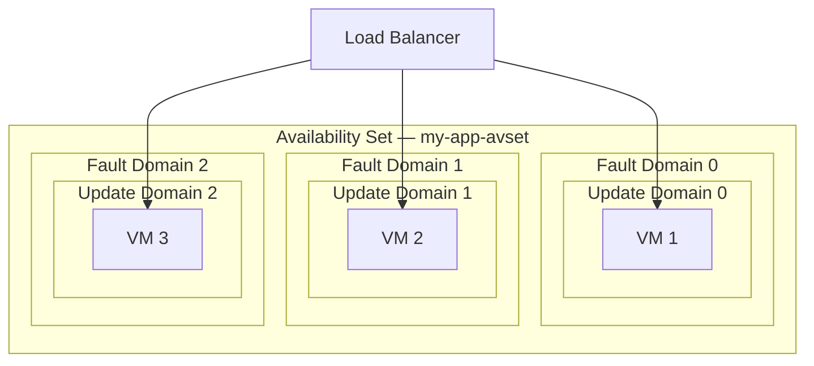
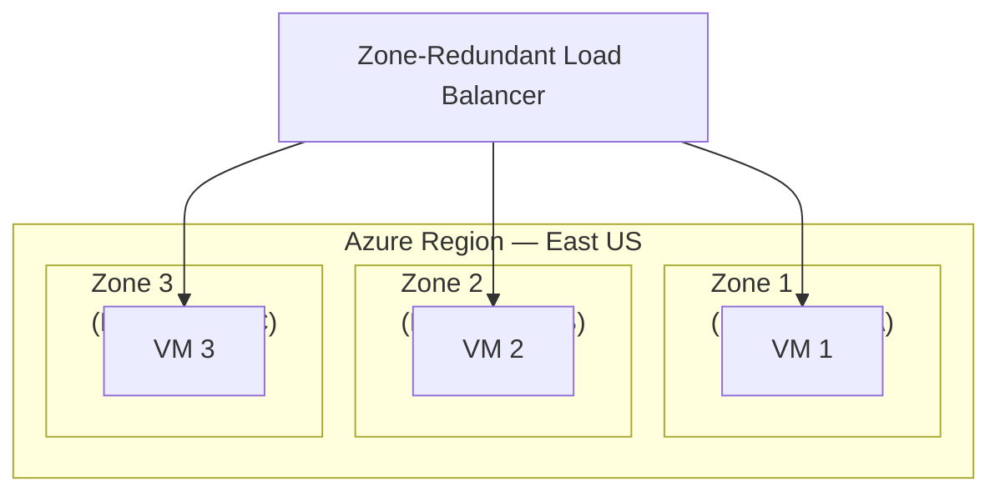
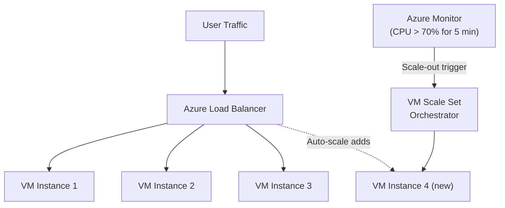
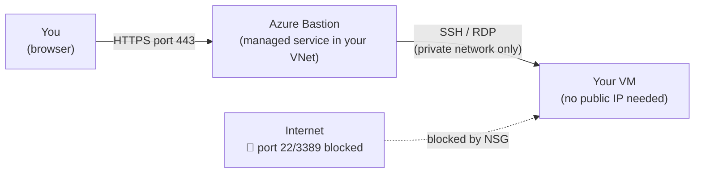
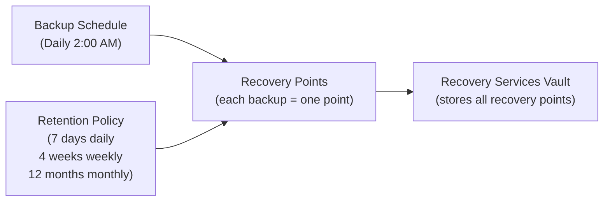
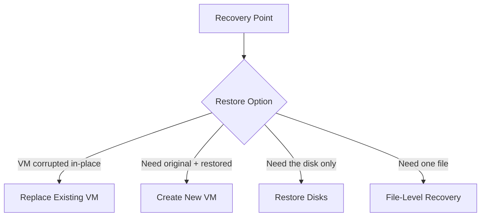

# Day 5 — Azure Virtual Machines Part 3: Management, Availability & Backup

**Phase 1 — Compute**

> You can create a VM and connect to it. But in the real world, that's only the beginning. What happens when the physical server your VM lives on fails? What happens when traffic doubles overnight? What happens if someone accidentally deletes your VM? Today you'll learn how Azure keeps VMs reliable at scale — and how to protect your data with a fully managed backup service.

---

## What You'll Learn

- Availability Sets and Availability Zones — how Azure protects VMs from hardware and datacenter failures
- VM Scale Sets (VMSS) — automatically deploy and scale a group of identical VMs based on demand
- VM Snapshots — capture a disk's exact state at a point in time
- Custom Images — turn a configured VM into a reusable template for deploying identical VMs
- Azure Bastion — connect to VMs securely without exposing SSH or RDP to the internet
- Azure Backup — fully managed backup service: Recovery Services Vault, backup policies, recovery points, and all four restore options
- VM Monitoring — view CPU, memory, and disk metrics and set up an alert in the portal

---

## Before We Begin — Set Up a VM

All the demos today require an existing VM. If you have your VM from Day 3 still running (or deallocated), start it up. If not, create a quick Ubuntu B1s VM in a new resource group called `vm-mgmt-rg` — the steps are in Day 3.

**✅ Free Tier**

> For the backup demos, a Linux VM is fine. For Bastion, you can watch the instructor demo — Bastion is a paid service (~$0.19/hr).

---

## Part 1 — Availability: Protecting VMs from Failure

### The Problem — What Can Go Wrong?

When your VM runs on a physical server in a Microsoft data center, that server has hardware inside it — CPUs, RAM, hard drives, network cards. Any of that hardware can fail. Rarely, but it happens.

There are two types of failures you need to plan for:

| Failure type | What it means |
|---|---|
| **Unplanned hardware failure** | A physical component dies — your VM goes down until Azure migrates it |
| **Planned maintenance** | Microsoft needs to update the hypervisor or hardware — your VM may restart |

If you run your application on a single VM, either of those events takes your app offline. For production workloads, that's not acceptable.

Azure gives you two tools to solve this: **Availability Sets** and **Availability Zones**.

---

### Availability Sets

An **Availability Set** is a logical grouping of VMs that tells Azure to spread them across different physical hardware within the same data center.

When you put two or more VMs in an Availability Set, Azure guarantees they will never be on the same:
- **Fault Domain** — a rack of servers sharing power and network switches. If a rack loses power, only VMs on that rack are affected.
- **Update Domain** — a group of servers that are rebooted together during planned maintenance. Azure reboots update domains one at a time — so your other VMs stay running.

**The guarantee:** Azure's SLA for two or more VMs in an Availability Set is **99.95% uptime**.

**The catch:** Availability Sets protect against hardware failure within a single data center. They do NOT protect against the entire data center going down (flood, power outage, network issue).

**When to use:** When you need high availability within a single region and you want the lowest cost (VMs in Availability Sets use standard managed disks).

---

### Availability Zones

An **Availability Zone** is a physically separate data center within the same Azure region. Each zone has its own independent power, cooling, and networking.

Every major Azure region has at least three zones — Zone 1, Zone 2, and Zone 3. They are connected by a high-speed private network but are physically kilometres apart.

**The guarantee:** VMs spread across Availability Zones have a **99.99% uptime SLA** — the highest available for individual VMs.

**Why higher than Availability Sets?** Because even if an entire data center goes dark, your other zones keep serving traffic.

**When to use:** Any production workload that cannot afford downtime. Most enterprise deployments today target Availability Zones.

---

### Availability Sets vs Availability Zones — Side by Side

| | Availability Sets | Availability Zones |
|---|---|---|
| Protection scope | Rack/hardware failure within one data center | Full data center failure |
| SLA | 99.95% | 99.99% |
| Cost | No extra charge | Small inter-zone data transfer cost |
| Disk requirement | Managed disks required | Managed disks required |
| When to use | Lower-cost HA within a single DC | Maximum resilience, production workloads |

> **Important:** You choose Availability Set or Availability Zone at VM creation time. You cannot add a running VM to an Availability Set or change its zone after it is deployed.

---

## Part 2 — VM Scale Sets (VMSS)

### The Problem — What Happens When Traffic Spikes?

Imagine you run an e-commerce site on a single VM. On a normal day, one VM handles the load fine. But on a sale day, traffic goes 10x. Your single VM is overwhelmed — slow responses, errors, lost revenue.

You could provision a large VM to handle peak traffic. But then you're paying for maximum capacity 24/7, even at 2 AM when nobody's shopping.

**VM Scale Sets solve this.**

### What Is a VM Scale Set?

A **VM Scale Set (VMSS)** is a group of identical VMs managed as a single unit. You define one configuration (OS image, size, startup script), and Azure creates as many copies as you need — automatically.

Key capabilities:

| Capability | What it means |
|---|---|
| **Auto-scale** | Add VMs when CPU is above 70%, remove them when it drops below 30% |
| **Identical instances** | Every VM in the set is cloned from the same image — consistent configuration |
| **Load balancer integration** | Traffic is automatically distributed across all healthy instances |
| **Rolling upgrades** | Update VMs one batch at a time — no full downtime during deployments |
| **Spot instance support** | Run the scale set on Spot VMs for massive cost savings on fault-tolerant workloads |

### Orchestration Modes

When creating a VMSS, you choose an orchestration mode:

- **Flexible orchestration** — Microsoft's recommended mode. You get full control over individual VM instances. Works with Availability Zones. Better for most modern workloads.
- **Uniform orchestration** — all instances are truly identical and managed as one unit. Better for stateless workloads like web servers or batch processing where instances are interchangeable.

### Auto-Scale Rules

An auto-scale rule has two parts:

1. **Scale-out rule** — when to add VMs. Example: if average CPU > 70% for 5 minutes, add 2 VMs.
2. **Scale-in rule** — when to remove VMs. Example: if average CPU < 30% for 10 minutes, remove 1 VM.

You also set minimum and maximum instance counts so auto-scale never goes below 2 (for availability) or above 20 (to control cost).

> **VMSS is not for today's demo** — it requires a Load Balancer in front of it to distribute traffic, which we cover in Day 8. We'll build a full VMSS + Load Balancer setup there. Today we understand the concept so Day 8 makes sense immediately.

---

## Part 3 — Snapshots and Custom Images

### VM Snapshots

A **snapshot** is a read-only copy of a managed disk taken at a specific point in time. It captures everything on that disk at that exact moment.

**What snapshots are for:**
- **Before a risky operation** — about to install a major OS update or a new application? Take a snapshot first. If something breaks, you restore from the snapshot.
- **Quick backup** — snapshots are faster than a full Azure Backup for a one-time point-in-time capture.
- **Cloning a disk** — create a new managed disk from a snapshot to spin up a copy of a VM.

**What snapshots are NOT for:**
- Long-term backup with scheduling and retention policies — use Azure Backup for that.
- Application-consistent backups where you need the database to be in a clean state — Azure Backup handles VSS quiescing on Windows and the freeze/thaw scripts on Linux.

Snapshots are stored as managed disks and billed by the size of the snapshot.

### Custom Images

A **custom image** (also called a **Managed Image** or **Azure Compute Gallery image**) is a snapshot of an entire VM — OS disk and optionally data disks — turned into a reusable template.

**Use case:** You've set up a VM exactly how you want it — installed your web server, configured your application, applied security hardening. Instead of repeating that setup on every new VM, you capture the image and use it as the base for all future VMs.

**The process:**
1. Configure your VM exactly as you want it.
2. Generalize it (`sysprep` on Windows, `waagent -deprovision` on Linux) — this removes machine-specific identifiers so clones don't conflict.
3. Capture the VM as an image in Azure.
4. Deploy new VMs from that image instead of a marketplace base image.

VM Scale Sets use custom images heavily — every instance in a VMSS is deployed from the same image for consistency.

---

## Part 4 — Azure Bastion

### The Problem with Public SSH and RDP

When you expose port 22 (SSH) or port 3389 (RDP) directly to the internet via an NSG rule, you're giving the entire internet a door to knock on. Automated scanners constantly probe those ports for weak passwords or unpatched vulnerabilities. Every exposed SSH or RDP port is an attack surface.

The common solution used to be a **jump server** (also called a bastion host) — a hardened VM in a public subnet that you SSH into first, and then from there you SSH into your private VMs. You're only exposing one machine to the internet.

Azure Bastion is Microsoft's managed version of that pattern — and it's significantly better.

### What Is Azure Bastion?

**Azure Bastion** is a fully managed PaaS service that lets you connect to your VMs directly from the Azure Portal, over HTTPS (port 443), without exposing port 22 or 3389 to the internet at all.

**Key benefits:**

| | Traditional SSH/RDP | Azure Bastion |
|---|---|---|
| Port exposure | 22 / 3389 open to internet | No VM ports exposed |
| Access method | SSH client / RDP client | Browser only (HTTPS) |
| VM needs public IP | Yes | No |
| Management | You manage jump server | Fully managed by Microsoft |
| Cost | Jump server compute | ~$0.19/hr (Bastion host) |

**How it works:** You deploy Bastion into a special subnet called `AzureBastionSubnet` inside your VNet. It connects to your VMs over the private network — no public IP or open ports required on the VM.

**💳 Paid — Instructor Demo:** Azure Bastion costs approximately $0.19/hr for the Basic SKU. We'll demonstrate it in the portal — students can follow along without deploying to avoid the charge.

---

## Part 5 — Azure Backup

This is the most important section of today's session. If you run a VM with important data and it gets deleted or corrupted, you need a way to get it back. Azure Backup is how you do that.

### What Is Azure Backup?

**Azure Backup** is Microsoft's native, fully managed backup-as-a-service. You don't need to manage backup infrastructure, backup agents, or storage accounts manually. You tell Azure what to back up and when — Azure handles everything else.

**What Azure Backup can protect:**
- Azure VMs (the whole VM — OS + data disks)
- SQL Server running inside Azure VMs
- Azure Files (file shares)
- Azure Blobs
- Azure Managed Disks
- On-premise servers (via Microsoft Azure Recovery Services agent)

Today we focus on **VM backup**.

---

### Recovery Services Vault

Before you can back anything up, you need a **Recovery Services Vault**.

A **Recovery Services Vault** is the storage container that holds all your backup data. Think of it as a bank vault — your backups are the valuables inside.

Key things to know:

| Property | Detail |
|---|---|
| **Region** | A vault must be in the same region as the VMs it protects |
| **One vault, many VMs** | A single vault can protect multiple VMs |
| **Redundancy** | Your vault's storage is replicated — LRS (3 copies in one data center) or GRS (6 copies across two regions) |
| **Soft delete** | Deleted backup data is retained for 14 additional days before permanent removal — protection against ransomware or accidental deletion |

---

### Backup Policy

A **backup policy** defines two things:
1. **Schedule** — when to take backups (daily at 2:00 AM, or weekly on Sunday)
2. **Retention** — how long to keep each recovery point

Example policy:
- Daily backup at 2:00 AM
- Keep daily backups for 7 days
- Keep weekly backups (taken on Sunday) for 4 weeks
- Keep monthly backups for 12 months

This means you can recover from any point in the last week, any Sunday in the last month, or any month in the last year.

---

### Recovery Points

Every time a backup job runs successfully, it creates a **recovery point** — a snapshot of your VM's state at that moment.

In the Azure Portal, you can browse all recovery points for a VM and see exactly which points are available to restore from. Recovery points are labelled with their date and time.

**Application-consistent vs Crash-consistent:**

| Type | What it means | When it happens |
|---|---|---|
| **Application-consistent** | VSS (Windows) or freeze/thaw scripts (Linux) ensure the app is in a clean state before the snapshot | When app-consistent settings are configured |
| **Crash-consistent** | Snapshot taken as-is — like pulling the power cord and snapshotting the disk | Fallback when app-consistent isn't possible |

Application-consistent is always preferred for databases — it ensures no transaction is half-written when the backup is taken.

---

### Restore Options

When you need to restore from a backup, Azure gives you four options:

**1. Replace Existing VM**
Overwrites your running VM with the backed-up state. The current VM's disks are replaced. Use this when your VM is corrupted and you want to restore it in-place.

**2. Create New VM**
Restores the backup as a brand-new VM — the original VM is left completely untouched. Use this when you want to test a restore, or when you need the original and the restored version to co-exist.

**3. Restore Disks Only**
Restores the managed disk from the backup without creating a VM. You then attach the disk manually to a VM. Use this for surgical restores where you need to inspect the disk contents first.

**4. File-Level Recovery**
Mounts the backup as a temporary drive on a running VM. You can then browse the backed-up file system and copy individual files back. Use this when you just need to recover one file, not the entire VM.

---

### Backup Pricing

Azure Backup charges for two things:
1. **Protected instance fee** — a small per-VM monthly fee based on the VM size
2. **Storage fee** — charged for the storage space used by your recovery points in the vault

GRS vaults cost more than LRS because your backup data is replicated to a second region, giving you protection even if the primary region has an outage.

---

## Part 6 — Portal Demo

### Demo 1 — Create a VM Snapshot

**✅ Free Tier**

!!! success "Step 1 — Open your VM's Disks"
    Go to your VM in the Azure Portal. In the left menu, click **"Disks."** You'll see your OS disk listed.

!!! success "Step 2 — Open the OS disk"
    Click the name of your OS disk to open the disk resource.

!!! success "Step 3 — Create a snapshot"
    In the disk's left menu, click **"Create snapshot."**

    Fill in:

    | Field | Value |
    |-------|-------|
    | Resource group | *(same as your VM)* |
    | Name | `my-vm-os-snapshot-01` |
    | Snapshot type | **Full** |
    | Storage type | **Standard HDD** *(cheapest for a snapshot you don't need frequently)* |

    Click **"Review + create"** → **"Create."**

!!! success "Step 4 — Verify the snapshot"
    Search for **"Snapshots"** in the portal search bar. Your snapshot appears with its size and creation time. This is a frozen copy of your OS disk at this exact moment.

    > To restore from this snapshot later: go to the snapshot → **"Create disk"** → attach the new disk to a VM. The VM will boot from the restored disk.

---

### Demo 2 — Enable Azure Backup

**✅ Free Tier**

!!! success "Step 1 — Create a Recovery Services Vault"
    Search for **"Recovery Services vaults"** in the portal → click **"+ Create."**

    | Field | Value |
    |-------|-------|
    | Resource group | `vm-mgmt-rg` |
    | Vault name | `my-backup-vault` |
    | Region | *(same region as your VM — this is required)* |

    Click **"Review + create"** → **"Create."**

!!! success "Step 2 — Open the vault"
    Once deployed, click **"Go to resource."** You're now inside the Recovery Services Vault.

!!! success "Step 3 — Enable backup for your VM"
    In the vault's left menu, under **Getting started**, click **"Backup."**

    - **Where is your workload running?** → **Azure**
    - **What do you want to back up?** → **Virtual machine**

    Click **"Backup."**

!!! success "Step 4 — Review the default backup policy"
    You'll see the **DefaultPolicy** pre-selected:
    - Daily backup at 2:30 AM UTC
    - 30-day retention for daily recovery points
    - 12-week retention for weekly recovery points

    This is fine for our demo. In production, you'd create a custom policy with your specific retention requirements.

!!! success "Step 5 — Select your VM"
    Click **"Add"** under Virtual Machines. Your VM appears in the list. Select it and click **"OK."**

!!! success "Step 6 — Enable backup"
    Click **"Enable Backup."** Azure will configure the backup extension on your VM. This takes about 1–2 minutes.

---

### Demo 3 — Trigger an On-Demand Backup

**✅ Free Tier**

The scheduled backup runs at 2:30 AM, but you can trigger one manually right now.

!!! success "Step 1 — Go to Backup Items"
    Inside your Recovery Services Vault, click **"Backup items"** in the left menu → **"Azure Virtual Machine."** Your VM appears in the list.

!!! success "Step 2 — Trigger a backup now"
    Click on your VM → **"Backup now."**

    Set the **Retain Backup Till** date to one week from today (this is how long this specific recovery point will be kept regardless of policy).

    Click **"OK."**

!!! success "Step 3 — Monitor the backup job"
    In the vault left menu, click **"Backup jobs."** You'll see your job in progress with status **"In progress."**

    Click the job to see details — the individual steps: taking the snapshot, transferring data to the vault, completing. A full initial backup of a B1s VM typically takes 15–30 minutes.

---

### Demo 4 — Explore Recovery Points and Restore Options

**✅ Free Tier** *(explore only — we won't actually restore)*

!!! success "Step 1 — View recovery points"
    Go to **Backup items** → **Azure Virtual Machine** → click your VM.

    You'll see all available recovery points listed with their date, time, and consistency type (application-consistent or crash-consistent). Each row is a point in time you can restore from.

!!! success "Step 2 — Explore the restore wizard"
    Click **"Restore VM."** Azure opens the restore wizard. Browse through the options:

    - **Restore type** — you can see all four options: Create new VM, Replace existing, Restore disks, File recovery.
    - **Restore point** — select any available recovery point.

    > We're just exploring — click **"Cancel"** when done. No restore is needed for this demo.

!!! success "Step 3 — File-level recovery"
    Back on the VM backup page, click **"File Recovery."** This shows you how to mount a recovery point as a temporary drive on a running VM. Azure gives you a script to run on the VM — it mounts the backup disk so you can copy individual files.

    Again, just explore the wizard — click **"Cancel."**

---

### Demo 5 — Azure Bastion (Instructor Demo)

**💳 Paid — Instructor Demo (~$0.19/hr)**

> Azure Bastion is paid. This demo is instructor-only. Students should watch and understand the concept — you do not need to deploy this for the course.

!!! info "How to deploy Azure Bastion"
    1. Go to your VM → **"Connect"** → **"Bastion."**
    2. Azure will prompt you to create a `AzureBastionSubnet` in your VNet — click **"Create subnet."**
    3. Click **"Deploy Bastion"** — this takes 5–10 minutes to provision.
    4. Once deployed, you connect by entering your VM's username and password (or SSH key) directly in the browser — no SSH client or RDP file needed.
    5. A terminal or desktop session opens right inside the Azure Portal tab.

    **To avoid ongoing charges:** After demonstrating, go to the `AzureBastionSubnet` → delete the Bastion host, or simply delete it from the Bastion resource itself.

---

### Demo 6 — Set Up a CPU Alert

**✅ Free Tier**

This is a preview of Azure Monitor — we'll go deep on monitoring in Day 17. But setting up a basic alert now means you get notified if your VM is under heavy load.

!!! success "Step 1 — Open Alerts for your VM"
    Go to your VM → in the left menu under **Monitoring**, click **"Alerts"** → **"+ Create"** → **"Alert rule."**

!!! success "Step 2 — Configure the signal"
    Under **Condition**, click **"Add condition."**

    Search for and select **"Percentage CPU."**

    Configure the threshold:
    - **Operator:** Greater than
    - **Aggregation type:** Average
    - **Threshold value:** 80
    - **Check every:** 1 minute
    - **Lookback period:** 5 minutes

    Click **"Next: Actions."**

!!! success "Step 3 — Create an Action Group"
    An Action Group defines what happens when the alert fires — send an email, trigger a webhook, etc.

    Click **"+ Create action group"** and fill in:

    | Field | Value |
    |-------|-------|
    | Action group name | `vm-alerts-ag` |
    | Display name | `VM Alerts` |

    Under **Notifications**, add:
    - Notification type: **Email/SMS/Push/Voice**
    - Name: `Email me`
    - Email: *(your email address)*

    Click **"Review + create"** → **"Create."**

!!! success "Step 4 — Name the alert rule and save"
    Back in the alert rule wizard:
    - **Alert rule name:** `VM CPU above 80%`
    - **Severity:** 2 — Warning

    Click **"Review + create"** → **"Create."**

    You'll now receive an email whenever your VM's CPU averages above 80% for 5 minutes.

---

### Cleaning Up

**✅ Free Tier**

!!! warning "Stop backup before deleting"
    If you want to delete your VM or resource group, stop the backup first. Go to the vault → **Backup items** → your VM → **"Stop backup"** → choose **"Delete backup data."** If you delete the VM without stopping backup, the vault still holds recovery points and charges for storage.

To clean up everything: delete `vm-mgmt-rg`. This removes the VM, disks, and snapshot. Then delete `my-backup-vault` from whatever resource group it's in.

---

## Summary and What's Next

Today you went from knowing how to create a VM to knowing how to keep it reliable, scalable, and protected.

**Availability Sets and Zones** ensure your application stays up even when hardware fails — Availability Sets protect against rack-level failures (99.95% SLA), Availability Zones protect against full data center failures (99.99% SLA).

**VM Scale Sets** let you define one configuration and have Azure automatically add or remove VM instances based on demand — you pay for what you use, and traffic spikes don't take your app down.

**Snapshots** give you a quick point-in-time capture of a disk — great before risky changes. **Custom Images** let you clone a fully configured VM into a reusable template.

**Azure Bastion** eliminates the need to expose SSH or RDP to the internet — you connect through the browser over HTTPS, with no public IP required on the VM.

**Azure Backup** is the proper production solution for VM protection — Recovery Services Vault, scheduled backup policies, retention rules, and four restore options covering every scenario from a full VM restore to recovering a single file.

**Coming up next:** Day 6 moves to **Azure App Service** — Microsoft's managed platform for hosting web applications. Instead of managing the OS, web server, and patches yourself (as you did in Day 4 with IIS and Nginx), App Service handles all of that. You deploy your code, Azure runs it.

---

## Key Takeaways

- **Availability Sets** spread VMs across fault and update domains within one data center — 99.95% SLA. Set at creation time, cannot change later.
- **Availability Zones** spread VMs across physically separate data centers in the same region — 99.99% SLA. The standard for production workloads.
- **VM Scale Sets** deploy identical VM instances with auto-scale rules — adds capacity when load increases, removes it when load drops. Covered in depth with Load Balancer in Day 8.
- **Snapshots** are point-in-time captures of a disk — fast, but not a replacement for scheduled backup.
- **Custom Images** let you bake your configuration into a template and deploy identical VMs from it.
- **Azure Bastion** provides browser-based SSH/RDP access without exposing ports 22 or 3389 to the internet. Paid service.
- **Recovery Services Vault** is the container that stores all your backup data — must be in the same region as the protected VMs.
- **Backup Policy** defines schedule + retention. You set it once; Azure handles the rest.
- **Four restore options:** Replace existing VM, Create new VM, Restore disks, File-level recovery — each for a different scenario.
- **Soft delete** on the vault keeps deleted backup data for 14 days — protection against accidental or malicious deletion.
- Always **stop backup before deleting a VM** to avoid orphaned recovery points continuing to accrue storage charges.
