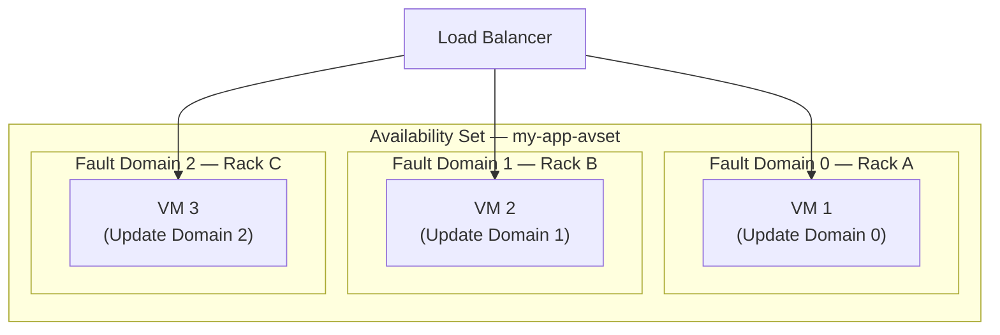
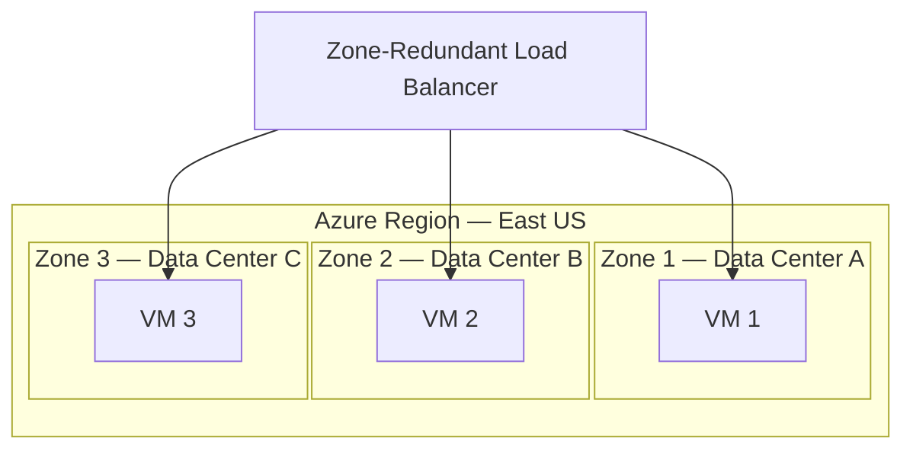
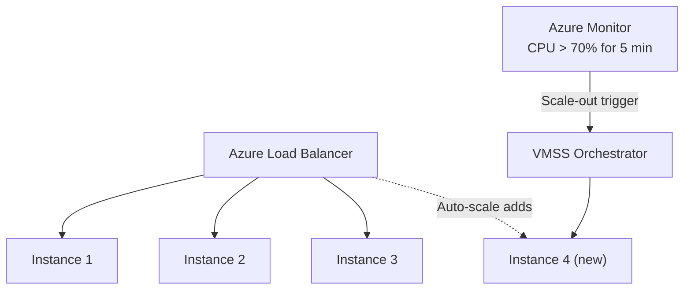
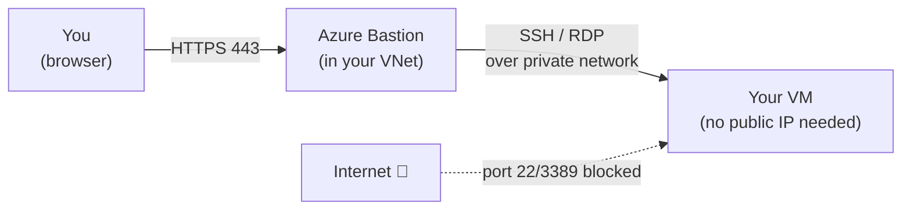
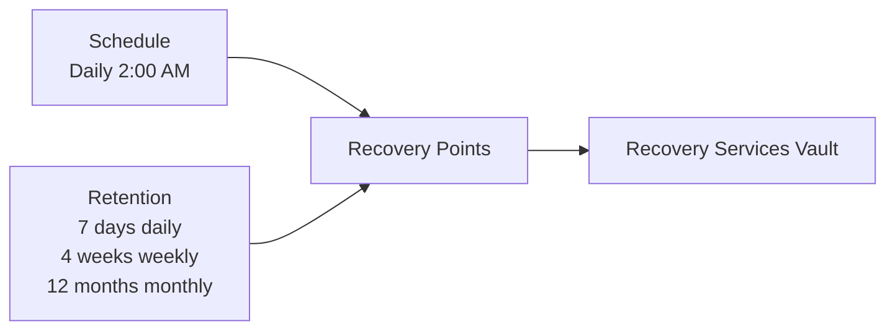
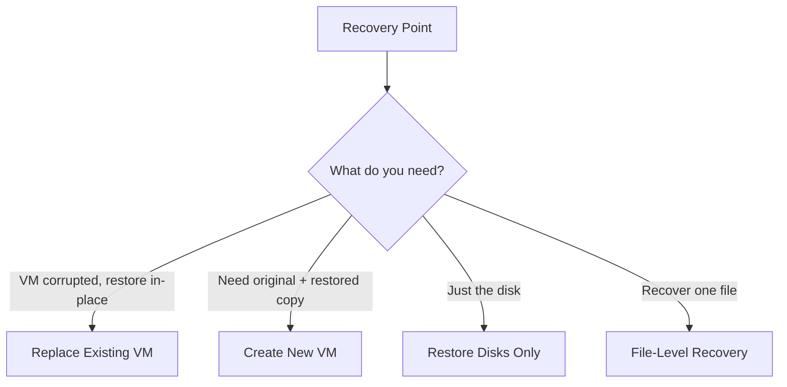

# Day 5 — Azure Virtual Machines Part 3: Management, Availability & Backup

**Phase 1 — Compute**

> You can create a VM and connect to it. But in the real world, that's only the beginning. What happens when the physical server your VM lives on fails? What happens when traffic doubles overnight? What happens if someone accidentally deletes your VM? Today you'll learn how Azure keeps VMs reliable at scale — and how to protect your data with a fully managed backup service.

---

## What You'll Learn

- Availability Sets and Availability Zones — how Azure protects VMs from hardware and datacenter failures
- VM Scale Sets (VMSS) — automatically deploy and scale a group of identical VMs based on demand
- VM Snapshots — capture a disk's exact state at a point in time
- Custom Images — turn a configured VM into a reusable template for deploying identical VMs
- Azure Bastion — connect to VMs securely without exposing SSH or RDP to the internet
- Azure Backup — fully managed backup service: Recovery Services Vault, backup policies, recovery points, and all four restore options
- VM Monitoring — set up a CPU alert that emails you when your VM is under load

---

## Before We Begin — Set Up a VM

All the demos today require an existing VM. If you still have your VM from Day 3 deallocated, start it up. If not, quickly create an Ubuntu B1s VM in a new resource group called `vm-mgmt-rg` — the creation steps are in Day 3.

**✅ Free Tier**

---

## Part 1 — Availability Sets

### The Problem

When your VM runs on a physical server in a Microsoft data center, that server has hardware inside it — CPUs, RAM, hard drives, network cards. Any of that hardware can fail. There are two types of failure to plan for:

| Failure type | What it means |
|---|---|
| **Unplanned hardware failure** | A physical component dies — your VM goes down until Azure migrates it |
| **Planned maintenance** | Microsoft updates the hypervisor — your VM may restart |

If you run your application on a single VM, either event takes your app offline.

### What Is an Availability Set?

An **Availability Set** is a logical grouping of VMs that tells Azure to spread them across different physical hardware within the same data center.

When you put two or more VMs in an Availability Set, Azure guarantees they will never be on the same:
- **Fault Domain** — a rack of servers sharing power and network. If one rack loses power, only VMs on that rack go down.
- **Update Domain** — a group of servers rebooted together during maintenance. Azure reboots domains one at a time — other VMs stay up.

**SLA:** Two or more VMs in an Availability Set = **99.95% uptime**.

**Important:** You set the Availability Set at VM creation time. You cannot add a running VM to one after deployment.

---

### Demo — Create a VM with an Availability Set

**✅ Free Tier**

!!! success "Step 1 — Start creating a VM"
    Search **"Virtual machines"** → **"+ Create"** → **"Azure virtual machine."**

!!! success "Step 2 — Availability options"
    On the **Basics** tab, find the **"Availability options"** dropdown. Change it from *"No infrastructure redundancy required"* to **"Availability set."**

!!! success "Step 3 — Create a new Availability Set"
    Click **"Create new"** next to the Availability Set field.

    | Field | Value |
    |-------|-------|
    | Name | `my-app-avset` |
    | Fault domains | **3** *(Azure spreads VMs across 3 racks)* |
    | Update domains | **5** *(Azure staggers reboots across 5 groups)* |

    Click **"OK."**

!!! success "Step 4 — Observe the placement"
    Notice the VM creation wizard now shows your Availability Set name. Any second VM you create and assign to the same set will automatically land on a different fault domain and update domain.

    > You don't need to finish creating this VM for the demo — you've seen where the setting lives. Click **"Cancel"** if you don't want to deploy it.

---

## Part 2 — Availability Zones

### What Are Availability Zones?

An **Availability Zone** is a physically separate data center within the same Azure region. Each zone has its own independent power, cooling, and networking — and they are connected by a high-speed private network kilometres apart.

Every major Azure region has at least three zones — Zone 1, Zone 2, and Zone 3.

**SLA:** VMs spread across Availability Zones = **99.99% uptime** — the highest SLA for VMs.

### Availability Sets vs Availability Zones

| | Availability Sets | Availability Zones |
|---|---|---|
| Protects against | Rack / hardware failure in one DC | Full data center failure |
| SLA | 99.95% | 99.99% |
| Cost | No extra charge | Minor inter-zone data transfer |
| When to use | Lower-cost HA | Production workloads, maximum resilience |

---

### Demo — Create a VM with an Availability Zone

**✅ Free Tier**

!!! success "Step 1 — Start creating a VM"
    Search **"Virtual machines"** → **"+ Create"** → **"Azure virtual machine."**

!!! success "Step 2 — Select Availability Zone"
    On the **Basics** tab, change **"Availability options"** to **"Availability zone."**

    A **"Availability zone"** dropdown appears — select **Zone 1**. For a second VM you'd select Zone 2, and a third VM Zone 3.

!!! success "Step 3 — Observe zone selection"
    Notice the region stays the same (e.g., East US) but the VM will be physically deployed to the data center for Zone 1 within that region.

    > Again, you don't need to fully deploy — you've seen where the setting lives. Click **"Cancel"** to exit without creating.

---

## Part 3 — VM Scale Sets (VMSS)

### The Problem

Your web app runs on one VM. Normal traffic — fine. Sale day — 10x traffic — VM is overwhelmed. You could provision a large VM to handle peak load, but you'd pay for maximum capacity 24/7 even at 2 AM when no one is online.

### What Is a VM Scale Set?

A **VM Scale Set (VMSS)** is a group of identical VMs managed as a single unit. You define one configuration — OS image, size, startup script — and Azure clones it into as many instances as demand requires, automatically.

**Auto-scale rules:**
- **Scale-out:** if average CPU > 70% for 5 minutes, add 2 instances
- **Scale-in:** if average CPU < 30% for 10 minutes, remove 1 instance
- Set a **minimum** (e.g., 2 for availability) and **maximum** (e.g., 20 to cap cost)

**Orchestration modes:**
- **Flexible** — recommended; full control over individual instances, works with Availability Zones
- **Uniform** — all instances truly identical, better for fully stateless batch workloads

> **VMSS demo is in Day 8** alongside Load Balancer — a VMSS without a Load Balancer in front of it has nowhere to distribute traffic. Understanding the concept now means Day 8 clicks immediately.

---

## Part 4 — VM Snapshots

### What Is a Snapshot?

A **snapshot** is a read-only, point-in-time copy of a managed disk. It freezes the disk's contents at that exact moment.

**Use snapshots for:**
- Before a risky OS update or application install — if it breaks, restore from the snapshot
- A quick one-time backup before decommissioning a VM
- Cloning a disk — create a new managed disk from a snapshot and attach it to another VM

**Snapshots are NOT** a replacement for Azure Backup — they have no scheduling, no retention management, and no application consistency guarantees built in.

---

### Demo — Create a VM Snapshot

**✅ Free Tier**

!!! success "Step 1 — Open your VM's Disks"
    Go to your VM in the portal → left menu → **"Disks."** You'll see your OS disk listed.

!!! success "Step 2 — Open the OS disk"
    Click the name of your OS disk to open the disk resource.

!!! success "Step 3 — Create a snapshot"
    In the disk's left menu, click **"Create snapshot."**

    | Field | Value |
    |-------|-------|
    | Resource group | *(same as your VM)* |
    | Name | `my-vm-os-snapshot-01` |
    | Snapshot type | **Full** |
    | Storage type | **Standard HDD** *(cheapest for a snapshot you won't access frequently)* |

    Click **"Review + create"** → **"Create."**

!!! success "Step 4 — Verify the snapshot"
    Search for **"Snapshots"** in the portal. Your snapshot appears with its size and creation timestamp. This is a frozen copy of your disk at this exact moment.

    > To restore later: go to the snapshot → **"Create disk"** → attach the new disk to a VM and boot from it.

---

## Part 5 — Custom Images

### What Is a Custom Image?

A **custom image** is an entire VM — OS disk and optionally data disks — captured and turned into a reusable deployment template.

**Use case:** You've set up a VM exactly how you want it — web server installed, app configured, security hardening applied. Instead of repeating that work on every new VM (or every VMSS instance), you capture the image and deploy from it.

**The process:**
1. Configure your VM exactly as needed.
2. **Generalize** it — run `sysprep` on Windows or `waagent -deprovision` on Linux. This removes machine-specific identifiers so clones don't conflict with each other.
3. **Capture** the image in Azure (via Azure Compute Gallery or as a Managed Image).
4. Deploy new VMs using that image instead of the marketplace base image.

VM Scale Sets use custom images heavily — every instance is deployed from the same image for consistency.

> Custom image capture requires generalizing and deallocating the source VM first — the source VM is no longer usable after generalization. For this reason, we use a spare VM or test VM when demonstrating, not a VM with live data. We'll use custom images properly when we build the VMSS in Day 8.

---

## Part 6 — Azure Bastion

### The Problem with Exposed SSH and RDP

When you open port 22 (SSH) or port 3389 (RDP) in an NSG inbound rule, you're giving the entire internet a door to knock on. Automated scanners probe those ports constantly. Every exposed SSH or RDP port is an attack surface.

### What Is Azure Bastion?

**Azure Bastion** is a fully managed PaaS service that lets you connect to VMs directly from the Azure Portal, over HTTPS (port 443), without exposing port 22 or 3389 at all.

| | Traditional SSH/RDP | Azure Bastion |
|---|---|---|
| Ports exposed | 22 / 3389 open to internet | None |
| Access | SSH client / RDP client | Browser only |
| VM needs public IP | Yes | No |
| Cost | Jump server compute | ~$0.19/hr (Basic SKU) |

Bastion is deployed into a dedicated subnet called `AzureBastionSubnet` inside your VNet. It connects to your VMs over the private network.

---

### Demo — Deploy and Use Azure Bastion

**💳 Paid — Instructor Demo (~$0.19/hr)**

> Bastion is a paid service. This is an instructor demo — students watch and understand the flow. Do not deploy unless you want to incur the hourly charge.

!!! info "Step 1 — Start Bastion deployment from the VM"
    Go to your VM → **"Connect"** → **"Bastion."**

    Azure detects that no Bastion host exists in the VNet and prompts you to create one.

!!! info "Step 2 — Create the required subnet"
    Azure requires a subnet named exactly `AzureBastionSubnet` with a `/26` or larger address range. Click **"Create subnet"** — Azure creates it automatically.

!!! info "Step 3 — Deploy Bastion"
    Click **"Deploy Bastion."** Provisioning takes 5–10 minutes.

!!! info "Step 4 — Connect via browser"
    Once deployed, enter your VM's username and password (or upload your SSH private key) directly in the Azure Portal. Click **"Connect."**

    A terminal session (Linux) or Remote Desktop (Windows) opens right inside your browser tab — no client software needed, no port 22 or 3389 open anywhere.

!!! warning "Clean up after the demo"
    Bastion charges ~$0.19/hr while provisioned. After demonstrating, delete the Bastion resource from the portal to stop billing. The `AzureBastionSubnet` can stay — it has no cost by itself.

---

## Part 7 — Azure Backup

This is the most important section of today's session. If a VM holding important data gets deleted, corrupted, or encrypted by ransomware, you need a way to get it back. Azure Backup is how you do that.

### What Is Azure Backup?

**Azure Backup** is Microsoft's native, fully managed backup-as-a-service. You don't manage backup agents, storage accounts, or schedules manually — you tell Azure what to back up and when, and Azure handles everything else.

What Azure Backup can protect: Azure VMs, SQL Server in VMs, Azure Files, Azure Blobs, on-premise servers via the MARS agent.

Today we focus entirely on **VM backup**.

---

### Recovery Services Vault

Before backing up anything, you need a **Recovery Services Vault** — the container that stores all your backup data.

| Property | Detail |
|---|---|
| **Region** | Must be in the same region as the VMs it protects |
| **One vault, many VMs** | A single vault can protect multiple VMs |
| **Storage redundancy** | LRS (3 copies, one data center) or GRS (6 copies across two regions) |
| **Soft delete** | Deleted backups are retained 14 extra days before permanent removal |

---

### Demo — Create a Recovery Services Vault

**✅ Free Tier**

!!! success "Step 1 — Search for Recovery Services vaults"
    In the portal search bar, type **"Recovery Services vaults"** → click **"+ Create."**

    | Field | Value |
    |-------|-------|
    | Resource group | `vm-mgmt-rg` |
    | Vault name | `my-backup-vault` |
    | Region | *(same region as your VM — required)* |

    Click **"Review + create"** → **"Create."**

!!! success "Step 2 — Explore vault properties"
    Once deployed, click **"Go to resource."** In the left menu, click **"Properties."**

    Notice **Backup Storage Redundancy** — by default it's set to **GRS** (geo-redundant). This means your backup data is replicated to a paired Azure region. You can change it to LRS to reduce cost if cross-region recovery isn't required.

---

### Backup Policy

A **backup policy** defines two things: **schedule** (when to take backups) and **retention** (how long to keep each recovery point).

This means you can restore from any point in the last 7 days, any Sunday in the last month, or any month in the last year — from a single policy.

---

### Demo — Enable Backup for Your VM

**✅ Free Tier**

!!! success "Step 1 — Open Backup from the vault"
    Inside your vault → left menu under **Getting started** → **"Backup."**

    - **Where is your workload running?** → **Azure**
    - **What do you want to back up?** → **Virtual machine**

    Click **"Backup."**

!!! success "Step 2 — Review the default policy"
    The **DefaultPolicy** is pre-selected:
    - Daily backup at 2:30 AM UTC
    - 30-day retention for daily recovery points
    - 12-week retention for weekly recovery points

    This is fine for the demo. In production you'd create a custom policy with your specific retention requirements.

!!! success "Step 3 — Select your VM"
    Click **"Add"** under Virtual Machines. Your VM appears. Select it → **"OK."**

!!! success "Step 4 — Enable backup"
    Click **"Enable Backup."** Azure installs the backup extension on your VM. This takes 1–2 minutes.

---

### Recovery Points

Every time a backup job runs, it creates a **recovery point** — a snapshot of your VM's state at that moment. Each point is labelled with its date, time, and consistency type.

| Consistency type | What it means |
|---|---|
| **Application-consistent** | VSS (Windows) or freeze/thaw (Linux) ensures the OS and apps are in a clean state before snapshot |
| **Crash-consistent** | Taken as-is — like pulling the power cord and snapshotting the disk immediately |

Application-consistent is always preferred for databases — no transaction is half-written at backup time.

---

### Demo — Trigger an On-Demand Backup and View Recovery Points

**✅ Free Tier**

!!! success "Step 1 — Go to Backup Items"
    Inside your vault → **"Backup items"** → **"Azure Virtual Machine."** Your VM appears.

!!! success "Step 2 — Trigger a manual backup"
    Click your VM → **"Backup now."**

    Set **"Retain Backup Till"** to one week from today → **"OK."**

!!! success "Step 3 — Watch the backup job"
    In the vault left menu → **"Backup jobs."** Your job shows **"In progress."** Click it to see each step: taking the snapshot, transferring data to the vault, completing.

    An initial backup of a B1s VM typically takes 15–30 minutes.

!!! success "Step 4 — Browse recovery points"
    Once complete, go back to **Backup items** → your VM. You'll see recovery points listed with date, time, and consistency type. Each row is a point in time you can restore from.

---

### Restore Options

When you need to restore, Azure gives you four options:

| Option | What it does | When to use |
|---|---|---|
| **Replace Existing VM** | Overwrites the running VM's disks with the backup | VM is corrupted, restore in-place |
| **Create New VM** | Restores as a brand-new VM — original untouched | Test a restore, or need both VMs side-by-side |
| **Restore Disks Only** | Restores the managed disk; you attach it manually | Inspect disk before attaching, surgical restore |
| **File-Level Recovery** | Mounts the backup as a temporary drive; copy individual files | Recovering one file, not the whole VM |

---

### Demo — Explore Restore Options

**✅ Free Tier** *(explore only — no actual restore needed)*

!!! success "Step 1 — Open the restore wizard"
    Go to **Backup items** → your VM → **"Restore VM."**

    Browse the **Restore type** dropdown — you can see all four options. Select a recovery point and notice how the options change based on your selection.

    > Click **"Cancel"** — we're just exploring the wizard.

!!! success "Step 2 — File-level recovery"
    Back on the VM backup page → **"File Recovery."**

    Azure shows you a downloadable script. Running this script on any VM mounts the backup disk as a temporary drive so you can browse the file system and copy individual files.

    > Click **"Cancel"** — no action needed.

---

## Part 8 — VM Monitoring and Alerts

Azure Monitor collects CPU, memory, disk, and network metrics from every VM automatically. You can view them in the portal and set up alerts that notify you when something crosses a threshold.

---

### Demo — Set Up a CPU Alert

**✅ Free Tier**

!!! success "Step 1 — Open Alerts for your VM"
    Go to your VM → left menu under **Monitoring** → **"Alerts"** → **"+ Create"** → **"Alert rule."**

!!! success "Step 2 — Configure the condition"
    Under **Condition** → **"Add condition."** Search for and select **"Percentage CPU."**

    | Setting | Value |
    |---|---|
    | Operator | Greater than |
    | Aggregation type | Average |
    | Threshold value | **80** |
    | Check every | 1 minute |
    | Lookback period | 5 minutes |

    Click **"Next: Actions."**

!!! success "Step 3 — Create an Action Group"
    Click **"+ Create action group."**

    | Field | Value |
    |---|---|
    | Action group name | `vm-alerts-ag` |
    | Display name | `VM Alerts` |

    Under **Notifications** → add:
    - Type: **Email/SMS/Push/Voice**
    - Name: `Email me`
    - Email: *(your email address)*

    Click **"Review + create"** → **"Create."**

!!! success "Step 4 — Name the alert and save"
    - **Alert rule name:** `VM CPU above 80%`
    - **Severity:** 2 — Warning

    Click **"Review + create"** → **"Create."**

    You'll now receive an email whenever your VM's CPU averages above 80% for 5 minutes. We go deep on Azure Monitor in Day 17.

---

## Cleaning Up

**✅ Free Tier**

!!! warning "Stop backup before deleting"
    If you delete your VM or resource group without stopping backup first, the vault continues to hold recovery points and charges for storage.

    **Before deleting:** go to the vault → **Backup items** → your VM → **"Stop backup"** → select **"Delete backup data"** → confirm.

Then delete `vm-mgmt-rg` to remove the VM, disks, snapshot, and NSG in one step. Delete `my-backup-vault` separately.

---

## Summary and What's Next

Today you covered the full VM management picture.

**Availability Sets** spread VMs across fault and update domains for 99.95% uptime. **Availability Zones** spread them across separate data centers for 99.99% uptime — the production standard. **VM Scale Sets** let you define one VM config and have Azure auto-scale instances up and down based on demand — full VMSS + Load Balancer demo is in Day 8.

**Snapshots** give you a quick point-in-time disk capture before risky changes. **Custom Images** let you clone a fully configured VM into a reusable template for consistent deployments. **Azure Bastion** eliminates exposed SSH/RDP ports by routing connections through the Azure Portal over HTTPS.

**Azure Backup** is the proper production solution: create a Recovery Services Vault, attach a backup policy with a schedule and retention rules, and Azure handles everything. Four restore options cover every scenario — from a full in-place VM restore to recovering a single file.

**Coming up next:** Day 6 moves to **Azure App Service** — Microsoft's fully managed platform for hosting web apps. Instead of managing the OS, web server, and patches yourself (as you did in Day 4), App Service handles all of that. You deploy your code, Azure runs it.

---

## Key Takeaways

- **Availability Sets:** 99.95% SLA — protects against rack-level hardware failure within one data center. Must be set at VM creation.
- **Availability Zones:** 99.99% SLA — protects against full data center failure. The standard for production workloads.
- **VM Scale Sets:** identical VM instances with auto-scale rules — adds capacity on load, removes it when idle. Full demo in Day 8 with Load Balancer.
- **Snapshots:** fast point-in-time disk capture — great before risky changes, not a replacement for scheduled backup.
- **Custom Images:** bake your configuration into a template; deploy identical VMs (and VMSS instances) from it.
- **Azure Bastion:** browser-based SSH/RDP over HTTPS with no public ports exposed. Paid ~$0.19/hr.
- **Recovery Services Vault:** must be in the same region as protected VMs. One vault can protect many VMs.
- **Backup Policy:** schedule + retention rules — set once, Azure runs it.
- **Four restore options:** Replace existing VM, Create new VM, Restore disks, File-level recovery — each for a different scenario.
- **Soft delete:** deleted backup data is retained for 14 days — protection against accidental or malicious deletion.
- **Always stop backup before deleting a VM** — otherwise recovery points keep charging for storage.
