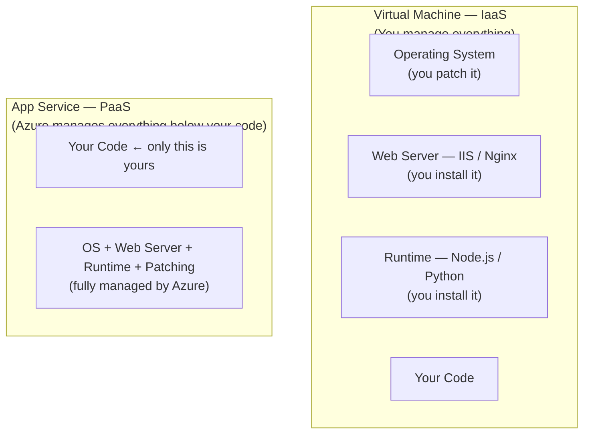
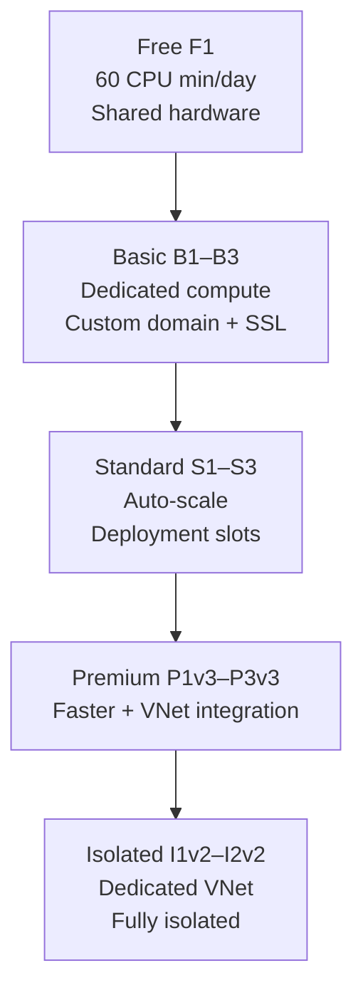
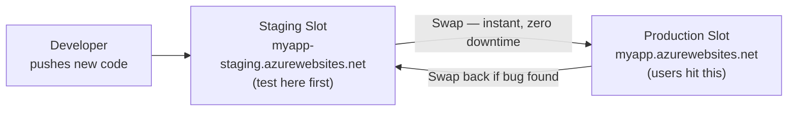
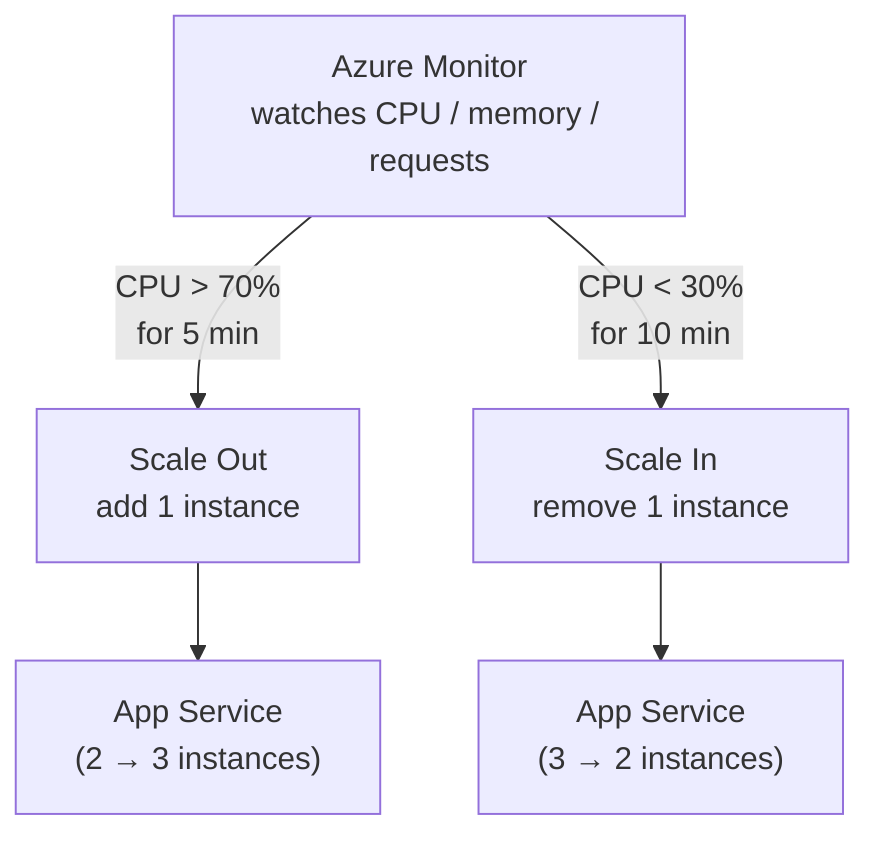

# Day 6 — Azure App Service: Deploy Web Apps Without Managing Servers

**Phase 1 — Compute**

> In Day 4 you hosted a website on a VM. You created the VM, opened port 80, installed IIS or Nginx, put your HTML file in the right folder, and managed the firewall rules yourself. That's fine for learning — but in the real world, companies deploy dozens of applications. Repeating that setup for every app would be slow, error-prone, and expensive to maintain. Today you'll learn a smarter way: Azure App Service. You bring the code. Azure handles everything else.

---

## What You'll Learn

- What Azure App Service is and why companies choose it over VMs for web applications
- App Service Plans — the four tiers and what each unlocks
- Supported runtimes — Node.js, Python, Java, .NET, PHP, and more
- Deployment methods — ZIP deploy, GitHub Actions, Local Git, FTP
- Application settings and environment variables — how to configure apps without hardcoding values
- Custom domains and SSL certificates
- Deployment slots — staging environments with zero-downtime production swaps
- Scaling — manual scale on Basic, auto-scale rules on Standard

---

## Part 1 — What Is Azure App Service?

### From VMs to Platform-as-a-Service

In Day 3 and Day 4, you worked with **Virtual Machines** — Azure's Infrastructure-as-a-Service (IaaS) offering. With a VM, you rent a virtual computer and take responsibility for everything that runs on it: the OS, the web server, the runtime, the patches, the SSL certificates, the scaling logic.

**Azure App Service** is a different model. It is Microsoft's **Platform-as-a-Service (PaaS)** offering for web applications. You give Azure your code — a zip file, a git repo, a container image — and Azure takes care of:

- The underlying OS and its patches
- The web server (IIS on Windows, Nginx/Apache on Linux)
- Runtime installation and upgrades
- Load balancing across instances
- SSL termination
- Health monitoring and automatic restarts



**When to choose App Service over a VM:**

| | Virtual Machine | App Service |
|---|---|---|
| You manage | OS, runtime, web server, patches | Only your code |
| Setup time | 15–30 min per app | 2–3 min |
| Scaling | Manual or VMSS (complex) | One slider or auto-scale rules |
| Cost model | Pay per hour even when idle | Pay per plan (shared across apps) |
| Best for | Full OS control, legacy apps | Web apps, REST APIs, mobile backends |

> App Service runs your code, not your OS. The moment you need to SSH into a machine and install something, a VM is the right choice. For most web apps and APIs, App Service is faster and cheaper to operate.

---

### Demo — Create an App Service Plan and Web App

**✅ Free Tier**

!!! success "Step 1 — Search for App Services"
    In the Azure Portal search bar, type **"App Services"** and click the result.

!!! success "Step 2 — Create a new Web App"
    Click **"+ Create"** → **"Web App."**

!!! success "Step 3 — Fill in the Basics tab"

    | Field | Value |
    |-------|-------|
    | Subscription | *(your subscription)* |
    | Resource group | Create new → `appservice-demo-rg` |
    | Name | `myapp-lwm-demo` *(must be globally unique — this becomes your URL)* |
    | Publish | **Code** |
    | Runtime stack | **Node.js 20 LTS** |
    | Operating system | **Linux** |
    | Region | *(same region you've been using)* |

!!! success "Step 4 — Configure the App Service Plan"
    Under **Pricing plan**, click **"Create new."**

    | Field | Value |
    |-------|-------|
    | Name | `my-free-plan` |
    | Pricing tier | Click **"Explore pricing plans"** → select **Free F1** → **"Select"** |

    Click **"OK."**

    > **What is an App Service Plan?** It defines the underlying compute resources your app runs on — how many CPUs, how much RAM, and which features are available. Multiple apps can share one plan. We'll cover plans in detail in the next section.

!!! success "Step 5 — Review + Create"
    Leave all other tabs at defaults → click **"Review + create"** → **"Create."**

    Deployment takes about 30–60 seconds. Once complete, click **"Go to resource."**

!!! success "Step 6 — Visit your app"
    On the App Service overview page, find the **URL** — it looks like `https://myapp-lwm-demo.azurewebsites.net`.

    Click the URL. You'll see Azure's default "Your web app is running and waiting for your content" page. The app is live — we just haven't deployed any code yet.

---

## Part 2 — App Service Plans

### What Is an App Service Plan?

An **App Service Plan** is the compute layer that your web apps run on. It defines:
- How many virtual cores and GB of RAM are allocated
- Whether your app runs on shared or dedicated hardware
- Which features are available (auto-scale, deployment slots, custom domains, etc.)
- How many apps can share the plan

**Multiple apps on one plan:** You can run 10 different web apps on a single App Service Plan and they all share the same compute. If the plan has 2 vCPUs and 7 GB RAM, all 10 apps share that pool. This makes plans cost-effective for teams running many small services.

### App Service Plan Tiers

| Tier | Examples | Hardware | Key Features | Cost |
|---|---|---|---|---|
| **Free** | F1 | Shared | 60 min compute/day, `*.azurewebsites.net` only | Free |
| **Basic** | B1, B2, B3 | Dedicated | Custom domains, SSL, manual scale | ~$13–$52/mo |
| **Standard** | S1, S2, S3 | Dedicated | Auto-scale, deployment slots (5), daily backups | ~$70–$300/mo |
| **Premium** | P1v3, P2v3 | Dedicated | Faster compute, VNet integration, 20 slots | ~$150–$600/mo |
| **Isolated** | I1v2, I2v2 | Dedicated VNet | Runs in your own VNet, fully isolated | ~$400+/mo |

**Free tier limitations to know:**
- 60 CPU minutes per day — enough for demos and learning
- No custom domain (only `*.azurewebsites.net`)
- No SSL on custom domain
- App goes to sleep after 20 minutes of inactivity (cold start on next request)



---

### Demo — Explore the App Service Plan

**✅ Free Tier**

!!! success "Step 1 — Open your App Service Plan"
    In the Azure Portal, search **"App Service plans"** and click your `my-free-plan`.

!!! success "Step 2 — View the Apps tab"
    In the left menu, click **"Apps."** Your web app appears here. Any additional apps you add to this plan will also show up here — they all share the same resources.

!!! success "Step 3 — Scale up to see tier options"
    In the left menu, click **"Scale up (App Service plan)."**

    You'll see all the pricing tiers laid out — Free, Basic, Standard, Premium, Isolated. Each tier shows the vCPU count, RAM, and available features.

    > We're not upgrading — just exploring what's available. Click **"Cancel"** or navigate away.

---

## Part 3 — Supported Runtimes

Azure App Service can host applications written in any of these languages natively — no VM, no runtime installation required:

| Runtime | Versions available | Common use |
|---|---|---|
| **Node.js** | 18, 20, 22 LTS | REST APIs, React/Vue/Next.js SSR |
| **Python** | 3.9, 3.10, 3.11, 3.12 | Flask, FastAPI, Django apps |
| **.NET** | 6, 7, 8 | ASP.NET Core APIs and MVC apps |
| **Java** | 8, 11, 17, 21 | Spring Boot, Tomcat, JBoss |
| **PHP** | 8.0, 8.1, 8.2 | WordPress, Laravel |
| **Ruby** | 3.2 | Rails applications (Linux only) |

You pick the runtime when creating the Web App. Azure installs it, keeps it updated, and knows how to start your app automatically based on the runtime you chose.

> **What about static sites?** For a purely static HTML/CSS/JS site with no server-side code, **Azure Static Web Apps** (a separate service) is the better choice. App Service is for applications with server-side logic. We'll cover Static Web Apps separately.

---

## Part 4 — Deploying Your Code

### Deployment Methods

There are four main ways to get your code into App Service:

| Method | How it works | Best for |
|---|---|---|
| **ZIP Deploy** | Upload a `.zip` of your app folder via the portal or CLI | Quick demos, one-off deploys |
| **GitHub Actions** | Push to GitHub → CI/CD pipeline automatically deploys to App Service | Teams, production workflows |
| **Azure DevOps Pipelines** | Same as GitHub Actions but using Azure DevOps | Enterprise teams using ADO |
| **Local Git** | Push to a Git URL hosted by App Service itself | Developers who prefer Git push |

Today we use **ZIP Deploy** — it's the simplest and works entirely in the browser.

---

### Demo — Deploy a Node.js App via ZIP Deploy

**✅ Free Tier**

We're going to create a simple two-file Node.js app, zip it, and deploy it to App Service.

#### Step A — Create the App Files

!!! success "Step 1 — Create a project folder on your laptop"
    Create a new folder on your desktop called `nodeapp`. Inside it, create two files:

    **`server.js`**
    ```javascript
    const http = require('http');
    const port = process.env.PORT || 8080;

    const server = http.createServer((req, res) => {
        const appName = process.env.APP_NAME || 'Azure App Service';
        res.writeHead(200, { 'Content-Type': 'text/html' });
        res.end(`
            <!DOCTYPE html>
            <html lang="en">
            <head>
                <meta charset="UTF-8">
                <title>${appName}</title>
                <style>
                    body { font-family: Arial, sans-serif; display: flex; justify-content: center;
                           align-items: center; height: 100vh; margin: 0;
                           background: #0078d4; color: white; text-align: center; }
                    .card { background: rgba(255,255,255,0.15); padding: 40px 60px; border-radius: 12px; }
                    h1 { font-size: 2.5em; margin-bottom: 10px; }
                    p { font-size: 1.2em; opacity: 0.9; }
                </style>
            </head>
            <body>
                <div class="card">
                    <h1>Hello from ${appName}!</h1>
                    <p>Deployed via ZIP Deploy — no VM, no Nginx, no setup.</p>
                    <p>Platform: <strong>Azure App Service</strong></p>
                </div>
            </body>
            </html>
        `);
    });

    server.listen(port, () => console.log('Server running on port ' + port));
    ```

    **`package.json`**
    ```json
    {
        "name": "azure-appservice-demo",
        "version": "1.0.0",
        "scripts": {
            "start": "node server.js"
        }
    }
    ```

!!! success "Step 2 — Zip the folder contents"
    Select **both files** inside the `nodeapp` folder (not the folder itself — select `server.js` and `package.json`), right-click → **"Compress to ZIP"** (Windows 11) or **"Send to → Compressed folder"** (Windows 10).

    Name the zip file `nodeapp.zip`.

    > **Important:** The zip must contain the files at the root level, not inside a subfolder. If you zip the folder itself, the deploy will fail because App Service won't find `package.json` at the root.

#### Step B — Deploy via the Portal

!!! success "Step 3 — Open your Web App"
    Go to **App Services** → your `myapp-lwm-demo` app.

!!! success "Step 4 — Open the ZIP Deploy tool"
    In the left menu, under **Development Tools**, click **"Advanced Tools"** → **"Go."**

    This opens **Kudu** — App Service's deployment and diagnostic console — in a new tab.

!!! success "Step 5 — Upload the ZIP"
    In the Kudu toolbar, click **"Tools"** → **"Zip Push Deploy."**

    Drag and drop your `nodeapp.zip` onto the page, or click to browse for it. Kudu unpacks the zip into `/home/site/wwwroot/`.

    You'll see a `200 OK` response when the deployment completes.

!!! success "Step 6 — Restart the app and visit the URL"
    Go back to your App Service in the portal → click **"Restart"** in the toolbar → confirm.

    Wait 20–30 seconds, then click your app's URL (`https://myapp-lwm-demo.azurewebsites.net`). Your custom page loads — **"Hello from Azure App Service!"** — served directly by the platform, no web server configuration needed.

---

## Part 5 — Application Settings and Environment Variables

### Why Not Hardcode Configuration?

In `server.js` you'll notice this line:
```javascript
const appName = process.env.APP_NAME || 'Azure App Service';
```

This reads a value from an **environment variable** instead of hardcoding it. This is a critical best practice:

- **Secrets** (database passwords, API keys) must never be in your code — they'd appear in your git history and be visible to anyone with repo access
- **Environment-specific values** (dev URL vs prod URL) change per deployment but your code stays the same
- **Changing a config value** should not require redeploying your code

Azure App Service injects environment variables into your app at runtime via **Application Settings**.

---

### Demo — Add an Application Setting

**✅ Free Tier**

!!! success "Step 1 — Open Configuration"
    Go to your App Service → left menu → **"Configuration."**

    You'll see two tabs: **Application settings** and **Connection strings**. Application settings are for general config values. Connection strings are specifically for database connection strings (same concept, just separated for clarity).

!!! success "Step 2 — Add a new setting"
    Under **Application settings**, click **"+ New application setting."**

    | Field | Value |
    |-------|-------|
    | Name | `APP_NAME` |
    | Value | `LearnWithMithran Demo` |

    Click **"OK."**

!!! success "Step 3 — Save"
    Click **"Save"** at the top → **"Continue"** to confirm. App Service restarts to apply the new settings.

!!! success "Step 4 — Verify the change"
    Wait 20–30 seconds for the restart, then refresh your app URL. The heading now reads **"Hello from LearnWithMithran Demo!"** — the app read the environment variable from Application Settings.

    > The code didn't change. The zip didn't change. Only the environment variable changed — and the app behaviour updated instantly.

---

## Part 6 — Custom Domains and SSL

### Custom Domains

By default, every App Service gets a free subdomain: `yourappname.azurewebsites.net`. For a real product, you want your own domain — `www.yourcompany.com`.

**To add a custom domain (Basic plan and above):**
1. Buy a domain from any registrar (GoDaddy, Namecheap, Azure itself via App Service Domains)
2. In App Service → **Custom domains** → **Add custom domain**
3. Azure gives you a TXT or CNAME record to add to your DNS provider — this proves you own the domain
4. Once verified, Azure binds the domain to your app

### SSL / HTTPS

App Service automatically provides a free **managed SSL certificate** for:
- Your `*.azurewebsites.net` subdomain — HTTPS works out of the box, zero configuration
- Your custom domain — App Service can issue and renew a free certificate via **App Service Managed Certificate** (Basic+ plan)

**Managed Certificate:** Azure creates, installs, and auto-renews the SSL certificate for your custom domain. You don't touch `openssl`, you don't manage certificate expiry — it just works.

> Free (F1) plan does not support custom domains or custom SSL. You need at least Basic (B1) for that.

---

## Part 7 — Deployment Slots

### The Problem with Deploying Directly to Production

When you deploy a new version of your app directly to production:
- There's a brief moment where the old code is shutting down and the new code is starting
- If the new version has a bug, your production users hit it immediately
- Rolling back means redeploying the old version — another deployment, another disruption

### What Are Deployment Slots?

A **deployment slot** is a separate, live instance of your app running alongside production on the same App Service Plan. It has its own URL, its own settings, and its own deployed code.

The typical workflow:
1. Deploy your new version to the **staging** slot
2. Test it at the staging URL (`myapp-lwm-demo-staging.azurewebsites.net`)
3. When ready, **swap** staging and production — the two slots exchange their code and settings instantly
4. Production is now running the new version. The old version is now in the staging slot — if something breaks, one click swaps back.



**Why zero downtime?** Azure warms up the new slot before the swap — it sends HTTP requests to the new version and waits until it responds before completing the swap. Users never hit a cold-starting instance.

> Deployment slots require **Standard plan or higher**. Free and Basic plans do not support slots.

---

### Demo — Create a Staging Slot and Swap to Production

**💳 Paid — Instructor Demo (Standard S1 plan)**

> Deployment slots require a Standard plan (~$70/mo). This is an instructor demo — students watch the workflow. The concept is the same whether you follow along or not.

!!! info "Step 1 — Upgrade the plan to Standard"
    Go to your App Service → left menu → **"Scale up (App Service plan)"** → select **S1 Standard** → **"Apply."**

!!! info "Step 2 — Create a staging slot"
    Left menu → **"Deployment slots"** → **"+ Add slot."**

    | Field | Value |
    |---|---|
    | Name | `staging` |
    | Clone settings from | *(your production app)* |

    Click **"Add."** A new slot appears: `myapp-lwm-demo-staging.azurewebsites.net`.

!!! info "Step 3 — Deploy new code to staging"
    Click on the `staging` slot to open it. Go to **Advanced Tools** → **Kudu** → **Zip Push Deploy.**

    Upload a modified zip with an updated `server.js` — change the background colour to orange (`#e95420`) or the text to `"Version 2 — Staging"` so you can visually see the difference.

!!! info "Step 4 — Test the staging slot"
    Visit `https://myapp-lwm-demo-staging.azurewebsites.net`. The new version is running. Production (`https://myapp-lwm-demo.azurewebsites.net`) still shows the original version — users are unaffected.

!!! info "Step 5 — Swap staging to production"
    Go back to the production app → **"Deployment slots"** → **"Swap."**

    - Source: `staging`
    - Target: `production`

    Click **"Swap."** Azure warms up the staging slot, then swaps. In about 30 seconds, production is now running Version 2 and staging holds Version 1.

!!! info "Step 6 — Instant rollback"
    If Version 2 has a bug, click **"Swap"** again — production immediately reverts to Version 1.

!!! warning "Scale back down after demo"
    Standard S1 costs ~$70/mo. Go to **Scale up** → select **Free F1** to scale back down after the demo.

---

## Part 8 — Scaling

### Manual Scale

On the **Basic plan and above**, you can manually set how many instances (copies) of your app run simultaneously.

Go to your App Service → left menu → **"Scale out (App Service plan)"** → drag the instance count slider.

Each instance is an identical copy of your app running in parallel. The built-in load balancer distributes requests across all instances. If one instance crashes, the others keep serving traffic.

---

### Demo — Manual Scale

**✅ Free Tier** *(Basic plan needed for more than 1 instance — Free plan shows the UI but limits to 1)*

!!! success "Step 1 — Open Scale out"
    Go to your App Service → **"Scale out (App Service plan)."**

!!! success "Step 2 — View the instance slider"
    On the **Manual** tab, you'll see the instance count slider — currently set to 1. On a Basic or Standard plan, you'd drag this to 2, 3, or more and click **"Save"** to immediately spin up additional instances.

    > On the Free F1 plan the slider is locked to 1. This is just to show where the setting lives.

---

### Auto-Scale

On **Standard plan and above**, you can define rules that automatically add or remove instances based on metrics.

An auto-scale rule has two parts:
- **Scale-out rule:** if average CPU > 70% for 5 minutes, add 1 instance
- **Scale-in rule:** if average CPU < 30% for 10 minutes, remove 1 instance

You also set:
- **Minimum instances:** e.g., 2 — never drop below 2 even at 2 AM
- **Maximum instances:** e.g., 10 — cap cost at 10 instances
- **Default instances:** where to start



---

### Demo — Configure Auto-Scale Rules

**💳 Paid — Instructor Demo (Standard plan)**

!!! info "Step 1 — Open Scale out on Standard plan"
    With the app on a Standard plan → **"Scale out (App Service plan)"** → select the **"Custom autoscale"** tab.

!!! info "Step 2 — Set instance limits"
    | Setting | Value |
    |---|---|
    | Minimum | 1 |
    | Maximum | 5 |
    | Default | 1 |

!!! info "Step 3 — Add a scale-out rule"
    Click **"+ Add a rule."**

    | Setting | Value |
    |---|---|
    | Metric source | Current resource |
    | Metric name | CPU Percentage |
    | Operator | Greater than |
    | Threshold | 70 |
    | Duration | 5 minutes |
    | Action | Increase count by 1 |
    | Cool down | 5 minutes |

    Click **"Add."**

!!! info "Step 4 — Add a scale-in rule"
    Click **"+ Add a rule"** again.

    | Setting | Value |
    |---|---|
    | Metric name | CPU Percentage |
    | Operator | Less than |
    | Threshold | 30 |
    | Duration | 10 minutes |
    | Action | Decrease count by 1 |
    | Cool down | 5 minutes |

    Click **"Add"** → **"Save."**

    App Service will now automatically scale between 1 and 5 instances based on CPU load — no manual intervention required.

---

## Cleaning Up

**✅ Free Tier**

!!! warning "Delete the resource group when done"
    Go to **Resource groups** → `appservice-demo-rg` → **"Delete resource group"** → type the name to confirm → **"Delete."**

    This removes the App Service, App Service Plan, and all associated resources in one step.

    > The Free F1 plan has no compute charge, but it's good practice to clean up demo resources so they don't count against your subscription quotas.

---

## Summary and What's Next

Today you moved from manually managing web servers to a fully managed platform.

**App Service** removes the need to install, patch, or manage a web server. You deploy code — Azure runs it. App Service Plans define the compute tier — Free for learning, Basic for custom domains, Standard for auto-scale and deployment slots.

You deployed a real Node.js app via **ZIP Deploy** through the Kudu console. You configured an **Application Setting** and watched the app pick up the new value without a redeploy. You saw how **deployment slots** let you test in staging and swap to production in seconds with instant rollback. And you understood how **auto-scale** adds and removes instances automatically based on CPU load.

**Coming up next:** Day 7 moves into **Networking** — specifically **Azure Virtual Networks (VNet)**. Until now, Azure has been handling networking automatically in the background. In Day 7, you'll take control of it: define your own private network, create subnets, control traffic flow with NSGs, and understand how VMs and App Services connect to each other securely.

---

## Key Takeaways

- **App Service is PaaS** — you manage only your code. Azure manages OS, web server, runtime, patching, and load balancing.
- **App Service Plan = the compute** — multiple apps share one plan and its resources.
- **Free F1** — great for learning; 60 CPU min/day, no custom domain, app sleeps after 20 min idle.
- **Basic B1+** — dedicated compute, custom domains, SSL, manual scale.
- **Standard S1+** — auto-scale rules, deployment slots, daily backups.
- **ZIP Deploy** — simplest deployment method; select both files (not the folder), zip them, upload via Kudu.
- **Application Settings** — inject environment variables at runtime. Never hardcode secrets in code.
- **Deployment slots** — staging environment on the same plan; swap to production is instant and zero-downtime. Requires Standard+.
- **Auto-scale** — define CPU/memory thresholds; App Service adds or removes instances automatically. Requires Standard+.
- **Managed SSL certificate** — App Service issues and renews free SSL for custom domains on Basic+. No manual certificate management.
