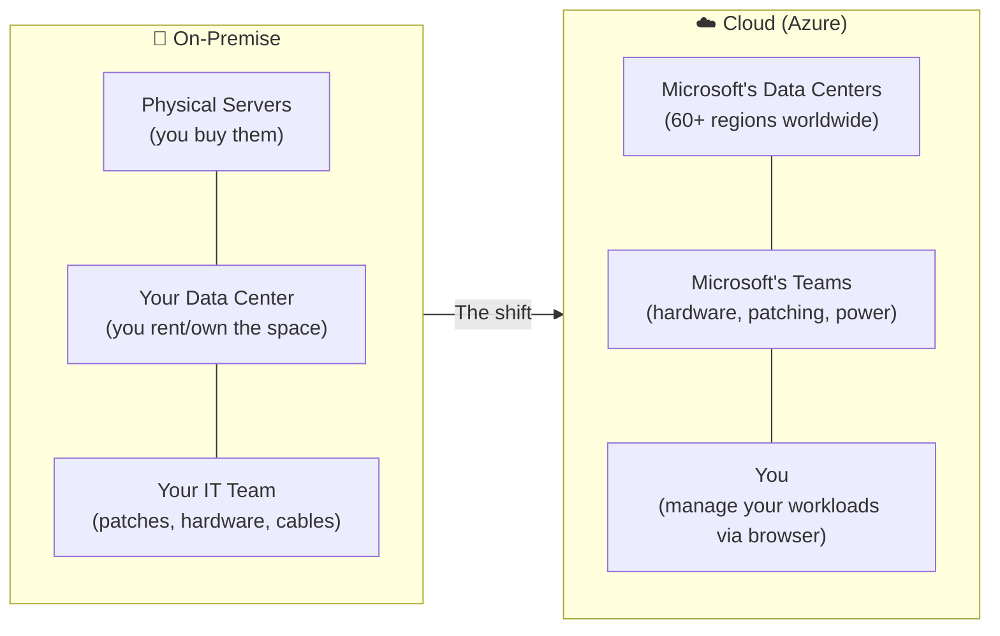
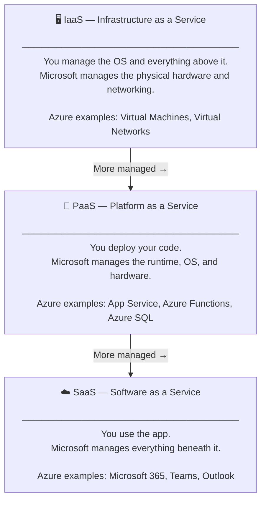
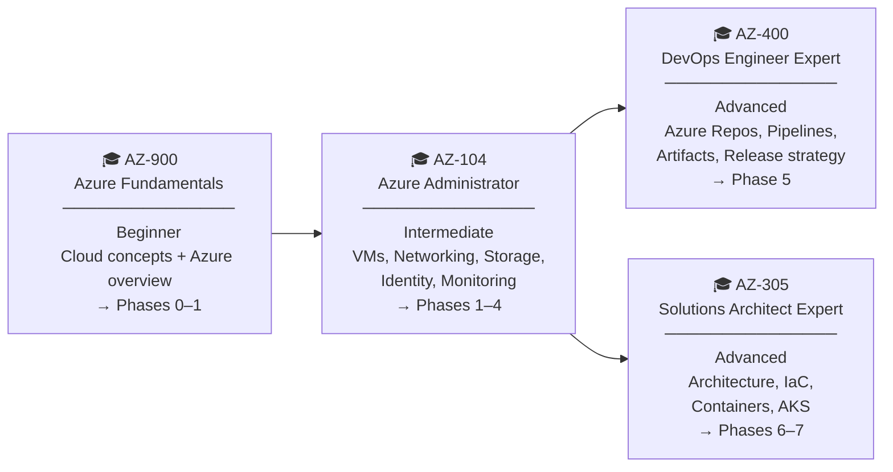
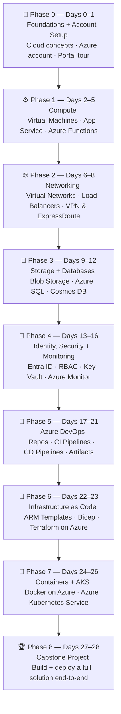
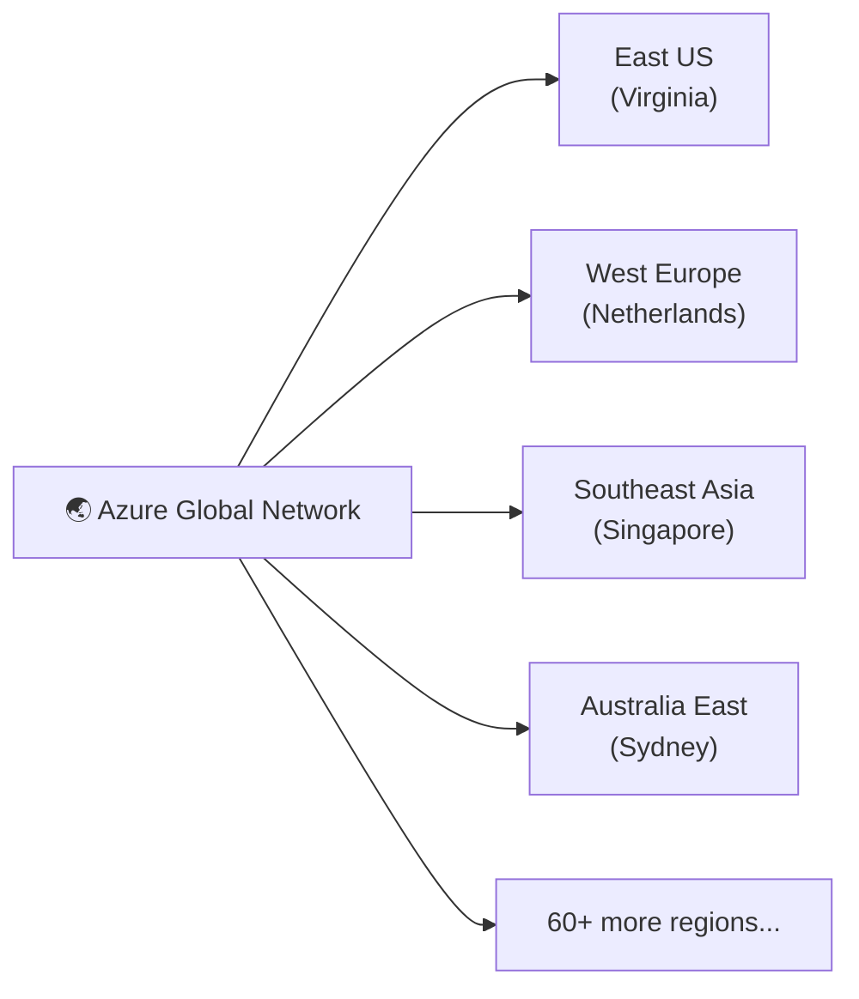
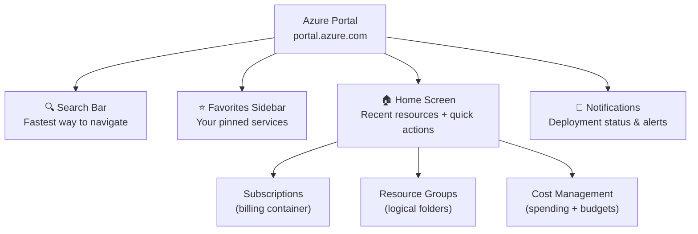
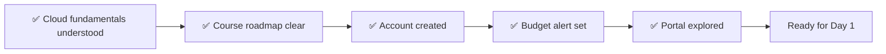

# Day 0 — Cloud Fundamentals, Course Roadmap & Azure Account Setup

**Phase 0 — Foundations + Account Setup**

> Every journey starts somewhere. Before we touch Azure, we answer the question every beginner has: *what even is cloud, and why does everyone keep talking about it?* Then we map out everything you'll build in this course — and get your Azure account ready to go.

---

## Part 1 — Cloud Fundamentals

### What Is Cloud Computing?

Think about electricity. You don't build a power station to turn the lights on in your house — you plug into the grid and pay for what you use. The infrastructure exists somewhere; it's just not your problem.

**Cloud computing works the same way for IT.**

Before cloud existed, companies had to buy and run their own servers. That meant:

- Purchasing physical hardware (expensive, upfront cost)
- Finding space to put it — a server room or a rented data center
- Running power and cooling to keep it alive
- Hiring people to maintain and upgrade it
- Waiting **weeks or months** to get new capacity when demand grew
- Paying for full servers even when only using 10% of their capacity

This model is called **on-premise** (or "on-prem") — your infrastructure, your building, your problem.

**Cloud flips this model.** Microsoft builds and operates massive data centers around the world. You rent the computing, storage, and networking you need — over the internet, on demand, paying only for what you actually use. When you need more capacity, you get it in minutes. When you need less, you scale back and stop paying.

---

### On-Premise vs Cloud

| Dimension | On-Premise | Cloud (Azure) |
|-----------|-----------|---------------|
| **Cost model** | CapEx — large upfront purchase | OpEx — monthly pay-as-you-go |
| **Scaling** | Weeks/months (order, rack, configure) | Minutes (click a button) |
| **Maintenance** | Your IT team handles hardware | Microsoft handles it |
| **Reliability** | Risk is concentrated in one location | Built-in redundancy across zones |
| **Global reach** | Only where you have offices | 60+ regions, every major continent |
| **Getting started** | High barrier — hardware, space, power | Low barrier — just a browser |

!!! info "Why IT companies are moving to cloud"
    The business case is straightforward: lower upfront cost, faster time-to-market, and the ability to scale with demand instead of guessing capacity 3 years in advance. Most enterprises today run a **hybrid model** — some workloads in their own data centers, the rest on cloud. The trend is consistently toward more cloud, not less.

---

### Cloud Service Models — IaaS, PaaS, SaaS

Cloud doesn't mean one thing. There are three layers, each hiding more complexity from you:

| Model | You manage | Microsoft manages | Best for |
|-------|-----------|------------------|---------|
| **IaaS** | OS, runtime, app, data | Hardware, network, storage | Max control, e.g. lift-and-shift migrations |
| **PaaS** | App code, data | Everything below the app | Developers who want to focus on code |
| **SaaS** | Just your data/settings | The entire product | End users, not builders |

!!! tip "This course covers all three"
    Virtual Machines (IaaS) → App Service & Functions (PaaS) → and we'll use SaaS products like Azure DevOps throughout. You'll understand each model from hands-on experience, not just theory.

---

### Where Does Microsoft Azure Fit?

Azure is **Microsoft's cloud platform** — and Microsoft's history is why Azure matters in enterprise IT.

Most companies already run Microsoft products: Windows servers, Office 365, Active Directory for identity management, SQL Server for databases. Azure is the natural cloud extension of that ecosystem:

| On-Premise Microsoft | Azure Equivalent |
|---------------------|-----------------|
| Active Directory | Microsoft Entra ID (formerly Azure AD) |
| Windows Server | Azure Virtual Machines (Windows) |
| SQL Server | Azure SQL Database |
| Team Foundation Server | Azure DevOps |
| On-prem file shares | Azure Files / Blob Storage |

This deep integration with existing enterprise infrastructure is a major reason Azure is widely adopted in corporate environments. And for you as someone learning cloud — Azure skills are directly applicable to the IT landscape at most mid-to-large companies.

!!! info "Enterprise scale"
    Azure operates in **60+ regions** across every major continent. It holds compliance certifications for healthcare (HIPAA), government (FedRAMP), financial services, and more. This isn't a startup product — it's infrastructure trusted by governments, banks, and hospitals worldwide.

---

## Part 2 — Course Overview

### Certifications This Course Prepares You For

This course is structured to build toward four Microsoft Azure certifications, in order of difficulty:

| Certification | Level | Course phases |
|--------------|-------|--------------|
| **AZ-900** — Azure Fundamentals | Beginner | Phase 0–1 |
| **AZ-104** — Azure Administrator Associate | Intermediate | Phase 1–4 |
| **AZ-400** — DevOps Engineer Expert | Advanced | Phase 5 |
| **AZ-305** — Solutions Architect Expert | Advanced | Phase 6–7 |

You don't need to sit any exam to follow this course. But if you do, the content maps directly to the exam objectives for all four.

---

### Your Learning Roadmap — 29 Days, 9 Phases

By the end of Day 28, you'll have built and deployed a real multi-component application on Azure — using every major service category in this roadmap.

---

### What This Course Covers — and What It Doesn't

!!! info "This series: Azure + Azure DevOps (Azure-native tools only)"

    Every tool and service in this course is **Azure-native**:

    - **Azure Repos** — source control inside Azure DevOps
    - **Azure Pipelines** — CI/CD automation
    - **Azure Artifacts** — package management
    - **Azure Bicep / ARM** — infrastructure as code, Azure-specific
    - **Azure Kubernetes Service** — managed Kubernetes on Azure

    The goal is to make you proficient in the Azure platform end-to-end.

!!! warning "What this course does NOT cover (by design)"

    The following tools are **not covered in this series**:

    | Tool | Why it's excluded |
    |------|------------------|
    | Git (advanced) | Covered in the separate LearnWithMithran DevOps series |
    | Jenkins | Not Azure-native; separate DevOps series |
    | Docker (standalone) | Covered in the separate DevOps series |
    | Kubernetes (standalone) | Covered in the separate DevOps series |
    | General CI/CD theory | Separate DevOps series |

    These tools have their own dedicated LearnWithMithran series. **This course and that series are designed to complement each other** — together they give you the full picture of modern cloud + DevOps. But they are separate learning tracks.

---

## Part 3 — Azure Account Setup

### What You'll Learn in This Section

- What the Azure Free Account actually includes (no surprises)
- Why the credit card is identity verification — not a billing trigger
- How to set a budget alert so Azure emails you before you spend a cent
- How to navigate the Azure Portal confidently

---

### The Azure Free Account — What's Actually Free

!!! info "Three layers of free"

    The Azure Free Account has three distinct tiers. Understanding these upfront prevents confusion later.

    **Layer 1 — $200 credit for 30 days**
    Dropped into your account the moment you sign up. Use it to try almost anything in Azure. Expires after 30 days regardless of how much you've used.

    **Layer 2 — 12 months of popular free services**
    After the 30-day credit expires, a specific set of services stays free for 12 months:

    | Service | Free limit |
    |---------|-----------|
    | Linux Virtual Machine (B1s) | 750 hours/month |
    | Windows Virtual Machine (B1s) | 750 hours/month |
    | Azure SQL Database | 250 GB |
    | Azure Blob Storage | 5 GB |
    | Azure Files | 5 GB |
    | Bandwidth (outbound) | 15 GB |

    **Layer 3 — 25+ always-free services**
    These never expire, no matter how long you've had your account:

    | Service | Always-free limit |
    |---------|------------------|
    | Azure Functions | 1 million requests/month |
    | Azure App Service | 10 web apps (F1 plan) |
    | Azure Cosmos DB | 1,000 RU/s + 25 GB storage |
    | Azure DevOps | 5 users, unlimited private repos |
    | Azure Container Registry | 1 registry (Basic) |

!!! warning "Credit card: identity only"
    Azure requires a credit card to verify you're a real person — not to bill you. **When the $200 credit expires, Azure suspends your non-free resources. It does not automatically charge your card.** You must explicitly upgrade to Pay-As-You-Go for charges to begin.

!!! tip "No credit card? Use Azure for Students"
    If you have a school or university email address (.edu or your institution's domain), you qualify for **Azure for Students**: $100 credit, no credit card required. Sign up at `azure.microsoft.com/en-us/free/students`.

---

### What Is a Region?

When you create any resource in Azure, you choose a **region** — a geographic location where Microsoft's data centers are physically located.

**How to pick your region:** Choose the one closest to where you live. Closer = lower latency = snappier portal and faster demos. For personal learning, that's all that matters.

---

### The Azure Portal at a Glance

The Azure Portal (`portal.azure.com`) is the web dashboard you'll use for this entire course. Everything is GUI-based — no command line required.

---

## Demo: Getting Set Up

All steps below are **✅ Free Tier** — you can follow every one.

---

### Part A — Create Your Free Azure Account

!!! success "Step 1 — Go to the sign-up page"
    Open your browser and navigate to **azure.microsoft.com/free**. Click the blue **"Start free"** button.

!!! success "Step 2 — Sign in with a Microsoft account"
    Use an existing Outlook, Hotmail, or Xbox account — or click **"Create one"** to make a new Microsoft account. Use an email address you actually check; billing alerts and notifications go here.

    *Azure for Students users: go to `azure.microsoft.com/en-us/free/students` and verify with your school email instead.*

!!! success "Step 3 — Fill in the sign-up form"
    - **Country/region:** Select your actual country. This affects pricing and legal terms.
    - **Phone verification:** Enter your mobile number. Azure texts you a code — type it in. This is a real-person check, nothing more.
    - **Credit card:** Enter your card details for identity verification. You will not be charged.

!!! success "Step 4 — Agree and sign up"
    Accept the subscription agreement and click **"Sign up."** Azure takes 30–60 seconds to provision your account. When it's done, you'll land directly in the Azure Portal.

    **You're in.** You now have a working Azure account.

---

### Part B — Portal Orientation

!!! success "Step 5 — Find your Subscription"
    In the top search bar, type **"Subscriptions"** and click the result. You'll see one subscription — likely named **"Azure subscription 1"** or **"Free Trial."** Click on it. This is your billing container — everything you create will live here.

!!! success "Step 6 — Find Resource Groups"
    Go back (browser back button) and search for **"Resource Groups."** The list will be empty — that's expected. A resource group is a logical folder. We'll create our first one on Day 1.

!!! success "Step 7 — Explore the search bar"
    Type anything into the top search bar — "virtual machine," "storage," "functions." Notice how it instantly shows both services and your resources. This search bar is the fastest way to navigate Azure; get comfortable using it.

---

### Part C — Set a Budget Alert

This is the most important step in Day 0. A budget alert means Azure emails you the moment you approach any real spending.

!!! success "Step 8 — Open Cost Management"
    In the top search bar, type **"Cost Management"** and click **Cost Management + Billing**.

!!! success "Step 9 — Navigate to Budgets"
    In the left-hand menu, click **"Cost Management"** (the sub-section), then click **"Budgets."**

!!! success "Step 10 — Create a new budget"
    Click **"+ Add"** and fill in the form:

    | Field | Value |
    |-------|-------|
    | Name | `LearningBudget` |
    | Reset period | Monthly |
    | Amount | `1` (one dollar) |

    Click **Next.**

!!! success "Step 11 — Set the alert threshold"
    | Field | Value |
    |-------|-------|
    | Alert type | Actual |
    | % of budget | `80` |
    | Alert email | *your email address* |

    Click **Create.**

!!! success "Step 12 — Confirm it's there"
    You'll be taken back to the Budgets list. Your `LearningBudget` should appear with a $1 limit. Done — your safety net is live.

---

## Summary

You now understand what cloud is and why it matters, where Azure fits in the enterprise world, what certifications and skills this course builds toward, and you have a working Azure account with a safety budget alert in place.

**No money spent. No surprises. Let's build.**

---

## Key Takeaways

| Concept | What to remember |
|---------|-----------------|
| Cloud vs on-premise | Cloud = rent on demand (OpEx); on-prem = buy upfront (CapEx) |
| IaaS / PaaS / SaaS | Three layers — VMs, App Service, and SaaS products like DevOps |
| Azure's position | Microsoft's cloud — deep integration with enterprise Microsoft ecosystem |
| Certifications | AZ-900 → AZ-104 → AZ-400 / AZ-305 (all mapped to this course) |
| Free Account layers | $200 credit (30 days) → 12 months free services → 25+ always-free |
| Credit card | Identity verification only — Azure suspends, never auto-charges |
| Azure for Students | No credit card, $100 credit, .edu email required |
| Budget alerts | Cost Management → Budgets → set $1 / 80% threshold |
| Azure Portal | `portal.azure.com` — your home for this entire course |
| Course scope | Azure-native tools only — separate series covers standalone DevOps tools |

---

[:material-arrow-right: Next: Day 1 — Core Concepts & Portal Deep Dive](day01_fundamentals.md)
