# Day 1 — Azure Fundamentals: Core Concepts & Portal Deep Dive

**Phase 0 — Foundations + Account Setup**

> Today we go deep on how Azure is actually organized — the infrastructure, the hierarchy, the tools, and the safeguards every Azure user needs to know. By the end of this session, you'll be comfortable with the portal and have a solid foundation for every technical day ahead.

---

## What You'll Learn

- How Azure's global infrastructure is organized: Regions, Availability Zones, Region Pairs
- The full resource hierarchy: Management Groups → Subscriptions → Resource Groups → Resources
- Azure Resource Manager (ARM) — the control plane behind everything
- Subscription types and when they apply
- Naming conventions and tagging best practices
- Azure Cloud Shell — the browser-based terminal you'll use throughout this course
- Azure Pricing Calculator — estimate costs before creating anything
- Service Level Agreements (SLAs) — what the numbers mean, and composite SLAs
- Azure Advisor — free optimization recommendations across 5 pillars
- Azure Service Health — how to track outages and set health alerts
- Resource Locks — preventing accidental deletion
- Portal Dashboards — building your own custom views
- Azure Marketplace and Microsoft Learn

---

## Azure's Global Infrastructure

### Regions

A **region** is a geographic location that contains one or more Azure data centers. Every resource you create in Azure lives in a specific region.

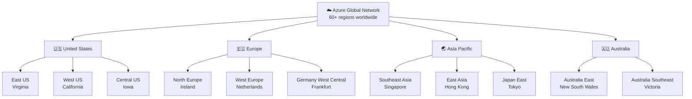

**Why region choice matters:**

| Reason | What it means for you |
|--------|-----------------------|
| **Latency** | Closer region = faster response times for your app's users |
| **Data residency** | Some regulations require data to stay in a specific country |
| **Service availability** | New Azure services roll out to major regions first |
| **Pricing** | Costs vary slightly between regions |
| **Compliance** | Certain regions have specific certifications (government, healthcare) |

!!! tip "For this course"
    Pick the region closest to where you live. East US and West Europe have the broadest service availability. Australia East is ideal if you're in the Asia-Pacific region.

---

### Availability Zones

Inside many regions, Azure has multiple **Availability Zones** — physically separate data centers within the same region, each with independent power, cooling, and networking.

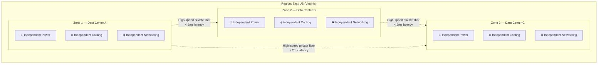

**Zone-redundant deployment:** When you deploy a resource across multiple zones, Azure automatically spreads it. If Zone 1 loses power, Zones 2 and 3 keep running — your application survives without intervention.

!!! info "Not all regions have Availability Zones"
    Availability Zones exist in major regions (East US, West Europe, Australia East, etc.). Smaller or newer regions may only have one zone. Always check the Azure documentation for your region if redundancy matters.

!!! info "When you'll configure this"
    From Day 2 onward, when creating VMs and databases, you'll see an Availability Zone dropdown. Zone-redundant storage and zone-redundant databases are also options you'll choose. Understanding this now means you'll know exactly what you're selecting later.

---

### Region Pairs

Every Azure region is **paired** with another region in the same geography. This pairing has two purposes: staggered maintenance and disaster recovery.

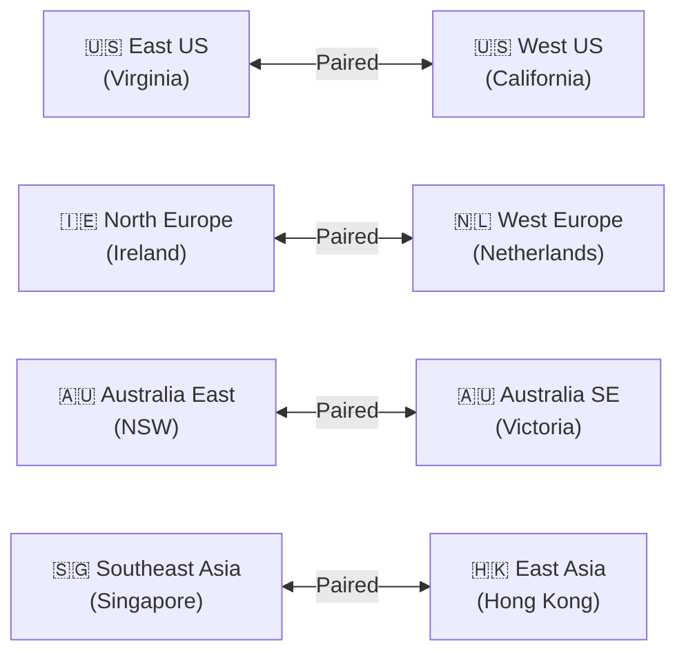

**Key guarantees from region pairing:**
- Microsoft never updates both paired regions at the same time — planned maintenance is staggered
- In a region-wide outage, Azure prioritizes recovery of the paired region first
- Azure geo-redundant storage (GRS) automatically replicates data to the paired region

---

## The Azure Resource Hierarchy

Everything you create in Azure lives inside a structured four-level hierarchy.

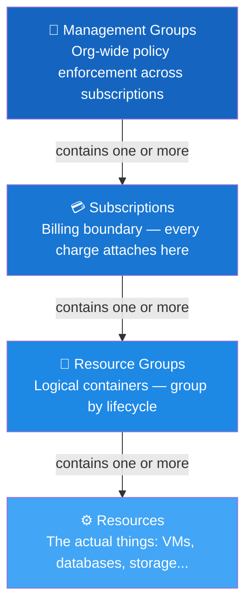

### Resources

A **resource** is any individual Azure object you create: a virtual machine, a storage account, a database, a web app, a virtual network, a key vault. Everything visible in the portal is a resource.

**Key resource properties:**
- Every resource belongs to exactly one resource group
- Every resource has a type (e.g., `Microsoft.Compute/virtualMachines`)
- Every resource lives in one region
- Every resource has a unique resource ID

### Resource Groups

A **resource group** is a logical container — a folder — that holds related resources.

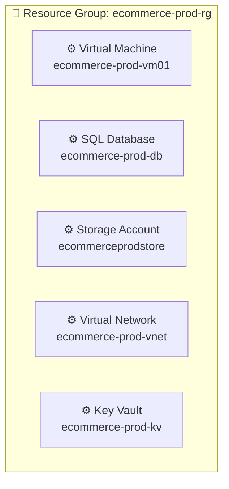

**Five reasons resource groups matter:**

| Reason | Practical benefit |
|--------|-----------------|
| **Lifecycle** | Delete the group → everything inside is deleted. Clean up entire projects with one click. |
| **Access control** | Grant access to one RG without touching others. |
| **Cost visibility** | Filter Cost Management by RG to see exactly what a project costs. |
| **Tagging scope** | Tags on a RG appear on all resources inside for cost allocation. |
| **Policy scope** | Governance policies can be applied at the RG level. |

!!! tip "How to group resources"
    Group resources that live and die together. A web app, its database, its storage, and its key vault — all created together, all deleted together — belong in the same resource group.

!!! warning "Resource groups are regional but resources inside can span regions"
    The resource group itself is created in a region (this is where its metadata is stored), but the resources inside it can be in any region. You can have an East US resource group containing a West Europe VM.

### Subscriptions

A **subscription** is the billing boundary. Every charge in Azure attaches to a subscription. Subscriptions also act as a trust boundary — they trust exactly one Microsoft Entra ID tenant.

**Subscription types:**

| Type | Who uses it | Credit card? | Notes |
|------|------------|-------------|-------|
| **Free Trial** | Beginners | Required (identity only) | $200 credit, 30 days |
| **Pay-As-You-Go (PAYG)** | Individuals, small teams | Required | Charged monthly for usage |
| **Enterprise Agreement (EA)** | Large enterprises | Invoice | Bulk discount, annual commitment |
| **Cloud Solution Provider (CSP)** | Businesses via partners | Via partner | Managed by Microsoft partner |
| **Azure for Students** | Students with .edu email | Not required | $100 credit |
| **Dev/Test** | Dev and test workloads | Required | Discounted rates for non-prod |

!!! info "For this course"
    You're on a Free Trial or Pay-As-You-Go subscription. Enterprise Agreement and CSP subscriptions are managed by organizations — you'll encounter them in real jobs, so it's worth knowing they exist.

### Management Groups

**Management groups** sit above subscriptions and let organizations apply policies and permissions across many subscriptions simultaneously.

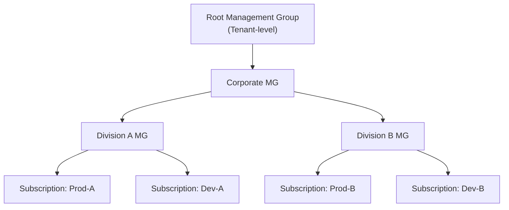

**What you can do with management groups:**
- Apply Azure Policy across all subscriptions (e.g., "no resources outside approved regions")
- Assign RBAC roles that inherit down to all subscriptions and resource groups
- Organize subscriptions into a hierarchy that mirrors your org structure

---

## Azure Resource Manager (ARM)

Every action in Azure — portal click, CLI command, API call, Bicep template — goes through **Azure Resource Manager**.

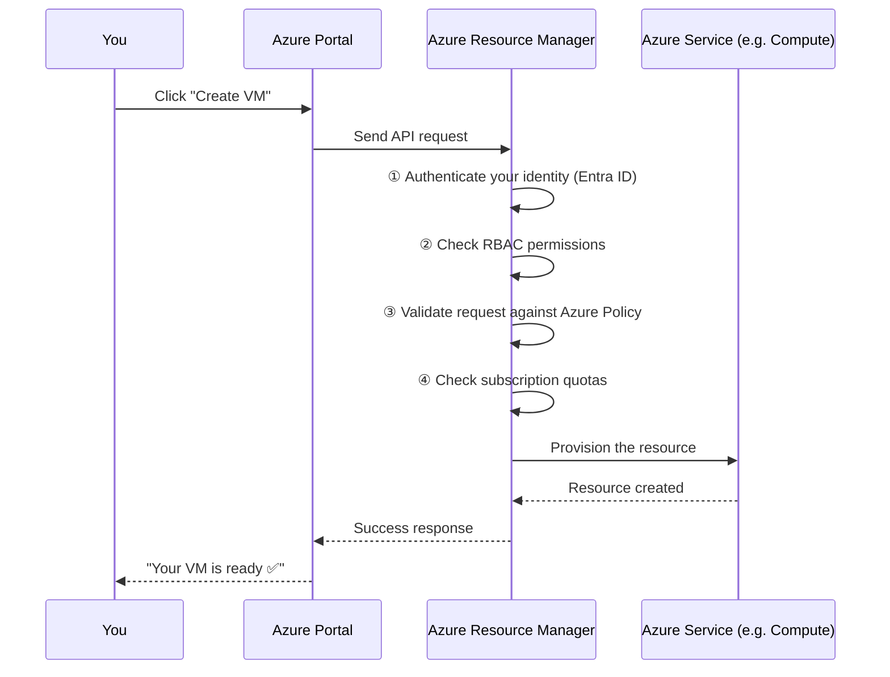

ARM provides a consistent layer that means:
- **Every interface works the same way** — portal, CLI, PowerShell, Terraform, Bicep all call the same ARM API
- **Declarative deployments** — you can describe the desired state and ARM figures out the steps
- **Template exports** — any resource you create manually can be exported as a JSON template for reuse
- **Locks and policies are enforced here** — you can't bypass ARM, so governance applies everywhere

**Why this matters throughout the course:** In Phase 6 (IaC), you'll write Bicep templates that describe resources. ARM reads them and creates everything. Understanding that Bicep → ARM → resource is the whole flow makes IaC click immediately.

---

## Naming Conventions

Azure resource names are **permanent** — you cannot rename most resources after creation.

**Recommended convention for this course:**

```
[workload]-[environment]-[resource-type](-[instance])
```

| Resource | Naming example | Notes |
|---------|---------------|-------|
| Resource Group | `learning-dev-rg` | |
| Virtual Machine | `webapp-dev-vm01` | Number suffix for multiple instances |
| Storage Account | `learndevstore01` | No hyphens allowed, max 24 chars, lowercase only |
| Virtual Network | `learning-dev-vnet` | |
| Key Vault | `learning-dev-kv` | Globally unique, 3–24 chars |
| SQL Server | `learning-dev-sql` | Globally unique, lowercase |
| App Service Plan | `learning-dev-asp` | |
| Web App | `learning-dev-app01` | Globally unique (part of URL) |

!!! warning "Naming rules vary by resource type"
    Some resources have strict rules: storage accounts can't have hyphens or uppercase; key vaults must be globally unique; web app names become part of the URL (`appname.azurewebsites.net`). The portal validates names in real time — watch for the red error under the field.

!!! tip "Microsoft abbreviation guide"
    Microsoft publishes official abbreviations for all resource types: `rg` for resource group, `vm` for virtual machine, `st` for storage, `kv` for key vault, etc. Using standard abbreviations makes your resources recognizable to anyone familiar with Azure.

---

## Tagging

**Tags** are key-value metadata pairs attached to any resource or resource group. They don't affect behaviour — they affect visibility, filtering, and cost allocation.

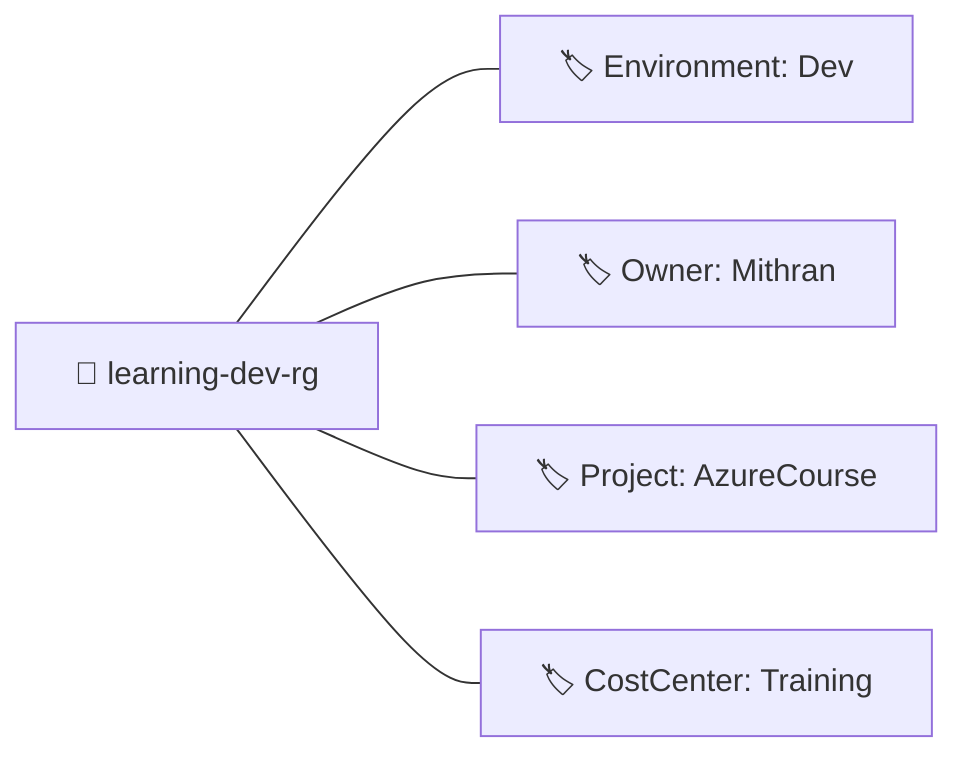

**Practical uses for tags:**

| Tag key | Example value | Use |
|---------|--------------|-----|
| `Environment` | `Dev` / `Staging` / `Prod` | Filter cost by environment |
| `Owner` | `mithran@company.com` | Know who to contact |
| `Project` | `AzureCourse` | Group costs by project |
| `CostCenter` | `CC-1042` | Chargeback to internal teams |
| `ShutdownSchedule` | `18:00-08:00` | Auto-shutdown scripts |
| `DataClassification` | `Public` / `Confidential` | Compliance tracking |

!!! info "Tags inherit downward in billing — but not automatically in the portal"
    If you tag a resource group, the tag appears in Cost Management for billing — but resources inside the group don't automatically inherit the tag in the portal. Use Azure Policy to enforce tag inheritance if needed.

**Tag limits:** 50 tags per resource, key max 512 characters, value max 256 characters. Not all resource types support tags (classic resources don't).

---

## Azure Cloud Shell

**Azure Cloud Shell** is a browser-based terminal built directly into the Azure Portal. It's pre-authenticated with your Azure identity — no login, no installation, no configuration needed.

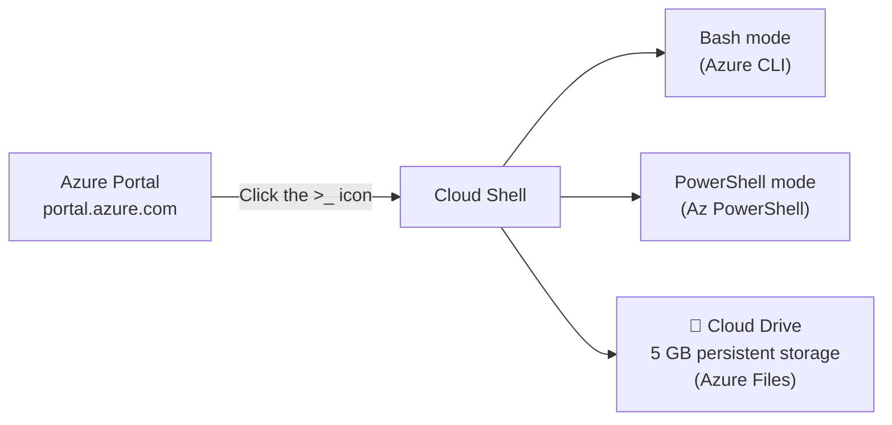

**What Cloud Shell gives you:**
- **Azure CLI** pre-installed and pre-authenticated
- **Azure PowerShell** module pre-installed
- **Common tools**: git, terraform, kubectl, helm, python, node, .NET SDK — all ready to use
- **Persistent storage**: a 5 GB Azure Files share is automatically created and mounted as your home directory — files survive between sessions
- **Editor**: a built-in Monaco editor (same as VS Code) accessible via `code filename`

**When to use Cloud Shell vs the portal:**
- Portal GUI for creating and exploring resources interactively
- Cloud Shell for running scripts, batch operations, or commands that are faster to type than click
- Cloud Shell when you're following documentation that provides CLI commands

!!! tip "Cloud Shell doesn't require a local terminal"
    If you're on a locked-down corporate laptop or a Chromebook, Cloud Shell gives you a full Azure CLI environment through nothing but a browser. It's the equalizer.

---

## Azure Pricing Calculator

Before creating any resource, you should know what it will cost. The **Azure Pricing Calculator** lets you estimate costs for any combination of Azure services.

Found at: `azure.microsoft.com/en-us/pricing/calculator/`

**How the pricing calculator works:**

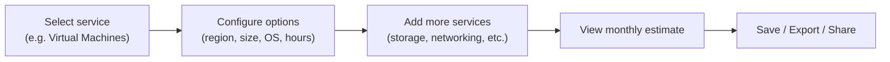

**Key options to understand:**

| Option | What it means |
|--------|--------------|
| **Pay-as-you-go** | Default rate, no commitment, most expensive per hour |
| **1-year Reserved** | Pre-commit to 1 year, ~30–40% cheaper than PAYG |
| **3-year Reserved** | Pre-commit to 3 years, ~50–60% cheaper than PAYG |
| **Spot pricing** | Up to 90% cheaper — but Azure can evict your VM with 30s notice (for batch workloads only) |
| **Azure Hybrid Benefit** | Bring your own Windows Server / SQL Server license, significant discount |

!!! tip "Always calculate before you create"
    Habit: before creating any resource in this course, open the Pricing Calculator and estimate the cost first. This builds real-world intuition and prevents surprises.

**Azure TCO Calculator** (`azure.microsoft.com/en-us/pricing/tco/calculator/`): A separate tool specifically for estimating the cost savings of migrating on-premise workloads to Azure. Used in enterprise sales and migration planning.

---

## Service Level Agreements (SLAs)

An **SLA** is Microsoft's guarantee about the availability of a service — expressed as an uptime percentage. If Microsoft fails to meet the SLA, you receive service credits.

**What the percentages mean in real downtime:**

| SLA | Max downtime per year | Max downtime per month |
|-----|----------------------|----------------------|
| 99% | 87.6 hours | 7.2 hours |
| 99.9% | 8.76 hours | 43.8 minutes |
| 99.95% | 4.38 hours | 21.9 minutes |
| 99.99% | 52.6 minutes | 4.4 minutes |
| 99.999% | 5.26 minutes | 26.3 seconds |

**Examples of Azure service SLAs:**

| Service | SLA | Notes |
|---------|-----|-------|
| Virtual Machine (single instance, premium SSD) | 99.9% | Single VM only |
| Virtual Machine (2+ instances in Availability Set) | 99.95% | Must use Availability Set |
| Virtual Machine (2+ instances across Availability Zones) | 99.99% | Best VM SLA |
| Azure SQL Database | 99.99% | Built-in HA |
| Azure Blob Storage (GRS) | 99.9% read / 99.9% write | |
| Azure App Service | 99.95% | |

**Composite SLAs — the multiplier effect:**

When your application depends on multiple services, the combined SLA is the *product* of individual SLAs:

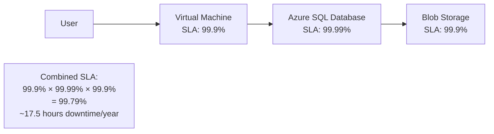

!!! warning "The composite SLA is always lower than the lowest individual SLA"
    This is why architecture matters. More dependencies = lower combined SLA. The solution is redundancy: multiple VMs across zones, geo-redundant storage, etc.

**How to improve your SLA:**
- Use Availability Zones for VMs (99.9% → 99.99%)
- Use geo-redundant storage (adds a second copy in the paired region)
- Use managed services like Azure SQL instead of SQL on a VM (Microsoft manages the HA)
- Use Traffic Manager or Front Door to route across multiple regions

**Where to find SLAs:** Search "Azure SLA" in your browser → Microsoft's official SLA page lists every service.

---

## Azure Advisor

**Azure Advisor** is a free personalized recommendation engine built into Azure. It continuously analyzes your resources and makes recommendations across five pillars.

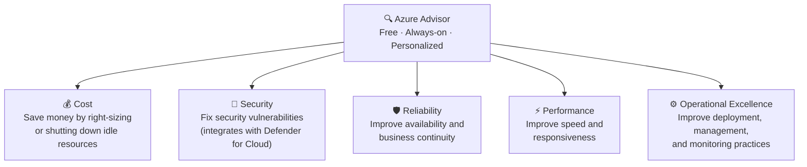

**What each pillar covers:**

| Pillar | Example recommendations |
|--------|------------------------|
| **Cost** | "Resize this underutilized VM and save $45/month"; "Delete unused public IP addresses" |
| **Security** | "Enable MFA for admin accounts"; "Apply disk encryption" |
| **Reliability** | "Add a second instance to this App Service Plan"; "Enable backup for this VM" |
| **Performance** | "Enable caching for this storage account"; "Use Premium SSD for high I/O" |
| **Operational Excellence** | "Set up monitoring alerts"; "Use managed identities instead of stored credentials" |

Advisor gives each pillar a score (0–100). Fixing recommendations improves the score.

!!! tip "Check Advisor weekly"
    As you build resources throughout this course, Advisor will start generating recommendations. It's a free, real-time code review for your Azure environment — always worth checking before the end of a session.

---

## Azure Service Health

**Azure Service Health** tells you the current and historical health of Azure services and your specific resources. It has three components:

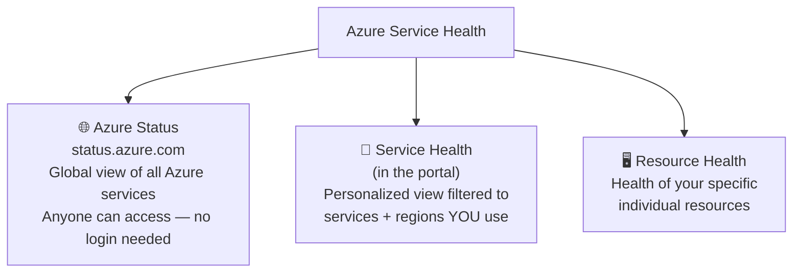

**Azure Status** (`status.azure.com`): A public page showing the current status of every Azure service in every region. Green = healthy. Orange = degraded. Red = service disruption.

**Service Health** (in portal): Personalized alerts filtered to the Azure services and regions you actually use. Shows:
- Active incidents affecting your services
- Planned maintenance windows
- Health advisories (non-incident announcements)
- History of past incidents

**Resource Health**: Drills down to a specific resource. Is *your* virtual machine healthy right now? If not, is it a platform issue or something you caused?

**Service Health Alerts:** You can configure Service Health to email or page you when an incident affects your services. This is a best practice even for learning environments.

---

## Resource Locks

**Resource locks** are a safety mechanism that prevents accidental modification or deletion of critical resources.

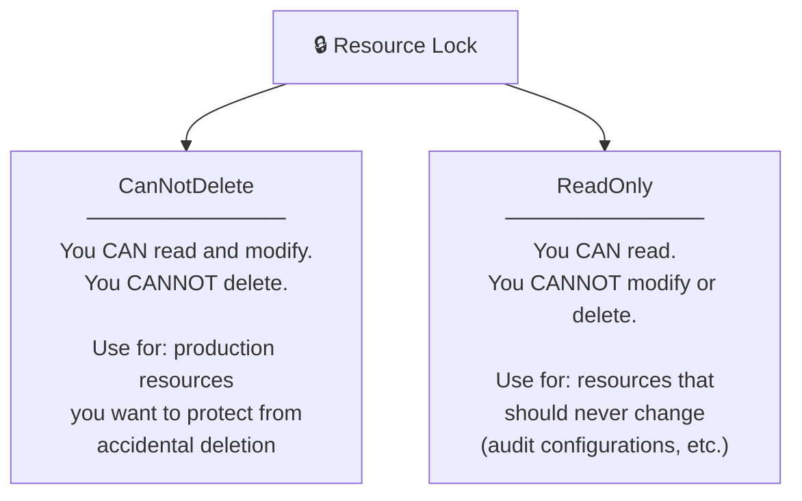

**Lock inheritance:**

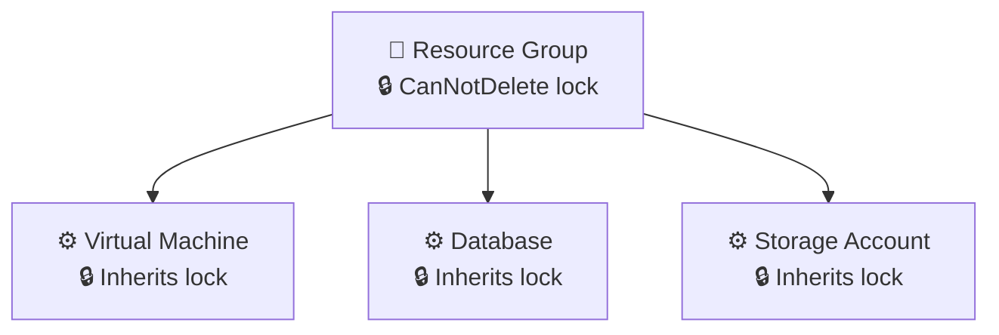

A lock applied to a resource group automatically protects every resource inside it. You don't need to lock each resource individually.

**Lock management rules:**
- Only **Owner** and **User Access Administrator** roles can create or delete locks
- A lock overrides permissions — even an Owner cannot delete a locked resource without first removing the lock
- Locks don't affect read operations — resources function normally under a lock

!!! warning "Locks can cause unexpected failures"
    Some Azure operations require modifying or deleting sub-resources internally. A ReadOnly lock on a storage account can break operations that need to rotate keys. Use CanNotDelete for most cases and ReadOnly only when truly needed.

---

## Portal Dashboards

The Azure Portal home screen is a **dashboard** — and you can fully customize it, create multiple dashboards, and share them with teammates.

**What you can pin to a dashboard:**
- Any resource (VM, storage account, database)
- Metrics charts (CPU usage, request rate, error rate)
- Cost Management charts (spending trends by resource group)
- Azure Advisor score
- Service Health widget
- Markdown tiles (notes, links, documentation)
- Azure Monitor alert summaries

**Multiple dashboards:** Create separate dashboards for different purposes:
- "Daily Operations" — health and alerts for running workloads
- "Cost Overview" — spending by resource group and tag
- "Project Alpha" — all resources for a specific project

Dashboards can be **shared** with other users in your organization (published as Azure resources in a resource group) or **exported** as JSON files for version control.

---

## Demo: Deep Dive into Day 1 Tools

All steps below are **✅ Free Tier** — you can follow every one.

---

### Part A — Create and Tag a Resource Group

!!! success "Step 1 — Open Resource Groups"
    In the Azure Portal search bar, type **"Resource groups"** and click the result.

!!! success "Step 2 — Create a new Resource Group"
    Click **"+ Create"** and fill in:

    | Field | Value |
    |-------|-------|
    | Subscription | *(your subscription)* |
    | Resource group name | `learning-dev-rg` |
    | Region | *(closest to you)* |

    Click **"Review + create"** → **"Create"** → **"Go to resource group."**

!!! success "Step 3 — Apply tags"
    In the left menu, click **"Tags."** Add:

    | Name | Value |
    |------|-------|
    | Environment | Learning |
    | Owner | *(your name)* |
    | Project | AzureCourse |
    | CostCenter | Training |

    Click **"Apply."**

!!! success "Step 4 — Apply a Resource Lock"
    In the left menu, click **"Locks."** Click **"+ Add"** and fill in:

    | Field | Value |
    |-------|-------|
    | Lock name | `prevent-delete` |
    | Lock type | **CanNotDelete** |
    | Notes | Protects course resources from accidental deletion |

    Click **"OK."**

    Now try to delete the resource group: click **"Delete resource group"** in the toolbar, type the name to confirm, and click **"Delete."** It will fail with a lock error. **Good — that's exactly what we want.** The lock works.

!!! success "Step 5 — Remove the lock (so you can clean up later)"
    Go back to **Locks**, select `prevent-delete`, and click **"Delete."** You can delete the resource group normally again when you need to.

---

### Part B — Azure Cloud Shell

!!! success "Step 6 — Open Cloud Shell"
    In the Azure Portal top bar, click the **>_** icon (between the search bar and notifications). A panel opens at the bottom of the screen.

!!! success "Step 7 — First-time setup"
    If this is your first time, Azure will prompt you to create a storage account for your Cloud Drive. Select your subscription, click **"Create storage."** This takes about 30 seconds.

!!! success "Step 8 — Switch between Bash and PowerShell"
    At the top-left of the Cloud Shell panel, click the **Bash** dropdown and switch to **PowerShell** — then switch back to **Bash.** Both are available; this course primarily uses the Portal GUI, but knowing how to switch matters.

!!! success "Step 9 — Run your first commands"
    In Bash mode, run the following:

    ```bash
    az account show
    ```
    This shows your current subscription details — you're already authenticated.

    ```bash
    az group list --output table
    ```
    This lists all your resource groups. You'll see `learning-dev-rg` in the output.

    ```bash
    az group show --name learning-dev-rg
    ```
    This shows the full details of your resource group in JSON format.

!!! success "Step 10 — Use the Cloud Shell editor"
    Run:
    ```bash
    code hello.txt
    ```
    A VS Code-style editor opens in the browser. Type `Hello from Cloud Shell!`, save with `Ctrl+S`, and close. Run `cat hello.txt` to confirm it's there. This file persists in your Cloud Drive across sessions.

---

### Part C — Azure Pricing Calculator

!!! success "Step 11 — Open the Pricing Calculator"
    Open a new browser tab and go to **azure.microsoft.com/en-us/pricing/calculator/**

!!! success "Step 12 — Estimate a Virtual Machine"
    Click **"Virtual Machines"** to add it to your estimate. Configure:

    | Setting | Value |
    |---------|-------|
    | Region | *(your region)* |
    | Operating System | Windows |
    | VM Size | B2s (2 vCPUs, 4 GB RAM) |
    | Hours | 730 (one full month) |
    | Payment option | Pay as you go |

    Note the monthly estimate. Now change **Payment option** to **1-year reserved** and see how the price drops by approximately 30–40%.

!!! success "Step 13 — Add Storage to the estimate"
    Click **"+ Add to estimate"** → search for **"Managed Disks."** Add a 128 GB Premium SSD P10 disk. Watch the monthly total update. This is how a real VM cost estimate works — compute + storage + networking all add up.

!!! success "Step 14 — Save the estimate"
    Click **"Export"** to download the estimate as an Excel file. Click **"Share"** to get a shareable URL. In real projects, you send this URL to stakeholders for approval before deploying.

---

### Part D — Azure Advisor

!!! success "Step 15 — Open Azure Advisor"
    In the Azure Portal search bar, type **"Advisor"** and click the result.

!!! success "Step 16 — Review the overview"
    You'll see the Advisor Score dashboard — scores for each of the 5 pillars. Since your account is new and has minimal resources, scores may be high. As you build more resources throughout this course, Advisor will generate more recommendations here.

!!! success "Step 17 — Explore each pillar"
    Click through **Cost**, **Security**, **Reliability**, **Performance**, and **Operational Excellence**. Read any recommendations present. Even on a fresh account, you may see security recommendations like "Enable MFA" or "Set up a budget alert" (which we already did on Day 0).

!!! success "Step 18 — Configure Advisor alerts (optional)"
    Click **"Alerts"** → **"New Advisor Alert."** You can configure Advisor to email you when a new recommendation appears. This is useful in production environments.

---

### Part E — Azure Service Health

!!! success "Step 19 — Open Service Health"
    In the Azure Portal search bar, type **"Service Health"** and click the result.

!!! success "Step 20 — Review the Service Issues tab"
    This shows any active Azure service incidents in your selected regions. If everything is green, there are no current incidents. Click the **"History"** tab to see past incidents — even large cloud platforms have occasional outages.

!!! success "Step 21 — Check Health Advisories"
    Click the **"Health Advisories"** tab. These are non-incident announcements — things like service retirements, feature changes, and required migrations. This is where you'd find out if a service you're using is being deprecated.

!!! success "Step 22 — Set up a Service Health Alert"
    Click **"Health Alerts"** → **"+ Add service health alert."** Configure:

    | Field | Value |
    |-------|-------|
    | Subscription | *(your subscription)* |
    | Services | Select **Virtual Machines** and **SQL databases** |
    | Regions | *(your region)* |
    | Event types | ✅ Service issue, ✅ Planned maintenance, ✅ Health advisories |
    | Action group | Create new → name it `course-alerts` → add your email |

    Click **"Create alert rule."** You'll now receive an email if any of those services have an issue in your region.

---

### Part E — Azure Marketplace

!!! success "Step 23 — Open Azure Marketplace"
    In the top search bar, type **"Marketplace"** and click the result. Browse the categories on the left: Compute, Networking, Databases, Developer Tools, Security.

!!! success "Step 24 — Explore VM images"
    Click **"Compute"** → click **"Ubuntu Server 24.04 LTS"**. Note the publisher (Canonical), pricing model, and the Create button. This is the image you'll use on Day 2 to create your first Linux VM.

!!! success "Step 25 — Explore third-party solutions"
    Search for **"WordPress"** in the Marketplace. You'll see pre-configured WordPress images from various publishers — ready to deploy in minutes. Marketplace images can save hours of manual configuration.

---

### Part F — Create a Custom Dashboard

!!! success "Step 26 — Create a new dashboard"
    Click the portal home icon (☰ menu → Dashboard). Click **"+ New dashboard"** → **"Blank dashboard."** Name it `AzureCourse Overview`.

!!! success "Step 27 — Pin your resource group"
    Navigate to your `learning-dev-rg` resource group. In the top toolbar, click **"📌 Pin to dashboard."** Select `AzureCourse Overview`. Click **"Pin."**

!!! success "Step 28 — Add a Cost Management tile"
    Search for **"Cost Management"** in the portal. In Cost Management, find the **"Cost by resource"** chart. Click the **📌 pin icon** on the chart → pin it to `AzureCourse Overview`.

!!! success "Step 29 — View and arrange your dashboard"
    Click the portal home icon → select `AzureCourse Overview`. You'll see your pinned tiles. Click **"Edit"** to drag and resize them. Click **"Done customizing"** when satisfied.

---

## Summary

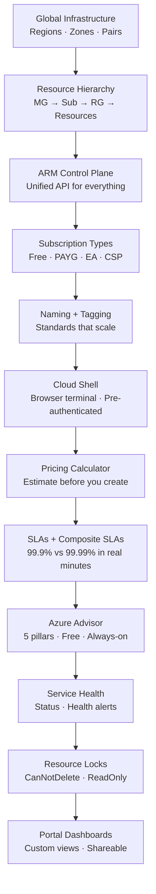

---

## Key Takeaways

| Concept | What to remember |
|---------|-----------------|
| Regions | Geographic locations — pick the closest; check service availability |
| Availability Zones | Physically separate DCs within a region — spread workloads for 99.99% SLA |
| Region Pairs | Paired geographies — staggered maintenance, disaster recovery |
| Resource hierarchy | Management Groups → Subscriptions → Resource Groups → Resources |
| Subscription types | Free Trial, PAYG, EA, CSP, Dev/Test — know which you're on |
| ARM | Every portal click, CLI command, and template calls the same ARM API |
| Resource Groups | Shared lifecycle, access control, cost visibility — group things that belong together |
| Naming | `[workload]-[env]-[type]` — permanent, so get it right the first time |
| Tags | Up to 50 per resource — use Environment, Owner, Project, CostCenter from Day 1 |
| Cloud Shell | Browser terminal at the >_ icon — pre-authenticated, persistent 5 GB drive |
| Pricing Calculator | Always estimate costs before creating — azure.microsoft.com/en-us/pricing/calculator/ |
| SLAs | 99.9% = 8.76 hrs downtime/year; composite SLAs multiply — redundancy improves them |
| Azure Advisor | Free 5-pillar recommendations — check weekly as you build |
| Service Health | 3 layers: Azure Status (global) · Service Health (your services) · Resource Health (your resources) |
| Resource Locks | CanNotDelete on production resource groups — saves you from accidents |
| Dashboards | Pin resources and charts to custom views — shareable with your team |

---

[:material-arrow-left: Previous: Day 0 — Account Setup](day00_account_setup.md) &nbsp;&nbsp; [:material-arrow-right: Next: Day 2 — Virtual Machines Part 1](day02_vms_part1.md)
