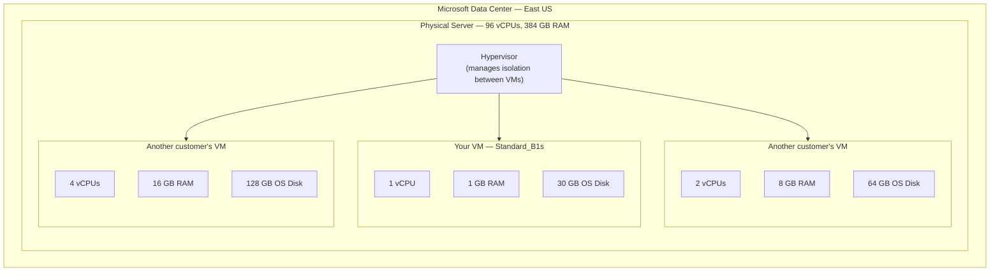
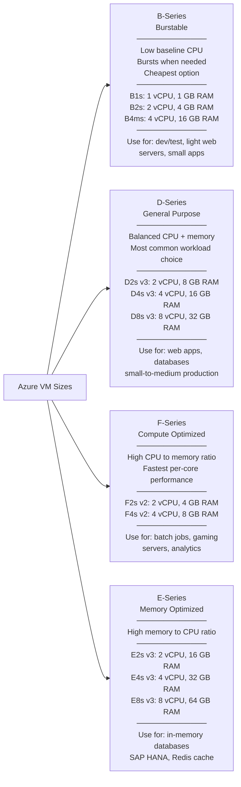
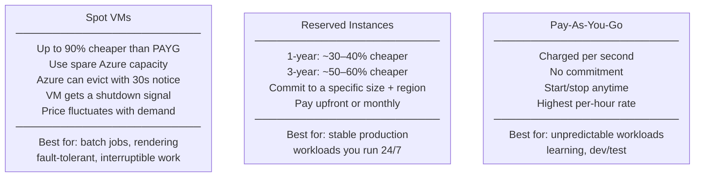
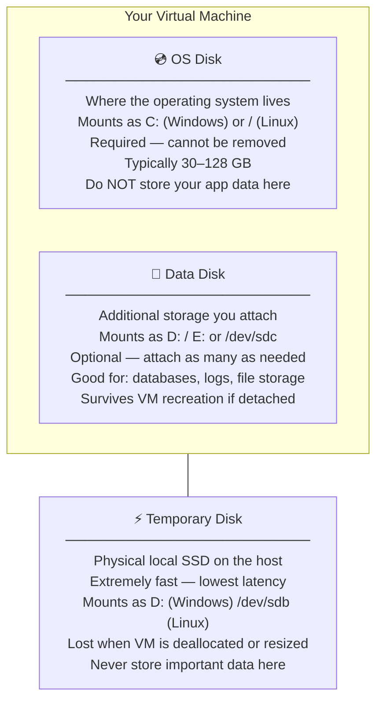
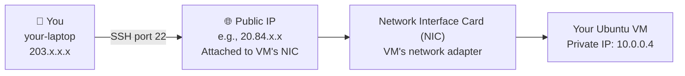
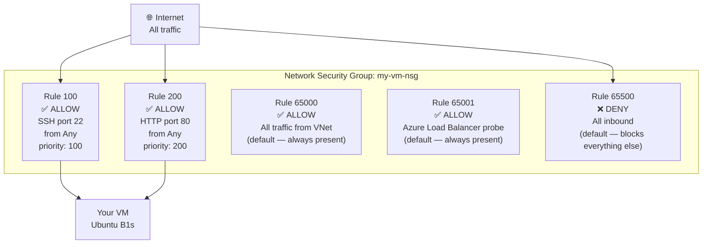
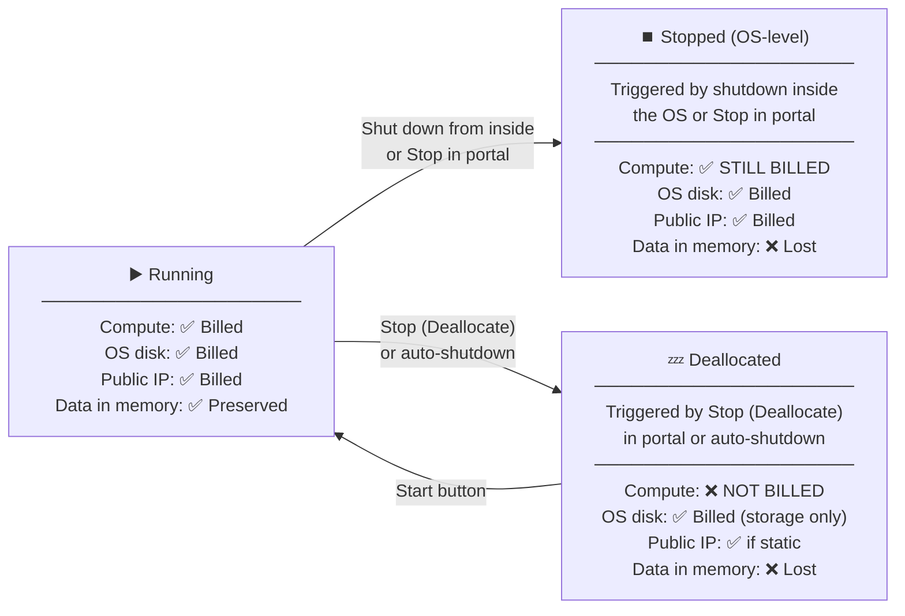
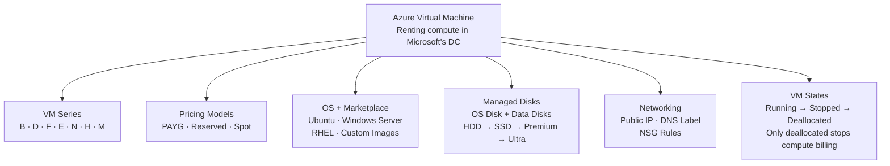

# Day 2 — Azure Virtual Machines Part 1: Creating Your First VM

**Phase 1 — Compute**

> Today you're going to rent a computer in Microsoft's data center, configure it exactly how you want, connect to it from your laptop, and learn how to shut it down without wasting money. By the end of this session, you'll have a real Linux server running in the cloud — one you built from scratch.

---

## What You'll Learn

- What Azure Virtual Machines actually are and how they work under the hood
- VM series and sizes — and which one to pick for what job
- Pricing models: Pay-as-you-go, Reserved Instances, and Spot VMs
- OS options and the Azure Marketplace
- Managed Disks — OS disks vs Data disks, and the four disk tiers
- Public IP addresses and DNS labels
- Network Security Groups — the firewall that controls what can reach your VM
- Full walkthrough: creating an Ubuntu VM from zero in the Azure Portal
- Connecting to your VM over SSH
- The critical difference between stopping and deallocating a VM

---

## Before We Begin — Create a Resource Group

Every resource in Azure needs a home. We create a dedicated resource group first so that when we're done, one delete cleans everything up.

**✅ Free Tier**

!!! success "Step 1 — Open Resource Groups"
    In the Azure Portal search bar, type **"Resource groups"** and click the result.

!!! success "Step 2 — Create the resource group"
    Click **"+ Create"** and fill in:

    | Field | Value |
    |-------|-------|
    | Subscription | *(your subscription)* |
    | Resource group name | `vm-demo-rg` |
    | Region | *(closest to you — e.g., East US, Australia East, West Europe)* |

    Click **"Review + create"** → **"Create."**

    > **Why a separate resource group?** Everything we create today — the VM, its disk, its public IP, its NSG, its virtual network — lands here. When we're done learning, deleting this one resource group cleans everything up instantly.

---

## What Is a Virtual Machine?

A **Virtual Machine (VM)** is a software-defined computer running inside a physical server in one of Microsoft's data centers. You don't buy or touch that server — you rent a slice of it.



**What you control on a VM:**
- The operating system (Ubuntu, Windows Server, RHEL — your choice)
- Everything installed on it (web servers, databases, custom software)
- Network rules that control who can reach it
- The size and number of disks attached

**What Azure controls:**
- The physical hardware underneath
- The hypervisor that keeps your VM isolated from others
- Power, cooling, and physical security in the data center
- Hardware failures — if the physical server dies, Azure migrates your VM

---

### Hands-On: Navigate to Virtual Machines

**✅ Free Tier**

!!! success "Step 3 — Open Virtual Machines"
    In the Azure Portal search bar, type **"Virtual machines"** and click the result. You'll see the VM list (empty for now). Click **"+ Create"** → **"Azure virtual machine"** to open the creation wizard.

    Keep this wizard open — we'll fill it in section by section as we learn each concept.

---

## VM Series and Sizes

Azure offers hundreds of VM sizes organized into **series**, each optimized for a different type of workload. The series letter tells you the workload type; the number tells you how many vCPUs it has.



**Other series worth knowing:**

| Series | Optimized for | Example use case |
|--------|--------------|-----------------|
| **N-series** | GPU workloads | Machine learning training, video rendering |
| **H-series** | High Performance Compute | Scientific simulations, CFD, molecular dynamics |
| **M-series** | Massive memory | SAP HANA up to 4 TB RAM |
| **L-series** | Storage optimized | NoSQL databases, high disk I/O |

**Understanding the size name — Standard_D2s_v3:**

| Part | Meaning |
|------|---------|
| `Standard` | Pricing tier (Standard vs Basic) |
| `D` | Series (General Purpose) |
| `2` | vCPU count |
| `s` | Supports Premium SSD storage |
| `_v3` | Hardware generation (newer = better performance/price) |

!!! info "Free Tier in this course: Standard_B1s"
    The Azure Free Tier includes **750 hours per month of B1s compute for 12 months** — that's enough to run a B1s VM around the clock for an entire year at zero cost. Every demo step today uses the B1s and is fully free.

!!! tip "How to pick a size"
    Start small — B2s or D2s — and use Azure Advisor's right-sizing recommendations to tell you if your VM is consistently under- or over-utilized. It's easier to resize up than to guess up front.

---

### Hands-On: Fill In the Basics Tab

Back in the VM creation wizard on the **Basics** tab.

**✅ Free Tier**

!!! success "Step 4 — Project details"
    | Field | Value |
    |-------|-------|
    | Subscription | *(your subscription)* |
    | Resource group | `vm-demo-rg` |

!!! success "Step 5 — Instance details"
    | Field | Value |
    |-------|-------|
    | Virtual machine name | `ubuntu-demo-vm01` |
    | Region | *(same region as the resource group)* |
    | Availability options | **No infrastructure redundancy required** |
    | Security type | **Standard** |
    | Image | **Ubuntu Server 24.04 LTS — x64 Gen2** |
    | VM architecture | **x64** |
    | Run with Azure Spot discount | *(leave unchecked)* |
    | Size | Click **"See all sizes"** → filter by **B-series** → select **B1s (1 vCPU, 1 GiB RAM)** → click **Select** |

    > **Why Ubuntu 24.04 LTS?** LTS stands for Long-Term Support — this version receives security updates until 2034. Industry-standard choice for cloud Linux servers.

!!! success "Step 6 — Administrator account"
    | Field | Value |
    |-------|-------|
    | Authentication type | **SSH public key** |
    | Username | `azureuser` |
    | SSH public key source | **Generate new key pair** |
    | Key pair name | `ubuntu-demo-vm01_key` |

    > **SSH key vs password:** SSH public key authentication is more secure than a password. Azure generates a key pair — the private key goes to your laptop, the public key goes to the VM. Only someone with the private key file can log in.

!!! success "Step 7 — Inbound port rules"
    | Field | Value |
    |-------|-------|
    | Public inbound ports | **Allow selected ports** |
    | Select inbound ports | **SSH (22)** |

    Leave the Basics tab open — **do not click "Review + create" yet.** Click **"Next: Disks >"**

---

## VM Pricing Models

The same VM size can be priced three different ways depending on your commitment level.



**Pricing comparison — Standard_D2s_v3 in East US:**

| Pricing Model | Monthly cost (approx.) | Savings vs PAYG |
|--------------|----------------------|-----------------|
| Pay-As-You-Go | ~$70/month | baseline |
| 1-Year Reserved | ~$44/month | ~37% cheaper |
| 3-Year Reserved | ~$30/month | ~57% cheaper |
| Spot (when available) | ~$7–$15/month | up to 90% cheaper |

!!! warning "Spot VMs are not for everything"
    If Azure needs that capacity back, your Spot VM gets a 30-second eviction notice and then shuts down. Fine for batch processing or rendering jobs that save their state. Not suitable for web servers, databases, or anything that needs to be always available.

!!! tip "Azure Hybrid Benefit"
    If your organization already owns Windows Server or SQL Server licenses with Software Assurance, you can bring those to Azure and avoid paying for the OS layer — typically saving another 30–40% on top of Reserved pricing.

---

## OS Options and the Azure Marketplace

When you create a VM, you choose an **image** — a pre-built snapshot of an operating system ready to boot.

**First-party images (Microsoft-published):**

| Category | Options |
|----------|---------|
| **Windows Server** | Windows Server 2019, 2022, Windows 10/11 (Dev/Test) |
| **Linux** | Ubuntu 20.04 / 22.04 / 24.04 LTS, Debian 11/12, SUSE SLES |
| **Enterprise Linux** | Red Hat Enterprise Linux 8/9 (licensed), Oracle Linux |

**Third-party Marketplace images:**

| Publisher | Images available |
|-----------|----------------|
| Canonical | Ubuntu Pro (enterprise support) |
| Bitnami | WordPress, LAMP, Nginx, Node.js, MongoDB — pre-configured stacks |
| JetBrains | TeamCity CI/CD server |
| CIS | Hardened OS images meeting CIS benchmarks |
| Cisco, Palo Alto | Network virtual appliances |

**Generation 1 vs Generation 2:**
- **Gen 1**: Legacy BIOS, wider compatibility
- **Gen 2**: UEFI boot, supports larger disks (>2 TB OS disk), faster boot, required for Trusted Launch — always use Gen 2 for new VMs when supported

---

## Managed Disks

Every VM needs storage. Azure storage for VMs comes in three categories:



**Disk performance tiers:**

| Tier | Use case | IOPS (example) | Latency | Price |
|------|---------|---------------|---------|-------|
| **Standard HDD** | Backup, archive, infrequent access | ~500 IOPS | High | Lowest |
| **Standard SSD** | Light production, dev/test, web servers | ~500–6,000 IOPS | Medium | Low |
| **Premium SSD** | Production databases, high-throughput apps | ~7,500–80,000 IOPS | Low | Medium |
| **Ultra Disk** | SAP HANA, top-tier databases, HPC | Up to 160,000 IOPS | Sub-ms | Highest |

!!! info "Managed vs Unmanaged Disks"
    **Managed disks** are the modern standard — Azure manages the underlying storage account for you. You just pick the size and tier. Always use managed disks for new VMs.

---

### Hands-On: Configure the Disks Tab

Still in the VM creation wizard, now on the **Disks** tab.

**✅ Free Tier**

!!! success "Step 8 — OS disk configuration"
    | Field | Value |
    |-------|-------|
    | OS disk size | **Default size (30 GiB)** |
    | OS disk type | **Standard SSD (locally redundant storage)** |
    | Delete with VM | ✅ Checked |

    > **Delete with VM:** Checking this means the OS disk is deleted when you delete the VM. If unchecked, the disk (and its cost) persists even after the VM is gone — a common source of surprise charges.

!!! success "Step 9 — Add a Data Disk"
    Click **"+ Create and attach a new disk."** Configure:

    | Field | Value |
    |-------|-------|
    | Name | `ubuntu-demo-vm01-data01` |
    | Source type | **None (empty disk)** |
    | Size | Click **"Change size"** → select **4 GiB, Standard HDD** → **OK** |
    | Delete disk with virtual machine | ✅ Checked |

    Click **"OK."**

    > In production, your application data, logs, and databases live on separate data disks — never on the OS disk.

    Click **"Next: Networking >"**

---

## Public IP Addresses and DNS Labels

For your VM to be reachable from the internet, it needs a **Public IP address**.



**Dynamic vs Static Public IP:**

| Type | Behavior | Use case |
|------|---------|---------|
| **Dynamic** | IP changes every time the VM is deallocated and started again | Dev/test, short-lived VMs |
| **Static** | IP stays the same forever | Production, DNS records, whitelisted IPs |

!!! tip "DNS labels instead of IPs"
    Azure lets you assign a **DNS label** to a Public IP: `myvm.eastus.cloudapp.azure.com`. This hostname always resolves to your VM's current public IP — even if you use a dynamic IP and it changes.

---

## Network Security Groups (NSG)

A **Network Security Group** is the firewall for your VM. It contains rules that allow or deny traffic based on protocol, port, and source/destination address.



**Key NSG concepts:**

| Concept | Details |
|---------|---------|
| **Priority** | Lower number = evaluated first. Range: 100–4096. Lower wins if rules conflict. |
| **Direction** | Inbound (traffic coming in to the VM) or Outbound (traffic leaving the VM) |
| **Action** | Allow or Deny |
| **Source** | Any IP, a specific IP/CIDR range, a VNet, or a Service Tag (e.g., `Internet`, `AzureCloud`) |
| **Protocol** | TCP, UDP, ICMP, or Any |

**Default inbound rules (always present, cannot be deleted):**

| Priority | Name | Action | What it does |
|----------|------|--------|-------------|
| 65000 | AllowVnetInBound | Allow | All traffic between resources in the same VNet |
| 65001 | AllowAzureLoadBalancerInBound | Allow | Health probes from Azure Load Balancer |
| 65500 | DenyAllInBound | Deny | Blocks everything not explicitly allowed above |

!!! tip "NSG can be attached to a subnet or a NIC"
    When attached to a **subnet**, it applies to every VM in that subnet. When attached to a **NIC**, it applies to one specific VM. You can use both — traffic is evaluated at the subnet NSG first, then the NIC NSG.

---

### Hands-On: Configure Networking, Management, and Deploy

Still in the VM creation wizard — **Networking**, **Management**, **Monitoring**, **Tags**, then deploy.

**✅ Free Tier**

!!! success "Step 10 — Networking tab"
    Azure auto-creates a Virtual Network and subnet since this is the first VM in this resource group.

    | Field | Value |
    |-------|-------|
    | Virtual network | *(auto-generated)* |
    | Subnet | *(auto-generated: `default 10.0.0.0/24`)* |
    | Public IP | *(auto-generated)* |
    | NIC network security group | **Basic** |
    | Public inbound ports | **Allow selected ports** |
    | Select inbound ports | **SSH (22)** |
    | Load balancing options | **None** |

    Click **"Next: Management >"**

!!! success "Step 11 — Management tab: Enable auto-shutdown"
    Scroll to **"Auto-shutdown."** Enable it:

    | Field | Value |
    |-------|-------|
    | Enable auto-shutdown | ✅ On |
    | Shutdown time | **11:00 PM** (or your local evening time) |
    | Time zone | *(your local time zone)* |
    | Send notification before shutdown | ✅ On |
    | Notification email | *(your email address)* |

    > **This is critical for cost control.** Auto-shutdown deallocates your VM each night so you're not paying for compute while you sleep.

    Click **"Next: Monitoring >"**

!!! success "Step 12 — Monitoring tab"
    | Field | Value |
    |-------|-------|
    | Boot diagnostics | **Enable with managed storage account (recommended)** |

    > **Boot diagnostics** captures a screenshot of your VM's console during startup. If your VM ever fails to boot, this is your only way to see what went wrong on a headless cloud VM.

    Click **"Next: Advanced >"** → leave defaults → click **"Next: Tags >"**

!!! success "Step 13 — Tags tab"
    | Name | Value |
    |------|-------|
    | Environment | Learning |
    | Owner | *(your name)* |
    | Project | AzureCourse |
    | Day | Day02 |

    Click **"Next: Review + create >"**

!!! success "Step 14 — Review and deploy"
    Azure validates all your settings. Confirm:
    - VM size: **Standard_B1s**
    - Image: **Ubuntu Server 24.04 LTS**
    - OS disk: **Standard SSD, 30 GiB**
    - Data disk: **Standard HDD, 4 GiB**

    Click **"Create."**

!!! success "Step 15 — Download the private key"
    A dialog appears: **"Generate new key pair."** Click **"Download private key and create resource."**

    Your browser downloads `ubuntu-demo-vm01_key.pem`. **Move this file somewhere safe.** On Linux/macOS: `~/.ssh/`. On Windows: `C:\Users\YourName\.ssh\`.

    Deployment takes 1–3 minutes. When complete, click **"Go to resource."**

---

### Hands-On: Explore Your VM in the Portal

**✅ Free Tier**

!!! success "Step 16 — Overview page"
    The VM Overview shows:
    - **Status:** Running
    - **Public IP address:** Note this — you'll SSH to it shortly
    - **Private IP address:** The VM's internal address (10.0.0.x)
    - **Operating system:** Linux (Ubuntu 24.04)
    - **Size:** Standard_B1s

!!! success "Step 17 — Explore the Disks section"
    In the left-hand menu, click **"Disks."** You'll see the OS disk (30 GiB Standard SSD) and the data disk (4 GiB Standard HDD). Click on the OS disk — notice disks are first-class Azure resources with their own Overview, Snapshots, and access control.

!!! success "Step 18 — Explore Networking and the NSG"
    In the left-hand menu, click **"Networking."** You can see your NIC and the NSG rules. Click **"ubuntu-demo-vm01-nsg"** to open the NSG blade directly — you'll see your port 22 rule and the three Azure default rules.

---

## Connecting to Your VM

SSH (Secure Shell) is the standard way to connect to a Linux VM. You authenticate with the private key you downloaded during creation — no password needed.

---

### Hands-On: SSH Into Your VM

**✅ Free Tier**

!!! success "Step 19 — Open a terminal"
    On **Windows:** Open Windows Terminal or PowerShell.
    On **macOS/Linux:** Open Terminal.
    Or use **Azure Cloud Shell** (click `>_` in the portal) — SSH is pre-installed.

!!! success "Step 20 — Set permissions on the private key (macOS/Linux only)"
    SSH requires the key file is readable only by you:

    ```bash
    chmod 400 ~/.ssh/ubuntu-demo-vm01_key.pem
    ```

!!! success "Step 21 — Connect via SSH"
    Replace `YOUR_PUBLIC_IP` with the IP from your VM's Overview page:

    ```bash
    ssh -i ~/.ssh/ubuntu-demo-vm01_key.pem azureuser@YOUR_PUBLIC_IP
    ```

    On Windows PowerShell:
    ```powershell
    ssh -i C:\Users\YourName\.ssh\ubuntu-demo-vm01_key.pem azureuser@YOUR_PUBLIC_IP
    ```

    Type **yes** when prompted about the host fingerprint. You're now inside your Ubuntu VM.

!!! success "Step 22 — Explore the VM from inside"
    ```bash
    # Check the OS version
    lsb_release -a
    ```
    ```bash
    # Check CPU and memory
    nproc && free -h
    ```
    ```bash
    # Check disk layout — you'll see the OS disk and the data disk
    lsblk
    ```
    ```bash
    # Confirm your public internet address
    curl ifconfig.me
    ```

!!! success "Step 23 — Format and mount the data disk"
    The data disk is attached but not yet usable:

    ```bash
    # Format with ext4 filesystem
    sudo mkfs.ext4 /dev/sdc
    ```
    ```bash
    # Create mount point and mount
    sudo mkdir /data && sudo mount /dev/sdc /data
    ```
    ```bash
    # Verify it's mounted
    df -h /data
    ```

    In a real workload, `/data` is where your application data, database files, or logs would live.

!!! success "Step 24 — Exit the SSH session"
    ```bash
    exit
    ```

    The VM continues running in Azure.

---

## VM Lifecycle — Stop vs Deallocate

This is one of the most important cost concepts for VMs and one of the most common mistakes beginners make.



**The key insight:** When you shut down from inside the VM (`sudo shutdown now`) or press Stop in the portal, Azure keeps the compute capacity **reserved** for you. You're still paying for the vCPU and RAM.

**Deallocating** releases that reserved compute back to Azure's pool. You pay only for disk storage — a few cents per GB per month — until you start the VM again.

---

### Hands-On: Deallocate and Inspect the NSG

**✅ Free Tier**

!!! success "Step 25 — Deallocate the VM"
    In the Azure Portal on your VM's Overview page, click the **"Stop"** button in the top toolbar.

    A dialog appears: **"Do you want to reserve the public IP address?"** — leave it unchecked (we're using a dynamic IP).

    Click **"OK."**

    The VM status changes: **Running → Stopping → Stopped (deallocated).** The Public IP disappears from the Overview — it's been released. The compute charge has now stopped.

!!! success "Step 26 — Start the VM again (optional)"
    Click **"Start."** The VM goes Running in about 30–60 seconds. Notice the Public IP has changed — that's the tradeoff of a dynamic IP.

!!! success "Step 27 — Navigate to the NSG and review rules"
    In the Azure Portal search bar, type **"Network security groups"** and click **"ubuntu-demo-vm01-nsg."** Click **"Inbound security rules"** and confirm:

    | Priority | Name | Port | Action |
    |----------|------|------|--------|
    | 300 | SSH | 22 | Allow |
    | 65000 | AllowVnetInBound | Any | Allow |
    | 65001 | AllowAzureLoadBalancerInBound | Any | Allow |
    | 65500 | DenyAllInBound | Any | Deny |

!!! success "Step 28 — Add an HTTP rule"
    Click **"+ Add"** and configure:

    | Field | Value |
    |-------|-------|
    | Destination port | `80` |
    | Protocol | **TCP** |
    | Action | **Allow** |
    | Priority | `310` |
    | Name | `HTTP` |

    Click **"Add."**

    > We're not running a web server yet — but this is exactly how you'd open port 80 when you install one. Add the NSG rule first, then install the software.

---

## Summary



You've gone from zero to a live Ubuntu server in Microsoft's data center — created, configured, connected to over SSH, explored from the inside, and shut down correctly. These are the fundamental mechanics you'll use for every VM in this course.

**What's next on Day 3:** Availability Sets, Availability Zones, VM Scale Sets, VM backups, Azure Bastion, and custom script extensions. Same service, much more power.

---

## Key Takeaways

| Concept | What to remember |
|---------|-----------------|
| Virtual Machines | Software-defined computers in Microsoft's data centers — you control the OS; Azure controls the hardware |
| B-series (B1s) | Burstable, cheapest series — Free Tier includes 750 hrs/month |
| D-series | General purpose — balanced CPU/memory — most common choice for production |
| Pay-as-you-go | Charged per second, no commitment, most expensive per hour |
| Reserved Instances | 1-year saves ~37%; 3-year saves ~57% — commit when workloads are stable |
| Spot VMs | Up to 90% cheaper — evicted with 30s notice — batch and fault-tolerant workloads only |
| OS Disk | Where the OS lives — never store app data here |
| Data Disks | Separate storage for app data, databases, logs — survives VM recreation if detached first |
| Standard SSD vs Premium SSD | Standard SSD for dev/test; Premium SSD for production databases |
| Public IP | Dynamic (changes on deallocate) or Static (fixed) — use DNS labels to abstract IP changes |
| NSG | Layer 4 firewall — lower priority number = higher precedence — default deny-all protects your VM |
| Stopped ≠ Deallocated | Stopped VM still bills for compute — always use Stop (Deallocate) or auto-shutdown |
| Boot diagnostics | Enable it — your only way to see what a headless VM is doing if it fails to boot |
| Auto-shutdown | Enable on every learning VM — automatically deallocates nightly so you're never accidentally billed overnight |
| SSH key auth | More secure than passwords — download and safeguard your .pem file; it cannot be recovered |

---

[:material-arrow-left: Previous: Day 1 — Azure Fundamentals](day01_fundamentals.md) &nbsp;&nbsp; [:material-arrow-right: Next: Day 3 — Virtual Machines Part 2](day03_vms_part2.md)
