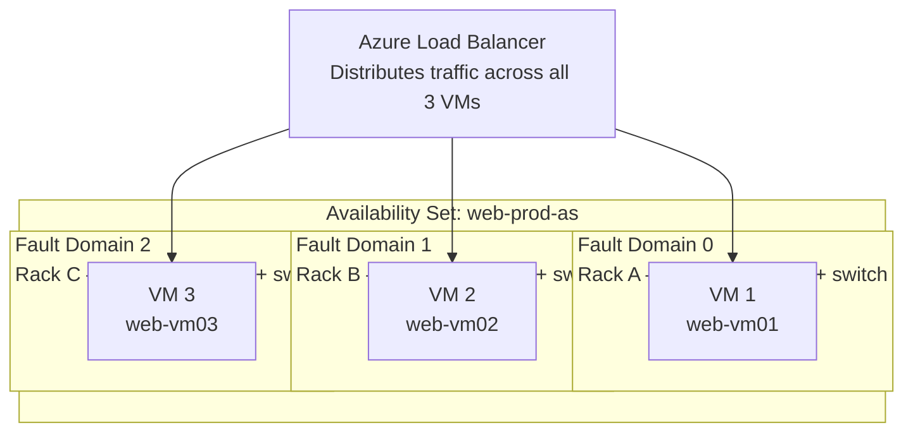
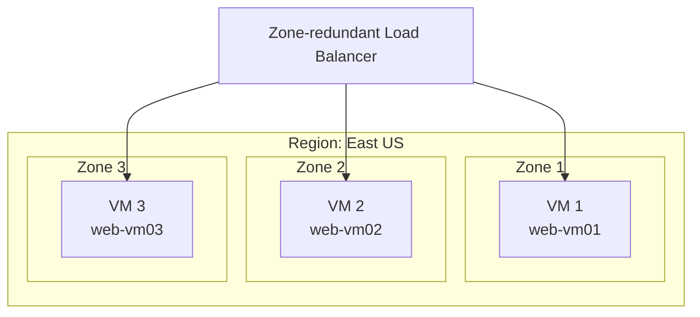
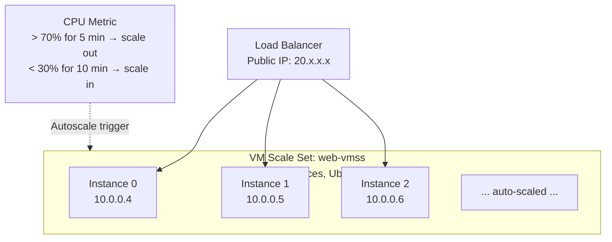
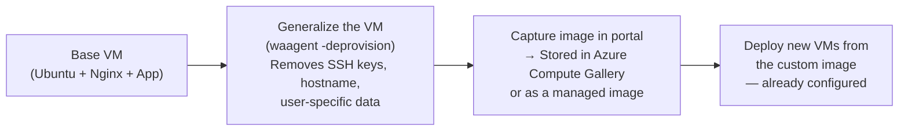
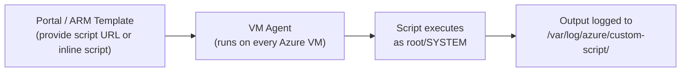
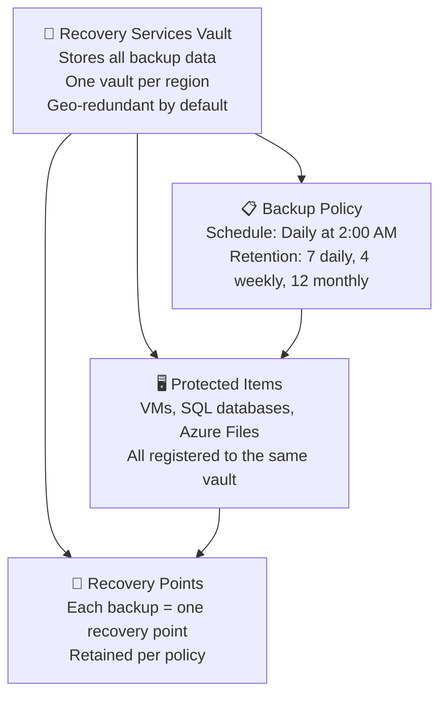
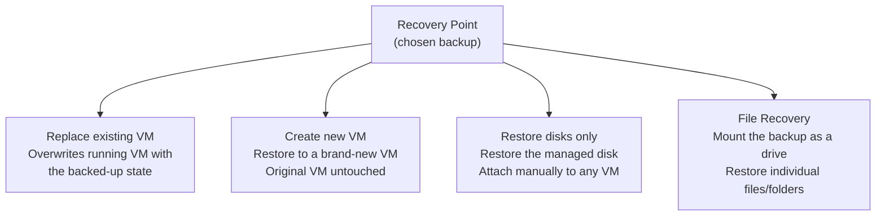
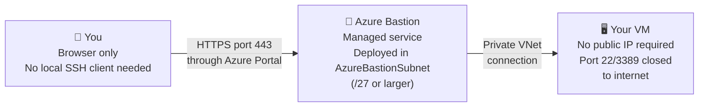
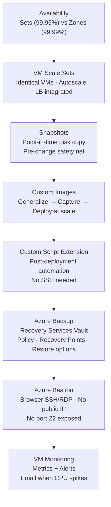

# Day 4 — Azure Virtual Machines Part 2: Management, VMSS & Backups

**Phase 1 — Compute**

> Yesterday you created a VM and connected to it. Today you learn how to make it resilient, scalable, protected, and production-ready. By the end of this session you'll understand how Azure protects your VMs from failures, how to auto-scale a fleet of them, how to back them up, and how to connect securely without exposing SSH to the internet.

---

## What You'll Learn

- Availability Sets and Availability Zones — how Azure protects your VMs from hardware and datacenter failures
- VM Scale Sets (VMSS) — deploy and auto-scale a group of identical VMs as a single resource
- VM Snapshots — point-in-time copies of a disk for backup or cloning
- Custom Images — capture a configured VM as a reusable template
- Custom Script Extensions — run scripts on a VM automatically after deployment
- Azure Bastion — browser-based SSH/RDP without exposing a public IP
- Azure Backup — fully managed backup service using a Recovery Services Vault
- VM Monitoring — CPU, memory, and disk metrics in the portal

---

## Availability Sets vs Availability Zones

When you run a single VM, it sits on a single physical server in a single rack in a single data center. If that server fails, your VM goes down. Azure gives you two tools to fix this: **Availability Sets** and **Availability Zones**.

### Availability Sets

An **Availability Set** distributes your VMs across multiple physical servers, racks, and power/network switches within a single data center — protecting against hardware failures.



**Fault Domains:** Physical racks with separate power supply and network switch. VMs in different fault domains survive a rack-level power failure.

**Update Domains:** Azure performs planned maintenance (host OS updates, hardware replacements) one update domain at a time. VMs in different update domains are never rebooted simultaneously.

**SLA with Availability Sets:** 2+ VMs in an Availability Set → **99.95% SLA** (up from 99.9% for a single VM).

!!! warning "Availability Sets must be configured at VM creation"
    You cannot add an existing VM to an Availability Set after creation. Plan your Availability Sets before deploying your first VM.

---

### Availability Zones

**Availability Zones** spread your VMs across physically separate data centers within the same Azure region — each with independent power, cooling, and networking.



**SLA with Availability Zones:** 2+ VMs across zones → **99.99% SLA** — the highest VM SLA Azure offers.

**Availability Sets vs Availability Zones:**

| | Availability Set | Availability Zone |
|--|-----------------|------------------|
| Protects against | Hardware failure, rack failure | Data center failure |
| Scope | Single data center | Multiple data centers in region |
| SLA | 99.95% | 99.99% |
| Cost | No extra charge | No extra charge for the zone placement |
| When to use | Regions without AZ support | Regions with AZ support (preferred) |

!!! tip "Choose Availability Zones when available"
    If your region supports Availability Zones (East US, West Europe, Australia East, etc.), always use zones instead of Availability Sets. Zones provide stronger protection and a higher SLA.

---

### Hands-On: Deploy Two VMs Across Availability Zones

**✅ Free Tier** — Uses the B1s size (Free Tier eligible). Having two VMs running simultaneously will consume Free Tier hours faster; deallocate when done.

!!! success "Step 1 — Create VM 1 in Zone 1"
    In the Azure Portal, search for **"Virtual machines"** → **"+ Create"** → **"Azure virtual machine."**

    | Field | Value |
    |-------|-------|
    | Resource group | `vm-demo-rg` (from Day 2) |
    | VM name | `web-vm01` |
    | Region | *(your region)* |
    | Availability options | **Availability zone** |
    | Zone | **Zone 1** |
    | Image | **Ubuntu Server 24.04 LTS — Gen2** |
    | Size | **B1s** |
    | Authentication | SSH public key — generate new |
    | Inbound ports | SSH (22) |

    Click through Disks (Standard SSD, delete with VM) → Networking (defaults) → **Review + create** → **Create.**

!!! success "Step 2 — Create VM 2 in Zone 2"
    Repeat the process, same settings except:

    | Field | Value |
    |-------|-------|
    | VM name | `web-vm02` |
    | Zone | **Zone 2** |

    > You now have two VMs in separate data centers. Even if Zone 1's entire data center goes offline, `web-vm02` in Zone 2 keeps running.

!!! success "Step 3 — Observe zone placement"
    On the Overview page of each VM, look at the **"Availability zone"** field. Confirm `web-vm01` shows Zone 1 and `web-vm02` shows Zone 2.

---

## VM Scale Sets (VMSS)

A **VM Scale Set** lets you deploy and manage a group of identical VMs as a single resource — and automatically scale the number of instances up or down based on demand.



**Key VMSS concepts:**

| Concept | Details |
|---------|---------|
| **Uniform orchestration** | All instances are identical — same image, same size. Best for stateless web servers and batch jobs. |
| **Flexible orchestration** | Mix different VM sizes and configs. More control, closer to managing individual VMs. |
| **Autoscale rules** | Scale out when CPU > 70% for 5 min; scale in when CPU < 30% for 10 min. Rules can also use custom metrics, schedules, or Azure Monitor alerts. |
| **Overprovisioning** | Azure creates extra VMs during scale-out, keeps the fastest ones, discards the rest. Reduces risk of a VM creation failure blocking the scale event. |
| **Update policy** | **Manual**: you trigger updates. **Automatic**: Azure rolls out new images immediately. **Rolling**: replace VMs in batches — never takes the whole fleet down. |
| **Instance protection** | Mark specific instances as protected from scale-in so they aren't removed automatically (e.g., an instance running a long-running job). |

!!! info "VMSS + Load Balancer"
    VMSS automatically registers all instances as the Load Balancer's backend pool. New instances added by autoscale join the pool automatically; terminated instances leave automatically. No manual VM management needed.

---

### Hands-On: Create a VM Scale Set

**💳 Paid — Instructor Demo.** Each VMSS instance is a standard VM (billed per hour). Students should watch or use trial credits.

!!! success "Step 4 — Create the Scale Set"
    In the Azure Portal, search for **"Virtual machine scale sets"** → **"+ Create."**

    | Field | Value |
    |-------|-------|
    | Resource group | `vm-demo-rg` |
    | Scale set name | `web-vmss` |
    | Region | *(your region)* |
    | Orchestration mode | **Uniform** |
    | Image | **Ubuntu Server 24.04 LTS — Gen2** |
    | Size | **B1s** |
    | Authentication | SSH public key |

    Click **"Next: Spot >"** → leave unchecked → **"Next: Disks >"** → defaults → **"Next: Networking >"**

!!! success "Step 5 — Configure networking and load balancer"
    | Field | Value |
    |-------|-------|
    | Virtual network | *(select or auto-create)* |
    | NIC network security group | **Basic** — allow HTTP (80) and SSH (22) |
    | Load balancing options | **Azure load balancer** |
    | Load balancer | **Create new** → name `web-vmss-lb` |

    Click **"Next: Scaling >"**

!!! success "Step 6 — Configure autoscale"
    | Field | Value |
    |-------|-------|
    | Initial instance count | `2` |
    | Scaling policy | **Custom** |
    | Minimum instances | `2` |
    | Maximum instances | `10` |

    Click **"+ Add a rule"** → configure scale-out:

    | Field | Value |
    |-------|-------|
    | Metric | **Percentage CPU** |
    | Operator | **Greater than** |
    | Threshold | `70` |
    | Duration | `5 minutes` |
    | Operation | **Increase count by 1** |
    | Cool down | `5 minutes` |

    Add a second rule for scale-in: CPU < 30%, decrease count by 1, 10-minute cool down.

    Click **"Review + create"** → **"Create."**

!!! success "Step 7 — Explore the Scale Set in the portal"
    Once created, open the Scale Set and explore:
    - **Instances** tab: see all running instances with their zone and status
    - **Scaling** tab: view and edit autoscale rules
    - **Operating system** tab: update the image version across all instances
    - **Networking** tab: see the Load Balancer association

---

## VM Snapshots

A **snapshot** is a point-in-time, read-only copy of a managed disk. You create one before making risky changes — if something breaks, you restore from the snapshot.

**When to use snapshots:**
- Before installing new software or making OS changes
- Before resizing a VM's OS disk
- To clone a disk and attach it to another VM for testing
- As a lightweight backup (though Azure Backup is the proper backup solution)

**Snapshot vs Azure Backup:**

| | Snapshot | Azure Backup |
|--|---------|-------------|
| What it is | Copy of one disk | Full VM backup with policy + retention |
| Scheduling | Manual only | Automated on a schedule |
| Retention management | Manual | Automated by policy |
| Restore granularity | Disk only | Full VM, disk, or individual files |
| Best for | One-off pre-change safety net | Production backup strategy |

---

### Hands-On: Create a VM Snapshot

**✅ Free Tier** — Snapshots are billed for storage consumed (same rate as Standard HDD). A 30 GB OS disk snapshot costs a few cents per month.

!!! success "Step 8 — Navigate to the VM's disk"
    Open your `ubuntu-demo-vm01` from Day 2. In the left menu click **"Disks."** Click on the **OS disk** name to open the disk blade.

!!! success "Step 9 — Create a snapshot"
    In the disk blade top toolbar, click **"+ Create snapshot."**

    | Field | Value |
    |-------|-------|
    | Resource group | `vm-demo-rg` |
    | Name | `ubuntu-demo-vm01-osdisk-snap01` |
    | Snapshot type | **Full** |
    | Storage type | **Standard HDD** (cheapest for snapshots) |

    Click **"Review + create"** → **"Create."**

!!! success "Step 10 — Verify the snapshot"
    In the Azure Portal search for **"Snapshots."** Your snapshot appears with a size, resource group, and creation time. To restore: you would create a new managed disk from this snapshot, then either swap the OS disk on the VM or create a new VM from it.

---

## Custom Images

A **custom image** is a generalized snapshot of an entire VM — OS + software + configuration — that you can use to create new VMs. Instead of deploying a base Ubuntu VM and then installing your software every time, you bake everything into an image once and deploy from it.

**Workflow:**



!!! warning "Generalizing destroys the VM"
    Running `waagent -deprovision` on a Linux VM removes its identity and makes it unusable as a running VM. After generalizing, you must capture it as an image immediately. Never generalize a VM you intend to keep running.

!!! info "Azure Compute Gallery"
    The recommended way to store and share custom images. A gallery organizes images by definition (e.g., "ubuntu-nginx-app") and version (1.0.0, 1.0.1, 2.0.0). You can replicate gallery images across regions and share them across subscriptions.

---

## Custom Script Extensions

A **Custom Script Extension (CSE)** runs a shell script (Linux) or PowerShell script (Windows) on a VM after it's deployed — directly from the portal, CLI, or ARM template. No SSH required.

**Common uses:**
- Install software on first boot
- Configure application settings
- Join a domain
- Apply security hardening scripts

**How it works:**



**Script sources:** Azure Blob Storage URL, GitHub raw URL, or inline script (small scripts only).

---

### Hands-On: Run a Script via Custom Script Extension

**✅ Free Tier**

!!! success "Step 11 — Open the VM extension blade"
    Open `ubuntu-demo-vm01`. In the left menu, scroll to **"Extensions + applications"** and click it. Click **"+ Add."**

!!! success "Step 12 — Add the Custom Script Extension"
    Search for and select **"Custom Script Extension."** Click **"Next."**

    In the **Script** field, paste this inline script:

    ```bash
    #!/bin/bash
    apt-get update -y
    apt-get install -y nginx
    echo "<h1>Deployed via Custom Script Extension</h1>" > /var/www/html/index.html
    systemctl enable nginx
    systemctl start nginx
    ```

    Click **"Review + create"** → **"Create."**

!!! success "Step 13 — Monitor the extension"
    The extension status shows **Provisioning** then **Succeeded**. Once complete, visit `http://YOUR_VM_PUBLIC_IP` in a browser — you'll see the custom page served by Nginx, installed entirely via the extension without manual SSH.

---

## Azure Backup for VMs

**Azure Backup** is Microsoft's fully managed backup-as-a-service. It handles scheduling, retention, encryption, and storage — you just define a policy and Azure does the rest.



**Key Azure Backup concepts:**

| Concept | Details |
|---------|---------|
| **Recovery Services Vault** | The container for all backup data. Create one per region. Backed by Azure Storage (GRS by default — replicated to paired region). |
| **Backup policy** | Defines: schedule (daily/weekly), time, retention (days/weeks/months/years). You can have multiple policies in one vault. |
| **Recovery point** | A single backup snapshot. The vault retains recovery points per the policy — old ones are automatically deleted when expired. |
| **Instant restore** | Azure keeps a short-term snapshot (1–5 days) locally for fast restores — no waiting for data to be retrieved from vault storage. |
| **Soft delete** | Deleted backup data is retained for 14 days before permanent removal — protects against accidental or malicious deletion. |
| **GRS vs LRS storage** | Default is Geo-Redundant Storage (backup data replicated to paired region). Switch to LRS if data residency rules require keeping backups in one region. |

**Restore options:**



---

### Hands-On: Enable Azure Backup and Take a Backup

**✅ Free Tier** — Azure Backup charges for storage used by recovery points (a few cents/GB) plus a small protected-instance fee (~$5/month per VM). For learning, the cost is minimal if you clean up recovery points afterward.

!!! success "Step 14 — Create a Recovery Services Vault"
    In the Azure Portal search bar, type **"Recovery Services vaults"** → **"+ Create."**

    | Field | Value |
    |-------|-------|
    | Resource group | `vm-demo-rg` |
    | Vault name | `learning-rsv01` |
    | Region | *(same region as your VM)* |

    Click **"Review + create"** → **"Create."** → **"Go to resource."**

!!! success "Step 15 — Enable backup for your VM"
    In the vault's left menu, click **"Backup."**

    | Field | Value |
    |-------|-------|
    | Where is your workload running? | **Azure** |
    | What do you want to back up? | **Virtual machine** |

    Click **"Backup."**

    On the next screen:

    | Field | Value |
    |-------|-------|
    | Backup policy | **DefaultPolicy** (daily at 9:30 PM, 30-day retention) |

    Click **"+ Add"** → select `ubuntu-demo-vm01` → click **"OK"** → **"Enable Backup."**

!!! success "Step 16 — Trigger an on-demand backup"
    In the vault left menu, click **"Backup items"** → **"Azure Virtual Machine."** Click on `ubuntu-demo-vm01`.

    Click **"Backup now."** Set retention to **30 days** → **"OK."**

    The backup job starts. Go to **"Backup jobs"** in the vault left menu to watch it run. It takes 5–15 minutes for the initial backup.

!!! success "Step 17 — Explore recovery points and restore options"
    Once the backup job completes, go back to **"Backup items"** → **"Azure Virtual Machine"** → `ubuntu-demo-vm01`.

    Click **"Restore VM"** to open the restore wizard. Explore the four options (Replace existing, Create new VM, Restore disks, File Recovery). **Do not complete the restore** — just explore the wizard to understand the options.

    Click **"Cancel"** when done.

---

## Azure Bastion

**Azure Bastion** is a fully managed service that provides secure browser-based SSH (Linux) and RDP (Windows) access to your VMs — without requiring a public IP on the VM or exposing port 22/3389 to the internet.



**Why Bastion instead of SSH over public IP:**

| | Direct SSH (public IP) | Azure Bastion |
|--|----------------------|--------------|
| VM needs public IP | Yes | No |
| Port 22 exposed to internet | Yes | No |
| Client software needed | SSH client | Browser only |
| Audit logging | No | Yes (activity logged) |
| Cost | Free | ~$0.19/hr (~$140/month) |

!!! info "Bastion is not free"
    Azure Bastion charges per hour regardless of whether anyone is connected. For learning environments, SSH over a public IP is fine. Use Bastion in production environments where exposing port 22 to the internet is not acceptable.

---

### Hands-On: Enable Azure Bastion

**💳 Paid — Instructor Demo.** (~$0.19/hr. Students: watch this demo or skip and continue using SSH.)

!!! success "Step 18 — Open your VM and click Connect"
    Navigate to `ubuntu-demo-vm01`. Click **"Connect"** in the top toolbar → **"Bastion."**

    Azure will prompt you to create a Bastion host if one doesn't exist in the VNet.

!!! success "Step 19 — Create the Bastion host"
    Click **"Create Azure Bastion using defaults."** Azure automatically:
    - Creates an `AzureBastionSubnet` (/27) in your VNet
    - Deploys the Bastion host (takes 5–10 minutes)

!!! success "Step 20 — Connect via browser"
    Once Bastion is ready, enter:

    | Field | Value |
    |-------|-------|
    | Authentication type | **SSH Private Key from Local File** |
    | Username | `azureuser` |
    | SSH Private Key | *(upload your .pem file)* |

    Click **"Connect."** A terminal session opens directly in your browser tab — no SSH client, no public IP on the VM needed.

---

## VM Monitoring

Azure provides built-in metrics for every VM — visible in the portal with no configuration required. You can also create **alerts** that notify you when a metric crosses a threshold.

**Built-in VM metrics:**

| Metric | What it tells you |
|--------|-----------------|
| **Percentage CPU** | How hard the vCPU is working — sustained >80% means the VM is under-resourced |
| **Available Memory Bytes** | How much RAM is free — low available memory causes swapping and slowdowns |
| **Disk Read/Write Operations/Sec** | I/O throughput — spikes may indicate a disk bottleneck |
| **Network In/Out** | Bytes received and sent — useful for detecting unexpected traffic |
| **OS Disk Queue Depth** | Pending disk operations — high queue depth = disk is a bottleneck |

---

### Hands-On: Set a CPU Alert

**✅ Free Tier** — Azure Monitor alerts are free for metric alerts up to a generous limit.

!!! success "Step 21 — Open Alerts from your VM"
    Navigate to `ubuntu-demo-vm01`. In the left menu, click **"Alerts"** → **"+ Create"** → **"Alert rule."**

!!! success "Step 22 — Configure the alert condition"
    The VM is pre-selected as the scope. Under **"Condition"**, click **"+ Add condition."**

    | Field | Value |
    |-------|-------|
    | Signal name | **Percentage CPU** |
    | Operator | **Greater than** |
    | Threshold value | `80` |
    | Aggregation type | **Average** |
    | Check every | **1 minute** |
    | Lookback period | **5 minutes** |

    Click **"Done."**

!!! success "Step 23 — Configure the action group"
    Click **"+ Add action groups"** → **"+ Create action group."**

    | Field | Value |
    |-------|-------|
    | Action group name | `vm-alerts-ag` |
    | Display name | `VM Alerts` |

    Under **"Notifications"** → Add:

    | Type | Name | Email |
    |------|------|-------|
    | Email/SMS/Push/Voice | `notify-me` | *(your email)* |

    Click **"Review + create"** → **"Create."**

!!! success "Step 24 — Name and create the alert rule"
    | Field | Value |
    |-------|-------|
    | Alert rule name | `cpu-high-alert` |
    | Severity | **2 — Warning** |
    | Enable upon creation | ✅ Yes |

    Click **"Review + create"** → **"Create."**

    You'll now receive an email if this VM's CPU stays above 80% for 5 minutes. Azure Monitor fires and resolves the alert automatically.

---

## Summary



You now have the full toolkit for running VMs in production: protect them with zones, scale them with VMSS, snapshot before risky changes, automate setup with extensions, back them up with Azure Backup, access them securely with Bastion, and alert on metrics before problems become outages.

**What's next on Day 4:** Azure App Service — deploying web applications without managing VMs at all.

---

## Key Takeaways

| Concept | What to remember |
|---------|-----------------|
| Availability Sets | Protects against rack/hardware failure — 99.95% SLA — must configure at VM creation |
| Availability Zones | Protects against data center failure — 99.99% SLA — use over Availability Sets when region supports it |
| VM Scale Sets | Fleet of identical VMs managed as one resource — autoscale rules add/remove instances automatically |
| Uniform vs Flexible VMSS | Uniform for identical stateless VMs; Flexible when you need mixed sizes or more control |
| Update policy | Rolling updates never take the whole fleet down simultaneously |
| Snapshots | Read-only disk copy — quick safety net before changes; not a substitute for a backup policy |
| Custom Images | Generalize (destroys the VM) → Capture → Deploy — use Azure Compute Gallery for versioning |
| Custom Script Extension | Runs shell/PowerShell scripts post-deployment via the VM Agent — no SSH needed |
| Recovery Services Vault | Central container for all Azure Backup data — one per region, GRS-replicated by default |
| Backup policy | Defines schedule + retention — Azure manages recovery point lifecycle automatically |
| Restore options | Replace VM, create new VM, restore disks only, file-level recovery — choose based on what you need |
| Soft delete | 14-day safety net after deleting backup data — protects against accidental deletion |
| Azure Bastion | Browser-based SSH/RDP — no public IP on VM, no port 22 exposed — paid (~$0.19/hr) |
| VM Metrics | Percentage CPU, Available Memory, Disk IOPS, Network In/Out — all visible in portal with no setup |
| Metric Alerts | Create in Azure Monitor — fire and auto-resolve based on thresholds — free for basic metric alerts |

---

[:material-arrow-left: Previous: Day 3 — Virtual Machines Part 1](day03_vms_part1.md) &nbsp;&nbsp; [:material-arrow-right: Next: Day 4 — Azure App Service](day05_app_service.md)
