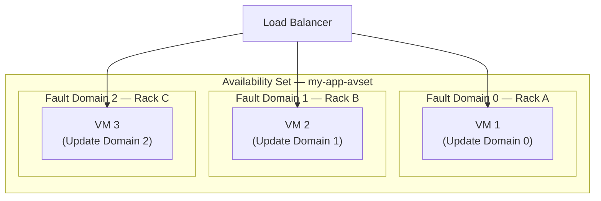
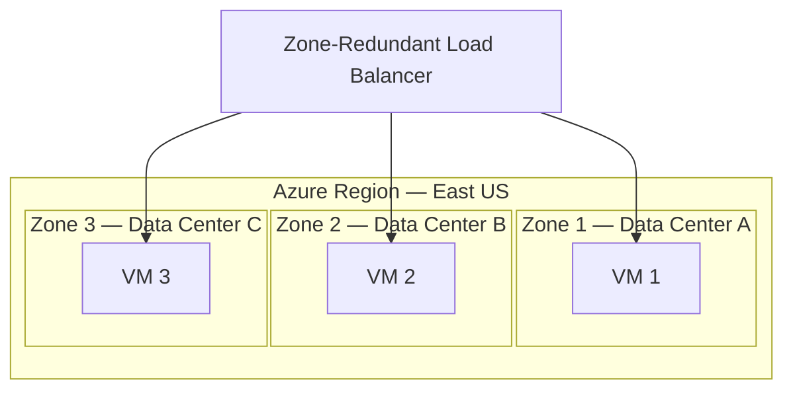
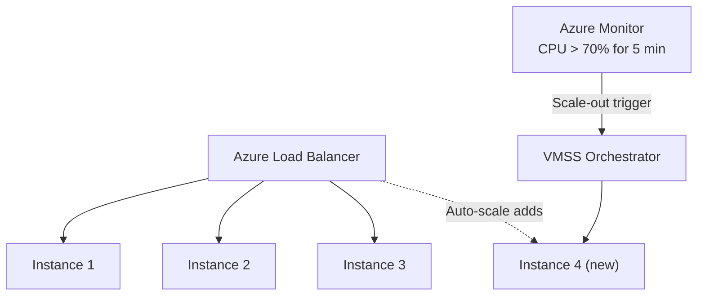
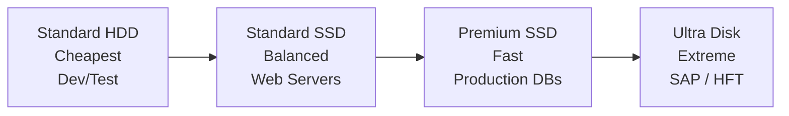
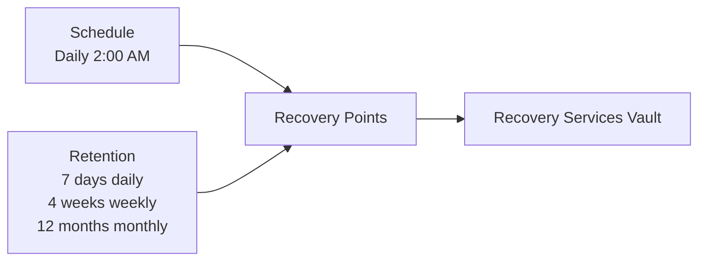
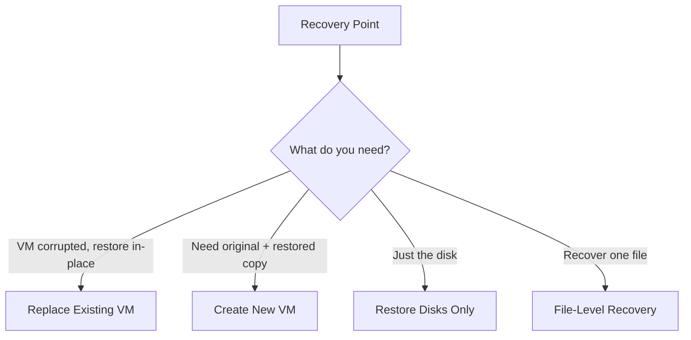

# Day 5 — Azure Virtual Machines Part 3: Management, Availability & Backup

**Phase 1 — Compute**

> You can create a VM and connect to it. But in the real world, that's only the beginning. What happens when the physical server your VM lives on fails? What happens when traffic doubles overnight? What happens if someone accidentally deletes your VM? Today you'll learn how Azure keeps VMs reliable at scale — how to manage disks, capture images, and protect your data with a fully managed backup service.

---

## What You'll Learn

- Availability Sets and Availability Zones — how Azure protects VMs from hardware and datacenter failures
- VM Scale Sets (VMSS) — automatically deploy and scale a group of identical VMs based on demand
- Disk types in Azure — Standard HDD, Standard SSD, Premium SSD, and Ultra Disk compared
- Adding a data disk to a VM and initialising it on both Windows and Linux
- VM Snapshots — capture a disk's exact state at a point in time
- Custom Images — build a configured Ubuntu + Nginx VM, capture it as an image, and deploy a clone from it
- Azure Backup — fully managed backup service: Recovery Services Vault, backup policies, recovery points, and all four restore options
- VM Monitoring — set up a CPU alert that emails you when your VM is under load

---

## Before We Begin — Set Up a VM

All the demos today require an existing VM. If you still have your VM from Day 3 deallocated, start it up. If not, quickly create an Ubuntu B1s VM in a new resource group called `vm-mgmt-rg` — the creation steps are in Day 3.

**✅ Free Tier**

---

## Part 1 — Availability Sets

### The Problem

When your VM runs on a physical server in a Microsoft data center, that server has hardware inside it — CPUs, RAM, hard drives, network cards. Any of that hardware can fail. There are two types of failure to plan for:

| Failure type | What it means |
|---|---|
| **Unplanned hardware failure** | A physical component dies — your VM goes down until Azure migrates it |
| **Planned maintenance** | Microsoft updates the hypervisor — your VM may restart |

If you run your application on a single VM, either event takes your app offline.

### What Is an Availability Set?

An **Availability Set** is a logical grouping of VMs that tells Azure to spread them across different physical hardware within the same data center.

When you put two or more VMs in an Availability Set, Azure guarantees they will never be on the same:
- **Fault Domain** — a rack of servers sharing power and network. If one rack loses power, only VMs on that rack go down.
- **Update Domain** — a group of servers rebooted together during maintenance. Azure reboots domains one at a time — other VMs stay up.

**Example — 3 web servers in an Availability Set:**

| VM | Fault Domain | Update Domain |
|----|-------------|---------------|
| web-vm-1 | FD 0 — Rack A | UD 0 |
| web-vm-2 | FD 1 — Rack B | UD 1 |
| web-vm-3 | FD 2 — Rack C | UD 2 |

**Hardware failure (Fault Domain in action):** A power supply fails on Rack B — `web-vm-2` goes down. `web-vm-1` and `web-vm-3` are on separate racks with their own power, so they keep serving traffic. Your site stays up.

**Azure planned maintenance (Update Domain in action):** Azure needs to patch the hypervisor. It reboots UD 0 first — `web-vm-1` is briefly offline. `web-vm-2` and `web-vm-3` keep running. Once `web-vm-1` is back, Azure reboots UD 1, then UD 2. At no point are all three VMs down at the same time.



**SLA:** Two or more VMs in an Availability Set = **99.95% uptime**.

**Important:** You set the Availability Set at VM creation time. You cannot add a running VM to one after deployment.

---

### Demo — Create a VM with an Availability Set

**✅ Free Tier**

!!! success "Step 1 — Start creating a VM"
    Search **"Virtual machines"** → **"+ Create"** → **"Azure virtual machine."**

!!! success "Step 2 — Availability options"
    On the **Basics** tab, find the **"Availability options"** dropdown. Change it from *"No infrastructure redundancy required"* to **"Availability set."**

!!! success "Step 3 — Create a new Availability Set"
    Click **"Create new"** next to the Availability Set field.

    | Field | Value |
    |-------|-------|
    | Name | `my-app-avset` |
    | Fault domains | **3** *(Azure spreads VMs across 3 racks)* |
    | Update domains | **5** *(Azure staggers reboots across 5 groups)* |

    Click **"OK."**

!!! success "Step 4 — Observe the placement"
    The VM wizard now shows your Availability Set name. Any second VM assigned to the same set automatically lands on a different fault and update domain.

    > You don't need to finish creating this VM — you've seen where the setting lives. Click **"Cancel"** if you don't want to deploy it.

---

## Part 2 — Availability Zones

### What Are Availability Zones?

An **Availability Zone** is a physically separate data center within the same Azure region. Each zone has its own independent power, cooling, and networking — connected by a high-speed private network kilometres apart.

Every major Azure region has at least three zones — Zone 1, Zone 2, and Zone 3.



**SLA:** VMs spread across Availability Zones = **99.99% uptime** — the highest SLA for VMs.

### Availability Sets vs Availability Zones

| | Availability Sets | Availability Zones |
|---|---|---|
| Protects against | Rack / hardware failure in one DC | Full data center failure |
| SLA | 99.95% | 99.99% |
| Cost | No extra charge | Minor inter-zone data transfer |
| When to use | Lower-cost HA | Production workloads, maximum resilience |

---

### Demo — Create a VM with an Availability Zone

**✅ Free Tier**

!!! success "Step 1 — Start creating a VM"
    Search **"Virtual machines"** → **"+ Create"** → **"Azure virtual machine."**

!!! success "Step 2 — Select Availability Zone"
    On the **Basics** tab, change **"Availability options"** to **"Availability zone."**

    A zone dropdown appears — select **Zone 1**. A second VM would go in Zone 2, a third in Zone 3.

!!! success "Step 3 — Observe zone selection"
    The region stays the same (e.g., East US) but the VM is physically deployed to the data center for Zone 1 within that region.

    > Click **"Cancel"** to exit without creating.

---

## Part 3 — VM Scale Sets (VMSS)

### The Problem

Your web app runs on one VM. Normal traffic — fine. Sale day — 10x traffic — VM is overwhelmed. You could provision a large VM to handle peak load, but you'd pay for maximum capacity 24/7 even at 2 AM when no one is online.

### What Is a VM Scale Set?

A **VM Scale Set (VMSS)** is a group of identical VMs managed as a single unit. You define one configuration — OS image, size, startup script — and Azure clones it into as many instances as demand requires, automatically.



**Auto-scale rules:**
- **Scale-out:** if average CPU > 70% for 5 minutes, add 2 instances
- **Scale-in:** if average CPU < 30% for 10 minutes, remove 1 instance
- Set a **minimum** (e.g., 2 for availability) and **maximum** (e.g., 20 to cap cost)

**Orchestration modes:**
- **Flexible** — recommended; full control over individual instances, works with Availability Zones
- **Uniform** — all instances truly identical, better for fully stateless batch workloads

> **VMSS demo is in Day 8** alongside Load Balancer — a VMSS without a Load Balancer in front of it has nowhere to distribute traffic. Understanding the concept now means Day 8 clicks immediately.

---

## Part 4 — Disk Management

### Disk Types in Azure

When you create a VM, Azure attaches an **OS disk** automatically. But in most real-world scenarios, you also add **data disks** — separate disks just for your application data, databases, or logs. This separates your OS from your data, making backups, resizing, and migrations much cleaner.

Every managed disk in Azure is one of four types:

| Disk Type | Max IOPS | Max Throughput | Use Case |
|---|---|---|---|
| **Standard HDD** | 500 | 60 MB/s | Dev/test, backups, infrequent access |
| **Standard SSD** | 6,000 | 750 MB/s | Web servers, lightly loaded apps, CI/CD agents |
| **Premium SSD** | 20,000 | 900 MB/s | Production databases, critical workloads |
| **Ultra Disk** | 160,000 | 2,000 MB/s | SAP HANA, high-frequency trading, latency-sensitive DBs |

**IOPS** = Input/Output Operations Per Second — how many read/write requests the disk can handle per second.  
**Throughput** = how much data (MB/s) flows through the disk.



### Three Types of Disk on Every VM

| Disk | Purpose | Billed | Survives VM restart? |
|---|---|---|---|
| **OS Disk** | Runs the operating system | Yes | Yes |
| **Data Disk** | Your application data, separate from OS | Yes | Yes |
| **Temporary Disk** | Swap space, short-term scratch data | No | **No — data is lost on deallocation** |

> Never store important data on the temporary disk. It is wiped every time the VM is deallocated.

---

### Demo — Add a Data Disk in the Portal

**✅ Free Tier**

!!! success "Step 1 — Open Disks for your VM"
    Go to your VM → left menu → **"Disks."**

    You'll see your OS disk. Below it is an empty **Data disks** section.

!!! success "Step 2 — Create and attach a new disk"
    Click **"+ Create and attach a new disk."** A new row appears.

    | Field | Value |
    |-------|-------|
    | Disk name | `my-data-disk-01` |
    | Storage type | **Standard SSD** |
    | Size | **4 GiB** *(smallest available — enough for the demo)* |

!!! success "Step 3 — Save"
    Click **"Save"** at the top. Azure creates the managed disk and attaches it to the VM as a new block device. The VM does not need to restart.

    > The disk is now attached but **not yet usable** — the OS doesn't know about it yet. You need to initialise it from inside the VM. We'll do that in both Windows and Linux.

---

### Demo — Initialise the Data Disk on Windows

**✅ Free Tier**

For this demo you need a **Windows Server VM** with the data disk attached. If you created one in Day 4, use that — or quickly create a Windows B1s VM and attach a 4 GiB Standard SSD data disk using the steps above.

!!! success "Step 1 — RDP into the Windows VM"
    Go to your Windows VM → **"Connect"** → **"RDP"** → download and open the RDP file → log in.

!!! success "Step 2 — Open Disk Management"
    Press **Win + R**, type `diskmgmt.msc`, and press Enter.

    Disk Management opens. You'll see your OS disk (Disk 0) and the new disk (Disk 1) marked as **Unknown** and **Not Initialized** — this is the 4 GiB data disk you just attached.

!!! success "Step 3 — Initialise the disk"
    Right-click on **Disk 1** (the unknown disk on the left side) → **"Initialize Disk."**

    A dialog appears asking for the partition style:
    - **MBR** — older format, max 2 TB, compatible with older systems
    - **GPT** — modern format, supports disks larger than 2 TB, required for most Azure workloads

    Select **GPT** → **"OK."**

    The disk status changes to **Online**.

!!! success "Step 4 — Create a new volume"
    Right-click the black **Unallocated** bar next to Disk 1 → **"New Simple Volume."**

    The New Simple Volume Wizard opens:

    1. Click **"Next."**
    2. Leave the volume size at maximum → **"Next."**
    3. Assign a drive letter — e.g., **E:** → **"Next."**
    4. Format settings:
        - File system: **NTFS**
        - Allocation unit size: Default
        - Volume label: `DataDisk`
        - Check **"Perform a quick format"**
    5. Click **"Next"** → **"Finish."**

!!! success "Step 5 — Verify in File Explorer"
    Open **File Explorer**. You'll see a new drive **E: (DataDisk)** listed alongside your C: drive. The disk is ready to use — create a folder, save a file, confirm it works.

---

### Demo — Initialise the Data Disk on Ubuntu Linux

**✅ Free Tier**

For this demo you need your **Ubuntu VM** with the data disk attached (done via the portal steps above).

!!! success "Step 1 — SSH into the Ubuntu VM"
    ```bash
    ssh -i ~/Downloads/your-key.pem azureuser@<your-vm-ip>
    ```

!!! success "Step 2 — List block devices"
    ```bash
    lsblk
    ```

    You'll see output like this:

    ```
    NAME    MAJ:MIN RM  SIZE RO TYPE MOUNTPOINT
    sda       8:0    0   30G  0 disk
    └─sda1    8:1    0   30G  0 part /
    sdb       8:16   0    4G  0 disk
    └─sdb1    8:17   0    4G  0 part /mnt
    sdc       8:32   0    4G  0 disk
    ```

    `sda` is the OS disk. `sdb` is the temporary disk. `sdc` is your new data disk — it has no partition yet.

!!! success "Step 3 — Partition the disk with fdisk"
    ```bash
    sudo fdisk /dev/sdc
    ```

    You're now inside the `fdisk` prompt. Type the following commands one at a time:

    | Command | What it does |
    |---|---|
    | `n` | Create a new partition |
    | `p` | Primary partition |
    | `1` | Partition number 1 |
    | *(Enter)* | Accept default first sector |
    | *(Enter)* | Accept default last sector (use the whole disk) |
    | `w` | Write the partition table and exit |

    `fdisk` writes the changes and exits.

!!! success "Step 4 — Format the partition"
    ```bash
    sudo mkfs.ext4 /dev/sdc1
    ```

    This formats the partition with the **ext4** filesystem — the standard Linux filesystem. You'll see output as it writes the superblock and inode tables.

!!! success "Step 5 — Create a mount point and mount the disk"
    ```bash
    sudo mkdir /mnt/data
    sudo mount /dev/sdc1 /mnt/data
    ```

    Verify it's mounted:
    ```bash
    df -h
    ```

    You'll see `/dev/sdc1` listed with its size and mount point `/mnt/data`.

!!! success "Step 6 — Make the mount permanent"
    Right now the disk will unmount on reboot. To make it permanent, add it to `/etc/fstab`:

    ```bash
    echo '/dev/sdc1 /mnt/data ext4 defaults 0 0' | sudo tee -a /etc/fstab
    ```

    Verify it's in fstab:
    ```bash
    cat /etc/fstab
    ```

    Your entry should appear at the bottom. The disk will now automatically mount on every reboot.

!!! success "Step 7 — Test it"
    ```bash
    sudo touch /mnt/data/testfile.txt
    ls /mnt/data
    ```

    The file appears — your data disk is fully initialised, formatted, mounted, and persistent.

---

## Part 5 — VM Snapshots

### What Is a Snapshot?

A **snapshot** is a read-only, point-in-time copy of a managed disk. It freezes the disk's contents at that exact moment.

**Use snapshots for:**
- Before a risky OS update or application install — if it breaks, restore from the snapshot
- A quick one-time backup before decommissioning a VM
- Cloning a disk — create a new managed disk from a snapshot and attach it to another VM

**Snapshots are NOT** a replacement for Azure Backup — they have no scheduling, no retention management, and no application consistency guarantees built in.

---

### Demo — Create a VM Snapshot

**✅ Free Tier**

!!! success "Step 1 — Open your VM's Disks"
    Go to your VM → left menu → **"Disks."** You'll see your OS disk and the data disk you just attached.

!!! success "Step 2 — Open the OS disk"
    Click the name of your OS disk to open the disk resource.

!!! success "Step 3 — Create a snapshot"
    In the disk's left menu, click **"Create snapshot."**

    | Field | Value |
    |-------|-------|
    | Resource group | *(same as your VM)* |
    | Name | `my-vm-os-snapshot-01` |
    | Snapshot type | **Full** |
    | Storage type | **Standard HDD** *(cheapest for a snapshot you won't access frequently)* |

    Click **"Review + create"** → **"Create."**

!!! success "Step 4 — Verify the snapshot"
    Search for **"Snapshots"** in the portal. Your snapshot appears with its size and creation timestamp — a frozen copy of your disk at this exact moment.

    > To restore later: go to the snapshot → **"Create disk"** → attach the new disk to a VM and boot from it.

---

## Part 6 — Custom Images

### What Is a Custom Image?

A **custom image** is an entire VM — OS disk and optionally data disks — captured and turned into a reusable deployment template.

**Use case:** You've set up a VM exactly how you want it — web server installed, custom HTML deployed, configuration applied. Instead of repeating that setup on every new VM, you capture the image once and deploy from it in seconds. Every new VM from that image is an identical clone.

**The process:**
1. Configure your VM exactly as needed.
2. **Generalize** it — run `waagent -deprovision` on Linux (or `sysprep` on Windows). This removes machine-specific identifiers like the SSH host keys, hostname, and user credentials so clones don't conflict.
3. **Deallocate** the VM from the portal.
4. **Capture** the VM as an image in Azure.
5. Deploy new VMs from that image.

> **Important:** Generalizing a VM makes it permanently unusable as a standalone machine. Always do this on a VM you've set up specifically to be a template — not one you're actively using.

---

### Demo — Build a Nginx Web Server VM, Capture It, and Deploy a Clone

**✅ Free Tier**

We're going to build an Ubuntu VM with Nginx and a custom HTML page, capture it as a custom image, then deploy a brand-new VM from that image and confirm it already has Nginx running — zero setup needed.

#### Step A — Create the Source VM

!!! success "Step 1 — Create an Ubuntu B1s VM"
    Search **"Virtual machines"** → **"+ Create"** → **"Azure virtual machine."**

    | Field | Value |
    |-------|-------|
    | Resource group | `vm-mgmt-rg` |
    | VM name | `nginx-source-vm` |
    | Image | **Ubuntu Server 22.04 LTS** |
    | Size | **Standard_B1s** |
    | Authentication | SSH public key — generate new key pair, name it `nginx-source-vm-key` |
    | Inbound ports | SSH (22) |

    Click **"Review + create"** → **"Create."** Download the `.pem` key when prompted.

!!! success "Step 2 — Open port 80 in NSG"
    Once deployed, go to the VM → **"Networking"** → **"Add inbound port rule"** → port **80**, protocol TCP, name `Allow-HTTP-80` → **"Add."**

#### Step B — Install Nginx and Deploy the HTML Page

!!! success "Step 3 — SSH into the VM"
    ```bash
    ssh -i ~/Downloads/nginx-source-vm-key.pem azureuser@<vm-public-ip>
    ```

!!! success "Step 4 — Install Nginx"
    ```bash
    sudo apt update && sudo apt install nginx -y
    ```

!!! success "Step 5 — Deploy the custom HTML page"
    ```bash
    sudo nano /var/www/html/index.html
    ```

    Replace the contents with:

    ```html
    <!DOCTYPE html>
    <html lang="en">
    <head>
        <meta charset="UTF-8">
        <meta name="viewport" content="width=device-width, initial-scale=1.0">
        <title>Azure Custom Image Demo</title>
        <style>
            body {
                font-family: Arial, sans-serif;
                display: flex;
                justify-content: center;
                align-items: center;
                height: 100vh;
                margin: 0;
                background-color: #0078d4;
                color: white;
                text-align: center;
            }
            .card {
                background: rgba(255,255,255,0.15);
                padding: 40px 60px;
                border-radius: 12px;
            }
            h1 { font-size: 2.5em; margin-bottom: 10px; }
            p { font-size: 1.2em; opacity: 0.9; }
        </style>
    </head>
    <body>
        <div class="card">
            <h1>Deployed from Custom Image</h1>
            <p>This VM was launched from an Azure Custom Image.</p>
            <p>Nginx was pre-installed — zero setup required.</p>
        </div>
    </body>
    </html>
    ```

    Press `Ctrl + X` → `Y` → `Enter` to save.

!!! success "Step 6 — Verify the page"
    On your laptop, open a browser and go to `http://<vm-public-ip>`. The custom page appears. The source VM is ready to be captured.

#### Step C — Generalise the VM

!!! success "Step 7 — Deprovision the VM"
    Still in the SSH session, run:

    ```bash
    sudo waagent -deprovision+user -force
    ```

    This removes:
    - SSH host keys (so clones don't share the same keys)
    - Hostname configuration
    - The `azureuser` account and its credentials
    - Cloud-init logs and cached data

    The terminal may show warnings — this is normal. Type `exit` to close the SSH session.

    > **The VM is now generalised.** Do not SSH back in or restart it — it will not work correctly as a standalone machine anymore.

#### Step D — Capture the Image in Azure

!!! success "Step 8 — Deallocate the VM"
    In the portal, go to `nginx-source-vm` → click **"Stop"** in the toolbar.

    Wait for the status to show **"Stopped (deallocated)."** You cannot capture a running or merely stopped VM.

!!! success "Step 9 — Capture the image"
    With the VM deallocated, click **"Capture"** in the VM toolbar.

    | Field | Value |
    |-------|-------|
    | Resource group | `vm-mgmt-rg` |
    | Share image to Azure Compute Gallery | **No, capture only a managed image** *(simpler for this demo)* |
    | Image name | `nginx-web-image` |
    | Automatically delete this VM after creating the image | **Yes** *(the source VM is no longer useful once generalised)* |

    Click **"Review + create"** → **"Create."**

    Azure captures the image and deletes the source VM. This takes 2–3 minutes.

#### Step E — Deploy a New VM from the Image

!!! success "Step 10 — Find your custom image"
    Search for **"Images"** in the portal. You'll see `nginx-web-image` in your `vm-mgmt-rg` resource group.

!!! success "Step 11 — Create a VM from the image"
    Click on `nginx-web-image` → **"+ Create VM."**

    | Field | Value |
    |-------|-------|
    | Resource group | `vm-mgmt-rg` |
    | VM name | `nginx-clone-vm` |
    | Size | **Standard_B1s** |
    | Authentication | SSH public key — generate new key pair |
    | Inbound ports | SSH (22) |

    Click **"Review + create"** → **"Create."**

!!! success "Step 12 — Open port 80 on the clone"
    Once deployed, go to `nginx-clone-vm` → **"Networking"** → add inbound rule for port **80** → **"Add."**

!!! success "Step 13 — Verify Nginx is already running"
    On your laptop, open a browser and go to `http://<clone-vm-public-ip>`.

    Your custom page appears — **"Deployed from Custom Image"** — with zero setup. Nginx was already installed and configured inside the image. The clone booted ready to serve traffic.

    You can also SSH in and confirm:
    ```bash
    sudo systemctl status nginx
    ```

    Output shows `active (running)`.

> This is exactly how VM Scale Sets work in production — every instance is deployed from a custom image that already has your application installed and configured. When the VMSS spins up a new instance under load, it's live in seconds, not minutes.

---

## Part 7 — Azure Backup

This is the most important section of today's session. If a VM holding important data gets deleted, corrupted, or encrypted by ransomware, you need a way to get it back. Azure Backup is how you do that.

### What Is Azure Backup?

**Azure Backup** is Microsoft's native, fully managed backup-as-a-service. You don't manage backup agents, storage accounts, or schedules manually — you tell Azure what to back up and when, and Azure handles everything else.

What Azure Backup can protect: Azure VMs, SQL Server in VMs, Azure Files, Azure Blobs, on-premise servers via the MARS agent.

Today we focus entirely on **VM backup**.

---

### Recovery Services Vault

Before backing up anything, you need a **Recovery Services Vault** — the container that stores all your backup data.

| Property | Detail |
|---|---|
| **Region** | Must be in the same region as the VMs it protects |
| **One vault, many VMs** | A single vault can protect multiple VMs |
| **Storage redundancy** | LRS (3 copies, one data center) or GRS (6 copies across two regions) |
| **Soft delete** | Deleted backups are retained 14 extra days before permanent removal |

---

### Demo — Create a Recovery Services Vault

**✅ Free Tier**

!!! success "Step 1 — Search for Recovery Services vaults"
    Type **"Recovery Services vaults"** in the portal search bar → **"+ Create."**

    | Field | Value |
    |-------|-------|
    | Resource group | `vm-mgmt-rg` |
    | Vault name | `my-backup-vault` |
    | Region | *(same region as your VM — required)* |

    Click **"Review + create"** → **"Create."**

!!! success "Step 2 — Explore vault properties"
    Once deployed, click **"Go to resource"** → left menu → **"Properties."**

    Notice **Backup Storage Redundancy** defaults to **GRS** — your backup data is replicated to a paired Azure region. Change to LRS to reduce cost if cross-region recovery isn't required.

---

### Backup Policy

A **backup policy** defines two things: **schedule** (when to take backups) and **retention** (how long to keep each recovery point).



This means you can restore from any point in the last 7 days, any Sunday in the last month, or any month in the last year — from a single policy.

---

### Demo — Enable Backup for Your VM

**✅ Free Tier**

!!! success "Step 1 — Open Backup from the vault"
    Inside your vault → **Getting started** → **"Backup."**

    - **Where is your workload running?** → **Azure**
    - **What do you want to back up?** → **Virtual machine**

    Click **"Backup."**

!!! success "Step 2 — Review the default policy"
    The **DefaultPolicy** is pre-selected:
    - Daily backup at 2:30 AM UTC
    - 30-day retention for daily recovery points
    - 12-week retention for weekly recovery points

!!! success "Step 3 — Select your VM"
    Click **"Add"** → select your VM → **"OK."**

!!! success "Step 4 — Enable backup"
    Click **"Enable Backup."** Azure installs the backup extension on your VM in 1–2 minutes.

---

### Recovery Points

Every time a backup job runs, it creates a **recovery point** — a snapshot of your VM at that moment.

| Consistency type | What it means |
|---|---|
| **Application-consistent** | VSS (Windows) or freeze/thaw (Linux) ensures apps are in a clean state before snapshot |
| **Crash-consistent** | Taken as-is — like pulling the power cord and snapshotting immediately |

Application-consistent is always preferred for databases.

---

### Demo — Trigger an On-Demand Backup and View Recovery Points

**✅ Free Tier**

!!! success "Step 1 — Go to Backup Items"
    Inside your vault → **"Backup items"** → **"Azure Virtual Machine."** Your VM appears.

!!! success "Step 2 — Trigger a manual backup"
    Click your VM → **"Backup now."** Set **"Retain Backup Till"** to one week from today → **"OK."**

!!! success "Step 3 — Watch the backup job"
    Vault left menu → **"Backup jobs."** Click the in-progress job to see each step — snapshot, transfer, complete. An initial B1s backup takes 15–30 minutes.

!!! success "Step 4 — Browse recovery points"
    Once complete → **Backup items** → your VM. Recovery points are listed with date, time, and consistency type. Each row is a restorable point in time.

---

### Restore Options



| Option | What it does | When to use |
|---|---|---|
| **Replace Existing VM** | Overwrites the running VM's disks | VM corrupted, restore in-place |
| **Create New VM** | Restores as a brand-new VM — original untouched | Test restore, or need both VMs |
| **Restore Disks Only** | Restores the managed disk; attach manually | Inspect before attaching |
| **File-Level Recovery** | Mounts backup as temporary drive; copy files | Recovering one file |

---

### Demo — Explore Restore Options

**✅ Free Tier** *(explore only — no actual restore)*

!!! success "Step 1 — Open the restore wizard"
    **Backup items** → your VM → **"Restore VM."** Browse the Restore type dropdown — all four options are visible. Select a recovery point and see how options update.

    > Click **"Cancel"** — exploring only.

!!! success "Step 2 — File-level recovery"
    Back on the VM backup page → **"File Recovery."** Azure shows a downloadable script that mounts the backup disk as a temporary drive on any running VM for individual file browsing.

    > Click **"Cancel"** — no action needed.

---

## Part 8 — VM Monitoring and Alerts

Azure Monitor collects CPU, memory, disk, and network metrics from every VM automatically. You can set up alerts that notify you when a metric crosses a threshold.

---

### Demo — Set Up a CPU Alert

**✅ Free Tier**

!!! success "Step 1 — Open Alerts for your VM"
    Your VM → **Monitoring** → **"Alerts"** → **"+ Create"** → **"Alert rule."**

!!! success "Step 2 — Configure the condition"
    **Condition** → **"Add condition"** → select **"Percentage CPU."**

    | Setting | Value |
    |---|---|
    | Operator | Greater than |
    | Aggregation type | Average |
    | Threshold value | **80** |
    | Check every | 1 minute |
    | Lookback period | 5 minutes |

    Click **"Next: Actions."**

!!! success "Step 3 — Create an Action Group"
    Click **"+ Create action group."**

    | Field | Value |
    |---|---|
    | Action group name | `vm-alerts-ag` |
    | Display name | `VM Alerts` |

    Under **Notifications** → type: **Email/SMS/Push/Voice** → name: `Email me` → enter your email → **"Review + create"** → **"Create."**

!!! success "Step 4 — Name the alert and save"
    - **Alert rule name:** `VM CPU above 80%`
    - **Severity:** 2 — Warning

    Click **"Review + create"** → **"Create."**

    You'll now receive an email whenever your VM's CPU averages above 80% for 5 minutes. Deep dive on Azure Monitor is in Day 17.

---

## Cleaning Up

**✅ Free Tier**

!!! warning "Stop backup before deleting"
    Go to the vault → **Backup items** → your VM → **"Stop backup"** → **"Delete backup data"** → confirm. If you skip this step, recovery points keep accruing storage charges even after the VM is deleted.

Delete `vm-mgmt-rg` to remove all VMs, disks, snapshots, and NSGs in one step. Delete `my-backup-vault` separately.

---

## Summary and What's Next

Today you covered the full VM management picture.

**Availability Sets** spread VMs across fault and update domains for 99.95% uptime. **Availability Zones** spread them across separate data centers for 99.99% uptime — the production standard.

**VM Scale Sets** let you define one config and auto-scale instances based on demand — full VMSS + Load Balancer demo is in Day 8.

**Disk management** — Azure offers four disk tiers from Standard HDD to Ultra Disk. You attached a data disk, initialised it with Disk Management on Windows, and partitioned, formatted, and mounted it with `fdisk` and `mount` on Linux.

**Snapshots** give you a fast point-in-time disk capture. **Custom Images** go further — you built an Ubuntu + Nginx VM, deployed a custom HTML page, generalised it with `waagent`, captured it as an Azure image, and deployed a clone from it that was already running Nginx with zero setup.

**Azure Backup** with Recovery Services Vault provides scheduled, managed backup with four restore options.

**Coming up next:** Day 6 moves to **Azure App Service** — Microsoft's fully managed platform for hosting web applications. Instead of managing the OS, web server, and patches yourself, App Service handles all of that. You deploy your code, Azure runs it.

---

## Key Takeaways

- **Availability Sets:** 99.95% SLA — rack-level protection. Must be set at VM creation time.
- **Availability Zones:** 99.99% SLA — full data center protection. Standard for production workloads.
- **VM Scale Sets:** identical instances with auto-scale — full demo in Day 8 with Load Balancer.
- **Disk types:** Standard HDD (dev/test) → Standard SSD (web servers) → Premium SSD (production DBs) → Ultra Disk (extreme workloads).
- **Never store data on the temporary disk** — it is wiped on every deallocation.
- **Windows disk initialisation:** Disk Management → Initialize → GPT → New Simple Volume → NTFS.
- **Linux disk initialisation:** `fdisk` to partition → `mkfs.ext4` to format → `mount` to attach → `/etc/fstab` to persist.
- **Snapshots:** fast point-in-time disk captures — good before risky changes, not a replacement for backup.
- **Custom Images:** generalise with `waagent -deprovision` → deallocate → capture → deploy clones. Source VM is no longer usable after generalisation.
- **Recovery Services Vault:** must be in the same region as protected VMs.
- **Four restore options:** Replace existing VM, Create new VM, Restore disks, File-level recovery.
- **Always stop backup before deleting a VM** — orphaned recovery points continue charging.
