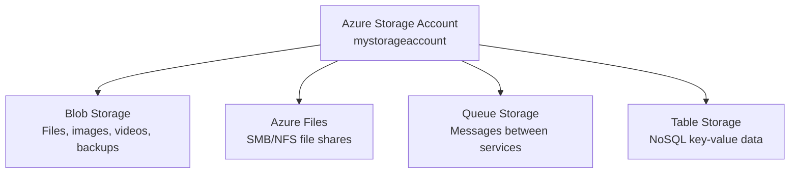
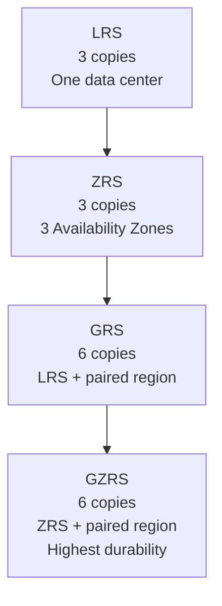
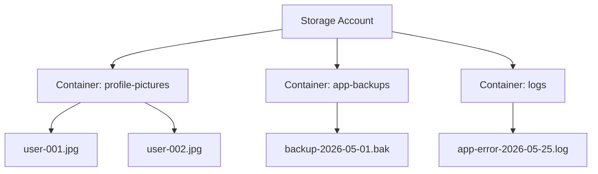
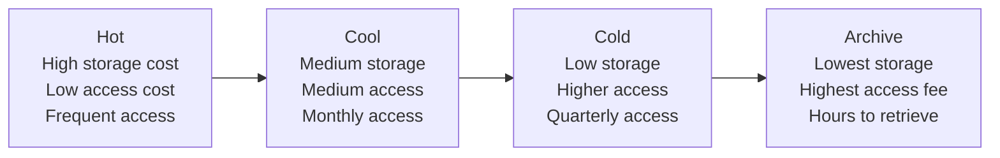

# Day 7 — Azure Storage Account: Blob Storage, Static Websites & Versioning

**Phase 3 — Storage, Databases & Global Delivery**

> Every application needs somewhere to put its data — user profile pictures, log files, database backups, configuration files, static website assets. In Azure, the answer to almost all of those is a single service: the Azure Storage Account. One account, four completely different storage services, one bill. Today we focus on Blob Storage — the most widely used of the four — plus two powerful Blob features you'll use in real projects: Static Website Hosting and Blob Versioning.

---

## What You'll Learn

- What an Azure Storage Account is — the unified namespace concept
- Performance tiers — Standard vs Premium
- Replication options — LRS, ZRS, GRS, GZRS and what they protect against
- Blob Storage — containers, blobs, three blob types, and when to use each
- Access tiers — Hot, Cool, Cold, and Archive — how cost shifts as data ages
- Shared Access Signatures (SAS) — generate a time-limited URL for secure file sharing
- Lifecycle management policies — automatically move blobs between tiers as they age
- Static Website Hosting — serve HTML, CSS, and JavaScript directly from a blob container with no server
- Blob Versioning — automatically save every version of a file and restore previous versions

---

## Before We Begin

All demos today use the **Azure Free Tier**. Microsoft gives you 5 GB of Blob Storage (LRS, Hot tier) free for 12 months — more than enough for everything we'll do today.

**✅ Free Tier** — all demos today.

---

## Part 1 — What Is an Azure Storage Account?

### The Unified Storage Namespace

When you create an **Azure Storage Account**, you are creating a single, named container in Azure that gives you access to four completely different storage services — all under one account name, one set of access keys, and one monthly bill.



Your storage account name becomes part of the URL for every service inside it:

| Service | URL format |
|---|---|
| Blob | `https://mystorageaccount.blob.core.windows.net` |
| Files | `https://mystorageaccount.file.core.windows.net` |
| Queue | `https://mystorageaccount.queue.core.windows.net` |
| Table | `https://mystorageaccount.table.core.windows.net` |

This is why the account name must be **globally unique** across all of Azure — it becomes a public DNS name.

---

### Performance Tiers

When creating a storage account, you choose a performance tier that determines the underlying hardware and which services are available.

| Tier | Hardware | Supported Services | Use Case |
|---|---|---|---|
| **Standard** | Magnetic HDD-backed | Blob, Files, Queue, Table | General-purpose — covers almost all scenarios |
| **Premium** | SSD-backed | Blob (block only) OR Files OR Page Blobs — separate account per type | Low-latency, high-throughput workloads |

> For this course, always use **Standard**. Premium is for databases and workloads that need sub-millisecond latency — not typical application storage.

---

### Replication Options

Azure always stores multiple copies of your data. You choose how many copies and how far apart they are.

| Option | Full Name | Copies | What it protects against |
|---|---|---|---|
| **LRS** | Locally Redundant Storage | 3 copies | Hardware failure in one rack — all 3 copies in one data center |
| **ZRS** | Zone-Redundant Storage | 3 copies | Data center failure — one copy in each of 3 availability zones |
| **GRS** | Geo-Redundant Storage | 6 copies | Regional disaster — LRS in primary region + async copy to paired region |
| **GZRS** | Geo-Zone-Redundant Storage | 6 copies | Both zone and regional failure — ZRS in primary + copy to paired region |



**Cost increases as redundancy increases** — GRS stores twice the data of LRS and replicates to another region, so it costs roughly twice as much.

**For this demo:** use **LRS** — cheapest, still 3 copies, and sufficient for learning.

---

### Demo — Create a Storage Account

**✅ Free Tier**

!!! success "Step 1 — Search for Storage accounts"
    In the Azure Portal search bar, type **"Storage accounts"** → click the result → **"+ Create."**

!!! success "Step 2 — Fill in the Basics tab"

    | Field | Value |
    |-------|-------|
    | Subscription | *(your subscription)* |
    | Resource group | Create new → `storage-demo-rg` |
    | Storage account name | `lwmstorage<yourname>` *(lowercase letters and numbers only, globally unique)* |
    | Region | *(same region you've been using)* |
    | Performance | **Standard** |
    | Redundancy | **Locally-redundant storage (LRS)** |

    Click **"Next: Advanced."**

!!! success "Step 3 — Review the Advanced tab"
    Notice **"Allow enabling public access on containers"** — this controls whether blobs can be made publicly readable. Leave it enabled for this demo; in production you'd evaluate this carefully.

    Also notice **"Minimum TLS version"** — leave at TLS 1.2.

    Click **"Next: Networking."**

!!! success "Step 4 — Networking tab"
    Leave **"Enable public access from all networks"** selected. In production you'd lock this to specific VNets or private endpoints — we'll cover that in the networking days.

    Click **"Review + create"** → **"Create."**

!!! success "Step 5 — Go to your storage account"
    Once deployed, click **"Go to resource."** Take a moment to look at the left menu — you'll see **Containers** (Blob), **File shares**, **Queues**, and **Tables** — all four services in one account.

---

## Part 2 — Blob Storage

### What Is Blob Storage?

**Blob** stands for **Binary Large Object** — it's Azure's object storage service for storing any kind of unstructured data: images, videos, PDFs, log files, database backups, application installers, static website assets.

Blob Storage is organized in two levels:



- **Container** — like a folder at the top level. You can't nest containers inside containers.
- **Blob** — the actual file stored inside a container.

Every blob gets its own URL:
`https://lwmstoragedemo.blob.core.windows.net/profile-pictures/user-001.jpg`

---

### Three Blob Types

| Type | What it's for | How writes work |
|---|---|---|
| **Block Blob** | General files — images, videos, documents, backups | Data written in blocks; blocks committed together. The default type. |
| **Append Blob** | Log files and audit streams | New data can only be appended to the end — cannot modify existing content |
| **Page Blob** | Azure VM managed disks | Optimized for random read/write operations across 512-byte pages |

> When you upload a file via the portal, Azure creates a Block Blob by default. You'll almost always use Block Blobs. Page Blobs are used internally by Azure for managed disks — you rarely create them directly.

---

### Demo — Create a Container and Upload Files

**✅ Free Tier**

!!! success "Step 1 — Open Containers"
    In your storage account → left menu → **"Containers"** → **"+ Container."**

    | Field | Value |
    |-------|-------|
    | Name | `my-uploads` |
    | Public access level | **Private (no anonymous access)** |

    Click **"Create."**

    > **Public access levels:**
    > - **Private** — no one can read blobs without authenticating
    > - **Blob** — anyone with the blob URL can read the file, but they can't list what's in the container
    > - **Container** — anyone can both read files AND list all contents

!!! success "Step 2 — Upload a file"
    Click on `my-uploads` to open it → **"Upload."**

    Drag any file from your laptop — a photo, a PDF, anything. In the upload panel:

    - **Files:** select your file
    - **Advanced → Blob type:** Block blob *(default)*
    - **Advanced → Access tier:** Hot *(default)*

    Click **"Upload."**

    The file appears in the container with its name, size, and last-modified time.

!!! success "Step 3 — View the blob URL"
    Click on the uploaded blob. On the blob's properties page, find the **URL** field:
    `https://lwmstoragedemo.blob.core.windows.net/my-uploads/yourfile.jpg`

    Copy the URL and try to open it in a browser. You'll get a **ResourceNotFound** or **PublicAccessNotPermitted** error — because the container is set to **Private**. Good. That's the correct behaviour. You need to authenticate to access it.

    > We'll fix this in the SAS demo next.

---

## Part 3 — Access Tiers and Lifecycle Management

### Blob Access Tiers

Not all data is accessed equally. A backup from today gets opened frequently. A backup from last year might sit untouched for 11 months. Azure lets you move data between **access tiers** to pay less for data you access less.

| Tier | Access frequency | Storage cost | Access cost | Retrieval time |
|---|---|---|---|---|
| **Hot** | Frequent (daily) | Highest | Lowest | Immediate |
| **Cool** | Infrequent (monthly) | Lower | Higher | Immediate |
| **Cold** | Rare (quarterly) | Lower still | Higher | Immediate |
| **Archive** | Almost never (annual compliance) | Lowest | Very high + rehydration fee | 1–15 hours |



**Key rule:** Archive blobs are **offline** — before you can read an Archive blob, you must **rehydrate** it (move it to Hot or Cool), which takes up to 15 hours and costs extra. Never archive data you might need urgently.

**Setting tiers:** You can set the tier per-blob at upload time, or change it on any individual blob after upload, or use **lifecycle management policies** to automate transitions.

---

### Demo — Change a Blob's Access Tier

**✅ Free Tier**

!!! success "Step 1 — Open the blob"
    In your `my-uploads` container → click your uploaded blob.

!!! success "Step 2 — Change the tier"
    On the blob's overview page, click **"Change tier."**

    You'll see the four options — Hot, Cool, Cold, Archive. Select **"Cool"** → **"Save."**

    The blob is now on the Cool tier. Accessing it less frequently means you're paying less per GB per month to store it.

    > Change it back to **Hot** for the rest of the demos.

---

### Lifecycle Management Policies

Instead of manually changing blob tiers, you can write rules that do it automatically:

- *"Move blobs to Cool tier if they haven't been accessed in 30 days"*
- *"Move blobs to Archive if they haven't been accessed in 90 days"*
- *"Delete blobs that are older than 365 days"*

This is **Lifecycle Management** — a set of JSON rules evaluated daily that automatically manage blob tiers and deletion based on age or last-access time.

---

### Demo — Create a Lifecycle Management Policy

**✅ Free Tier**

!!! success "Step 1 — Open Lifecycle management"
    In your storage account → left menu → **"Data management"** → **"Lifecycle management"** → **"+ Add a rule."**

!!! success "Step 2 — Name the rule"
    | Field | Value |
    |-------|-------|
    | Rule name | `auto-tier-rule` |
    | Rule scope | Apply rule to all blobs in storage account |
    | Blob type | Block blobs |
    | Blob subtype | Base blobs |

    Click **"Next: Base blobs."**

!!! success "Step 3 — Define the transitions"
    | Condition | Action |
    |-----------|--------|
    | Base blobs last modified more than **30** days ago | **Move to cool storage** |
    | Base blobs last modified more than **90** days ago | **Move to archive storage** |
    | Base blobs last modified more than **365** days ago | **Delete the blob** |

    Check all three boxes and set the day values as above.

    Click **"Add."**

    > The policy is now saved. Azure evaluates it once per day. Any blob untouched for 30 days automatically drops to Cool. Any blob untouched for 90 days drops to Archive. After a year, it's deleted. You never need to think about it again.

---

## Part 4 — Shared Access Signatures (SAS)

### The Problem

Your blobs are private — no one can access them without authenticating as your storage account. But what if you need to share a specific file with someone temporarily — a client, a contractor, a partner — without giving them your account key?

A **Shared Access Signature (SAS)** is a signed URL that grants specific, time-limited access to a blob, container, or service. You control exactly what they can do and for how long.

**A SAS URL looks like this:**
```
https://lwmstoragedemo.blob.core.windows.net/my-uploads/report.pdf
  ?sv=2023-11-03
  &se=2026-05-26T10%3A00%3A00Z
  &sr=b
  &sp=r
  &sig=AbCdEf1234...
```

The query parameters encode:
- **`se`** — expiry time (this URL stops working after this timestamp)
- **`sr`** — resource type (`b` = blob, `c` = container)
- **`sp`** — permissions (`r` = read only, `w` = write, `d` = delete)
- **`sig`** — the cryptographic signature that proves Azure generated it

If someone modifies any part of the URL, the signature check fails and access is denied.

---

### Demo — Generate a SAS URL for a Blob

**✅ Free Tier**

!!! success "Step 1 — Open the blob"
    In `my-uploads` → click your uploaded blob.

!!! success "Step 2 — Generate SAS"
    In the blob's left menu → **"Generate SAS."**

    | Field | Value |
    |-------|-------|
    | Signing method | **Account key** |
    | Permissions | **Read** *(untick everything else)* |
    | Expiry | Set to **tomorrow's date and time** |
    | Allowed protocols | **HTTPS only** |

    Click **"Generate SAS token and URL."**

!!! success "Step 3 — Test the URL"
    Copy the **Blob SAS URL** (the full URL, not just the token). Open it in a browser — your file loads successfully.

    Now try modifying the URL — change any character in the `sig` parameter. Reload the page — you get an **AuthenticationFailed** error. The signature check caught the tampering.

    > After the expiry time you set passes, the URL will stop working entirely — even without modification.

---

## Part 5 — Static Website Hosting

### Serving a Website Directly From Blob Storage

Blob Storage isn't just for storing files your application downloads — you can serve an entire website from it. Azure Storage has a built-in **Static Website Hosting** feature that turns a blob container into a web host for HTML, CSS, JavaScript, and image files.

When you enable static website hosting, Azure:
- Creates a special container called `$web` in your storage account
- Gives you a public endpoint URL — e.g., `https://lwmstoragedemo.z13.web.core.windows.net`
- Serves files from `$web` at that URL — no VM, no App Service, no compute charge

**When to use it:**

| Scenario | Good fit? |
|---|---|
| Marketing or landing page | ✅ Yes |
| Documentation site | ✅ Yes |
| React / Vue / Angular app (build output is static files) | ✅ Yes |
| Any site that needs server-side code or database calls from the server | ❌ No — use App Service or Azure Functions |

**Cost:** You pay only for the storage (fractions of a cent per GB) and bandwidth. There is no compute charge — no server is running. For a small site with modest traffic, monthly cost is effectively zero.

**Static Website vs App Service:**
- **App Service** runs server-side code — .NET, Node.js, Python — and handles the request on the server before sending a response
- **Static Website Hosting** just serves files. The browser downloads the HTML, CSS, and JS and runs everything client-side
- A common pattern: host your React frontend on Static Website, and have it call an Azure Functions backend API. Best of both — no servers for the frontend, pay-per-execution for the backend

---

### Demo — Enable Static Website Hosting

**✅ Free Tier**

!!! success "Step 1 — Enable Static Website"
    In your storage account → left menu → **"Data management"** → **"Static website."**

    Toggle **Static website** to **Enabled.**

    Fill in:
    - **Index document name:** `index.html`
    - **Error document path:** `404.html`

    Click **"Save."**

    Azure shows you two important URLs:
    - **Primary endpoint:** `https://<accountname>.z13.web.core.windows.net` — this is your site's public address
    - A `$web` container has been created automatically in your storage account

!!! success "Step 2 — Create a simple HTML page"
    On your laptop, create a file called `index.html` with this content:

    ```html
    <!DOCTYPE html>
    <html>
      <head><title>My Azure Site</title></head>
      <body>
        <h1>Hello from Azure Blob Storage!</h1>
        <p>This page is hosted entirely in a Storage Account — no server running anywhere.</p>
      </body>
    </html>
    ```

!!! success "Step 3 — Upload to the $web container"
    In the portal → **Containers** → click the **`$web`** container.

    Click **"Upload"** → select your `index.html` → click **"Upload."**

!!! success "Step 4 — Visit your site"
    Go back to **Static website** settings and copy the **Primary endpoint** URL.

    Open it in your browser. Your page loads — no VM, no App Service, no server running anywhere.

    > **Custom domain:** The default URL looks like `https://<accountname>.z13.web.core.windows.net`. For a real domain (e.g., `www.yoursite.com`), create a CNAME DNS record at your registrar pointing to this URL, then configure it under **Networking → Custom domain** in the storage account. Azure also integrates with Azure CDN to add HTTPS to custom domains on static sites.

!!! success "Step 5 — Test the error page"
    In your browser, navigate to a page that doesn't exist under your site URL — e.g., `https://<accountname>.z13.web.core.windows.net/nonexistent`.

    You'll get a 404 response. Azure serves your `404.html` if you created one and uploaded it to `$web`, otherwise a generic error. This is where you'd upload a branded error page for a real site.

---

## Part 6 — Blob Versioning

### Protecting Against Overwrites

SAS tokens control who can access blobs. Lifecycle policies manage cost. But what protects you from accidentally overwriting a critical file with corrupted or incorrect data?

**Blob Versioning** is a data protection feature that automatically creates and stores a copy of every blob each time it is overwritten or deleted. Each version has the same blob name but a different **version ID** — a timestamp-based identifier. You can view the full history of a blob, restore any previous version, or download a specific version.

**How it differs from Soft Delete:**

| Feature | Protects against | How it works |
|---|---|---|
| **Soft Delete** | Accidental *deletion* | Keeps deleted blobs in a hidden state for a retention period |
| **Versioning** | Accidental *overwrite* | Saves a copy automatically every time a blob is modified |

You can — and should — enable both together for maximum protection.

**Cost consideration:** Every version is billed as its own blob. If a 10 MB file is overwritten 20 times, you're storing 200 MB total. Use lifecycle management rules to auto-delete old versions after a set number of days.

---

### Demo — Enable Versioning and Restore a Previous Version

**✅ Free Tier**

!!! success "Step 1 — Enable Blob Versioning"
    In your storage account → left menu → **"Data management"** → **"Data protection."**

    Under **Recovery**, check **"Enable versioning for blobs."**

    Click **"Save."**

!!! success "Step 2 — Upload Version 1"
    Create a plain text file on your laptop called `notes.txt` with the content:
    ```
    Version 1 — original content
    ```

    Go to **Containers** → `my-uploads` → **"Upload"** → select `notes.txt` → **"Upload."**

!!! success "Step 3 — Overwrite with Version 2"
    Edit your `notes.txt` locally. Change the content to:
    ```
    Version 2 — updated content
    ```

    Upload the file again — **same filename** `notes.txt` → **"Upload."**

    Azure keeps both copies. The current blob is now Version 2. Version 1 is stored as a historical version with a different version ID.

!!! success "Step 4 — View the versions"
    Click on `notes.txt` in the container.

    On the blob's overview page, look for the **"Versions"** tab or click **"Show versions"** in the container list toolbar.

    You'll see two entries: the current version and the original, each showing its version ID (a timestamp string) and when it was created.

!!! success "Step 5 — Restore Version 1"
    Click the older version in the list.

    Click **"Make current version"** (or copy this version over the current blob).

    Download `notes.txt` — it now contains `Version 1 — original content`. The accidental overwrite is reversed.

    > **Production tip:** Enable versioning at account creation time. It only protects blobs created or modified *after* it is enabled — retroactive enabling does not version-stamp existing blobs. Also create a lifecycle rule to delete versions older than 90 days to keep storage costs under control.

---

## Cleaning Up

**✅ Free Tier**

!!! warning "Delete the resource group"
    Go to **Resource groups** → `storage-demo-rg` → **"Delete resource group"** → type the name to confirm → **"Delete."**

    This removes the storage account and all data inside it — blobs, the `$web` container, all versions — in one step.

    > The Free Tier gives you 5 GB of Blob Storage free for 12 months, so there is no charge from this demo.

---

## Summary and What's Next

Today you built a solid foundation in Azure Blob Storage.

**The Storage Account** is the unified namespace for four different storage engines. Today's focus was on the one you'll use most: **Blob Storage**.

**Blob Storage** is where unstructured data lives — images, backups, log files, anything that's a file. Block Blobs for general files, Append Blobs for logs, Page Blobs for VM disks. The four access tiers (Hot, Cool, Cold, Archive) let you cut costs as data ages, and lifecycle management policies automate those transitions.

**SAS tokens** give you surgical access control — a time-limited, permission-scoped URL you can share with anyone without exposing your account key. Tamper with the URL and the cryptographic signature check fails instantly.

**Static Website Hosting** turns your storage account into a zero-server web host. HTML, CSS, and JavaScript files in the `$web` container are served at a public URL — no compute charge, no infrastructure to maintain. Perfect for frontend apps, landing pages, and documentation sites.

**Blob Versioning** is your safety net for overwrites. Every time a blob is modified, Azure silently saves the previous copy. One click to restore. Combine it with Soft Delete and lifecycle policies for a complete data protection strategy.

**Coming up next — Day 8:** We finish the storage picture with **Azure Files** (mount a cloud file share on any VM or laptop), **Queue Storage** (decouple your application components with messages), and **Table Storage** (simple schemaless NoSQL for structured data), plus **Azure Storage Explorer** for managing everything from your desktop.

---

## Key Takeaways

- **Storage Account = one account, four services** — Blob, Files, Queue, Table all share one account name and one bill
- **Account name is globally unique** — it becomes the DNS name for all four service endpoints
- **Standard vs Premium** — Standard covers almost every use case. Premium is for sub-millisecond latency requirements
- **LRS** — 3 copies in one data center. **ZRS** — 3 copies across zones. **GRS** — 6 copies across two regions. **GZRS** — maximum durability
- **Block Blob** — general files. **Append Blob** — logs only. **Page Blob** — VM disks
- **Hot → Cool → Cold → Archive** — storage cost drops, access cost rises, retrieval time increases. Archive takes up to 15 hours to rehydrate
- **SAS tokens** — time-limited, permission-scoped URLs. Tampering with any part of the URL breaks the signature and returns AuthenticationFailed
- **Lifecycle management** — rules evaluated daily that automatically move or delete blobs based on age. Set once, forget
- **Static Website Hosting** — enable on the storage account, upload files to `$web`, get a public URL — no server, no compute charge
- **Blob Versioning** — every overwrite creates a stored version with a unique version ID. Enable at account creation; add a lifecycle rule to delete old versions to control cost
