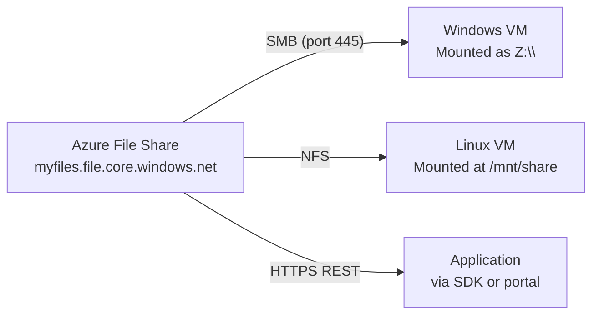
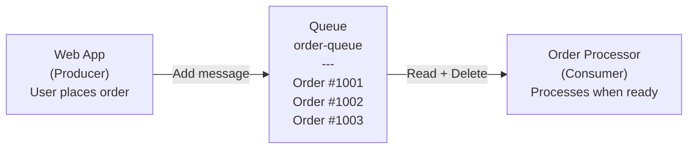
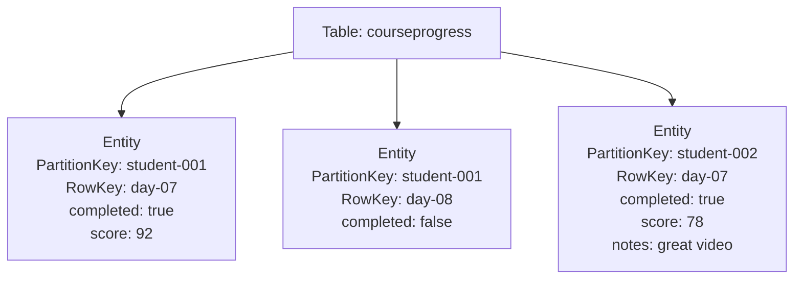

# Day 8 — Azure Storage: Files, Queues, Tables & Storage Explorer

**Phase 3 — Storage, Databases & Global Delivery**

> Last session you built a complete picture of Blob Storage — uploading files, controlling access with SAS tokens, managing cost with tiers and lifecycle policies, hosting a static website, and protecting your data with versioning. Today we finish the storage picture. Azure Files gives you a cloud file share that mounts like a network drive. Queue Storage lets your application components talk to each other without depending on each other's uptime. Table Storage is the simplest NoSQL option in Azure. And Storage Explorer gives you a desktop tool to manage all of it without opening the portal.

---

## What You'll Learn

- Azure Files — fully managed cloud file shares accessible via SMB and NFS
- How to mount an Azure File Share on a Windows or Linux machine
- Queue Storage — how messages work and why decoupling your services matters
- How producers send messages and consumers process them independently
- Table Storage — schemaless NoSQL key-value storage and when to use it
- PartitionKey and RowKey — the unique identity of every table entity
- Azure Storage Explorer — the free desktop tool for managing all storage services

---

## Before We Begin

All demos today are **✅ Free Tier**. Azure Files, Queue Storage, and Table Storage are pay-per-use at fractions of a cent — the volumes we use for demos are effectively free.

---

## Part 1 — Azure Files

### What Is Azure Files?

**Azure Files** is a fully managed file share service in the cloud. Unlike Blob Storage — which is object storage where you access files via a URL — Azure Files behaves like a traditional network drive.

- Accessible via **SMB (Server Message Block)** — the same protocol Windows uses for shared drives. Mount it as `Z:\` on any Windows machine or VM.
- Accessible via **NFS (Network File System)** — for Linux VMs. Mount it like any network filesystem.
- Accessible via **HTTPS/REST** — from any application without mounting.

**Use cases:**

| Scenario | Why Azure Files |
|---|---|
| Lift and shift of on-premise file servers | Applications continue to access files via the same path — no code changes |
| Shared config files across multiple VMs | Update a config file once; every VM reading from the share sees the change immediately |
| Log aggregation | All VMs in a pool write their logs to a central file share instead of local disks |
| Home directory shares | Each user gets a mounted drive backed by Azure — works across machines |



**Azure Files vs Blob Storage:**

| | Azure Files | Blob Storage |
|---|---|---|
| Access method | SMB / NFS / HTTPS | HTTPS (URL per object) |
| Directory structure | Yes — nested folders | Flat (virtual paths via `/` in name) |
| Best for | File shares, lift-and-shift | Images, backups, static assets, any unstructured data |
| Can be mounted as a drive | ✅ Yes | ❌ No |

---

### Demo — Create an Azure File Share

**✅ Free Tier**

!!! success "Step 1 — Open File shares"
    In your storage account → left menu → **"File shares"** → **"+ File share."**

    | Field | Value |
    |-------|-------|
    | Name | `my-file-share` |
    | Tier | **Transaction optimized** *(default — best for general use)* |

    Click **"Create."**

!!! success "Step 2 — Upload a file via the portal"
    Click on `my-file-share` → **"Upload."**

    Upload any file from your laptop — a document, an image, anything. The file appears inside the share, exactly like a folder on your computer.

    Click **"+ Add directory"** → name it `configs`. Click into that folder and upload another file. Notice you now have a real directory structure — this is fundamentally different from Blob Storage containers, which are flat.

!!! success "Step 3 — View the mount instructions"
    Click **"Connect"** at the top of the file share.

    Azure shows you the exact command to mount this share on any machine — already filled in with your account name, share name, and access key.

    **Windows (PowerShell):**
    ```powershell
    $connectTestResult = Test-NetConnection -ComputerName lwmstoragedemo.file.core.windows.net -Port 445
    if ($connectTestResult.TcpTestSucceeded) {
        net use Z: \\lwmstoragedemo.file.core.windows.net\my-file-share /user:Azure\lwmstoragedemo <key> /persistent:yes
    }
    ```

    **Linux (Ubuntu):**
    ```bash
    sudo mount -t cifs //lwmstoragedemo.file.core.windows.net/my-file-share /mnt/myfileshare \
        -o username=lwmstoragedemo,password=<key>,serverino
    ```

    > **Port 445 note:** SMB uses port 445. Some home ISPs and corporate firewalls block outbound port 445. If `Test-NetConnection` shows `TcpTestSucceeded: False`, your network is blocking it. Mount from a VM inside Azure instead — port 445 is always open within Azure's network.

!!! success "Step 4 — Browse via Storage Browser"
    In the left menu → **"Storage browser"** → expand **File shares** → click `my-file-share`.

    You can browse the full directory tree, upload/download files, create folders, and delete files — all without mounting.

---

## Part 2 — Queue Storage

### What Is Queue Storage?

**Queue Storage** is a message queue — a service that holds messages that one part of your application sends and another part reads when it's ready.

**Why queues?** Without a queue, if Component A calls Component B directly and B is slow or temporarily offline, A fails. With a queue, A puts a message in and moves on immediately. B picks up the message when it's ready. The two components are **decoupled** — neither depends on the other being available at the same instant.



**Real-world example:** A user uploads a video. The web app puts a message in a queue: *"Process video: user123/upload.mp4."* The video processing service reads from the queue when it has capacity, transcodes the video, and deletes the message. The web app didn't wait — it already told the user "your video is being processed." Even if the processor crashes halfway through, the message reappears in the queue after a timeout for another instance to retry.

**Key properties:**

| Property | Value |
|---|---|
| Max message size | 64 KB |
| Max queue size | 500 TB |
| Max message TTL | 7 days (configurable) |
| Visibility timeout | Configurable — while one consumer processes a message, others can't see it |

**Visibility timeout explained:** When a consumer reads a message, the message becomes invisible to all other consumers for the visibility timeout period (e.g., 30 seconds). If the consumer successfully processes it, it deletes the message. If it crashes, the message reappears after the timeout for another consumer to retry. This prevents double-processing without requiring complex coordination.

---

### Demo — Create a Queue and Send Messages

**✅ Free Tier**

!!! success "Step 1 — Open Queues"
    In your storage account → left menu → **"Queues"** → **"+ Queue."**

    | Field | Value |
    |-------|-------|
    | Queue name | `order-queue` *(lowercase, hyphens allowed)* |

    Click **"OK."**

!!! success "Step 2 — Add a message"
    Click on `order-queue` → **"Add message."**

    | Field | Value |
    |-------|-------|
    | Message text | `{"orderId": "1001", "product": "Azure Course", "qty": 1}` |
    | Expires in | **7 days** |
    | Encode the message body in Base64 | Leave unchecked |

    Click **"OK."** The message appears in the queue with its insertion time and expiry.

    Add two more messages:
    - `{"orderId": "1002", "product": "DevOps Course", "qty": 2}`
    - `{"orderId": "1003", "product": "Linux Course", "qty": 1}`

    You now have three messages queued up, simulating three customer orders waiting to be processed.

!!! success "Step 3 — Peek at the message"
    Click **"Peek"** at the top. You can see the message content — this is what a consumer would read. Peeking does **not** remove the message from the queue and does **not** trigger the visibility timeout. It's a read-only preview.

!!! success "Step 4 — Dequeue the message"
    Click **"Dequeue."** The first message (order 1001) is removed. This simulates a consumer successfully processing it and deleting it from the queue. The remaining two messages are still queued.

    > In a real application: the consumer reads the message via SDK → processes the order → calls `DeleteMessage()` to remove it. If the consumer crashes before calling delete, the message reappears after the visibility timeout. Queue Storage provides at-least-once delivery — design your consumers to be idempotent (safe to process the same message twice).

---

## Part 3 — Table Storage

### What Is Table Storage?

**Table Storage** is Azure's simple, schemaless NoSQL key-value store. Think of it as a massive structured table in the cloud — rows of data where each row has a unique identifier, and different rows can have completely different columns.

**Structure:**



| Term | Meaning |
|---|---|
| **Table** | The top-level container — like a database table |
| **Entity** | A single row of data |
| **Property** | A field on an entity — each entity can have different properties (schemaless) |
| **PartitionKey** | Groups related entities together for efficient querying |
| **RowKey** | Unique identifier within a partition |
| **PartitionKey + RowKey** | The composite primary key — must be unique per entity |

**Partitioning:** Azure physically stores all entities with the same PartitionKey on the same storage node. Queries that filter by PartitionKey are extremely fast. Queries that span multiple partitions are slower. Design your PartitionKey around your most common query pattern.

**When to use Table Storage:**

| Good fit | Poor fit |
|---|---|
| Simple lookup data: user settings, session state, feature flags | Complex queries with joins or aggregations → use Azure SQL |
| Time-series data: sensor readings, event logs keyed by device + timestamp | Large-scale analytics → use Azure Data Explorer or Synapse |
| Cheap, fast NoSQL when Cosmos DB is overkill | More than 20 GB per partition (performance degrades) |

**Table Storage vs Cosmos DB:** Cosmos DB is the enterprise NoSQL option — global replication, multiple APIs, guaranteed SLAs, single-digit millisecond reads. Table Storage is simpler and much cheaper. If you need global scale and high availability guarantees, use Cosmos DB. For straightforward key-value lookups with modest scale, Table Storage is the right call.

---

### Demo — Create a Table and Add Entities

**✅ Free Tier**

!!! success "Step 1 — Open Tables"
    In your storage account → left menu → **"Tables"** → **"+ Table."**

    | Field | Value |
    |-------|-------|
    | Table name | `courseprogress` |

    Click **"OK."**

!!! success "Step 2 — Open Storage Browser to add data"
    In the left menu → **"Storage browser"** → expand **Tables** → click `courseprogress` → **"Add entity."**

    Add the first entity:

    | Property | Type | Value |
    |---|---|---|
    | PartitionKey | String | `student-001` |
    | RowKey | String | `day-07` |
    | Add property: `completed` | Boolean | `true` |
    | Add property: `score` | Int32 | `92` |

    Click **"Insert."**

!!! success "Step 3 — Add a second entity"
    Click **"Add entity"** again:

    | Property | Type | Value |
    |---|---|---|
    | PartitionKey | String | `student-001` |
    | RowKey | String | `day-08` |
    | Add property: `completed` | Boolean | `false` |

    Click **"Insert."**

    Notice the second entity has no `score` property — Table Storage is schemaless. Each entity can have a completely different set of properties. You don't define columns upfront.

!!! success "Step 4 — Add a third entity for a different student"
    Click **"Add entity"** again:

    | Property | Type | Value |
    |---|---|---|
    | PartitionKey | String | `student-002` |
    | RowKey | String | `day-07` |
    | Add property: `completed` | Boolean | `true` |
    | Add property: `score` | Int32 | `78` |
    | Add property: `notes` | String | `great video` |

    Click **"Insert."**

    You now have two partitions (`student-001` and `student-002`). All entities within the same partition are stored together for fast retrieval. A query like "get all progress for student-001" hits only one partition and is extremely efficient.

!!! success "Step 5 — Query the table"
    In the Storage Browser table view, click **"Edit query"** or use the filter bar.

    Filter by: `PartitionKey eq 'student-001'`

    Only the two `student-001` entities are returned. This is the most efficient query pattern — always filter by PartitionKey first.

---

## Part 4 — Azure Storage Explorer

### What Is Storage Explorer?

**Azure Storage Explorer** is a free desktop application from Microsoft that gives you a visual, file-explorer-style interface for managing all four storage services — Blob, Files, Queue, and Table — across all your subscriptions and storage accounts.

**Why use it over the portal:**

| Task | Portal | Storage Explorer |
|---|---|---|
| Upload 500 files | Tedious — one at a time or small batches | Drag and drop the whole folder |
| Copy data between two storage accounts | Requires CLI | Right-click → Copy → paste into destination account |
| Generate SAS tokens | Works | Works — faster with right-click |
| Browse Table entities | Works | Works — with better filter UI |
| Works offline / without browser | ❌ | ✅ (once signed in) |

Available for **Windows, macOS, and Linux** — free to download and use.

---

### Demo — Connect Storage Explorer to Your Azure Account

**✅ Free Tier**

!!! success "Step 1 — Download Storage Explorer"
    Go to the Azure portal and search for "Storage Explorer" — or download directly from the Microsoft website. Install it on your machine.

!!! success "Step 2 — Sign in"
    Open Storage Explorer → click the **plug icon** (Connect to Azure Resources) in the left sidebar → **"Add an Azure Account"** → sign in with your Azure credentials.

    Your subscriptions load automatically in the left panel.

!!! success "Step 3 — Browse your storage account"
    In the left panel, expand:
    **Storage Accounts** → `lwmstoragedemo` → **Blob Containers** → `my-uploads`

    Your uploaded blob appears. Drag another file from your desktop directly into the Storage Explorer window — it uploads immediately.

!!! success "Step 4 — Browse the file share"
    Expand **File Shares** → `my-file-share`. You see the full folder tree. Double-click into the `configs` folder you created earlier. Drag a file from your laptop into that folder — it uploads directly to the nested directory.

!!! success "Step 5 — View the queue"
    Expand **Queues** → `order-queue`. You'll see the remaining messages from the earlier demo. Right-click a message → **"Dequeue message"** to remove it, simulating a consumer processing it.

!!! success "Step 6 — Query the table"
    Expand **Tables** → `courseprogress`. All entities are listed. Use the query bar to filter: `PartitionKey eq 'student-001'` → click **Execute** — only student-001's rows are shown.

!!! success "Step 7 — Generate a SAS token from Storage Explorer"
    Right-click on your `my-uploads` blob container → **"Get Shared Access Signature."**

    Set an expiry and permissions → **"Create."** Storage Explorer generates the full SAS URL immediately — faster than going through the portal.

---

## Cleaning Up

**✅ Free Tier**

!!! warning "Delete the resource group"
    Go to **Resource groups** → `storage-demo-rg` → **"Delete resource group"** → type the name to confirm → **"Delete."**

    This removes the storage account and everything inside it — the file share, queue, table, and all blobs — in one step.

---

## Summary and What's Next

Today you completed the full Azure Storage Account picture.

**Azure Files** is the cloud equivalent of a network file server. Mount it as a drive letter on Windows or a mount point on Linux via SMB. All VMs share the same files. Lift-and-shift file server migrations work without any application code changes — the path just changes. Port 445 is the only thing to watch for on home networks.

**Queue Storage** decouples your application components. Producers write messages and move on. Consumers read and process when ready. If a consumer crashes mid-processing, the message reappears automatically after the visibility timeout — no message lost, no double-processing risk if your consumers are idempotent.

**Table Storage** is the cheapest and simplest NoSQL option in Azure. PartitionKey groups related entities for fast querying; RowKey uniquely identifies each one within that group. Schemaless means different entities in the same table can have completely different properties. Use it when Cosmos DB is more than you need.

**Azure Storage Explorer** ties it all together — upload hundreds of files by drag and drop, copy blobs between accounts, browse table data, dequeue messages, and generate SAS tokens without touching the portal.

**Coming up next — Day 9:** We move into **Azure Virtual Networking**. You'll learn how Azure's private network infrastructure works, create a VNet with public and private subnets, control traffic with Network Security Groups, set up DNS for your resources, and see how Azure Bastion lets you connect to VMs without exposing any ports to the internet.

---

## Key Takeaways

- **Azure Files** serves via SMB (port 445) on Windows and NFS on Linux — mount it as a drive; update files in one place and every connected machine sees the change
- **Port 445** may be blocked by home ISPs — mount Azure file shares from a VM inside Azure if you hit this issue
- **Queue Storage** decouples producers and consumers — neither needs the other to be online at the same time
- **Visibility timeout** prevents double-processing — a message becomes invisible while one consumer holds it; if the consumer crashes, it reappears for retry
- **Queue messages** are up to 64 KB, live up to 7 days, and can be peeked without dequeuing
- **Table Storage** is schemaless NoSQL — PartitionKey + RowKey is the unique composite key; always query by PartitionKey for best performance
- **Different entities in the same table can have different properties** — no column schema to define upfront
- **Use Table Storage** for simple lookups and time-series data; **use Cosmos DB** when you need global replication, guaranteed low latency SLAs, or complex query APIs
- **Azure Storage Explorer** is free, cross-platform, and handles bulk uploads, cross-account copies, SAS generation, and table queries better than the portal
