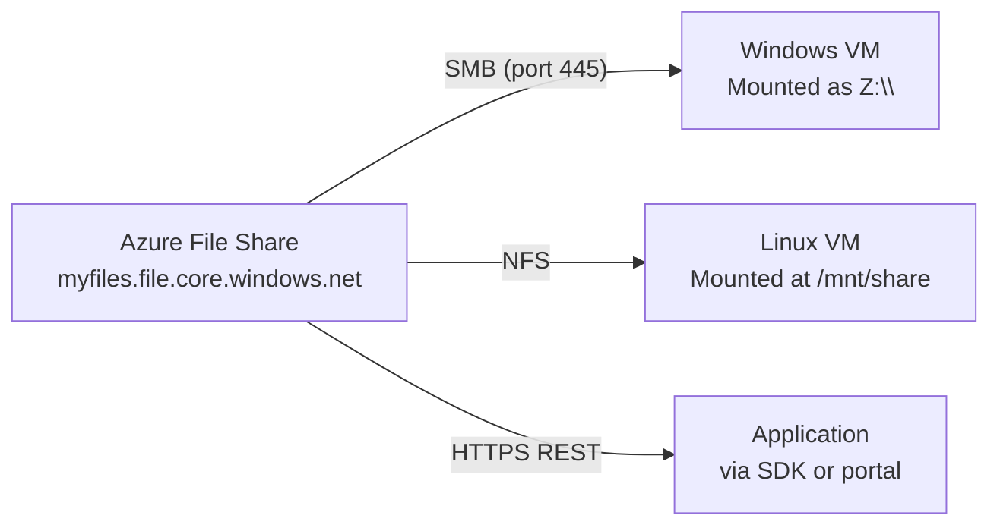
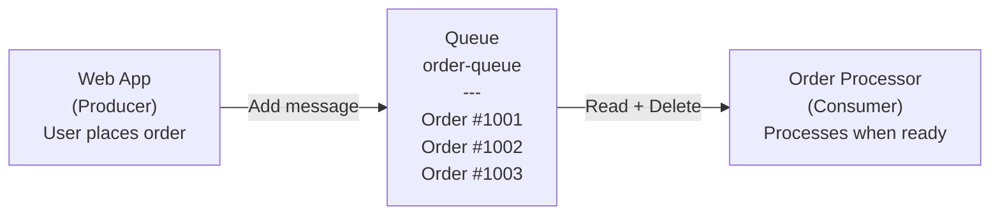
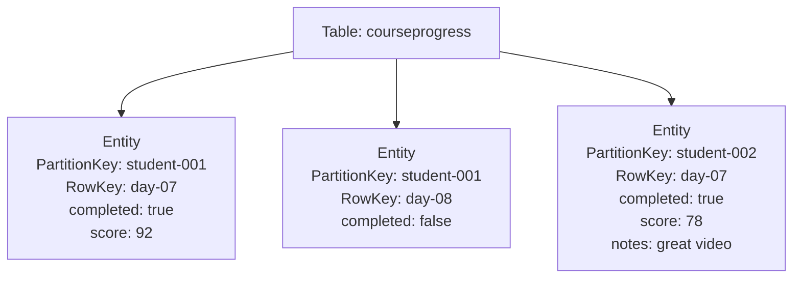
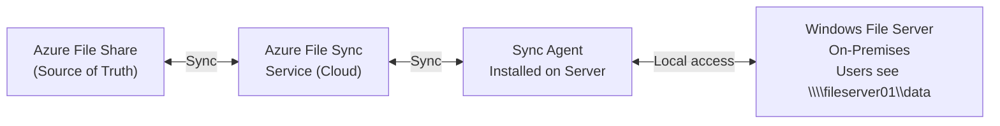

# Day 8 — Azure Storage: Files, Queues, Tables & Storage Explorer

**Phase 3 — Storage, Databases & Global Delivery**

> Last session you built a complete picture of Blob Storage — uploading files, controlling access with SAS tokens, managing cost with tiers and lifecycle policies, hosting a static website, and protecting your data with versioning. Today we finish the storage picture. Azure Files gives you a cloud file share that mounts like a network drive. Queue Storage lets your application components talk to each other without depending on each other's uptime. Table Storage is the simplest NoSQL option in Azure. And Storage Explorer gives you a desktop tool to manage all of it without opening the portal.

---

## What You'll Learn

- Azure Files — fully managed cloud file shares via SMB and NFS, file share tiers, snapshots, and soft delete
- How to mount an Azure File Share on a Windows or Linux machine
- Azure File Sync — syncing on-premises Windows file servers with Azure Files using cloud tiering
- Queue Storage — how messages work and why decoupling your services matters
- How producers send messages and consumers process them independently
- Table Storage — schemaless NoSQL key-value storage and when to use it
- PartitionKey and RowKey — the unique identity of every table entity
- Storage Firewall — restricting storage account access to specific networks
- AzCopy — the command-line tool for bulk data migration (an AZ-104 exam staple)
- Immutable Storage — WORM policies for compliance and regulatory requirements
- Azure Storage Explorer — the free desktop tool for managing all storage services

---

## Before We Begin

All demos today are **✅ Free Tier**. Azure Files, Queue Storage, and Table Storage are pay-per-use at fractions of a cent — the volumes we use for demos are effectively free.

---

## Part 1 — Azure Files

### What Is Azure Files?

**Azure Files** is a fully managed file share service in the cloud. Unlike Blob Storage — which is object storage where you access files via a URL — Azure Files behaves like a traditional network drive.

- Accessible via **SMB (Server Message Block)** — the same protocol Windows uses for shared drives. Mount it as `Z:\` on any Windows machine or VM.
- Accessible via **NFS (Network File System)** — for Linux VMs. Mount it like any network filesystem.
- Accessible via **HTTPS/REST** — from any application without mounting.

**Use cases:**

| Scenario | Why Azure Files |
|---|---|
| Lift and shift of on-premise file servers | Applications continue to access files via the same path — no code changes |
| Shared config files across multiple VMs | Update a config file once; every VM reading from the share sees the change immediately |
| Log aggregation | All VMs in a pool write their logs to a central file share instead of local disks |
| Home directory shares | Each user gets a mounted drive backed by Azure — works across machines |



**Azure Files vs Blob Storage:**

| | Azure Files | Blob Storage |
|---|---|---|
| Access method | SMB / NFS / HTTPS | HTTPS (URL per object) |
| Directory structure | Yes — nested folders | Flat (virtual paths via `/` in name) |
| Best for | File shares, lift-and-shift | Images, backups, static assets, any unstructured data |
| Can be mounted as a drive | ✅ Yes | ❌ No |

---

### File Share Tiers

Azure Files has four tiers. Choose at creation time — you cannot change the tier later without recreating the share.

| Tier | Storage Type | Best For |
|---|---|---|
| **Transaction Optimized** | Standard HDD | General-purpose file shares — the default choice for most workloads |
| **Hot** | Standard HDD | Actively used file shares with frequent reads and writes |
| **Cool** | Standard HDD | Infrequently accessed archives — lower storage cost, higher transaction cost |
| **Premium** | SSD | Latency-sensitive workloads, databases, CI/CD build caches — also required for NFS |

> NFS support requires Premium tier. SMB works on all four tiers. If you pick the wrong tier, you must create a new share and copy the data — plan ahead.

---

### Demo — Create an Azure File Share

**✅ Free Tier**

!!! success "Step 1 — Open File shares"
    In your storage account → left menu → **"File shares"** → **"+ File share."**

    | Field | Value |
    |-------|-------|
    | Name | `my-file-share` |
    | Tier | **Transaction optimized** *(default — best for general use)* |

    Click **"Create."**

!!! success "Step 2 — Upload a file via the portal"
    Click on `my-file-share` → **"Upload."**

    Upload any file from your laptop — a document, an image, anything. The file appears inside the share, exactly like a folder on your computer.

    Click **"+ Add directory"** → name it `configs`. Click into that folder and upload another file. Notice you now have a real directory structure — this is fundamentally different from Blob Storage containers, which are flat.

!!! success "Step 3 — View the mount instructions"
    Click **"Connect"** at the top of the file share.

    Azure shows you the exact command to mount this share on any machine — already filled in with your account name, share name, and access key.

    **Windows (PowerShell):**
    ```powershell
    $connectTestResult = Test-NetConnection -ComputerName lwmstoragedemo.file.core.windows.net -Port 445
    if ($connectTestResult.TcpTestSucceeded) {
        net use Z: \\lwmstoragedemo.file.core.windows.net\my-file-share /user:Azure\lwmstoragedemo <key> /persistent:yes
    }
    ```

    **Linux (Ubuntu):**
    ```bash
    sudo mount -t cifs //lwmstoragedemo.file.core.windows.net/my-file-share /mnt/myfileshare \
        -o username=lwmstoragedemo,password=<key>,serverino
    ```

    > **Port 445 note:** SMB uses port 445. Some home ISPs and corporate firewalls block outbound port 445. If `Test-NetConnection` shows `TcpTestSucceeded: False`, your network is blocking it. Mount from a VM inside Azure instead — port 445 is always open within Azure's network.

!!! success "Step 4 — Browse via Storage Browser"
    In the left menu → **"Storage browser"** → expand **File shares** → click `my-file-share`.

    You can browse the full directory tree, upload/download files, create folders, and delete files — all without mounting.

---

### File Share Snapshots

A **snapshot** is a read-only, point-in-time copy of your file share. Azure stores only the delta — the blocks that changed since the previous snapshot — so they are storage-efficient. You can browse a snapshot, restore individual files, or restore the entire share back to that state.

**Use cases:**

| Scenario | Why |
|---|---|
| Pre-deployment checkpoint | Snapshot before a config change — roll back instantly if something breaks |
| Accidental deletion recovery | User deleted an important file — restore it from the last snapshot |
| Compliance | Capture share state at specific intervals for audit trails |

---

**Demo — Create and Restore a File Share Snapshot**

**✅ Free Tier**

!!! success "Step 1 — Take a snapshot"
    In your storage account → **File shares** → click `my-file-share` → left menu → **"Snapshots"** → **"Add snapshot."**

    Add an optional note: `before-demo-change` → click **"OK."**

    The snapshot appears in the list with an exact timestamp. This represents the state of your entire file share right now.

!!! success "Step 2 — Simulate a destructive change"
    Go back to the file share → delete one of the files you uploaded earlier, or overwrite it with different content.

!!! success "Step 3 — Browse the snapshot"
    Click on the snapshot in the Snapshots list. You can navigate the share *exactly as it was* at that point in time. Every file, every folder — frozen.

    Find the file you deleted → right-click → **"Restore."** Choose to overwrite the current version or restore it as a new file. The original is back.

!!! success "Step 4 — Delete the snapshot"
    Snapshots are not deleted automatically — you manage their lifecycle. In the Snapshots list → select the snapshot → **"Delete snapshot."**

    > In production: use **Azure Backup** to automate snapshot scheduling and retention policies rather than managing snapshots manually. Azure Backup integrates directly with Azure Files.

---

### Soft Delete for File Shares

**Soft delete** is a safety net against accidental deletion of an entire file share. When enabled, a deleted share is retained for a configurable grace period (1–365 days) before it is permanently removed. During that window you can restore it completely — all files, folders, and metadata intact.

---

**Demo — Enable Soft Delete and Recover a Deleted Share**

**✅ Free Tier**

!!! success "Step 1 — Enable soft delete"
    In your storage account → left menu → **"Data protection"** → under the "Recovery" section → toggle **"Enable soft delete for file shares"** → set retention to **7 days** → click **"Save."**

!!! success "Step 2 — Delete the file share"
    Go to **File shares** → select `my-file-share` → click **"Delete."** Confirm. The share disappears from the active list.

!!! success "Step 3 — Recover the deleted share"
    Still in **File shares** → click **"Show deleted shares"** (toggle at the top of the list).

    Your share reappears with a "Deleted" badge and its expiry date. Click it → **"Undelete."** The share is fully restored — every file is exactly as it was.

    > Soft delete applies at the share level, not the file level. If you need per-file recovery, use snapshots or Azure Backup.

---

## Part 2 — Queue Storage

### What Is Queue Storage?

**Queue Storage** is a message queue — a service that holds messages that one part of your application sends and another part reads when it's ready.

**Why queues?** Without a queue, if Component A calls Component B directly and B is slow or temporarily offline, A fails. With a queue, A puts a message in and moves on immediately. B picks up the message when it's ready. The two components are **decoupled** — neither depends on the other being available at the same instant.



**Real-world example:** A user uploads a video. The web app puts a message in a queue: *"Process video: user123/upload.mp4."* The video processing service reads from the queue when it has capacity, transcodes the video, and deletes the message. The web app didn't wait — it already told the user "your video is being processed." Even if the processor crashes halfway through, the message reappears in the queue after a timeout for another instance to retry.

**Key properties:**

| Property | Value |
|---|---|
| Max message size | 64 KB |
| Max queue size | 500 TB |
| Max message TTL | 7 days (configurable) |
| Visibility timeout | Configurable — while one consumer processes a message, others can't see it |

**Visibility timeout explained:** When a consumer reads a message, the message becomes invisible to all other consumers for the visibility timeout period (e.g., 30 seconds). If the consumer successfully processes it, it deletes the message. If it crashes, the message reappears after the timeout for another consumer to retry. This prevents double-processing without requiring complex coordination.

---

### Demo — Create a Queue and Send Messages

**✅ Free Tier**

!!! success "Step 1 — Open Queues"
    In your storage account → left menu → **"Queues"** → **"+ Queue."**

    | Field | Value |
    |-------|-------|
    | Queue name | `order-queue` *(lowercase, hyphens allowed)* |

    Click **"OK."**

!!! success "Step 2 — Add a message"
    Click on `order-queue` → **"Add message."**

    | Field | Value |
    |-------|-------|
    | Message text | `{"orderId": "1001", "product": "Azure Course", "qty": 1}` |
    | Expires in | **7 days** |
    | Encode the message body in Base64 | Leave unchecked |

    Click **"OK."** The message appears in the queue with its insertion time and expiry.

    Add two more messages:
    - `{"orderId": "1002", "product": "DevOps Course", "qty": 2}`
    - `{"orderId": "1003", "product": "Linux Course", "qty": 1}`

    You now have three messages queued up, simulating three customer orders waiting to be processed.

!!! success "Step 3 — Peek at the message"
    Click **"Peek"** at the top. You can see the message content — this is what a consumer would read. Peeking does **not** remove the message from the queue and does **not** trigger the visibility timeout. It's a read-only preview.

!!! success "Step 4 — Dequeue the message"
    Click **"Dequeue."** The first message (order 1001) is removed. This simulates a consumer successfully processing it and deleting it from the queue. The remaining two messages are still queued.

    > In a real application: the consumer reads the message via SDK → processes the order → calls `DeleteMessage()` to remove it. If the consumer crashes before calling delete, the message reappears after the visibility timeout. Queue Storage provides at-least-once delivery — design your consumers to be idempotent (safe to process the same message twice).

---

### Demo — Python SDK: Send and Peek Messages

**✅ Free Tier**

The portal demo showed you the concepts. Now let's do what a real application does — use the Azure SDK for Python to send messages programmatically and peek at the queue.

**What you need:**
- Python 3.8+ installed on your machine
- The `azure-storage-queue` package
- Your storage account connection string

!!! success "Step 1 — Get your connection string"
    In the Azure Portal → your storage account → left menu → **"Security + networking"** → **"Access keys."**

    Click **"Show"** next to **key1** → copy the full **Connection string** value. It looks like:

    ```
    DefaultEndpointsProtocol=https;AccountName=lwmstoragedemo;AccountKey=...;EndpointSuffix=core.windows.net
    ```

    > Never commit this string to GitHub. In production you'd use a managed identity or Key Vault. For this demo, we'll paste it directly so you can see the SDK in action.

!!! success "Step 2 — Install the SDK"
    Open a terminal and run:

    ```bash
    pip install azure-storage-queue
    ```

!!! success "Step 3 — Send messages with Python"
    Create a file called `send_messages.py` and paste this code:

    ```python
    from azure.storage.queue import QueueClient

    CONNECTION_STRING = "YOUR_CONNECTION_STRING_HERE"
    QUEUE_NAME = "order-queue"

    queue_client = QueueClient.from_connection_string(CONNECTION_STRING, QUEUE_NAME)

    orders = [
        '{"orderId": "2001", "product": "Azure Course", "qty": 1}',
        '{"orderId": "2002", "product": "DevOps Course", "qty": 2}',
        '{"orderId": "2003", "product": "Linux Course", "qty": 1}',
    ]

    for order in orders:
        queue_client.send_message(order)
        print(f"Sent: {order}")

    print("\nAll messages sent to the queue.")
    ```

    Replace `YOUR_CONNECTION_STRING_HERE` with the value you copied in Step 1.

    Run it:
    ```bash
    python send_messages.py
    ```

    You'll see:
    ```
    Sent: {"orderId": "2001", "product": "Azure Course", "qty": 1}
    Sent: {"orderId": "2002", "product": "DevOps Course", "qty": 2}
    Sent: {"orderId": "2003", "product": "Linux Course", "qty": 1}

    All messages sent to the queue.
    ```

    Go back to the portal → your `order-queue` → you'll see the new messages sitting there, inserted by your Python code.

!!! success "Step 4 — Peek messages with Python"
    Create a second file called `peek_messages.py`:

    ```python
    from azure.storage.queue import QueueClient

    CONNECTION_STRING = "YOUR_CONNECTION_STRING_HERE"
    QUEUE_NAME = "order-queue"

    queue_client = QueueClient.from_connection_string(CONNECTION_STRING, QUEUE_NAME)

    print("Peeking at messages in the queue (no messages removed):\n")

    messages = queue_client.peek_messages(max_messages=10)

    for i, message in enumerate(messages, start=1):
        print(f"Message {i}: {message.content}")

    print("\nDone peeking. Queue is unchanged.")
    ```

    Run it:
    ```bash
    python peek_messages.py
    ```

    You'll see all the queued messages printed out — but nothing is removed. Refresh the portal queue view to confirm the message count hasn't changed.

    **This is the key difference:**
    - `peek_messages()` — read-only preview, no side effects
    - `receive_messages()` — makes the message invisible to other consumers for a visibility timeout period; you must call `delete_message()` after processing or it reappears

    For this demo, peeking is enough to prove the producer/consumer pattern end-to-end.

---

## Part 3 — Table Storage

### What Is Table Storage?

**Table Storage** is Azure's simple, schemaless NoSQL key-value store. Think of it as a massive structured table in the cloud — rows of data where each row has a unique identifier, and different rows can have completely different columns.

**Structure:**



| Term | Meaning |
|---|---|
| **Table** | The top-level container — like a database table |
| **Entity** | A single row of data |
| **Property** | A field on an entity — each entity can have different properties (schemaless) |
| **PartitionKey** | Groups related entities together for efficient querying |
| **RowKey** | Unique identifier within a partition |
| **PartitionKey + RowKey** | The composite primary key — must be unique per entity |

**Partitioning:** Azure physically stores all entities with the same PartitionKey on the same storage node. Queries that filter by PartitionKey are extremely fast. Queries that span multiple partitions are slower. Design your PartitionKey around your most common query pattern.

**When to use Table Storage:**

| Good fit | Poor fit |
|---|---|
| Simple lookup data: user settings, session state, feature flags | Complex queries with joins or aggregations → use Azure SQL |
| Time-series data: sensor readings, event logs keyed by device + timestamp | Large-scale analytics → use Azure Data Explorer or Synapse |
| Cheap, fast NoSQL when Cosmos DB is overkill | More than 20 GB per partition (performance degrades) |

**Table Storage vs Cosmos DB:** Cosmos DB is the enterprise NoSQL option — global replication, multiple APIs, guaranteed SLAs, single-digit millisecond reads. Table Storage is simpler and much cheaper. If you need global scale and high availability guarantees, use Cosmos DB. For straightforward key-value lookups with modest scale, Table Storage is the right call.

---

### Demo — Create a Table and Add Entities

**✅ Free Tier**

!!! success "Step 1 — Open Tables"
    In your storage account → left menu → **"Tables"** → **"+ Table."**

    | Field | Value |
    |-------|-------|
    | Table name | `courseprogress` |

    Click **"OK."**

!!! success "Step 2 — Open Storage Browser to add data"
    In the left menu → **"Storage browser"** → expand **Tables** → click `courseprogress` → **"Add entity."**

    Add the first entity:

    | Property | Type | Value |
    |---|---|---|
    | PartitionKey | String | `student-001` |
    | RowKey | String | `day-07` |
    | Add property: `completed` | Boolean | `true` |
    | Add property: `score` | Int32 | `92` |

    Click **"Insert."**

!!! success "Step 3 — Add a second entity"
    Click **"Add entity"** again:

    | Property | Type | Value |
    |---|---|---|
    | PartitionKey | String | `student-001` |
    | RowKey | String | `day-08` |
    | Add property: `completed` | Boolean | `false` |

    Click **"Insert."**

    Notice the second entity has no `score` property — Table Storage is schemaless. Each entity can have a completely different set of properties. You don't define columns upfront.

!!! success "Step 4 — Add a third entity for a different student"
    Click **"Add entity"** again:

    | Property | Type | Value |
    |---|---|---|
    | PartitionKey | String | `student-002` |
    | RowKey | String | `day-07` |
    | Add property: `completed` | Boolean | `true` |
    | Add property: `score` | Int32 | `78` |
    | Add property: `notes` | String | `great video` |

    Click **"Insert."**

    You now have two partitions (`student-001` and `student-002`). All entities within the same partition are stored together for fast retrieval. A query like "get all progress for student-001" hits only one partition and is extremely efficient.

!!! success "Step 5 — Query the table"
    In the Storage Browser table view, click **"Edit query"** or use the filter bar.

    Filter by: `PartitionKey eq 'student-001'`

    Only the two `student-001` entities are returned. This is the most efficient query pattern — always filter by PartitionKey first.

---

## Part 4 — Azure File Sync

### What Is Azure File Sync?

**Azure File Sync** turns an Azure file share into a centralized hub that your on-premises Windows file servers sync with. Users keep accessing files from the local server — same drive letters, same paths, no behavior change — but the data lives in Azure and is always up to date across every server in the sync group.

**The problem it solves:** You have a Windows file server running on-premises. The disk is full, it's a single point of failure, and buying more hardware is expensive. But you can't simply "move" the file server to Azure because local applications and users expect `\\fileserver01\data` to just work. Azure File Sync solves this: the local server stays, but the cloud becomes the source of truth.



---

### Cloud Tiering

**Cloud tiering** is the killer feature of Azure File Sync. When enabled, files that have not been accessed recently are automatically replaced on the local server with a tiny placeholder (a reparse point). When a user opens a tiered file, Azure File Sync downloads it transparently in the background — the user sees a brief delay but otherwise experiences no difference.

The local server's disk stays lean. The full dataset lives in Azure. You control how much free space to maintain on the local volume.

| | Cloud Tiering Off | Cloud Tiering On |
|---|---|---|
| Local disk usage | Full dataset — disk must be large enough | Only hot files — cold files tiered to Azure |
| Access speed | Instant for all files | Instant for hot files; brief delay on first access after tiering |
| Disk capacity required | 100% of dataset | Configurable — e.g., keep 20% of disk free, tier the rest |

---

### Key Concepts

| Concept | What It Is |
|---|---|
| **Storage Sync Service** | Top-level Azure resource — one per organization or region |
| **Sync Group** | Defines which endpoints sync together: one Azure file share + one or more server endpoints |
| **Cloud Endpoint** | The Azure file share in the sync group |
| **Server Endpoint** | A folder path on a registered Windows Server |
| **Registered Server** | A Windows Server with the sync agent installed and authenticated to the Storage Sync Service |

**Supported OS:** Windows Server 2019, 2022, and 2025. Multiple servers can sync to the same Azure share — changes on one server propagate to all others automatically.

---

### Demo — Configure Azure File Sync

> Creating a Storage Sync Service and registering a server requires a Windows Server VM, which is a paid resource. The steps below walk through the full setup so you understand the flow — watch the instructor demo and follow along on your own when you have a Windows Server available.

**💳 Paid (Instructor Demo)**

!!! warning "Step 1 — Create a Storage Sync Service"
    In the Azure portal → search **"Azure File Sync"** → **"+ Create."**

    | Field | Value |
    |---|---|
    | Resource group | `storage-demo-rg` |
    | Storage sync service name | `lwm-file-sync` |
    | Region | Same region as your storage account |

    Click **"Review + create"** → **"Create."**

!!! warning "Step 2 — Create a Sync Group"
    Open the Storage Sync Service → **"Sync groups"** → **"+ Sync group."**

    | Field | Value |
    |---|---|
    | Sync group name | `production-docs-sync` |
    | Storage account | `lwmstoragedemo` |
    | Azure File Share | `my-file-share` |

    Click **"Create."** This establishes the Azure file share as the cloud endpoint — the single source of truth for this sync group.

!!! warning "Step 3 — Install the sync agent on Windows Server"
    On your Windows Server VM → download the **Azure File Sync agent** from the Microsoft Download Center → run the installer.

    After installation, the agent configuration wizard opens. Sign in with your Azure credentials and register the server with `lwm-file-sync`. The server now appears under **"Registered servers"** in the portal.

!!! warning "Step 4 — Add a Server Endpoint"
    In the `production-docs-sync` sync group → **"Add server endpoint."**

    | Field | Value |
    |---|---|
    | Registered server | Your Windows Server |
    | Path | `D:\FileShareData` |
    | Cloud tiering | **Enabled** |
    | Volume free space | **20%** |

    Click **"Create."** Initial sync begins — Azure pulls all files from the file share to the server endpoint (or vice versa). After sync, every file in the Azure share appears on the local server at `D:\FileShareData`.

    > With cloud tiering on, files not accessed recently will automatically be tiered to Azure, keeping the local disk at 80% capacity or lower. The server endpoint shows sync health, tiering status, and last sync time in the portal.

---

## Part 5 — Storage Security: Firewall, AzCopy & Immutable Storage

### Storage Firewall and Network Rules

By default, a storage account accepts requests from anywhere on the internet — any IP, any network. The **Storage Firewall** lets you lock that down to specific virtual networks, subnets, or IP ranges. Everything else gets a 403 Forbidden.

**How it works:** Storage account → **Networking** tab → change "Enabled from all networks" to **"Enabled from selected virtual networks and IP addresses."** You then add the specific VNets, subnets, or IP ranges that are allowed.

**Use cases:**

| Scenario | Configuration |
|---|---|
| Only Azure VMs in a specific subnet should access storage | Add the VNet + subnet as an allowed network rule |
| Only your office should be able to manage blobs | Add your office's public IP range |
| No public internet access at all | Use a Private Endpoint instead (covered in the Networking phase) |

**Exception: Trusted Microsoft services** — Azure services like Azure Backup, Azure Monitor, and Azure Data Factory have a "trusted services" bypass that lets them access firewalled storage accounts without being on the allowed list. Enable this under the Exceptions section.

> **Note:** We'll run this as a hands-on portal demo in the Networking phase once you have VNets configured. For now, understand the concept and where to find it — the **Networking** tab of any storage account. This is a frequent AZ-104 exam topic.

---

### AzCopy

**AzCopy** is Microsoft's command-line tool built specifically for moving data to and from Azure Storage. It uses concurrent connections and supports resuming interrupted transfers — far faster than dragging files through the portal or Storage Explorer for large datasets.

**Why it matters for certification:** AZ-104 exam scenarios frequently involve data migration. "You need to copy 2 TB from an on-premises server to Azure Blob Storage efficiently" — the answer is AzCopy. Memorize the key commands and authentication methods.

**Common operations:**

| Task | Command |
|---|---|
| Upload a local folder to blob | `azcopy copy "C:\data\*" "https://account.blob.core.windows.net/container?<SAS>" --recursive` |
| Copy between two storage accounts | `azcopy copy "https://source.blob.core.windows.net/container?<SAS>" "https://dest.blob.core.windows.net/container?<SAS>" --recursive` |
| Sync (copy only changed files) | `azcopy sync "C:\data" "https://account.blob.core.windows.net/container?<SAS>" --recursive` |
| Check job progress | `azcopy jobs list` |

**Authentication options:**

| Method | When to Use |
|---|---|
| SAS token | Simplest — append `?<SAS>` to the URL |
| Azure AD (Entra ID) | `azcopy login` — uses your Azure credentials; supports RBAC |
| Managed Identity | For VMs or services running in Azure — no credentials to manage |

**AzCopy is pre-installed in Azure Cloud Shell** — open the portal, click the Cloud Shell icon, and you have AzCopy ready without any setup.

---

### Immutable Storage (WORM Policies)

**Immutable blob storage** enforces a write-once, read-many (WORM) policy. Once a blob is written under an active immutability policy, it cannot be modified or deleted — not by regular users, not by admins, not even by the storage account owner — until the retention period expires.

**Why this matters:** Financial services (SEC Rule 17a-4), healthcare (HIPAA), and legal compliance requirements mandate that certain records be preserved in an unmodified state for a defined period. Azure's immutable storage is SEC 17a-4(f) compliant.

**Two policy types:**

| Policy | How It Works | Use Case |
|---|---|---|
| **Time-based retention** | Blobs cannot be deleted or modified for a set number of days. Timer resets if blob is overwritten. | Financial records, audit logs — retention period is known |
| **Legal hold** | Blobs are locked indefinitely until the hold tag is explicitly removed. | Litigation — retention period is unknown |

**Locking a policy:** Time-based policies can be **locked**. Once locked, the retention period cannot be shortened or the policy removed — it can only be extended. Locking is what satisfies regulatory auditors. Before locking, you can modify or delete the policy freely (useful during testing).

---

**Demo — Enable a Time-Based Retention Policy**

**✅ Free Tier**

!!! success "Step 1 — Open the blob container"
    In your storage account → **Containers** → click on `my-uploads`.

!!! success "Step 2 — Set an immutability policy"
    In the container's left menu → **"Access policy"** → under "Immutable blob storage" → **"+ Add policy."**

    | Field | Value |
    |---|---|
    | Policy type | **Time-based retention** |
    | Retention period | **7 days** *(short period for testing)* |

    Click **"Save."**

!!! success "Step 3 — Verify the policy blocks deletion"
    Try to delete any blob in the container. Azure rejects it: *"This operation is not permitted as the blob is immutable due to a policy."*

    The blob is protected. No one can delete or modify it during the retention window.

!!! success "Step 4 — Lock the policy (understand the implications)"
    In the Access policy panel → click **"Lock."**

    > ⚠️ **Warning:** Locking is irreversible — you cannot shorten or remove a locked policy, only extend it. For this demo, you can skip locking. In a production compliance environment, you lock after validating the policy is correct.

!!! success "Step 5 — Remove the unlocked policy (cleanup)"
    Since we did not lock the policy, you can remove it: in the Access policy panel → select the policy → **"Delete."** Blobs are writable again.

---

## Part 6 — Azure Storage Explorer

### What Is Storage Explorer?

**Azure Storage Explorer** is a free desktop application from Microsoft that gives you a visual, file-explorer-style interface for managing all four storage services — Blob, Files, Queue, and Table — across all your subscriptions and storage accounts.

**Why use it over the portal:**

| Task | Portal | Storage Explorer |
|---|---|---|
| Upload 500 files | Tedious — one at a time or small batches | Drag and drop the whole folder |
| Copy data between two storage accounts | Requires CLI | Right-click → Copy → paste into destination account |
| Generate SAS tokens | Works | Works — faster with right-click |
| Browse Table entities | Works | Works — with better filter UI |
| Works offline / without browser | ❌ | ✅ (once signed in) |

Available for **Windows, macOS, and Linux** — free to download and use.

---

### Demo — Connect Storage Explorer to Your Azure Account

**✅ Free Tier**

!!! success "Step 1 — Download Storage Explorer"
    Go to the Azure portal and search for "Storage Explorer" — or download directly from the Microsoft website. Install it on your machine.

!!! success "Step 2 — Sign in"
    Open Storage Explorer → click the **plug icon** (Connect to Azure Resources) in the left sidebar → **"Add an Azure Account"** → sign in with your Azure credentials.

    Your subscriptions load automatically in the left panel.

!!! success "Step 3 — Browse your storage account"
    In the left panel, expand:
    **Storage Accounts** → `lwmstoragedemo` → **Blob Containers** → `my-uploads`

    Your uploaded blob appears. Drag another file from your desktop directly into the Storage Explorer window — it uploads immediately.

!!! success "Step 4 — Browse the file share"
    Expand **File Shares** → `my-file-share`. You see the full folder tree. Double-click into the `configs` folder you created earlier. Drag a file from your laptop into that folder — it uploads directly to the nested directory.

!!! success "Step 5 — View the queue"
    Expand **Queues** → `order-queue`. You'll see the remaining messages from the earlier demo. Right-click a message → **"Dequeue message"** to remove it, simulating a consumer processing it.

!!! success "Step 6 — Query the table"
    Expand **Tables** → `courseprogress`. All entities are listed. Use the query bar to filter: `PartitionKey eq 'student-001'` → click **Execute** — only student-001's rows are shown.

!!! success "Step 7 — Generate a SAS token from Storage Explorer"
    Right-click on your `my-uploads` blob container → **"Get Shared Access Signature."**

    Set an expiry and permissions → **"Create."** Storage Explorer generates the full SAS URL immediately — faster than going through the portal.

---

## Cleaning Up

**✅ Free Tier**

!!! warning "Delete the resource group"
    Go to **Resource groups** → `storage-demo-rg` → **"Delete resource group"** → type the name to confirm → **"Delete."**

    This removes the storage account and everything inside it — the file share, queue, table, and all blobs — in one step.

---

## Summary and What's Next

Today you completed the full Azure Storage Account picture — and the topics that certification exams actually test.

**Azure Files** is the cloud equivalent of a network file server. Mount it as a drive letter via SMB on Windows or NFS on Linux. All machines share the same files. Choose your tier at creation time — Transaction Optimized for general use, Premium for low-latency or NFS workloads. Protect your shares with snapshots (point-in-time recovery) and soft delete (share-level recovery within a grace period).

**Azure File Sync** extends Azure Files to your on-premises Windows Servers. The local server keeps its familiar path; Azure holds the source of truth. Cloud tiering keeps hot files local and tiers cold files to Azure automatically, so your on-premises disk never fills up.

**Queue Storage** decouples your application components. Producers write messages and move on. Consumers read and process when ready. If a consumer crashes mid-processing, the message reappears after the visibility timeout — no message lost, no double-processing risk if your consumers are idempotent.

**Table Storage** is the cheapest and simplest NoSQL option in Azure. PartitionKey groups related entities for fast querying; RowKey uniquely identifies each one within that group. Schemaless means different entities can have completely different properties. Use it when Cosmos DB is more than you need.

**Storage Firewall** restricts your storage account to specific VNets or IP ranges — a critical hardening step in any real deployment, and a frequent exam question.

**AzCopy** is the right tool when you need to move large amounts of data into or out of Azure Storage — bulk uploads, cross-account copies, and migrations. It's pre-installed in Azure Cloud Shell.

**Immutable Storage** enforces WORM policies on blob containers — blobs cannot be modified or deleted until the retention period expires. Lock the policy to satisfy regulatory requirements like SEC 17a-4.

**Azure Storage Explorer** ties it all together — drag-and-drop uploads, cross-account blob copies, table queries, message dequeuing, and SAS token generation in a single desktop tool.

**Coming up next — Day 9:** We move into **Azure Virtual Networking**. You'll learn how Azure's private network infrastructure works, create a VNet with public and private subnets, control traffic with Network Security Groups, set up DNS for your resources, and see how Azure Bastion lets you connect to VMs without exposing any ports to the internet.

---

## Key Takeaways

- **Azure Files** serves via SMB (port 445) on Windows and NFS on Linux — mount it as a drive; update files in one place and every connected machine sees the change
- **Port 445** may be blocked by home ISPs — mount from a VM inside Azure if `Test-NetConnection` fails
- **File Share Tiers** — Transaction Optimized for general use, Hot/Cool for access-pattern cost optimization, Premium (SSD) for low latency and NFS; tier is set at creation and cannot be changed
- **File Share Snapshots** are point-in-time read-only copies — restore individual files or the entire share; manage manually or automate via Azure Backup
- **Soft delete for file shares** — deleted shares are retained for up to 365 days before permanent removal; recover with one click during the grace period
- **Azure File Sync** — syncs Azure Files with on-premises Windows Servers; cloud tiering keeps hot files local and tiers cold files to Azure; supports multiple servers in a sync group
- **Queue Storage** decouples producers and consumers — neither needs the other to be online at the same time
- **Visibility timeout** prevents double-processing — a message becomes invisible while one consumer holds it; if the consumer crashes, it reappears for retry
- **Queue messages** are up to 64 KB, live up to 7 days, and can be peeked without dequeuing
- **Table Storage** is schemaless NoSQL — PartitionKey + RowKey is the unique composite key; always query by PartitionKey for best performance
- **Different entities in the same table can have different properties** — no column schema to define upfront
- **Use Table Storage** for simple lookups and time-series data; use Cosmos DB when you need global replication, guaranteed low latency, or complex query APIs
- **Storage Firewall** — restrict storage account access to specific VNets, subnets, or IP ranges; everything else gets 403; configured under the Networking tab
- **AzCopy** — command-line tool for bulk data movement; faster than the portal; pre-installed in Cloud Shell; authenticate with SAS, Azure AD, or Managed Identity
- **Immutable Storage (WORM)** — time-based retention or legal hold; blobs cannot be modified or deleted during the active policy; lock the policy to satisfy regulatory requirements like SEC 17a-4
- **Azure Storage Explorer** is free, cross-platform, and handles bulk uploads, cross-account copies, SAS generation, and table queries better than the portal
