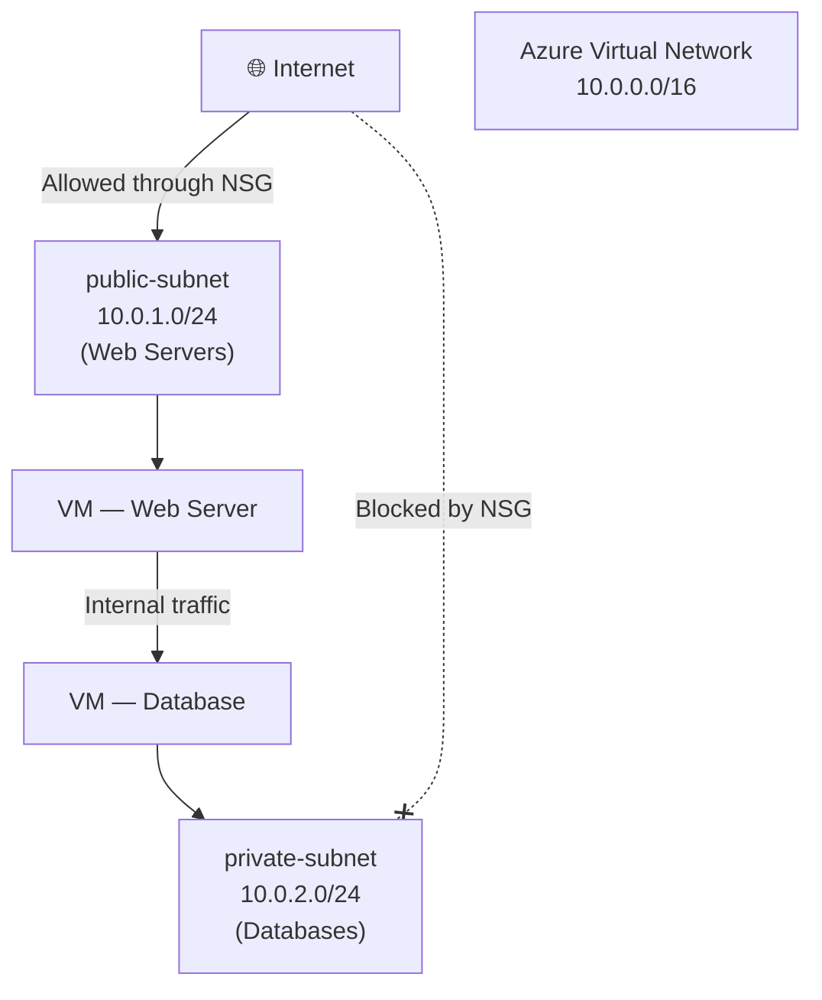
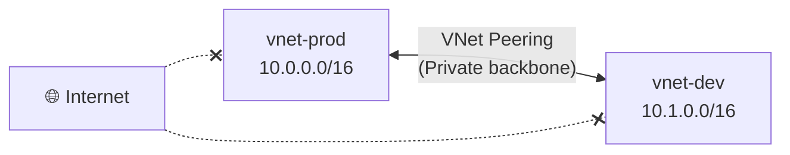
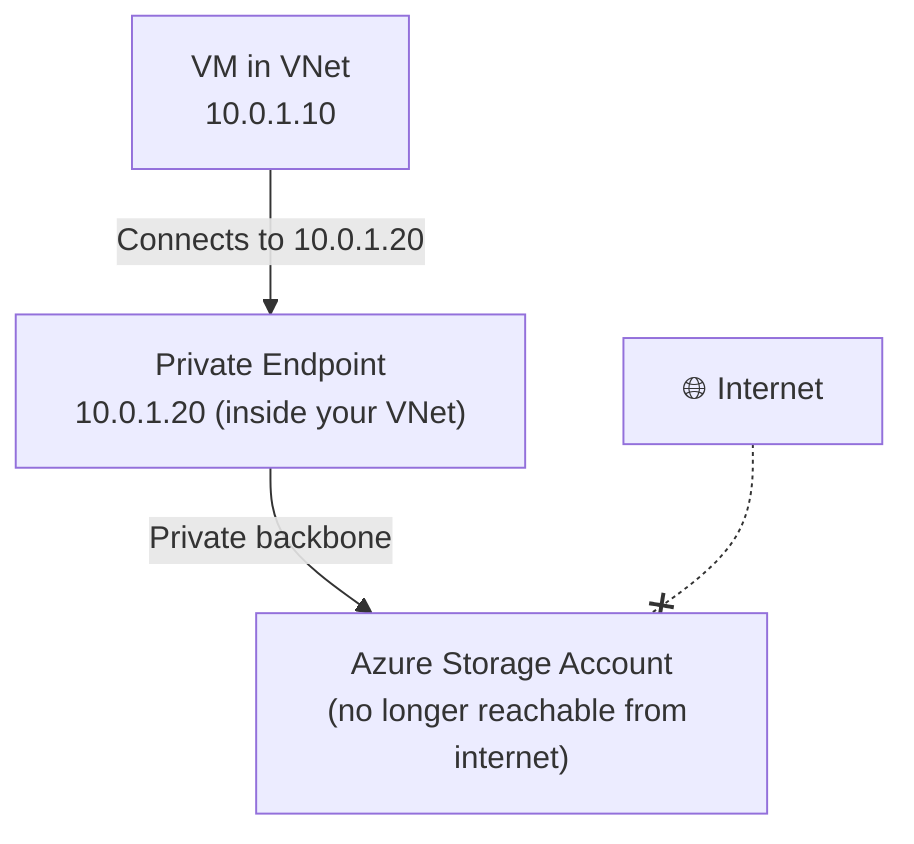
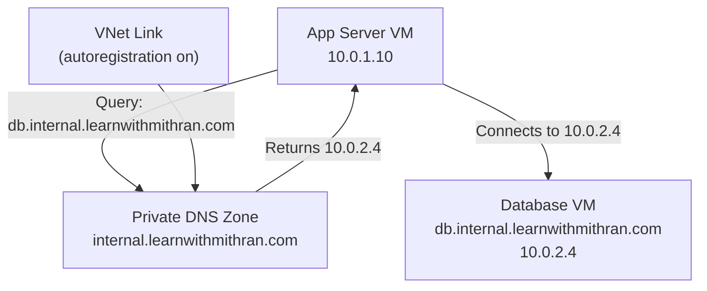
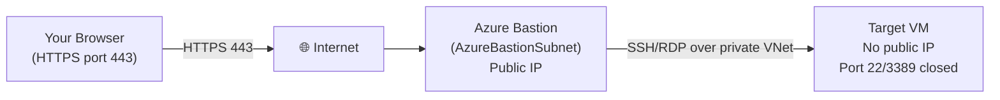

# Day 8 — Azure Virtual Network: Subnets, NSGs, DNS & Bastion

**Phase 2 — Networking**

> Every resource you've deployed so far — your VMs, your App Service, your storage account — lives somewhere. But where, exactly? They all live inside a network. Azure doesn't just drop your resources onto the internet and hope for the best. Every resource gets placed into a private, isolated network that you fully control. That network is called a **Virtual Network**, or VNet. Today you're going to understand what a VNet actually is, how to design one from scratch, and how to control exactly which traffic can go where — inside your network and from the outside world.

---

## What You'll Learn

- What a Virtual Network is and why every Azure resource lives inside one
- Address spaces and CIDR blocks — how to define and size your network's IP range
- Subnets — how to segment resources into logical groups for security and organisation
- Network Security Groups — the firewall rules that control exactly what traffic is allowed
- VNet Peering — connect two separate VNets privately, no internet, no gateway
- Service Endpoints vs Private Endpoints — the two ways to securely connect to Azure services from inside a VNet
- Azure DNS Public Zones — host your domain's DNS records in Azure at global scale
- Azure DNS Private Zones — give your VMs human-readable names that resolve only inside your network
- Azure-provided DNS vs custom DNS — what Azure gives you out of the box and when to change it
- Azure Bastion — browser-based VM access with no public IP and no exposed SSH or RDP port (💳 Paid)

---

## Before We Begin

Almost everything today is **free tier**. VNets, subnets, NSGs, VNet Peering within the same region, and Azure DNS zones are all free or cost fractions of a cent at demo volumes.

The one exception is **Azure Bastion**. The Basic SKU runs approximately **$0.19/hr**. I'll demo it live. If you want to follow along, activate an Azure free trial — or just watch and then delete Bastion immediately after to keep cost minimal.

---

## Part 1 — What Is a Virtual Network?

### Your Private Cloud Network

When you sign up for Azure and start creating resources, Azure doesn't just expose them directly to the internet. Every resource needs a home — a private, isolated network that belongs to you. That is a **Virtual Network**, or **VNet**.

Think of a VNet like the network inside a physical office building. The building has a certain number of rooms, each room has a phone extension, and people in the building can call each other without going through the public phone system. From outside the building, no one can reach an internal extension unless you deliberately set up a way for them to.

A VNet is exactly that — your private network inside Azure. Resources inside the VNet can talk to each other freely. Nothing from the internet gets in unless you explicitly open a door.



### Address Space — CIDR Notation

When you create a VNet, the first thing you choose is the **address space** — the pool of private IP addresses available for your network. You write this as a **CIDR block**.

CIDR stands for Classless Inter-Domain Routing. The notation looks like this: `10.0.0.0/16`.

Here's what that means:
- `10.0.0.0` is the starting IP address
- `/16` is the **prefix length** — it tells you how many addresses are available

The smaller the number after the slash, the larger the network:

| CIDR | Number of Addresses | Typical Use |
|---|---|---|
| `/8` | 16,777,216 | Huge enterprise networks |
| `/16` | 65,536 | Standard VNet address space — plenty of room |
| `/24` | 256 | Typical subnet size |
| `/28` | 16 | Small subnet (e.g., gateway subnet) |

> For almost every scenario in this course, use `10.0.0.0/16` as your VNet address space. It gives you 65,536 addresses and plenty of room for subnets.

Azure reserves a few addresses from every subnet — the network address, the broadcast address, and three Azure-managed addresses — so the actual usable count per subnet is slightly lower, but you won't run into that limit in practice.

**Private IP ranges to know:**
- `10.0.0.0/8`
- `172.16.0.0/12`
- `192.168.0.0/16`

These are reserved for private networks. Azure VNets always use one of these ranges — resources inside a VNet never get public IP addresses from the VNet itself. Public IPs are a separate resource you can optionally attach to a VM or a load balancer.

---

### Subnets — Segmenting Your Network

A **subnet** is a subdivision of your VNet. You carve up your VNet's address space into smaller chunks and place different resources into different subnets.

Why does this matter? Two big reasons:

**1. Security.** You can attach different firewall rules (NSGs) to different subnets. Your web servers can be in a subnet that allows inbound HTTP traffic from the internet. Your databases can be in a completely separate subnet that doesn't accept any internet traffic at all. Even though both subnets are inside the same VNet, the database subnet is completely isolated from the internet.

**2. Organisation.** In a real architecture, you separate concerns: web tier, application tier, database tier. Subnets let you draw those boundaries clearly.

A simple two-tier design looks like this:

| Subnet | CIDR | What Goes Here |
|---|---|---|
| `public-subnet` | `10.0.1.0/24` | Web servers, load balancers — things that talk to the internet |
| `private-subnet` | `10.0.2.0/24` | Databases, backend services — things that should never be publicly reachable |

> You'll notice the terms "public subnet" and "private subnet" — this is convention only. No subnet in Azure is automatically public or private based on its name. What makes a subnet reachable from the internet is whether the resources inside it have a public IP and whether the NSG allows inbound traffic. The names just help you remember the intent.

---

### Hands-On: Create a VNet with Two Subnets

Let's build the foundation. You'll create a VNet and two subnets inside it.

**✅ Free Tier — follow along**

1. In the Azure Portal, search for **Virtual networks** and click **+ Create**.
2. On the **Basics** tab:
   - **Subscription:** your subscription
   - **Resource group:** create a new one called `rg-networking-demo` (keeping networking resources together)
   - **Virtual network name:** `vnet-demo`
   - **Region:** East US (or your preferred region — just be consistent across today's demos)
3. Click **Next: IP Addresses**.
4. You'll see a default address space already populated — `10.0.0.0/16`. Leave it as-is.
5. **Delete the default subnet** that Azure pre-creates (click the trash icon). You'll add your own with meaningful names.
6. Click **+ Add a subnet** to create the first subnet:
   - **Name:** `public-subnet`
   - **Subnet address range:** `10.0.1.0/24`
   - Leave everything else as default
   - Click **Add**
7. Click **+ Add a subnet** again for the second subnet:
   - **Name:** `private-subnet`
   - **Subnet address range:** `10.0.2.0/24`
   - Click **Add**
8. Click **Review + create**, then **Create**.

Wait about 30 seconds. Once the deployment completes, click **Go to resource**. You'll see your VNet with both subnets listed under **Subnets** in the left menu. Notice each subnet shows its address range and how many available addresses remain. Right now, nothing is deployed into either subnet — those slots are all available.

That's your private network. Now let's control the traffic into it.

---

## Part 2 — Network Security Groups

### What Is an NSG?

A **Network Security Group** (NSG) is a set of inbound and outbound security rules — think of it as a firewall you attach to a subnet or a network interface card.

Every rule in an NSG has five things:

| Property | What it does |
|---|---|
| **Priority** | A number from 100 to 4096. Lower number = evaluated first. First matching rule wins. |
| **Name** | Descriptive label — what does this rule do? |
| **Protocol** | TCP, UDP, ICMP, or Any |
| **Port range** | A single port (80), a range (1024-65535), or * for any |
| **Action** | Allow or Deny |

Rules are evaluated in priority order. The moment a rule matches, Azure applies the action and stops. If no rule matches, Azure applies a default deny at the end.

Azure gives you a set of **default rules** in every NSG that you can't delete. These ensure basic connectivity works without configuration:

**Default inbound rules:**
- Allow all traffic from within the VNet (priority 65000)
- Allow traffic from Azure Load Balancer (priority 65001)
- Deny everything else (priority 65500)

**Default outbound rules:**
- Allow all outbound to within the VNet (priority 65000)
- Allow all outbound to the internet (priority 65001)
- Deny everything else (priority 65500)

By default, resources inside a VNet can reach each other and the internet, but nothing from the internet can reach your resources. You add rules to open specific inbound ports.

### Where Do You Attach an NSG?

You can attach an NSG to a **subnet** or to an individual **network interface card (NIC)** on a VM.

- **Subnet-level NSG:** applies to all resources in that subnet. Best for broad rules — "allow HTTP into the public subnet."
- **NIC-level NSG:** applies to a single VM. Best for fine-grained rules — "this specific VM also needs port 8080 open."

If you attach an NSG to both the subnet and the NIC, traffic must pass both sets of rules. Inbound: subnet rules run first, then NIC rules. Outbound: NIC rules run first, then subnet rules.

> Best practice: use subnet-level NSGs for your network-wide policy and avoid NIC-level NSGs unless you have a genuine need for per-VM overrides. Fewer NSGs = less complexity.

---

### Hands-On: Create an NSG and Add Rules

Let's create an NSG for the public subnet that allows SSH (so you can manage your servers) and HTTP (so the web server is reachable).

**✅ Free Tier — follow along**

**Step 1 — Create the NSG:**

1. In the portal, search for **Network security groups** and click **+ Create**.
2. Fill in:
   - **Resource group:** `rg-networking-demo`
   - **Name:** `nsg-public-subnet`
   - **Region:** East US
3. Click **Review + create**, then **Create**.
4. Go to the resource once deployed.

**Step 2 — Add an inbound rule for SSH (port 22):**

1. In the NSG blade, click **Inbound security rules** in the left menu.
2. You'll see the three default rules listed with priorities 65000, 65001, 65500.
3. Click **+ Add**.
4. Fill in:
   - **Source:** Any (for demo — in production, lock this to your IP)
   - **Source port ranges:** * (outbound port of the caller — always * for inbound rules)
   - **Destination:** Any
   - **Service:** SSH (this auto-fills port 22 / TCP)
   - **Action:** Allow
   - **Priority:** 100
   - **Name:** `Allow-SSH`
5. Click **Add**.

**Step 3 — Add an inbound rule for HTTP (port 80):**

1. Click **+ Add** again.
2. Fill in:
   - **Source:** Any
   - **Source port ranges:** *
   - **Destination:** Any
   - **Service:** HTTP (auto-fills port 80 / TCP)
   - **Action:** Allow
   - **Priority:** 110
   - **Name:** `Allow-HTTP`
3. Click **Add**.

Your inbound rules now show both custom rules at priority 100 and 110, followed by the three Azure defaults.

**Step 4 — Associate the NSG to the public subnet:**

An NSG does nothing until you attach it to something.

1. In the NSG blade, click **Subnets** in the left menu.
2. Click **+ Associate**.
3. Select:
   - **Virtual network:** `vnet-demo`
   - **Subnet:** `public-subnet`
4. Click **OK**.

Done. Every resource you deploy into `public-subnet` is now protected by these rules. The private subnet has no NSG yet — we'll leave it that way for now. Nothing from the internet can reach `private-subnet` because resources there have no public IP, and we won't create any.

> **Tip:** After attaching the NSG, go to your VNet → Subnets. You'll see `nsg-public-subnet` listed next to `public-subnet`. Private-subnet shows "—" for NSG, which is fine for a backend subnet that's only accessed from within the VNet.

---

## Part 3 — VNet Peering

### The Problem: Two Separate VNets

As your Azure environment grows, you'll often end up with more than one VNet. Maybe your company uses separate VNets per environment (dev, staging, prod). Maybe different teams each manage their own VNet. Maybe you have resources in two different regions.

By default, two VNets are completely isolated from each other — even if they're in the same subscription and the same region. A VM in `vnet-prod` cannot reach a VM in `vnet-dev` by default.

### VNet Peering — Private Connectivity Between VNets

**VNet Peering** lets two VNets communicate privately as if they were one network — no internet, no VPN tunnel, no gateway required. Traffic between peered VNets travels on Azure's private backbone network with low latency.



Two important points about VNet Peering:

**1. It is not transitive.** If VNet A is peered with VNet B, and VNet B is peered with VNet C, VNet A cannot reach VNet C. You need a direct peering between A and C as well.

**2. Address spaces cannot overlap.** VNet A uses `10.0.0.0/16` and VNet B uses `10.1.0.0/16` — that's fine. If both used `10.0.0.0/16`, Azure wouldn't know which VNet to send the traffic to, and the peering would fail. Plan your address spaces carefully upfront.

**VNet Peering is free within the same region.** Cross-region peering (Global VNet Peering) has a small bandwidth charge.

> We won't demo peering today since it requires two VNets, but the setup is straightforward: go to your VNet → Peerings → + Add → choose the remote VNet. Azure creates the peering in both directions for you automatically.

---

## Part 4 — Service Endpoints vs Private Endpoints

When you use Azure services like Azure Storage, Azure SQL, or Azure Key Vault from inside a VM, that traffic goes out over the public internet by default — even though both the VM and the service are technically in Azure. There are two ways to fix this: **Service Endpoints** and **Private Endpoints**. They solve the same problem differently.

### Service Endpoints

A **Service Endpoint** extends your VNet's identity to an Azure service. When you enable a Service Endpoint on a subnet for, say, Azure Storage, Azure Storage knows that traffic from that subnet is coming from a trusted VNet — and you can configure the storage account to only accept connections from that specific subnet.

**How it works:** Your VM still reaches the storage account using its public endpoint URL (`mystorageaccount.blob.core.windows.net`), but the traffic travels on Azure's internal network rather than the public internet. The storage account can then use a firewall rule to allow only connections from your VNet and block everything else.

**Key characteristic:** The service still has a public IP and a public endpoint. Service Endpoints don't make the service private — they make the *connection* private and give you a network-based access control.

### Private Endpoints

A **Private Endpoint** gives an Azure service a **private IP address directly inside your VNet**. Instead of reaching the service via its public URL, your VM connects to `10.0.1.5` (or whatever private IP it's assigned) and that connection stays entirely within your VNet — never touching the internet.

**How it works:** Azure creates a network interface inside your subnet with a private IP. That NIC is mapped to the Azure service. DNS is updated (via Private DNS Zones) so that the service's public hostname resolves to the private IP when queried from inside the VNet.



**Key characteristic:** The service gets a private IP inside your VNet. You can disable the public endpoint entirely. This is the most secure option.

### Which Should You Use?

| | Service Endpoint | Private Endpoint |
|---|---|---|
| Traffic path | Azure backbone (not internet) | Azure backbone (not internet) |
| Service gets a private IP | ❌ No | ✅ Yes |
| Can disable public access | Partially (via firewall) | ✅ Fully |
| DNS changes needed | ❌ No | ✅ Yes (Private DNS Zone) |
| Cost | Free | Small charge per endpoint |
| Best for | Simple scenarios, small teams | Production, compliance, maximum security |

> **General rule:** Use Private Endpoints for any service that stores sensitive data (databases, storage with PII, Key Vault). Service Endpoints are fine for internal tooling or non-sensitive data where you want network-level control without the operational overhead.

---

## Part 5 — Azure DNS: Public Zones

### What Is DNS and Why Does Azure Host It?

DNS — Domain Name System — is what translates a human-readable hostname like `www.learnwithmithran.com` into the IP address that computers actually use. Every time you type a domain name into a browser, DNS runs behind the scenes.

When you register a domain name (through a registrar like Namecheap or GoDaddy), you get control over that domain's DNS records. You need to host those records somewhere — on a DNS server that's reachable 24/7 from anywhere in the world.

**Azure DNS** lets you host your domain's DNS records inside Azure. Azure runs the DNS servers for you at global scale, across all Azure regions simultaneously. You don't maintain any infrastructure — you just manage records through the portal.

### DNS Record Types

| Record Type | What It Does | Example |
|---|---|---|
| **A** | Maps a hostname to an IPv4 address | `www → 20.1.2.3` |
| **AAAA** | Maps a hostname to an IPv6 address | `www → 2001:db8::1` |
| **CNAME** | Maps one hostname to another hostname | `blog → myapp.azurewebsites.net` |
| **MX** | Specifies mail servers for a domain | `@ → mail.domain.com` |
| **TXT** | Arbitrary text — used for domain verification, SPF records | `@ → "v=spf1 ..."` |
| **NS** | Name server records — which DNS servers hold this zone's records | auto-set by Azure |
| **SOA** | Start of Authority — zone metadata | auto-set by Azure |

### How Azure DNS Works

When you create a **Public DNS Zone** in Azure, Azure assigns four **name server (NS) records** to it. These look like:

```
ns1-01.azure-dns.com.
ns2-01.azure-dns.net.
ns3-01.azure-dns.org.
ns4-01.azure-dns.info.
```

You take those four NS record values and enter them into your domain registrar's control panel. From that point on, any DNS query for your domain — from anywhere in the world — gets answered by Azure's DNS servers.

---

### Hands-On: Create an Azure DNS Public Zone and Add an A Record

For this demo, you'll use a test subdomain. If you own a domain, you can use it. If not, you can still create the zone and add records — you just won't be able to verify resolution without updating your registrar.

**✅ Free Tier — follow along**

**Step 1 — Create a DNS Public Zone:**

1. In the portal, search for **DNS zones** and click **+ Create**.
2. Fill in:
   - **Resource group:** `rg-networking-demo`
   - **Name:** `demo.learnwithmithran.com` (use your own domain or any name — zone creation itself always works)
3. Click **Review + create**, then **Create**.
4. Go to the resource.

You'll land on the DNS zone overview page. Notice the four **NS records** in the record set list — Azure has already assigned those four name servers. These are the values you'd copy into your domain registrar.

**Step 2 — Add an A record:**

1. Click **+ Record set** in the top menu of the zone.
2. Fill in:
   - **Name:** `www` (this will create `www.demo.learnwithmithran.com`)
   - **Type:** A
   - **TTL:** 1 Hour
   - **IP address:** enter the public IP of a VM you've created — or use any IP for the demo (e.g., `20.1.2.3`)
3. Click **OK**.

The A record now appears in your record set list. When someone queries `www.demo.learnwithmithran.com`, Azure DNS returns the IP you entered.

> **TTL (Time to Live)** — this value tells DNS resolvers how long to cache this record before checking for updates. A short TTL (1 min) means changes propagate quickly but put more load on your DNS servers. A long TTL (1 day) is efficient for stable records. For production, use 1 hour or more. During a migration or cutover, temporarily drop to 5 minutes.

---

## Part 6 — Azure DNS: Private Zones

### The Problem: Resources Can't Reach Each Other by Name

Inside your VNet, VMs can reach each other using private IP addresses. But IP addresses are fragile — if you redeploy a VM, it might get a different IP. Hardcoding IPs into your application configuration is a maintenance nightmare.

What you really want is to be able to say: "my app server should connect to `db.internal`" — and have that hostname always resolve to wherever the database actually is, even if its IP changes.

**Azure DNS Private Zones** solve this. A private zone is a DNS zone that only resolves inside your VNet — it's invisible to the public internet.

### How Private Zones Work

You create a private zone (e.g., `internal.learnwithmithran.com`), add DNS records for your resources (`db.internal.learnwithmithran.com → 10.0.2.4`), and then **link the zone to your VNet**. Once linked, every VM in that VNet can resolve those names.

You can also enable **autoregistration** — when this is on, every VM you deploy into the VNet automatically gets an A record created for it in the private zone, using its hostname and private IP. No manual record management needed.



### Azure-Provided DNS vs Custom DNS

Before we set up the private zone, let's talk about what Azure gives you by default.

Every VNet automatically has a built-in DNS resolver at `168.63.129.16`. This is Azure's default DNS — it resolves:
- Public internet hostnames (e.g., `google.com`)
- Azure-internal service hostnames (e.g., `mystorageaccount.blob.core.windows.net`)
- Azure DNS Private Zone records, once linked

For most scenarios, the Azure-provided DNS at `168.63.129.16` is all you need. You never need to configure anything — it just works.

When would you use **custom DNS**?
- You have an on-premises DNS server and want split-horizon resolution (different answers for the same hostname depending on where the query comes from)
- You need conditional forwarding for on-premises domain names
- You're running a large hybrid environment with complex DNS requirements

For this course, we stick with Azure-provided DNS — it handles everything we need.

---

### Hands-On: Create a DNS Private Zone and Link It to Your VNet

Let's set up private name resolution so resources inside the VNet can refer to each other by hostname.

**✅ Free Tier — follow along**

**Step 1 — Deploy a test VM (if you don't already have one):**

For the DNS demo, you need at least one VM inside the VNet so you can test resolution from inside the network. If you followed Day 3's VM lab, you can reuse that VM — just make sure it's in the same region as `vnet-demo`. Otherwise, quickly deploy a small VM:

1. Search for **Virtual machines** → **+ Create** → **Azure virtual machine**.
2. Fill in:
   - **Resource group:** `rg-networking-demo`
   - **VM name:** `vm-demo-01`
   - **Region:** East US
   - **Image:** Ubuntu Server 24.04 LTS
   - **Size:** Standard_B1s
   - **Authentication:** SSH public key (or password for quick demo)
3. On the **Networking** tab:
   - **Virtual network:** `vnet-demo`
   - **Subnet:** `private-subnet`
   - **Public IP:** Create new (you need this to SSH in for the DNS test)
   - **NIC network security group:** None (the VNet's subnet NSG will handle it)
4. Click **Review + create**, then **Create**.

**Step 2 — Create the Private DNS Zone:**

1. In the portal, search for **Private DNS zones** and click **+ Create**.
2. Fill in:
   - **Resource group:** `rg-networking-demo`
   - **Name:** `internal.learnwithmithran.com` (use any name — it never needs to match a real domain; private zones resolve only inside the VNet)
3. Click **Review + create**, then **Create**.
4. Go to the resource.

**Step 3 — Link the Private Zone to your VNet:**

1. In the Private DNS Zone blade, click **Virtual network links** in the left menu.
2. Click **+ Add**.
3. Fill in:
   - **Link name:** `link-vnet-demo`
   - **Virtual network:** `vnet-demo`
   - **Enable auto registration:** ✅ Check this box
4. Click **OK**.

Wait a moment for the link to provision. Once it shows **Completed**, auto-registration is active. Any VM already in `vnet-demo` gets an A record automatically. Click **Record sets** in the left menu — you should see `vm-demo-01` already listed with its private IP.

**Step 4 — Add a manual record (optional but instructive):**

Auto-registration covers VMs, but you can also add manual records for any resource — a database with a specific IP, a load balancer frontend, etc.

1. In the Private DNS Zone, click **+ Record set**.
2. Fill in:
   - **Name:** `db`
   - **Type:** A
   - **TTL:** 1 Hour
   - **IP address:** `10.0.2.10` (a placeholder — in real use, this would be your database VM's IP)
3. Click **OK**.

**Step 5 — Verify resolution from inside the VNet:**

1. SSH into `vm-demo-01`:
   ```bash
   ssh azureuser@<public-ip-of-vm>
   ```
2. Once connected, query the private zone:
   ```bash
   nslookup vm-demo-01.internal.learnwithmithran.com
   ```
   You should get back the private IP of the VM.

3. Also test the manual record:
   ```bash
   nslookup db.internal.learnwithmithran.com
   ```
   Returns `10.0.2.10` — the placeholder you entered.

4. Test that public DNS still works:
   ```bash
   nslookup google.com
   ```
   Returns Google's public IPs — Azure-provided DNS handles this automatically alongside the private zone.

Private DNS is working. Resources in this VNet can now reach each other by hostname. If you ever redeploy a VM and its IP changes, the auto-registration updates the record automatically.

---

## Part 7 — Azure Bastion

### The Problem With Public IPs on VMs

When you deploy a VM for management access, the classic approach is to give it a public IP and open port 22 (SSH) or port 3389 (RDP). This works — but it means your VM is exposed on the public internet. Bots actively scan the internet for open SSH and RDP ports, attempting brute-force logins constantly.

Even with strong passwords and key-based authentication, the fact that port 22 is open on a public IP is a real attack surface. In regulated industries, security teams often flag this as a compliance violation.

### Azure Bastion — Browser-Based VM Access

**Azure Bastion** is a fully managed PaaS service that lets you connect to VMs via a browser over HTTPS (port 443) — with **no public IP on the VM** and **no open port 22 or 3389**.

Here's how it works:

1. You deploy Azure Bastion into a dedicated subnet in your VNet called `AzureBastionSubnet` (the name is mandatory).
2. Bastion gets a public IP — but it's the *only* public-facing surface.
3. When you click **Connect → Bastion** in the Azure Portal, the portal communicates with the Bastion service, which then opens an RDP or SSH session to the VM over the private network.
4. The session runs inside your browser window — no SSH client or RDP client needed.



**Azure Bastion SKUs:**

| SKU | Cost | Features |
|---|---|---|
| **Basic** | ~$0.19/hr | SSH + RDP in browser, shareable link |
| **Standard** | ~$0.38/hr | All Basic features + file upload/download, audio support, custom ports, private-only Bastion |

For this demo, the Basic SKU is sufficient.

**Important requirements:**
- The subnet must be named `AzureBastionSubnet` exactly — capital A, capital B
- The subnet must be at least `/26` in size (Azure Bastion requires 64 addresses minimum)
- You need to add `AzureBastionSubnet` to your existing VNet — not a separate VNet

---

### Hands-On: Deploy Azure Bastion and Connect to a VM

**💳 Paid — Instructor Demo (~$0.19/hr Basic SKU). Delete immediately after to minimise cost.**

**Step 1 — Add the AzureBastionSubnet to your VNet:**

1. Go to your `vnet-demo` VNet in the portal.
2. Click **Subnets** in the left menu.
3. Click **+ Subnet**.
4. Fill in:
   - **Name:** `AzureBastionSubnet` (exact spelling, exact casing — this is required)
   - **Subnet address range:** `10.0.3.0/26` (gives 64 addresses, the minimum for Bastion)
5. Click **Save**.

**Step 2 — Deploy Azure Bastion:**

1. In the portal, search for **Bastions** and click **+ Create**.
2. Fill in:
   - **Resource group:** `rg-networking-demo`
   - **Name:** `bastion-demo`
   - **Region:** East US
   - **Tier:** Basic
   - **Virtual network:** `vnet-demo`
   - **Subnet:** AzureBastionSubnet (auto-selected once you pick the VNet)
   - **Public IP address:** Create new, name it `pip-bastion-demo`
3. Click **Review + create**, then **Create**.

Bastion takes about 5 minutes to provision. While it's deploying, notice that you could remove the public IP from your target VM and close ports 22 and 3389 on its NSG entirely — once Bastion is running, you no longer need them.

**Step 3 — Connect to your VM via Bastion:**

1. Go to `vm-demo-01`.
2. Click **Connect** in the left menu, then choose **Connect via Bastion**.
3. You'll see the Bastion connection panel:
   - **Authentication type:** SSH Private Key (or Password if you set one)
   - **Username:** azureuser
   - Enter your credentials
4. Click **Connect**.

A terminal window opens directly in your browser tab. You are now inside the VM — over HTTPS, through Bastion, with no public IP on the VM itself.

You can now close port 22 entirely on the NSG. The VM is accessible only through Bastion. From a security and compliance standpoint, this is significantly better than a public IP with port 22 open.

**Step 4 — Clean up Bastion after the demo:**

Bastion charges by the hour. Delete it when you're done:

1. Search for **Bastions**, find `bastion-demo`, click **Delete**.
2. Also delete the `pip-bastion-demo` public IP to avoid any idle IP charges.

---

## Summary

Let's bring it all together. Here's what you built today and why it matters:

A **Virtual Network** is the private, isolated network that every Azure resource lives in. You define its **address space** in CIDR notation — `10.0.0.0/16` gives you 65,536 addresses to work with. You carve that address space into **subnets** to separate concerns: a `public-subnet` for internet-facing resources and a `private-subnet` for backend services.

**Network Security Groups** are the firewall that protects those subnets. Rules have priorities — the lowest number wins. You explicitly allow SSH and HTTP; everything else is denied by default. You attach the NSG to the subnet, and every resource inside inherits those rules.

**VNet Peering** connects two separate VNets on Azure's private backbone — no internet, no gateway, low latency. Remember: non-transitive, and no overlapping address spaces.

**Service Endpoints** and **Private Endpoints** are the two ways to securely reach Azure services from inside your VNet. Service Endpoints keep the traffic on the Azure backbone. Private Endpoints go further — giving the service a private IP inside your VNet and allowing you to disable its public endpoint entirely.

**Azure DNS Public Zones** host your domain's records in Azure's global DNS infrastructure. You point your domain registrar's NS records at Azure, then manage everything — A, CNAME, MX, TXT — through the portal.

**Azure DNS Private Zones** give your VNet internal name resolution. With autoregistration on, every VM gets a DNS record automatically. Resources can reach each other by name instead of IP — which is stable, readable, and maintainable.

**Azure Bastion** removes the need for public IPs and open SSH/RDP ports on your VMs entirely. Browser-based access over HTTPS, through a managed Bastion host in a dedicated subnet. More secure, compliant, and no extra software needed.

### What's Next

Day 9 covers the **Azure Load Balancer and VM Scale Sets** — taking everything you built today and scaling it out. You'll put multiple VMs behind a load balancer so traffic is distributed evenly, set up health probes so the load balancer automatically removes unhealthy VMs, and configure autoscale rules so your VMSS grows and shrinks based on CPU load. Everything you did today — VNets, subnets, NSGs — is the foundation that load balancing sits on top of.

---

## Key Takeaways

- A **VNet** is your private network in Azure — all resources communicate through it, nothing gets in unless you allow it
- **CIDR notation** defines your address space — `/16` gives 65,536 addresses, `/24` gives 256; subnets divide that space into segments
- **NSGs** are evaluated by priority (lowest first); the first matching rule wins; Azure's default rules allow intra-VNet traffic and deny all internet inbound
- **VNet Peering** is private, low-latency connectivity between VNets — non-transitive and requires non-overlapping address spaces
- **Service Endpoints** keep traffic on the Azure backbone; **Private Endpoints** give services a private IP inside your VNet — PE is more secure and is the production standard
- **Azure DNS Public Zones** host your domain's records; point your registrar's NS records at Azure's four name servers to activate
- **Azure DNS Private Zones** enable internal hostname resolution inside a VNet — link the zone, enable autoregistration, and VMs automatically get DNS entries
- Azure provides a built-in DNS resolver at `168.63.129.16` — sufficient for most scenarios; custom DNS is only needed for hybrid or split-horizon setups
- **Azure Bastion** requires a subnet named `AzureBastionSubnet` with at least `/26` — once deployed, VMs no longer need public IPs or open SSH/RDP ports
- Always delete Bastion (and its public IP) when done with a demo — it charges by the hour
