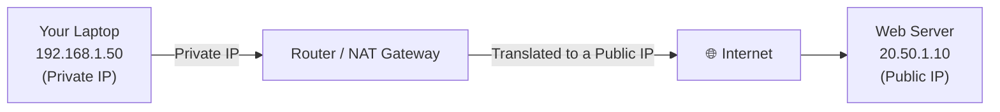

# Day 9 — Introduction to Networking: IP Addresses, Binary, CIDR & Subnet Classes

**Phase 2 — Networking**

> Before we touch a single Azure networking service, we need to talk about something that has nothing to do with Azure at all: how computers address each other on a network. Every Azure networking concept you're about to learn — Virtual Networks, subnets, address spaces, peering, even firewall rules — is built on one foundation: the **IP address** and a notation called **CIDR**. If a block like `10.0.1.0/24` currently looks like a string of random numbers to you, that's exactly what this video fixes. By the end, you'll be able to look at any CIDR block and instantly know how many addresses it contains, where it starts, and where it ends — because that skill is the single most useful thing you can carry into the rest of this networking phase.

---

## What You'll Learn

- What an IP address actually is and why every device needs one
- Bits, bytes, and binary — the language computers use to represent numbers, and why it matters for IP addresses
- How a 32-bit IPv4 address becomes the familiar `10.0.1.5` format
- The difference between a **public IP** and a **private IP** — and the exact private IP ranges every cloud network uses
- IP address **classes** (A, B, C, D, E) — where they came from, and why you still see their fingerprints everywhere
- **CIDR notation** — what `/16`, `/24`, `/28` actually mean, and a simple trick to calculate address ranges in your head
- How to read the Azure Portal's live address-space calculator (a sneak peek at what's coming in Day 10)

---

## Before We Begin

Today is **100% conceptual and 100% free**. There's no resource creation required — we'll spend most of our time on the whiteboard (so to speak), with one short trip into the Azure Portal just to look at IP addresses on resources you may have already created in earlier days, and to preview a tool you'll use heavily in Day 10.

If you skipped earlier days and don't have any resources deployed yet, that's fine — everything here stands on its own, and the portal walkthrough is purely observational.

---

## Part 1 — What Is an IP Address?

### The Basic Idea

Every device that communicates on a network — your laptop, your phone, a web server, an Azure virtual machine — needs a unique address so that other devices know where to send data. That address is called an **IP address** (IP stands for **Internet Protocol**).

Think of it like a street address. If you want a letter to reach your house, the postal system needs a unique address to route it to. If a packet of data wants to reach your virtual machine, the network needs a unique IP address to route it to. No address, no delivery.

### IPv4 — The Format You'll See Everywhere

There are two versions of IP addressing in use today: **IPv4** and **IPv6**. IPv6 exists because the world is running out of IPv4 addresses (we'll see exactly why later in this video), but IPv4 is still what you'll work with for the vast majority of this course — and for the vast majority of real-world Azure networking. Every VNet, subnet, and NSG rule you'll configure uses IPv4 addressing, so that's our focus today.

An IPv4 address looks like this:

```
10.0.1.5
```

Four numbers, separated by dots, each between **0 and 255**. This format is called **dotted decimal notation**. But here's the thing — your computer doesn't actually think in decimal. It thinks in **binary**. The dotted decimal format is just a human-friendly translation of what's really a 32-bit binary number. To understand *why* the numbers are limited to 0–255, why CIDR notation works the way it does, and why the private IP ranges look so oddly specific, we need to drop down one level — to bits and bytes.

---

## Part 2 — Bits, Bytes & Binary: The Language Behind Every IP Address

### What Is a Bit?

A **bit** (short for "binary digit") is the smallest unit of data a computer works with. A bit can only be one of two values: **0** or **1**. On or off. Yes or no. That's it.

### What Is a Byte?

A **byte** is a group of **8 bits**. In IP addressing, a byte is also called an **octet** — you'll hear both terms, and they mean exactly the same thing in this context: 8 bits, grouped together.

### From Binary to Decimal

Each bit in a byte represents a power of 2, depending on its position. Reading from left (most significant) to right (least significant), the position values are:

| Bit position | 7 | 6 | 5 | 4 | 3 | 2 | 1 | 0 |
|---|---|---|---|---|---|---|---|---|
| **Value** | 128 | 64 | 32 | 16 | 8 | 4 | 2 | 1 |

To convert a binary byte to decimal, you add up the position values wherever there's a `1`.

**Example:** Let's convert `00001010` to decimal.

| 128 | 64 | 32 | 16 | 8 | 4 | 2 | 1 |
|---|---|---|---|---|---|---|---|
| 0 | 0 | 0 | 0 | 1 | 0 | 1 | 0 |

Add up the columns where there's a `1`: `8 + 2 = 10`. So `00001010` in binary = `10` in decimal.

### Why Every Octet Maxes Out at 255

This is the key insight: **8 bits can represent exactly 256 different values** — because each of the 8 positions can independently be a 0 or a 1, giving you 2⁸ = 256 combinations. Those combinations represent the decimal numbers **0 through 255** (256 values total, starting from zero).

That's why every number in an IP address (`10.0.1.5`) is between 0 and 255 — each number is one byte, and one byte simply cannot represent anything higher than 255. If you ever see something like `10.0.1.300` written as an IP address, you know immediately it's invalid — 300 doesn't fit in a byte.

### Putting It All Together: A 32-Bit Address

An IPv4 address is **32 bits** total — which is exactly **4 bytes**, or **4 octets**. That's why an IP address has exactly four numbers separated by dots.

Let's convert the full address `10.0.1.5` to binary, octet by octet:

| Decimal | Binary |
|---|---|
| 10 | `00001010` |
| 0 | `00000000` |
| 1 | `00000001` |
| 5 | `00000101` |

Strung together, the full 32-bit binary representation of `10.0.1.5` is:

```
00001010.00000000.00000001.00000101
```

Your computer, your VM's network interface, and every router in between work with that 32-bit binary string. The dotted decimal notation (`10.0.1.5`) exists purely so humans don't have to read 32 ones and zeros every time.

> **Why this matters:** Every CIDR calculation you'll do from here on — figuring out how many addresses are in a `/24`, or where one subnet ends and the next begins — is really just binary arithmetic on these 32 bits. Once you can see an IP address as "32 bits split into 4 groups of 8," CIDR stops being mysterious.

---

## Part 3 — Public IP vs Private IP

Now that we know what an IP address *is*, let's talk about the two flavors every IP address comes in: **public** and **private**.

### Public IP Addresses

A **public IP address** is globally unique across the entire internet. No two devices on the public internet can have the same public IP at the same time. These addresses are allocated by regional internet registries and handed out to internet service providers, hosting companies, and cloud providers — including Microsoft for Azure.

If you want something to be reachable *from anywhere on the internet* — a website, a public-facing API, a VPN endpoint — it needs a public IP address (or needs to sit behind something that has one, like a load balancer).

### Private IP Addresses

A **private IP address** is only meaningful *within* a specific private network. It's not globally unique — in fact, millions of different private networks around the world are all using the exact same private IP addresses right now, and that's completely fine, because none of those addresses are ever directly reachable from the public internet.

Your home WiFi router almost certainly hands out addresses like `192.168.1.x` to your laptop and phone. Your office network might use `10.0.x.x`. An Azure Virtual Network typically uses `10.0.x.x` too. All of these can coexist without conflict because private IP ranges are **reserved** specifically for this purpose — they're carved out of the address space and the internet's routers are configured to never forward traffic to them.

### The Three Reserved Private IP Ranges

There are exactly three blocks of IPv4 addresses set aside for private use (defined in a standard called **RFC 1918**):

| Range | CIDR Notation | Total Addresses |
|---|---|---|
| `10.0.0.0` – `10.255.255.255` | `10.0.0.0/8` | ~16.7 million |
| `172.16.0.0` – `172.31.255.255` | `172.16.0.0/12` | ~1 million |
| `192.168.0.0` – `192.168.255.255` | `192.168.0.0/16` | 65,536 |

**Every Azure VNet you ever create will use an address space from one of these three ranges.** This isn't optional — it's a fundamental rule of how private networking works. We'll spend a lot of time with `10.0.0.0/16` specifically in Day 10, because it's the most common and most flexible choice.

### How Do Private Devices Reach the Internet? (NAT, Briefly)

You might be wondering: if private IPs aren't routable on the internet, how does a laptop with the address `192.168.1.50` ever load a website?

The answer is a process called **Network Address Translation (NAT)**. Somewhere at the edge of your private network — your home router, or in Azure's case, the platform itself — there's a device with a public IP address. When your laptop sends traffic to the internet, that edge device swaps your private source IP for its own public IP, sends the request out, and when the response comes back, translates it back to your private IP and delivers it to you. Your laptop never needs its own public IP to *reach* the internet — it just can't be *reached from* the internet without one.



This exact pattern carries straight into Azure: resources inside a VNet get **private IPs** from the VNet's address space by default, and can reach the internet outbound without any extra configuration. If you want something to be reachable *from* the internet — like a web server — you attach a separate **Public IP** resource to it. Public IP is never something a VNet "gives out" as part of its address space; it's always a distinct resource you opt into.

---

### Hands-On: View Public and Private IPs on an Existing VM

Let's make this concrete by looking at real IP addresses on a resource you may have already created.

**✅ Free Tier — follow along**

If you completed Day 3's VM lab, you should have a VM called `ubuntu-demo-vm01` in the resource group `vm-demo-rg`. Let's go look at its addresses.

1. In the Azure Portal, search for **Virtual machines** and open `ubuntu-demo-vm01`.
2. On the **Overview** page, look for two fields:
   - **Public IP address** — something like `20.84.x.x`. This is globally unique and is how you SSH into the VM from your laptop.
   - **Private IP address** — something like `10.0.0.4`. Notice this falls inside the `10.0.0.0/8` private range we just covered.
3. Click **Networking** in the left menu. You'll see the network interface attached to the VM, and you can confirm the same private IP listed there.

Take a moment to actually look at those two numbers side by side. The public IP is what the *internet* uses to find this VM. The private IP is what *other resources inside the same VNet* use to find it. They serve completely different purposes, and from Day 10 onward, you'll be designing the address ranges that private IPs like `10.0.0.4` come from.

If you don't have a VM deployed, that's fine — just keep this exercise in mind, and revisit it once you've built your VNet in Day 10.

---

## Part 4 — IP Address Classes (Classful Addressing)

### A Bit of History

Back in the early days of the internet (the 1980s), IPv4 addresses weren't assigned with the flexible CIDR notation we use today. Instead, the entire address space was divided into rigid categories called **classes**, based on the value of the *first* octet. This system is called **classful addressing**.

There are five classes — A through E:

| Class | First Octet Range | Default Subnet Mask | Default Prefix | Purpose |
|---|---|---|---|---|
| **Class A** | 1 – 126 | `255.0.0.0` | `/8` | Huge networks (~16.7 million hosts each) |
| **Class B** | 128 – 191 | `255.255.0.0` | `/16` | Medium networks (~65,536 hosts each) |
| **Class C** | 192 – 223 | `255.255.255.0` | `/24` | Small networks (254 hosts each) |
| **Class D** | 224 – 239 | — | — | Multicast (not for regular hosts) |
| **Class E** | 240 – 255 | — | — | Reserved / experimental |

> You might notice `127` is missing from the Class A range above. That's intentional — `127.0.0.0/8` is reserved entirely for **loopback** addresses (`127.0.0.1` is "localhost" — your own machine talking to itself).

### Why Classful Addressing Existed — and Why It Was a Problem

The idea was simple: if you ran a small business and needed, say, 300 IP addresses for your computers, you'd be assigned a Class B network — giving you 65,536 addresses. You'd use 300 of them and the other **65,236 would sit completely unused**, unable to be assigned to anyone else, because the whole Class B block belonged to you.

Multiply that waste across every organization on the early internet, and you can see the problem: the IPv4 address space (about 4.3 billion addresses total) was being exhausted at an alarming rate — not because the addresses were truly *needed*, but because the classful system forced allocations in huge, wasteful chunks.

### Why Classes Still Matter Today

Classful addressing was officially replaced by CIDR back in 1993 (more on that in a moment), and modern networks — including every Azure VNet — don't think in terms of "Class A" or "Class B" anymore. So why are we covering this at all?

Two reasons:

1. **The private IP ranges are direct descendants of the class system.** `10.0.0.0/8` is *exactly* the old Class A private block. `192.168.0.0/16` is 256 contiguous Class C blocks reserved for private use. `172.16.0.0/12` is a slice of the old Class B range. Understanding classes explains *why* these specific, oddly-shaped ranges were chosen.
2. **You'll still hear the terminology.** Experienced engineers will casually say "give it a /24" or "that's basically a Class C-sized network." Knowing what that means — even though it's informal — helps you follow real-world conversations and documentation.

So: classes are history, but their fingerprints are everywhere. CIDR is what you'll actually *use*.

---

## Part 5 — CIDR: Classless Inter-Domain Routing

### What CIDR Solves

**CIDR** stands for **Classless Inter-Domain Routing**. As the name suggests, it throws out the rigid class system entirely and replaces it with something far more flexible: you can define a network of *almost any size*, not just /8, /16, or /24.

CIDR notation looks like this:

```
10.0.1.0/24
```

The number after the slash — the **prefix length** — tells you how many of the 32 bits (reading left to right) are "fixed" as the **network portion**. The remaining bits are available for **host addresses** within that network.

### The Subnet Mask Connection

Every CIDR prefix has an equivalent **subnet mask** — a 32-bit number where the network bits are all `1`s and the host bits are all `0`s, written in the same dotted-decimal format as an IP address.

For `/24`:

```
Prefix:      24 bits of 1s, then 8 bits of 0s
Binary:      11111111.11111111.11111111.00000000
Decimal:     255  .  255  .  255  .   0
```

So `/24` and `255.255.255.0` mean exactly the same thing — they're just two different ways of writing "the first 24 bits are the network, the last 8 bits are for hosts."

### Calculating the Number of Addresses

Since the host portion has `(32 − prefix length)` bits, and each bit doubles the number of possible combinations, the formula is:

```
Number of addresses = 2^(32 − prefix length)
```

Here's a reference table covering the prefixes you'll encounter most often in Azure:

| CIDR | Subnet Mask | Host Bits | Total Addresses | Typical Use |
|---|---|---|---|---|
| `/8` | `255.0.0.0` | 24 | 16,777,216 | Entire private Class A block |
| `/16` | `255.255.0.0` | 16 | 65,536 | Standard VNet address space |
| `/20` | `255.255.240.0` | 12 | 4,096 | Large subnet |
| `/24` | `255.255.255.0` | 8 | 256 | Typical subnet |
| `/26` | `255.255.255.192` | 6 | 64 | Minimum size for AzureBastionSubnet |
| `/28` | `255.255.255.240` | 4 | 16 | Small subnet (e.g., gateway) |
| `/29` | `255.255.255.248` | 3 | 8 | Very small subnet |
| `/30` | `255.255.255.252` | 2 | 4 | Point-to-point link |
| `/32` | `255.255.255.255` | 0 | 1 | A single, specific host |

> Notice the pattern: every time the prefix length goes up by 1, the total number of addresses is cut in half. Going from `/24` (256) to `/25` gives you 128, then `/26` gives you 64, and so on.

### Network Address, Broadcast Address & Usable Hosts

Within any CIDR block, two addresses are special and can't be assigned to a device:

- The **network address** — the very first address in the block. It identifies the network itself, not a host.
- The **broadcast address** — the very last address in the block. It's used to send a message to *every* device on that network at once.

So for a generic `/24` network like `192.168.1.0/24`:

- **Network address:** `192.168.1.0`
- **Usable host range:** `192.168.1.1` through `192.168.1.254` (254 usable addresses)
- **Broadcast address:** `192.168.1.255`

That's `256 − 2 = 254` usable addresses for a `/24`. This network/broadcast reservation applies to on-premises and traditional networking. (Azure adds a few of its own reservations on top of this for VNet subnets — we'll cover exactly what those are and why, with real numbers, in Day 10.)

### The "256 Minus the Mask" Trick

Here's the single most useful shortcut for reading CIDR blocks at a glance — especially for subnets sized `/24` through `/30`, which is what you'll be creating constantly in Azure.

**The trick:** Look at the subnet mask octet that isn't `0` or `255`. Subtract it from `256`. That's your **block size** — the interval at which new networks of that size begin.

**Example — `/26` (mask `255.255.255.192`):**

```
256 − 192 = 64
```

So `/26` networks start at multiples of 64 in the last octet: `.0`, `.64`, `.128`, `.192`. If someone gives you `10.0.1.64/26`, you instantly know:

- It starts at `10.0.1.64`
- The next block starts at `10.0.1.128`
- So this block covers `10.0.1.64` through `10.0.1.127` (64 addresses)

**Example — `/28` (mask `255.255.255.240`):**

```
256 − 240 = 16
```

`/28` networks start at multiples of 16: `.0`, `.16`, `.32`, `.48`, ... `10.0.1.0/28` covers `10.0.1.0` through `10.0.1.15`.

**Example — `/24` (mask `255.255.255.0`):**

```
256 − 0 = 256
```

A block size of 256 means the *entire* last octet belongs to one network — which is exactly why `/24` networks are written as `x.x.x.0` and contain addresses `.0` through `.255`. This is also why `/24` subnets are so common: each one cleanly maps to "one full value of the last octet," which is easy for humans to reason about.

Keep this trick in your back pocket — you'll use it every time you look at a subnet's address range in the Azure Portal.

---

### Hands-On: Watch Azure Calculate CIDR Live

You don't actually need to memorize all of this math, because **the Azure Portal does it for you in real time**. Let's take a quick look — without creating anything yet, since we'll do that properly in Day 10.

**✅ Free Tier — exploration only, nothing is created**

1. In the Azure Portal, search for **Virtual networks** and click **+ Create**.
2. Fill in any resource group and name just to get to the next tab — don't worry about getting these "right," we're only exploring.
3. Click **Next: IP Addresses**.
4. You'll see a default address space already populated: `10.0.0.0/16`, with Azure helpfully showing **"65,536 addresses"** next to it. That number should look familiar — it's exactly what our table above predicted for a `/16`.
5. Click **+ Add a subnet**. Give it any name, and try changing the **Subnet address range** field:
   - Set it to a `/24` — Azure will show **256 addresses**.
   - Change it to a `/28` — Azure recalculates to **16 addresses**.
   - Try a `/26` — **64 addresses**.
6. Watch how Azure also adjusts the starting address as you change the prefix, snapping to the "block size" boundaries we just discussed.
7. Once you're done exploring, click **Cancel** (or just navigate away) — we have not created anything, and there's nothing to clean up.

This little calculator is going to be your best friend throughout Day 10 and beyond. Every time you're unsure how many addresses a CIDR block gives you, you can open this screen, type the prefix, and read the answer directly — but now you also understand *why* the number is what it is.

---

## Summary

Let's bring it all together. Here's the foundation we built today:

An **IP address** is a unique identifier for a device on a network — for IPv4, it's a **32-bit number** written as four decimal numbers (octets) separated by dots, like `10.0.1.5`.

**Bits and bytes** are the language underneath: a bit is a single 0 or 1, a byte (or octet) is 8 bits, and 8 bits can represent exactly 256 values (0–255) — which is why every number in an IP address falls in that range.

A **public IP** is globally unique and reachable from the internet. A **private IP** comes from one of three reserved ranges — `10.0.0.0/8`, `172.16.0.0/12`, and `192.168.0.0/16` — and is only meaningful inside its own private network. **NAT** is the mechanism that lets private-IP devices reach the internet without needing a public IP of their own.

**IP address classes** (A through E) were the original, rigid way of carving up the address space — and while they're no longer used for routing, they directly explain why our private IP ranges look the way they do.

**CIDR** replaced classes with flexible, arbitrary-sized network blocks written as `/n`. The prefix length tells you how many bits are fixed; the formula `2^(32 − n)` tells you how many addresses you get; and the **"256 minus the mask"** trick lets you instantly figure out where a block starts and ends.

### What's Next

In **Day 10 — Azure Virtual Network: Address Spaces, Subnets & NSGs**, we put all of this to work. You'll create your first VNet, choose its address space using exactly the CIDR knowledge from today, carve it into subnets for different purposes, and attach Network Security Groups to control traffic. Everything that felt abstract today — `/16`, `/24`, "65,536 addresses" — is about to become a real, working network you built yourself.

---

## Key Takeaways

- An **IPv4 address** is a 32-bit number, written as 4 decimal octets (0–255), separated by dots — each octet is exactly 1 byte (8 bits)
- 8 bits = 256 possible values (0–255), which is *why* IP address numbers never exceed 255
- **Public IPs** are globally unique and internet-routable; **private IPs** come from `10.0.0.0/8`, `172.16.0.0/12`, or `192.168.0.0/16` and are reused across countless private networks via **NAT**
- **IP classes (A–E)** are historical, but they explain the shape of today's private IP ranges and live on in informal terminology ("a /24" ≈ "a Class C")
- **CIDR notation (`/n`)** defines a network's size by specifying how many of the 32 bits are fixed; total addresses = `2^(32 − n)`
- The **"256 minus the subnet mask"** trick instantly tells you the block size and boundaries of any `/24`–`/30` network
- The Azure Portal's VNet creation screen calculates CIDR address counts live — use it whenever you need a quick answer
