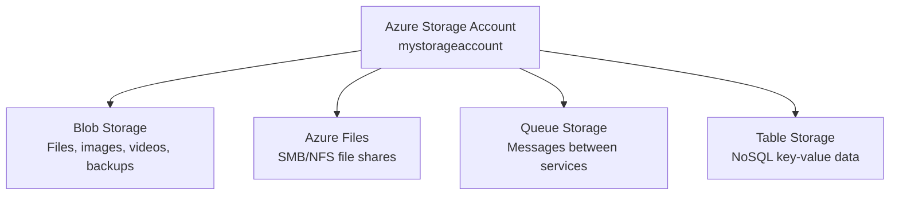
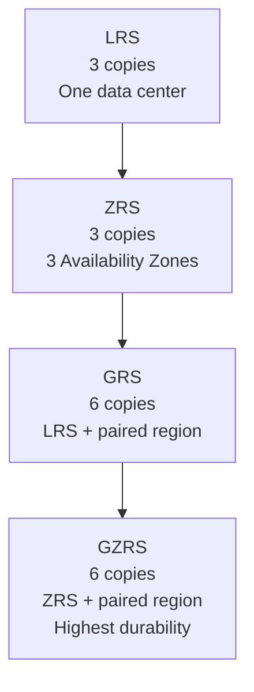
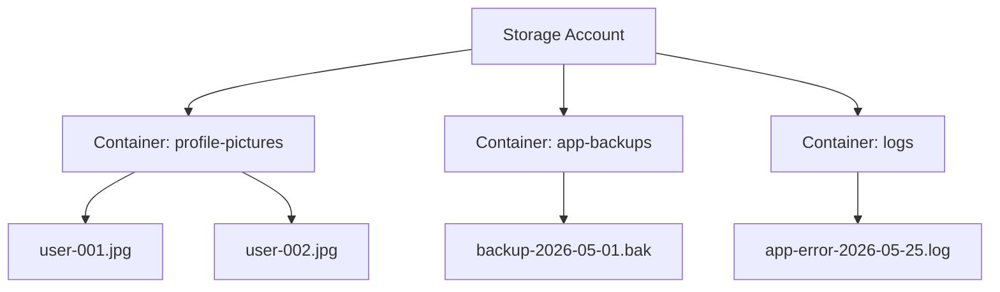
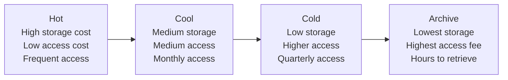
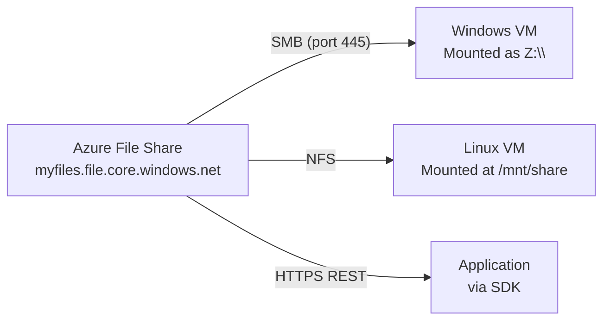
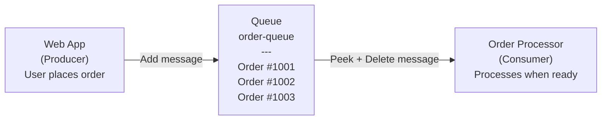

# Day 10 — Azure Storage Account: Blob, Files, Queues & Tables

**Phase 3 — Storage, Databases & Global Delivery**

> Every application needs somewhere to store data — user profile pictures, log files, database backups, configuration files, messages between services, invoices. In Azure, the answer to almost all of those is a single service: the Azure Storage Account. One account, four completely different storage services, one bill. Today you'll learn all four — what they are, when to use each, and how to work with them in the portal.

---

## What You'll Learn

- What an Azure Storage Account is — the unified namespace concept
- Performance tiers — Standard vs Premium
- Replication options — LRS, ZRS, GRS, GZRS and what they protect against
- Blob Storage — containers, blobs, three blob types, and when to use each
- Access tiers — Hot, Cool, Cold, and Archive — how cost shifts as data ages
- Shared Access Signatures (SAS) — generate a time-limited URL for secure file sharing
- Lifecycle management policies — automatically move blobs between tiers as they age
- Azure Files — fully managed file shares you can mount on any VM or laptop
- Queue Storage — how to decouple services using messages
- Table Storage — simple NoSQL key-value storage for structured data
- Azure Storage Explorer — the desktop tool for browsing and managing storage visually

---

## Before We Begin

All demos today use the **Azure Free Tier**. Microsoft gives you 5 GB of Blob Storage (LRS, Hot tier) free for 12 months. Azure Files, Queue Storage, and Table Storage are pay-per-use at fractions of a cent — the demo volumes are effectively free.

**✅ Free Tier** — all demos today.

---

## Part 1 — What Is an Azure Storage Account?

### The Unified Storage Namespace

When you create an **Azure Storage Account**, you are creating a single, named container in Azure that gives you access to four completely different storage services — all under one account name, one set of access keys, and one monthly bill.



Your storage account name becomes part of the URL for every service inside it:

| Service | URL format |
|---|---|
| Blob | `https://mystorageaccount.blob.core.windows.net` |
| Files | `https://mystorageaccount.file.core.windows.net` |
| Queue | `https://mystorageaccount.queue.core.windows.net` |
| Table | `https://mystorageaccount.table.core.windows.net` |

This is why the account name must be **globally unique** across all of Azure — it becomes a public DNS name.

---

### Performance Tiers

When creating a storage account, you choose a performance tier that determines the underlying hardware and which services are available.

| Tier | Hardware | Supported Services | Use Case |
|---|---|---|---|
| **Standard** | Magnetic HDD-backed | Blob, Files, Queue, Table | General-purpose — covers almost all scenarios |
| **Premium** | SSD-backed | Blob (block only) OR Files OR Page Blobs — separate account per type | Low-latency, high-throughput workloads |

> For this course, always use **Standard**. Premium is for databases and workloads that need sub-millisecond latency — not typical application storage.

---

### Replication Options

Azure always stores multiple copies of your data. You choose how many copies and how far apart they are.

| Option | Full Name | Copies | What it protects against |
|---|---|---|---|
| **LRS** | Locally Redundant Storage | 3 copies | Hardware failure in one rack — all 3 copies in one data center |
| **ZRS** | Zone-Redundant Storage | 3 copies | Data center failure — one copy in each of 3 availability zones |
| **GRS** | Geo-Redundant Storage | 6 copies | Regional disaster — LRS in primary region + async copy to paired region |
| **GZRS** | Geo-Zone-Redundant Storage | 6 copies | Both zone and regional failure — ZRS in primary + copy to paired region |



**Cost increases as redundancy increases** — GRS stores twice the data of LRS and replicates to another region, so it costs roughly twice as much.

**For this demo:** use **LRS** — cheapest, still 3 copies, and sufficient for learning.

---

### Demo — Create a Storage Account

**✅ Free Tier**

!!! success "Step 1 — Search for Storage accounts"
    In the Azure Portal search bar, type **"Storage accounts"** → click the result → **"+ Create."**

!!! success "Step 2 — Fill in the Basics tab"

    | Field | Value |
    |-------|-------|
    | Subscription | *(your subscription)* |
    | Resource group | Create new → `storage-demo-rg` |
    | Storage account name | `lwmstorage<yourname>` *(lowercase letters and numbers only, globally unique)* |
    | Region | *(same region you've been using)* |
    | Performance | **Standard** |
    | Redundancy | **Locally-redundant storage (LRS)** |

    Click **"Next: Advanced."**

!!! success "Step 3 — Review the Advanced tab"
    Notice **"Allow enabling public access on containers"** — this controls whether blobs can be made publicly readable. Leave it enabled for this demo; in production you'd evaluate this carefully.

    Also notice **"Minimum TLS version"** — leave at TLS 1.2.

    Click **"Next: Networking."**

!!! success "Step 4 — Networking tab"
    Leave **"Enable public access from all networks"** selected. In production you'd lock this to specific VNets or private endpoints — we'll cover that in the networking days.

    Click **"Review + create"** → **"Create."**

!!! success "Step 5 — Go to your storage account"
    Once deployed, click **"Go to resource."** Take a moment to look at the left menu — you'll see **Containers** (Blob), **File shares**, **Queues**, and **Tables** — all four services in one account.

---

## Part 2 — Blob Storage

### What Is Blob Storage?

**Blob** stands for **Binary Large Object** — it's Azure's object storage service for storing any kind of unstructured data: images, videos, PDFs, log files, database backups, application installers, static website assets.

Blob Storage is organized in two levels:



- **Container** — like a folder at the top level. You can't nest containers inside containers.
- **Blob** — the actual file stored inside a container.

Every blob gets its own URL:
`https://lwmstoragedemo.blob.core.windows.net/profile-pictures/user-001.jpg`

---

### Three Blob Types

| Type | What it's for | How writes work |
|---|---|---|
| **Block Blob** | General files — images, videos, documents, backups | Data written in blocks; blocks committed together. The default type. |
| **Append Blob** | Log files and audit streams | New data can only be appended to the end — cannot modify existing content |
| **Page Blob** | Azure VM managed disks | Optimized for random read/write operations across 512-byte pages |

> When you upload a file via the portal, Azure creates a Block Blob by default. You'll almost always use Block Blobs. Page Blobs are used internally by Azure for managed disks — you rarely create them directly.

---

### Demo — Create a Container and Upload Files

**✅ Free Tier**

!!! success "Step 1 — Open Containers"
    In your storage account → left menu → **"Containers"** → **"+ Container."**

    | Field | Value |
    |-------|-------|
    | Name | `my-uploads` |
    | Public access level | **Private (no anonymous access)** |

    Click **"Create."**

    > **Public access levels:**
    > - **Private** — no one can read blobs without authenticating
    > - **Blob** — anyone with the blob URL can read the file, but they can't list what's in the container
    > - **Container** — anyone can both read files AND list all contents

!!! success "Step 2 — Upload a file"
    Click on `my-uploads` to open it → **"Upload."**

    Drag any file from your laptop — a photo, a PDF, anything. In the upload panel:

    - **Files:** select your file
    - **Advanced → Blob type:** Block blob *(default)*
    - **Advanced → Access tier:** Hot *(default)*

    Click **"Upload."**

    The file appears in the container with its name, size, and last-modified time.

!!! success "Step 3 — View the blob URL"
    Click on the uploaded blob. On the blob's properties page, find the **URL** field:
    `https://lwmstoragedemo.blob.core.windows.net/my-uploads/yourfile.jpg`

    Copy the URL and try to open it in a browser. You'll get a **ResourceNotFound** or **PublicAccessNotPermitted** error — because the container is set to **Private**. Good. That's the correct behaviour. You need to authenticate to access it.

    > We'll fix this in the SAS demo next.

---

## Part 3 — Access Tiers and Lifecycle Management

### Blob Access Tiers

Not all data is accessed equally. A backup from today gets opened frequently. A backup from last year might sit untouched for 11 months. Azure lets you move data between **access tiers** to pay less for data you access less.

| Tier | Access frequency | Storage cost | Access cost | Retrieval time |
|---|---|---|---|---|
| **Hot** | Frequent (daily) | Highest | Lowest | Immediate |
| **Cool** | Infrequent (monthly) | Lower | Higher | Immediate |
| **Cold** | Rare (quarterly) | Lower still | Higher | Immediate |
| **Archive** | Almost never (annual compliance) | Lowest | Very high + rehydration fee | 1–15 hours |



**Key rule:** Archive blobs are **offline** — before you can read an Archive blob, you must **rehydrate** it (move it to Hot or Cool), which takes up to 15 hours and costs extra. Never archive data you might need urgently.

**Setting tiers:** You can set the tier per-blob at upload time, or change it on any individual blob after upload, or use **lifecycle management policies** to automate transitions.

---

### Demo — Change a Blob's Access Tier

**✅ Free Tier**

!!! success "Step 1 — Open the blob"
    In your `my-uploads` container → click your uploaded blob.

!!! success "Step 2 — Change the tier"
    On the blob's overview page, click **"Change tier."**

    You'll see the four options — Hot, Cool, Cold, Archive. Select **"Cool"** → **"Save."**

    The blob is now on the Cool tier. Accessing it less frequently means you're paying less per GB per month to store it.

    > Change it back to **Hot** for the rest of the demos.

---

### Lifecycle Management Policies

Instead of manually changing blob tiers, you can write rules that do it automatically:

- *"Move blobs to Cool tier if they haven't been accessed in 30 days"*
- *"Move blobs to Archive if they haven't been accessed in 90 days"*
- *"Delete blobs that are older than 365 days"*

This is **Lifecycle Management** — a set of JSON rules evaluated daily that automatically manage blob tiers and deletion based on age or last-access time.

---

### Demo — Create a Lifecycle Management Policy

**✅ Free Tier**

!!! success "Step 1 — Open Lifecycle management"
    In your storage account → left menu → **"Data management"** → **"Lifecycle management"** → **"+ Add a rule."**

!!! success "Step 2 — Name the rule"
    | Field | Value |
    |-------|-------|
    | Rule name | `auto-tier-rule` |
    | Rule scope | Apply rule to all blobs in storage account |
    | Blob type | Block blobs |
    | Blob subtype | Base blobs |

    Click **"Next: Base blobs."**

!!! success "Step 3 — Define the transitions"
    | Condition | Action |
    |-----------|--------|
    | Base blobs last modified more than **30** days ago | **Move to cool storage** |
    | Base blobs last modified more than **90** days ago | **Move to archive storage** |
    | Base blobs last modified more than **365** days ago | **Delete the blob** |

    Check all three boxes and set the day values as above.

    Click **"Add."**

    > The policy is now saved. Azure evaluates it once per day. Any blob untouched for 30 days automatically drops to Cool. Any blob untouched for 90 days drops to Archive. After a year, it's deleted. You never need to think about it again.

---

## Part 4 — Shared Access Signatures (SAS)

### The Problem

Your blobs are private — no one can access them without authenticating as your storage account. But what if you need to share a specific file with someone temporarily — a client, a contractor, a partner — without giving them your account key?

A **Shared Access Signature (SAS)** is a signed URL that grants specific, time-limited access to a blob, container, or service. You control exactly what they can do and for how long.

**A SAS URL looks like this:**
```
https://lwmstoragedemo.blob.core.windows.net/my-uploads/report.pdf
  ?sv=2023-11-03
  &se=2026-05-26T10%3A00%3A00Z
  &sr=b
  &sp=r
  &sig=AbCdEf1234...
```

The query parameters encode:
- **`se`** — expiry time (this URL stops working after this timestamp)
- **`sr`** — resource type (`b` = blob, `c` = container)
- **`sp`** — permissions (`r` = read only, `w` = write, `d` = delete)
- **`sig`** — the cryptographic signature that proves Azure generated it

If someone modifies any part of the URL, the signature check fails and access is denied.

---

### Demo — Generate a SAS URL for a Blob

**✅ Free Tier**

!!! success "Step 1 — Open the blob"
    In `my-uploads` → click your uploaded blob.

!!! success "Step 2 — Generate SAS"
    In the blob's left menu → **"Generate SAS."**

    | Field | Value |
    |-------|-------|
    | Signing method | **Account key** |
    | Permissions | **Read** *(untick everything else)* |
    | Expiry | Set to **tomorrow's date and time** |
    | Allowed protocols | **HTTPS only** |

    Click **"Generate SAS token and URL."**

!!! success "Step 3 — Test the URL"
    Copy the **Blob SAS URL** (the full URL, not just the token). Open it in a browser — your file loads successfully.

    Now try modifying the URL — change any character in the `sig` parameter. Reload the page — you get an **AuthenticationFailed** error. The signature check caught the tampering.

    > After the expiry time you set passes, the URL will stop working entirely — even without modification.

---

## Part 5 — Azure Files

### What Is Azure Files?

**Azure Files** is a fully managed file share service in the cloud. Unlike Blob Storage (which is object storage — you access files via URL), Azure Files behaves like a traditional network drive.

- Accessible via **SMB (Server Message Block)** — the same protocol Windows uses for shared drives. Mount it as `Z:\` on any Windows machine or VM.
- Accessible via **NFS (Network File System)** — for Linux VMs. Mount it like any network filesystem.
- Accessible via **HTTPS/REST** — from any application without mounting.

**Use cases:**
- **Lift and shift:** move on-premise file servers to Azure without changing how applications access files
- **Shared config:** multiple VMs read from the same file share — update the config once, all VMs see the change
- **Log aggregation:** all VMs write logs to a central file share instead of their own local disks



---

### Demo — Create an Azure File Share

**✅ Free Tier**

!!! success "Step 1 — Open File shares"
    In your storage account → left menu → **"File shares"** → **"+ File share."**

    | Field | Value |
    |-------|-------|
    | Name | `my-file-share` |
    | Tier | **Transaction optimized** *(default — best for general use)* |

    Click **"Create."**

!!! success "Step 2 — Upload a file via the portal"
    Click on `my-file-share` → **"Upload."** Upload any file from your laptop. The file appears inside the share — just like a folder on your computer.

!!! success "Step 3 — View the mount instructions"
    Click **"Connect"** at the top.

    Azure shows you the exact PowerShell command to mount this share on a Windows machine, and the exact Linux command to mount it on Ubuntu. Copy the Windows command — it contains your account name, share name, and a storage key already embedded.

    ```powershell
    $connectTestResult = Test-NetConnection -ComputerName lwmstoragedemo.file.core.windows.net -Port 445
    if ($connectTestResult.TcpTestSucceeded) {
        net use Z: \\lwmstoragedemo.file.core.windows.net\my-file-share /user:Azure\lwmstoragedemo <key>
    }
    ```

    > **Port 445 note:** SMB uses port 445. Some ISPs block outbound port 445 for residential customers. If the `Test-NetConnection` shows `TcpTestSucceeded: False`, your ISP is blocking it. Use Azure Cloud Shell or a VM inside Azure to mount the share instead — the port is always open within Azure.

!!! success "Step 4 — Explore the file share in the portal"
    Back in the share, you can create folders, upload files, and browse the directory structure — all from the portal without mounting anything.

---

## Part 6 — Queue Storage

### What Is Queue Storage?

**Queue Storage** is a message queue — a service that holds messages that one application component sends and another component reads.

**Why queues?** Without a queue, if Component A calls Component B directly and B is slow or offline, A fails. With a queue, A puts a message in the queue and moves on. B picks up the message when it's ready. They're **decoupled** — neither depends on the other being available at the same moment.



**Real-world example:** A user uploads a video. The web app puts a message in a queue: *"Process video: user123/upload.mp4."* The video processing service reads from the queue when it has capacity and transcodes the video. The web app doesn't wait — it already told the user "your video is being processed."

**Key properties:**
- Messages can be up to **64 KB** in size
- A queue can hold up to **500 TB** of messages
- Messages can have a **visibility timeout** — while one consumer is processing it, other consumers can't see it
- Messages expire after **7 days** by default (configurable up to 7 days)

---

### Demo — Create a Queue and Send a Message

**✅ Free Tier**

!!! success "Step 1 — Open Queues"
    In your storage account → left menu → **"Queues"** → **"+ Queue."**

    | Field | Value |
    |-------|-------|
    | Queue name | `order-queue` *(lowercase, hyphens allowed)* |

    Click **"OK."**

!!! success "Step 2 — Add a message"
    Click on `order-queue` → **"Add message."**

    | Field | Value |
    |-------|-------|
    | Message text | `{"orderId": "1001", "product": "Azure Course", "qty": 1}` |
    | Expires in | **7 days** |
    | Encode the message body in Base64 | Leave unchecked |

    Click **"OK."** The message appears in the queue with its insertion time and expiry.

!!! success "Step 3 — Peek at the message"
    Click **"Peek"** at the top. You can see the message content — this is what a consumer would read. Peeking does not remove the message from the queue.

!!! success "Step 4 — Dequeue the message"
    Click **"Dequeue."** The message is removed — simulating a consumer picking it up and deleting it after successful processing.

    > In a real application, the consumer reads the message via SDK, processes it, then deletes it. If processing fails, the message reappears after the visibility timeout for another consumer to retry.

---

## Part 7 — Table Storage

### What Is Table Storage?

**Table Storage** is Azure's simple, schemaless NoSQL key-value store. Think of it as a massive spreadsheet in the cloud — rows of data, each row has a unique key, and different rows can have different columns.

**Structure:**
- **Table** — the top-level container (like a database table)
- **Entity** — a single row of data (like a record)
- **Property** — a field on an entity (like a column, but not all entities need the same properties)
- **PartitionKey + RowKey** — the unique identifier for every entity (like a composite primary key)

**When to use Table Storage:**
- Simple lookup data: user settings, session data, small config tables
- Time-series data with a known key pattern: sensor readings, event logs
- When you need cheap, fast NoSQL reads without the cost of Cosmos DB

**When NOT to use Table Storage:**
- Complex queries, joins, or aggregations — use Azure SQL or Cosmos DB instead
- More than 20 GB per partition — performance degrades

---

### Demo — Create a Table and Add Entities

**✅ Free Tier**

!!! success "Step 1 — Open Tables"
    In your storage account → left menu → **"Tables"** → **"+ Table."**

    | Field | Value |
    |-------|-------|
    | Table name | `courseprogress` |

    Click **"OK."**

!!! success "Step 2 — Open Storage Browser"
    To add data easily, we'll use the built-in Storage Browser. In the left menu → **"Storage browser"** → expand **Tables** → click `courseprogress` → **"Add entity."**

    | Property | Value |
    |---|---|
    | PartitionKey | `student-001` |
    | RowKey | `day-10` |
    | Add property → Name: `completed` / Type: Boolean / Value: `true` | |
    | Add property → Name: `score` / Type: Int32 / Value: `95` | |

    Click **"Insert."** The entity appears in the table.

!!! success "Step 3 — Add a second entity"
    Click **"Add entity"** again:

    | Property | Value |
    |---|---|
    | PartitionKey | `student-001` |
    | RowKey | `day-11` |
    | completed | Boolean → `false` |

    Click **"Insert."**

    Notice the second entity doesn't have a `score` property — Table Storage is schemaless. Each entity can have different properties.

---

## Part 8 — Azure Storage Explorer

### What Is Storage Explorer?

**Azure Storage Explorer** is a free desktop application from Microsoft that gives you a visual, file-explorer-like interface for browsing and managing all your storage accounts across subscriptions — without opening the Azure Portal.

**Why use it:**
- Upload/download thousands of files via drag-and-drop
- Copy data between storage accounts or containers
- Generate SAS tokens
- Browse Table Storage entities
- View Queue messages
- Works on Windows, macOS, and Linux

---

### Demo — Download and Connect Storage Explorer

**✅ Free Tier**

!!! success "Step 1 — Download Storage Explorer"
    Go to `https://azure.microsoft.com/en-us/products/storage/storage-explorer/` and download the installer for your OS. Install it.

!!! success "Step 2 — Sign in with your Azure account"
    Open Storage Explorer → click the plug icon (**"Connect to Azure Resources"**) → **"Add an Azure Account"** → sign in with your Azure credentials.

    Your subscriptions load automatically. Expand **Storage Accounts** → expand your `lwmstoragedemo` account — you'll see Blob Containers, File Shares, Queues, and Tables all in a tree.

!!! success "Step 3 — Browse your container"
    Expand **Blob Containers** → `my-uploads`. Your uploaded file appears exactly as it would in a local file explorer. Drag another file from your desktop directly into the Storage Explorer window — it uploads instantly.

!!! success "Step 4 — Copy a blob URL"
    Right-click your blob → **"Copy URL."** Paste it somewhere — this is the direct URL (no SAS). Now right-click again → **"Get Shared Access Signature"** — Storage Explorer lets you generate SAS tokens without going to the portal at all.

---

## Cleaning Up

**✅ Free Tier**

!!! warning "Delete the resource group"
    Go to **Resource groups** → `storage-demo-rg` → **"Delete resource group"** → type the name to confirm → **"Delete."**

    This removes the storage account and all data inside it — blobs, files, queues, and tables — in one step.

    > The Free Tier gives you 5 GB of Blob Storage free for 12 months, so there's no charge for the demo. Still good practice to clean up.

---

## Summary and What's Next

Today you built a complete picture of Azure's unified storage layer.

**The Storage Account** is the single namespace that gives you access to four different storage engines — each designed for a different shape of data.

**Blob Storage** is the workhorse — every application stores unstructured files here. Block Blobs for general files, Append Blobs for logs, Page Blobs for VM disks. The four access tiers (Hot, Cool, Cold, Archive) let you cut costs as data ages, and lifecycle management policies automate those transitions so you never have to think about it.

**SAS tokens** give you surgical control over who can access what and for how long — without sharing your account key.

**Azure Files** turns your storage account into a network drive — mount it on any VM or laptop via SMB, and all machines share the same folder.

**Queue Storage** decouples application components — producers write messages, consumers read them independently, and your system stays resilient even when individual parts are slow or offline.

**Table Storage** is the simplest NoSQL option in Azure — fast, cheap key-value lookups with no schema required.

**Storage Explorer** is the tool you'll actually use day-to-day — drag, drop, browse, and generate SAS tokens without touching the portal.

**Coming up next:** Day 11 moves to **Azure SQL Database** — Microsoft's fully managed relational database. You'll create a serverless SQL database, connect to it with Azure Data Studio, and learn how Elastic Pools and Managed Instances fit into the picture.

---

## Key Takeaways

- **Storage Account = one account, four services** — Blob, Files, Queue, Table all share one account name and one bill.
- **Account name is globally unique** — it becomes the DNS name for all four service endpoints.
- **Standard vs Premium** — Standard covers almost every use case. Premium is for sub-millisecond latency requirements.
- **LRS** — 3 copies in one data center. **ZRS** — 3 copies across zones. **GRS** — 6 copies across two regions. **GZRS** — maximum durability.
- **Block Blob** — general files. **Append Blob** — logs only. **Page Blob** — VM disks.
- **Hot → Cool → Cold → Archive** — storage cost drops, access cost rises, retrieval time increases. Archive takes up to 15 hours to rehydrate.
- **SAS tokens** — time-limited, permission-scoped URLs. Tampering with any part of the URL breaks the signature.
- **Lifecycle management** — rules evaluated daily that automatically move or delete blobs based on age. Set once, forget.
- **Azure Files** — SMB/NFS file share. Uses port 445 for SMB — some home ISPs block it; use a VM inside Azure if needed.
- **Queue Storage** — messages up to 64 KB, expire in up to 7 days. Visibility timeout prevents double-processing.
- **Table Storage** — schemaless NoSQL. PartitionKey + RowKey = unique identity. Use when Cosmos DB is overkill.
- **Storage Explorer** — free desktop tool for Windows, macOS, Linux. The fastest way to manage storage outside the portal.
