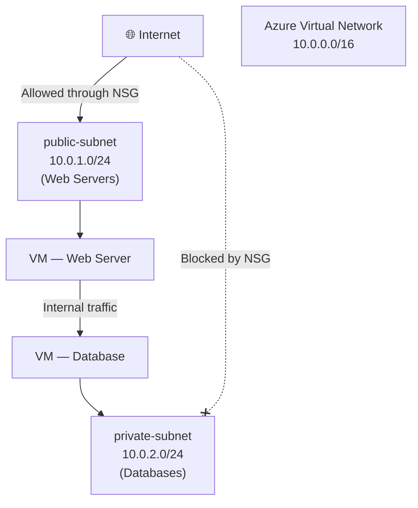
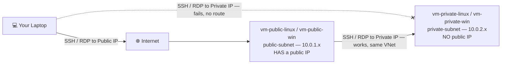

# Day 10 — Azure Virtual Network: Address Spaces, Subnets & Network Security Groups

**Phase 2 — Networking**

> In Day 9, we learned the language every Azure network speaks: bits, bytes, IP addresses, public vs private, and CIDR notation. Today we put that language to work. Every resource you've deployed so far — your VMs, your App Service, your storage account — lives somewhere. But where, exactly? They all live inside a network. Azure doesn't just drop your resources onto the internet and hope for the best. Every resource gets placed into a private, isolated network that you fully control. That network is called a **Virtual Network**, or VNet. Today you're going to design one from scratch using the CIDR knowledge from Day 9, carve it into subnets, and lock it down with firewall rules.

---

## What You'll Learn

- What a Virtual Network is and why every Azure resource lives inside one
- How to choose your VNet's **address space** using CIDR — and exactly which addresses Azure reserves for itself
- **Subnets** — how to segment resources into logical groups for security and organisation
- Hands-on: building a VNet with two subnets from scratch
- **Network Security Groups (NSGs)** — the firewall rules that control exactly what traffic is allowed
- Hands-on: writing NSG rules and attaching them to a subnet
- Hands-on: deploying real VMs (Windows **and** Linux) into the public and private subnets, and proving public vs. private reachability with your own hands
- **Application Security Groups (ASGs)** — grouping VMs by role so NSG rules target a group, not a fragile IP address
- Hands-on: tagging VMs into ASGs and rewriting an NSG rule to use them

---

## Before We Begin

Everything today is **free tier**. VNets, subnets, and NSGs cost nothing — you only pay for the compute, storage, or other resources you place *inside* them. There's no cleanup required at the end of this video beyond what you choose to keep for future demos.

---

## Part 1 — What Is a Virtual Network?

### Your Private Cloud Network

When you sign up for Azure and start creating resources, Azure doesn't just expose them directly to the internet. Every resource needs a home — a private, isolated network that belongs to you. That is a **Virtual Network**, or **VNet**.

Think of a VNet like the network inside a physical office building. The building has a certain number of rooms, each room has a phone extension, and people in the building can call each other without going through the public phone system. From outside the building, no one can reach an internal extension unless you deliberately set up a way for them to.

A VNet is exactly that — your private network inside Azure. Resources inside the VNet can talk to each other freely. Nothing from the internet gets in unless you explicitly open a door.

---

## Part 2 — Choosing Your VNet's Address Space

### Applying CIDR to Real Network Design

Back in Day 9, we learned that a CIDR block like `10.0.0.0/16` defines `2^(32-16) = 65,536` addresses, that it falls inside the private range `10.0.0.0/8`, and that the "256 minus the mask" trick tells you exactly where each block starts and ends. Now we apply all of that to an actual decision: **how big should your VNet be?**

When you create a VNet, the first thing you choose is the **address space** — the pool of private IP addresses available for everything you'll ever put inside it. Here's a quick recap of the sizes you'll most often consider:

| CIDR | Number of Addresses | Typical Use |
|---|---|---|
| `/8` | 16,777,216 | Huge enterprise networks |
| `/16` | 65,536 | Standard VNet address space — plenty of room |
| `/24` | 256 | Typical subnet size |
| `/28` | 16 | Small subnet (e.g., gateway subnet) |

> For almost every scenario in this course, use `10.0.0.0/16` as your VNet address space. It gives you 65,536 addresses — far more than you'll ever use in a learning environment — and plenty of room to carve out multiple `/24` subnets without ever running out of space or having to redesign later.

**Why not pick something smaller, like a `/24` for the whole VNet?** You technically could — but a `/16` costs you nothing extra, and it gives you room to grow. If you start with a `/24` (256 addresses) and later need three more subnets for a multi-tier app, you might run out of room or end up with awkward, oddly-sized subnets. Starting big and *subdividing* is almost always easier than starting small and trying to expand.

**Remember from Day 9:** Azure VNets always use an address space from one of the three RFC 1918 private ranges — `10.0.0.0/8`, `172.16.0.0/12`, or `192.168.0.0/16`. Resources inside a VNet never get public IP addresses from the VNet itself. Public IPs are a separate resource you can optionally attach to a VM or a load balancer, exactly as we discussed with NAT in Day 9.

### What Azure Reserves in Every Subnet

In Day 9, we calculated that a generic `/24` network gives you 254 usable host addresses (256 total, minus the network address and the broadcast address). Azure subnets follow that same rule, but reserve **three additional addresses** on top of it for platform use. In total, **every Azure subnet reserves 5 addresses**, regardless of its size:

| Address | Purpose |
|---|---|
| `x.x.x.0` | Network address (standard — identifies the subnet itself) |
| `x.x.x.1` | Reserved by Azure for the **default gateway** |
| `x.x.x.2` and `x.x.x.3` | Reserved by Azure to map the **Azure DNS** service into your VNet |
| `x.x.x.255` (last address) | Broadcast address (standard) |

So for a `/24` subnet (256 total addresses), you actually get **251 usable addresses** — `256 − 5`. For a `/28` (16 total), you get **11 usable**. This is why, when you're sizing a small subnet (like the `/26` minimum required for Azure Bastion, which we'll meet in Day 11), you should always subtract 5 from the raw CIDR total to know how many resources you can actually place in it.

You won't run into this limit in any demo in this course — but it's exactly the kind of detail that trips people up in real-world designs, so it's worth knowing now.

---

## Part 3 — Subnets — Segmenting Your Network

### Why Divide a VNet at All?

A **subnet** is a subdivision of your VNet. You carve up your VNet's address space into smaller chunks and place different resources into different subnets.

Why does this matter? Two big reasons:

**1. Security.** You can attach different firewall rules (NSGs) to different subnets. Your web servers can be in a subnet that allows inbound HTTP traffic from the internet. Your databases can be in a completely separate subnet that doesn't accept any internet traffic at all. Even though both subnets are inside the same VNet, the database subnet is completely isolated from the internet.

**2. Organisation.** In a real architecture, you separate concerns: web tier, application tier, database tier. Subnets let you draw those boundaries clearly.

A simple two-tier design looks like this:

| Subnet | CIDR | Total Addresses | Usable (after Azure reserves 5) | What Goes Here |
|---|---|---|---|---|
| `public-subnet` | `10.0.1.0/24` | 256 | 251 | Web servers, load balancers — things that talk to the internet |
| `private-subnet` | `10.0.2.0/24` | 256 | 251 | Databases, backend services — things that should never be publicly reachable |

Notice both subnets are `/24` blocks carved out of our `10.0.0.0/16` VNet — and using the "256 minus the mask" trick from Day 9, you know immediately that `10.0.1.0/24` covers `.1.0`–`.1.255` and `10.0.2.0/24` covers `.2.0`–`.2.255`. They don't overlap, and there's room for dozens more `/24` subnets within the same `/16` if needed.

> You'll notice the terms "public subnet" and "private subnet" — this is convention only. No subnet in Azure is automatically public or private based on its name. What makes a subnet reachable from the internet is whether the resources inside it have a public IP and whether the NSG allows inbound traffic. The names just help you remember the intent.

---

### Hands-On: Create a VNet with Two Subnets

Let's build the foundation. You'll create a VNet and two subnets inside it.

**✅ Free Tier — follow along**

1. In the Azure Portal, search for **Virtual networks** and click **+ Create**.
2. On the **Basics** tab:
   - **Subscription:** your subscription
   - **Resource group:** create a new one called `rg-networking-demo` (keeping networking resources together)
   - **Virtual network name:** `vnet-demo`
   - **Region:** East US (or your preferred region — just be consistent across today's demos)
3. Click **Next: IP Addresses**.
4. You'll see a default address space already populated — `10.0.0.0/16`. Leave it as-is.
5. **Delete the default subnet** that Azure pre-creates (click the trash icon). You'll add your own with meaningful names.
6. Click **+ Add a subnet** to create the first subnet:
   - **Name:** `public-subnet`
   - **Subnet address range:** `10.0.1.0/24`
   - Leave everything else as default
   - Click **Add**
7. Click **+ Add a subnet** again for the second subnet:
   - **Name:** `private-subnet`
   - **Subnet address range:** `10.0.2.0/24`
   - Click **Add**
8. Click **Review + create**, then **Create**.

Wait about 30 seconds. Once the deployment completes, click **Go to resource**. You'll see your VNet with both subnets listed under **Subnets** in the left menu. Click on `public-subnet` — notice the **Available IP addresses** count shows **251**, not 256. That's the 5 Azure-reserved addresses we just discussed, subtracted automatically. Right now, nothing is deployed into either subnet — those slots are all available.

That's your private network. Now let's control the traffic into it.

---

## Part 4 — Network Security Groups

### What Is an NSG?

A **Network Security Group** (NSG) is a set of inbound and outbound security rules — think of it as a firewall you attach to a subnet or a network interface card.

Every rule in an NSG has five things:

| Property | What it does |
|---|---|
| **Priority** | A number from 100 to 4096. Lower number = evaluated first. First matching rule wins. |
| **Name** | Descriptive label — what does this rule do? |
| **Protocol** | TCP, UDP, ICMP, or Any |
| **Port range** | A single port (80), a range (1024-65535), or * for any |
| **Action** | Allow or Deny |

Rules are evaluated in priority order. The moment a rule matches, Azure applies the action and stops. If no rule matches, Azure applies a default deny at the end.

Azure gives you a set of **default rules** in every NSG that you can't delete. These ensure basic connectivity works without configuration:

**Default inbound rules:**
- Allow all traffic from within the VNet (priority 65000)
- Allow traffic from Azure Load Balancer (priority 65001)
- Deny everything else (priority 65500)

**Default outbound rules:**
- Allow all outbound to within the VNet (priority 65000)
- Allow all outbound to the internet (priority 65001)
- Deny everything else (priority 65500)

By default, resources inside a VNet can reach each other and the internet, but nothing from the internet can reach your resources. You add rules to open specific inbound ports.

### Where Do You Attach an NSG?

You can attach an NSG to a **subnet** or to an individual **network interface card (NIC)** on a VM.

- **Subnet-level NSG:** applies to all resources in that subnet. Best for broad rules — "allow HTTP into the public subnet."
- **NIC-level NSG:** applies to a single VM. Best for fine-grained rules — "this specific VM also needs port 8080 open."

If you attach an NSG to both the subnet and the NIC, traffic must pass both sets of rules. Inbound: subnet rules run first, then NIC rules. Outbound: NIC rules run first, then subnet rules.

> Best practice: use subnet-level NSGs for your network-wide policy and avoid NIC-level NSGs unless you have a genuine need for per-VM overrides. Fewer NSGs = less complexity.

---

### Hands-On: Create an NSG and Add Rules

Let's create an NSG for the public subnet that allows SSH (so you can manage your servers) and HTTP (so the web server is reachable).

**✅ Free Tier — follow along**

**Step 1 — Create the NSG:**

1. In the portal, search for **Network security groups** and click **+ Create**.
2. Fill in:
   - **Resource group:** `rg-networking-demo`
   - **Name:** `nsg-public-subnet`
   - **Region:** East US
3. Click **Review + create**, then **Create**.
4. Go to the resource once deployed.

**Step 2 — Add an inbound rule for SSH (port 22):**

1. In the NSG blade, click **Inbound security rules** in the left menu.
2. You'll see the three default rules listed with priorities 65000, 65001, 65500.
3. Click **+ Add**.
4. Fill in:
   - **Source:** Any (for demo — in production, lock this to your IP)
   - **Source port ranges:** * (outbound port of the caller — always * for inbound rules)
   - **Destination:** Any
   - **Service:** SSH (this auto-fills port 22 / TCP)
   - **Action:** Allow
   - **Priority:** 100
   - **Name:** `Allow-SSH`
5. Click **Add**.

**Step 3 — Add an inbound rule for HTTP (port 80):**

1. Click **+ Add** again.
2. Fill in:
   - **Source:** Any
   - **Source port ranges:** *
   - **Destination:** Any
   - **Service:** HTTP (auto-fills port 80 / TCP)
   - **Action:** Allow
   - **Priority:** 110
   - **Name:** `Allow-HTTP`
3. Click **Add**.

Your inbound rules now show both custom rules at priority 100 and 110, followed by the three Azure defaults.

**Step 4 — Associate the NSG to the public subnet:**

An NSG does nothing until you attach it to something.

1. In the NSG blade, click **Subnets** in the left menu.
2. Click **+ Associate**.
3. Select:
   - **Virtual network:** `vnet-demo`
   - **Subnet:** `public-subnet`
4. Click **OK**.

Done. Every resource you deploy into `public-subnet` is now protected by these rules. The private subnet has no NSG yet — we'll leave it that way for now. Nothing from the internet can reach `private-subnet` because resources there have no public IP, and we won't create any.

> **Tip:** After attaching the NSG, go to your VNet → Subnets. You'll see `nsg-public-subnet` listed next to `public-subnet`. Private-subnet shows "—" for NSG, which is fine for a backend subnet that's only accessed from within the VNet.

---

## Part 5 — Proving It With Real VMs: Public Subnet vs. Private Subnet

### Why This Demo Matters

Everything so far has been address spaces and firewall rules on a screen. Let's make the public-vs-private distinction *real* by deploying actual VMs and trying to connect to them — exactly the way you'll be tested on this in the AZ-104 exam, and exactly the way you'll design real environments on the job.

We're going to build the classic pattern: one VM with a **public IP** sitting in `public-subnet`, directly reachable from the internet, and one VM with **no public IP at all** sitting in `private-subnet`, completely unreachable from the internet — reachable only from inside the VNet. We'll do this for **both Windows and Linux**, because the exam (and real environments) expect you to be comfortable connecting to either.

### Step 1 — Add an RDP Rule to the Public NSG

Our `nsg-public-subnet` already allows SSH (22) and HTTP (80) from earlier in this video. If you want to demo the Windows VM too, add one more rule:

**✅ Free Tier**

1. Go to `nsg-public-subnet` → **Inbound security rules** → **+ Add**.
2. Fill in:
   - **Source:** Any (demo only — lock this to your own IP in production)
   - **Service:** RDP (auto-fills port 3389 / TCP)
   - **Action:** Allow
   - **Priority:** 120
   - **Name:** `Allow-RDP`
3. Click **Add**.

`public-subnet` can now accept SSH, HTTP, and RDP. `private-subnet` still has no NSG attached at all — which matters in a moment.

### Step 2 — Deploy the Public VMs (Public IP, in `public-subnet`)

Create one or both of these — do both if you want the full Windows + Linux comparison.

**✅ Free Tier — both VM sizes below are B1s, eligible for the Azure free tier's 750 free hours/month for 12 months. Stop/deallocate VMs you're not actively using to stay within that limit.**

**Linux public VM:**

1. **Virtual machines** → **+ Create** → **Azure virtual machine**.
2. **Resource group:** `rg-networking-demo`
3. **VM name:** `vm-public-linux`
4. **Region:** East US
5. **Image:** Ubuntu Server 24.04 LTS
6. **Size:** Standard_B1s
7. **Authentication type:** SSH public key (generate a new key pair if you don't have one)
8. **Username:** `azureuser`
9. On the **Networking** tab:
   - **Virtual network:** `vnet-demo`
   - **Subnet:** `public-subnet`
   - **Public IP:** Create new
   - **NIC network security group:** None (the subnet-level NSG already covers this VM)
10. **Review + create** → **Create**. Download the private key when prompted — you'll need it to SSH in.

**Windows public VM:**

1. **Virtual machines** → **+ Create** → **Azure virtual machine**.
2. **Resource group:** `rg-networking-demo`
3. **VM name:** `vm-public-win`
4. **Region:** East US
5. **Image:** Windows Server 2022 Datacenter
6. **Size:** Standard_B1s
7. **Authentication type:** Password — set a username (e.g. `azureadmin`) and a strong password
8. On the **Networking** tab:
   - **Virtual network:** `vnet-demo`
   - **Subnet:** `public-subnet`
   - **Public IP:** Create new
   - **NIC network security group:** None
9. **Review + create** → **Create**.

### Step 3 — Deploy the Private VMs (No Public IP, in `private-subnet`)

**✅ Free Tier**

**Linux private VM:**

1. **Virtual machines** → **+ Create** → **Azure virtual machine**.
2. **VM name:** `vm-private-linux`, same resource group and region.
3. **Image:** Ubuntu Server 24.04 LTS, **Size:** Standard_B1s
4. **Authentication type:** SSH public key — you can reuse the same key pair from `vm-public-linux`
5. On the **Networking** tab:
   - **Virtual network:** `vnet-demo`
   - **Subnet:** `private-subnet`
   - **Public IP:** **None** ← this is the entire point of this VM
   - **NIC network security group:** None
6. **Review + create** → **Create**.

**Windows private VM:**

1. **VM name:** `vm-private-win`, same resource group and region.
2. **Image:** Windows Server 2022 Datacenter, **Size:** Standard_B1s
3. **Authentication type:** Password — reuse or set a new username/password.
4. On the **Networking** tab:
   - **Virtual network:** `vnet-demo`
   - **Subnet:** `private-subnet`
   - **Public IP:** **None**
   - **NIC network security group:** None
5. **Review + create** → **Create**.

Once all four are deployed, note each VM's **private IP** from its Overview page — something like `10.0.1.4` and `10.0.1.5` for the two public-subnet VMs, `10.0.2.4` and `10.0.2.5` for the two private-subnet VMs. The public VMs will also show a **public IP** like `20.x.x.x`; the private VMs will show **no public IP field at all** — there's nothing to show, because none was ever attached.

### Step 4 — Confirm the Public VM Is Directly Reachable

**✅ Free Tier**

From your own laptop, **not** through the Azure Portal:

- **Linux:** Open a terminal and run `ssh azureuser@<public-IP-of-vm-public-linux>` (using the private key you downloaded). You should land at a shell prompt in seconds.
- **Windows:** Open **Remote Desktop Connection** (`mstsc`) on your laptop and connect to `<public-IP-of-vm-public-win>`. Enter the username/password you set. You should see the Windows desktop.

Both connections work because each VM has two things at once: a **public IP** (so the internet can route to it) and an **NSG rule allowing the relevant port** (22 for SSH, 3389 for RDP). Take away either one and this stops working.

### Step 5 — Confirm the Private VM Is NOT Directly Reachable

**✅ Free Tier**

Now try the exact same thing, but aim at the *private* VMs' addresses:

- Try `ssh azureuser@10.0.2.4` (or whatever `vm-private-linux`'s private IP is) directly from your laptop.
- Try RDP'ing from `mstsc` on your laptop straight to `10.0.2.5` (or whatever `vm-private-win`'s private IP is).

Both attempts will simply time out — not "connection refused," but no response at all. This isn't an NSG blocking you (in fact, `private-subnet` has no NSG attached at all, so there's nothing actively denying the request). It's simpler and more fundamental than that: `10.0.2.4` is a private IP. The public internet has no route to it whatsoever — your laptop's request never even reaches Azure. This is the exact NAT/private-IP concept from Day 9 working in your favour: a VM with no public IP is unreachable from outside the VNet, full stop, regardless of any NSG rule.

### Step 6 — Reach the Private VM *From* the Public VM

**✅ Free Tier**

This is the payoff: the private VMs aren't reachable from the internet, but they're fully reachable from anything else *inside* the same VNet — because the default NSG rule we saw earlier ("Allow all traffic from within the VNet," priority 65000) permits it.

**Linux → Linux:**

1. SSH into `vm-public-linux` from your laptop, exactly as in Step 4.
2. From *inside* that SSH session (you're now on the public VM, not your laptop), run: `ssh azureuser@10.0.2.4` (the private IP of `vm-private-linux`).
3. You'll need the private key available on the public VM to do this — either copy it over securely, or generate a fresh key pair on the public VM and add its public half to `vm-private-linux`'s authorized keys via the Portal's **Reset password** → **Add SSH key** option.
4. You should land inside `vm-private-linux` — a hop the internet could never make directly.

**Windows → Windows:**

1. RDP into `vm-public-win` from your laptop, exactly as in Step 4.
2. *Inside* that remote desktop session, open **Remote Desktop Connection** again (yes, RDP from inside an RDP session) and connect to `10.0.2.5`, the private IP of `vm-private-win`.
3. Enter `vm-private-win`'s credentials. You're now remoted two layers deep — your laptop → the public VM → the private VM — entirely over Azure's private network for the second hop.

You can mix and match too (e.g., SSH from the public Linux VM into a private Windows VM isn't possible without an RDP client installed on the Linux box, but SSH-to-SSH and RDP-to-RDP both work cleanly as shown above).

> **This is called a "jump box" or "bastion host" pattern** — a publicly reachable VM that acts as the one doorway into an otherwise unreachable private network. It's exactly what you just built by hand. In Day 11, you'll meet **Azure Bastion**, which is Microsoft's fully managed version of this same idea — same outcome (reach a VM with no public IP), but without needing a separate VM, an open SSH/RDP port on a public IP, or any of the manual key-juggling you just did.

---

## Part 6 — Application Security Groups (ASGs)

### The Problem With IP-Based NSG Rules

Look back at `Allow-HTTP` from Part 4 — its **Destination** is `Any`. That means *any* resource you ever drop into `public-subnet` automatically receives inbound HTTP traffic, whether you intended that or not. You could narrow the destination to a specific private IP, but IPs change — rebuild a VM, and it can come back with a different address, silently breaking your rule.

An **Application Security Group (ASG)** solves this by letting you group VMs by **role** — `web`, `database`, `app-tier` — and write NSG rules against the *group*, not against an IP address or a subnet. Add a VM to the group, and it inherits every rule that references that group; remove it, and those rules no longer apply. The VM's actual IP is irrelevant.

> **Important:** an ASG is not a firewall by itself — it does nothing on its own. It's a label that an NSG rule can reference as a **source** or **destination**, exactly like you'd otherwise type in a CIDR block. All VMs referenced together in one NSG rule (e.g., as both source and destination ASGs) must belong to the same VNet.

### Hands-On: Group Your VMs and Rewrite the NSG Rule

**✅ Free Tier**

**Step 1 — Create two ASGs:**

1. Search for **Application security groups** → **+ Create**.
2. Fill in:
   - **Resource group:** `rg-networking-demo`
   - **Name:** `asg-web`
   - **Region:** East US
3. **Review + create** → **Create**.
4. Repeat with **Name:** `asg-db` — same resource group and region.

`asg-web` will represent anything internet-facing; `asg-db` will represent anything backend-only — mirroring the public-subnet / private-subnet split you already built.

**Step 2 — Add your VMs to the right ASG:**

1. Go to `vm-public-linux` → **Networking** → select its network interface → **Application security groups** → **Add application security groups** → select `asg-web` → **Save**.
2. Repeat for `vm-public-win` → add it to `asg-web` too.
3. Go to `vm-private-linux` → its NIC → **Application security groups** → add `asg-db`.
4. Repeat for `vm-private-win` → add it to `asg-db`.

Every VM is now tagged by role, independent of which subnet or IP it happens to have.

**Step 3 — Rewrite `Allow-HTTP` to target `asg-web` instead of `Any`:**

1. Go to `nsg-public-subnet` → **Inbound security rules** → open `Allow-HTTP`.
2. Change **Destination** from `Any` to **Application security group**, then select `asg-web`.
3. **Save**.

The rule now reads "allow inbound HTTP **only to VMs tagged `asg-web`**" — if you deploy a tenth VM into `public-subnet` tomorrow and forget to tag it, it simply won't receive HTTP traffic, even though it's in the right subnet. That's the safety net ASGs give you over plain subnet-based rules.

**Step 4 — (Optional) Write a role-to-role rule:**

A common real-world pattern: "only my web tier may talk to my database tier, on the database port." Try adding this rule to a new NSG attached to `private-subnet`:

- **Source:** Application security group → `asg-web`
- **Destination:** Application security group → `asg-db`
- **Service:** custom, port 1433 (SQL) or 3306 (MySQL) — whatever your backend uses
- **Action:** Allow
- **Priority:** 100

This single rule enforces "web talks to database, nothing else does" — and it keeps working even as VMs in either group are added, removed, or rebuilt with new IPs.

### Step 5 — Clean Up

**✅ Free Tier — but stop/deallocate or delete VMs you're done with to conserve your free-tier hours**

1. Select all four VMs in **Virtual machines**.
2. Click **Stop** to deallocate them (keeps the disks for later, stops compute billing) — or **Delete** if you're fully done with this demo and don't need them for Day 11.
3. If you delete the VMs, also check **Disks**, **Network interfaces**, and **Public IP addresses** in `rg-networking-demo` for any orphaned resources left behind, and delete those too.
4. ASGs themselves cost nothing to leave behind, but if you deleted the VMs, the now-empty `asg-web` and `asg-db` aren't doing anything useful — delete them too if you're tidying up, or keep them for a future demo.

---

## Summary

Let's bring it all together. Here's what you built today and why it matters:

A **Virtual Network** is the private, isolated network that every Azure resource lives in. Building on the CIDR knowledge from Day 9, you defined its **address space** — `10.0.0.0/16` gives you 65,536 addresses to work with. You carved that address space into **subnets** to separate concerns: a `public-subnet` for internet-facing resources and a `private-subnet` for backend services — and you saw firsthand that Azure reserves 5 addresses per subnet (`.0`, `.1`, `.2`, `.3`, and `.255`), turning a `/24`'s 256 addresses into 251 usable ones.

**Network Security Groups** are the firewall that protects those subnets. Rules have priorities — the lowest number wins. You explicitly allowed SSH, HTTP, and RDP; everything else is denied by default. You attached the NSG to the subnet, and every resource inside inherits those rules.

Then you **proved it with real VMs**. A Windows and a Linux VM in `public-subnet`, each with a public IP, were directly reachable from your laptop over SSH and RDP. A Windows and a Linux VM in `private-subnet`, each with **no** public IP, were completely unreachable from the internet — not because of an NSG, but because a private IP simply has no route from outside the VNet. The only way in was through the public VM, hopping over the private backbone to the private VM's private IP — the classic **jump box** pattern.

Finally, you used **Application Security Groups** to tag those VMs by role (`asg-web`, `asg-db`) and rewrote an NSG rule to target the group instead of `Any` or a raw IP — a safer, more maintainable way to write firewall rules that survives VMs being added, removed, or rebuilt.

### What's Next

In **Day 11 — VNet Advanced: Peering, Service & Private Endpoints, and Azure Bastion**, we go beyond a single VNet. You'll connect two separate VNets together with VNet Peering, securely reach Azure PaaS services like Storage from inside your VNet using Service Endpoints and Private Endpoints, and access your VMs through the browser with Azure Bastion — no public IP or open SSH port required. (Azure DNS — both public domain hosting and private name resolution inside your VNet — gets its own dedicated day later in the course.)

---

## Key Takeaways

- A **VNet** is your private network in Azure — all resources communicate through it, nothing gets in unless you allow it
- **`10.0.0.0/16`** is the recommended default address space — 65,536 addresses, plenty of room to subdivide
- Azure reserves **5 addresses per subnet** (`.0`, `.1`, `.2`, `.3`, and the last address `.255`) — a `/24` gives you 251 usable addresses, not 256
- **Subnets** divide your VNet's address space into segments for security and organisation — "public" and "private" are naming conventions, not technical guarantees
- **NSGs** are evaluated by priority (lowest first); the first matching rule wins; Azure's default rules allow intra-VNet traffic and deny all internet inbound
- NSGs can attach to a **subnet** (broad policy) or a **NIC** (per-VM overrides) — prefer subnet-level for simplicity
- A VM with a **public IP** + an NSG rule allowing the port is directly reachable from the internet, for both Windows (RDP) and Linux (SSH)
- A VM with **no public IP** is unreachable from the internet regardless of NSG rules — there's no route in, not just a blocked one — but it's fully reachable from other resources inside the same VNet
- Connecting through a public VM to reach a private VM is the **jump box / bastion host** pattern — the manual version of what Azure Bastion (Day 11) automates
- **Application Security Groups (ASGs)** group VMs by role so NSG rules can target "all web VMs" or "all database VMs" instead of a specific IP or subnet — rules keep working as VMs are added, removed, or rebuilt
- An ASG does nothing by itself — it's only a label an NSG rule can reference as a source or destination; all ASGs referenced in one rule must be in the same VNet
