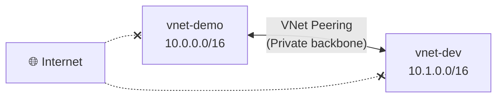
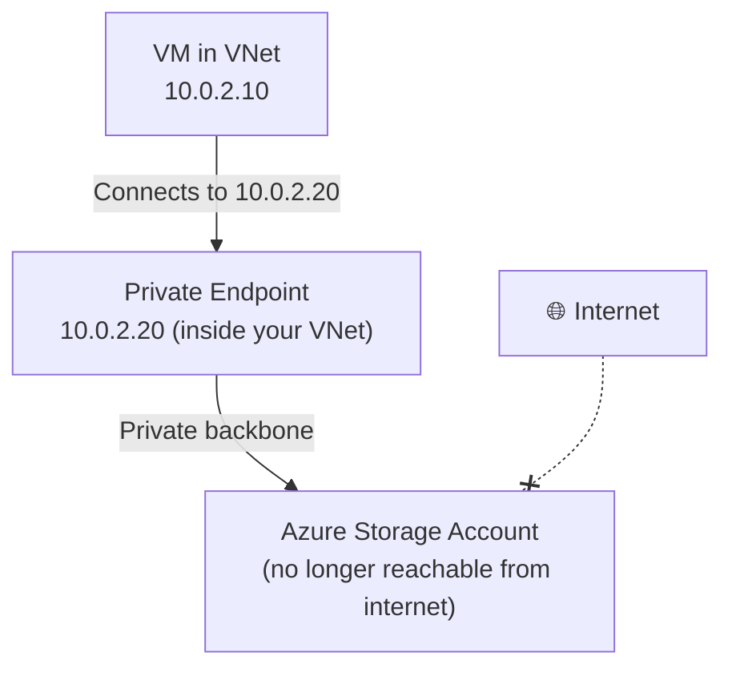
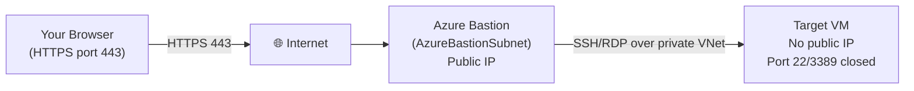

# Day 11 — VNet Advanced: Peering, Service & Private Endpoints, and Azure Bastion

**Phase 2 — Networking**

> In Day 10, you built `vnet-demo` — a working VNet with two subnets and an NSG controlling traffic. That's a complete, isolated network. But real Azure environments are rarely just one VNet, and they almost never talk to Azure services like Storage or SQL over the public internet if they can help it. And once your VMs are locked away inside private subnets, how do *you* — the administrator — actually get in to manage them? Today we answer all three of those questions: connecting separate VNets together with **VNet Peering**, reaching Azure PaaS services privately with **Service Endpoints** and **Private Endpoints**, and getting secure, browser-based access to your VMs with **Azure Bastion** — no public IP, no exposed SSH or RDP port required.

---

## What You'll Learn

- **VNet Peering** — connect two separate VNets privately, no internet, no gateway required
- Hands-on: create a second VNet and peer it with `vnet-demo`
- **Service Endpoints vs Private Endpoints** — the two ways to securely connect to Azure services from inside a VNet
- Hands-on: enable a Service Endpoint and lock a storage account down to your VNet
- Hands-on: create a Private Endpoint for a storage account (small cost — instructor demo)
- **Azure Bastion** — browser-based VM access with no public IP and no exposed SSH or RDP port (💳 Paid)

---

## Before We Begin

A mix of tiers today:

- **VNet Peering** is free within the same region. Cross-region (Global) peering has a small bandwidth charge — we're staying in one region, so this part is **✅ free**.
- **Service Endpoints** are **✅ free** — no additional charge at all.
- **Private Endpoints** cost roughly **$0.01/hour** (~$7.30/month if left running) plus a small data processing charge. We'll mark this **💳** and walk through deleting it immediately after.
- **Azure Bastion** Basic SKU runs approximately **$0.19/hr** — **💳 instructor demo**, delete immediately after.

---

## Part 1 — VNet Peering

### The Problem: Two Separate VNets

As your Azure environment grows, you'll often end up with more than one VNet. Maybe your company uses separate VNets per environment (dev, staging, prod). Maybe different teams each manage their own VNet. Maybe you have resources in two different regions.

By default, two VNets are completely isolated from each other — even if they're in the same subscription and the same region. A VM in `vnet-prod` cannot reach a VM in `vnet-dev` by default.

### VNet Peering — Private Connectivity Between VNets

**VNet Peering** lets two VNets communicate privately as if they were one network — no internet, no VPN tunnel, no gateway required. Traffic between peered VNets travels on Azure's private backbone network with low latency.

Two important points about VNet Peering:

**1. It is not transitive.** If VNet A is peered with VNet B, and VNet B is peered with VNet C, VNet A cannot reach VNet C. You need a direct peering between A and C as well.

**2. Address spaces cannot overlap.** Our `vnet-demo` uses `10.0.0.0/16`. If we want to peer it with another VNet, that VNet needs a *different* address space — say, `10.1.0.0/16`. If both used `10.0.0.0/16`, Azure wouldn't know which VNet to send the traffic to, and the peering would fail. This is exactly the kind of address-space planning we covered back in Day 9 — choosing non-overlapping CIDR blocks upfront saves you from a redesign later.

**VNet Peering is free within the same region.** Cross-region peering (Global VNet Peering) has a small bandwidth charge.

---

### Hands-On: Create a Second VNet and Peer It with `vnet-demo`

Unlike a single-VNet demo, peering needs two VNets to actually show — so let's build a second one and connect it.

**✅ Free Tier — follow along**

**Step 1 — Create the second VNet:**

1. In the Azure Portal, search for **Virtual networks** and click **+ Create**.
2. On the **Basics** tab:
   - **Resource group:** `rg-networking-demo` (same resource group as `vnet-demo`)
   - **Virtual network name:** `vnet-dev`
   - **Region:** East US (must match `vnet-demo`'s region for this demo)
3. Click **Next: IP Addresses**.
4. Change the default address space to **`10.1.0.0/16`** — different from `vnet-demo`'s `10.0.0.0/16`, satisfying the non-overlap rule.
5. Leave the default subnet as-is (Azure names it `default`, with a range like `10.1.0.0/24`).
6. Click **Review + create**, then **Create**.

**Step 2 — Create the peering:**

1. Go to `vnet-demo` in the portal.
2. Click **Peerings** in the left menu, then **+ Add**.
3. You'll configure both directions of the peering in one screen:
   - **This virtual network's peering link name:** `peer-to-vnet-dev`
   - **Remote virtual network's peering link name:** `peer-to-vnet-demo`
   - **Virtual network:** select `vnet-dev`
4. Leave the default settings checked:
   - **Allow virtual network access** (both directions) — this is the core setting that lets traffic flow
   - **Allow forwarded traffic** — leave unchecked unless you have an NVA (network virtual appliance) routing traffic between VNets; not needed for this demo
   - **Allow gateway transit / Use remote gateways** — leave unchecked; these relate to sharing a VPN Gateway across peered VNets, which we'll touch on in a future networking topic
5. Click **Add**.

Azure provisions the peering in **both directions automatically** — you only had to configure it once, from `vnet-demo`'s side.

**Step 3 — Verify the peering:**

1. Still on `vnet-demo` → **Peerings**, you should see `peer-to-vnet-dev` with **Peering status: Connected**.
2. Now go to `vnet-dev` → **Peerings**. You'll see `peer-to-vnet-demo`, also **Connected** — created automatically as part of the same operation.

**How would you actually test this?** If you deployed a VM into `vnet-dev`'s `default` subnet (`10.1.0.0/24`) and another VM into `vnet-demo`'s `private-subnet` (`10.0.2.0/24`), the two VMs could ping each other using their **private IPs** — `10.1.0.4` reaching `10.0.2.4`, for example — over Azure's private backbone, with no internet, no public IP, and no gateway involved on either side. We won't deploy extra VMs just for this (to keep costs and clutter down), but this is exactly the mechanism that lets a `vnet-prod` and `vnet-shared-services` VNet talk to each other privately in a real environment.

> **Cleanup note:** VNet Peering within the same region is free, so there's no cost pressure to remove `vnet-dev` or the peering. Feel free to keep both for future demos — or delete `vnet-dev` later if you want to tidy up; deleting a VNet automatically removes any peerings attached to it.

---

## Part 2 — Service Endpoints vs Private Endpoints

### The Problem: PaaS Traffic Goes Over the Internet by Default

When you use Azure services like Azure Storage, Azure SQL, or Azure Key Vault from inside a VM, that traffic goes out over the public internet by default — even though both the VM and the service are technically in Azure. There are two ways to fix this: **Service Endpoints** and **Private Endpoints**. They solve the same problem differently.

### Service Endpoints

A **Service Endpoint** extends your VNet's identity to an Azure service. When you enable a Service Endpoint on a subnet for, say, Azure Storage, Azure Storage knows that traffic from that subnet is coming from a trusted VNet — and you can configure the storage account to only accept connections from that specific subnet.

**How it works:** Your VM still reaches the storage account using its public endpoint URL (`mystorageaccount.blob.core.windows.net`), but the traffic travels on Azure's internal network rather than the public internet. The storage account can then use a firewall rule to allow only connections from your VNet and block everything else.

**Key characteristic:** The service still has a public IP and a public endpoint. Service Endpoints don't make the service private — they make the *connection* private and give you a network-based access control.

### Private Endpoints

A **Private Endpoint** gives an Azure service a **private IP address directly inside your VNet**. Instead of reaching the service via its public URL, your VM connects to `10.0.2.20` (or whatever private IP it's assigned) and that connection stays entirely within your VNet — never touching the internet.

**How it works:** Azure creates a network interface inside your subnet with a private IP. That NIC is mapped to the Azure service. DNS is updated (via Private DNS Zones) so that the service's public hostname resolves to the private IP when queried from inside the VNet.

**Key characteristic:** The service gets a private IP inside your VNet. You can disable the public endpoint entirely. This is the most secure option.

### Which Should You Use?

| | Service Endpoint | Private Endpoint |
|---|---|---|
| Traffic path | Azure backbone (not internet) | Azure backbone (not internet) |
| Service gets a private IP | ❌ No | ✅ Yes |
| Can disable public access | Partially (via firewall) | ✅ Fully |
| DNS changes needed | ❌ No | ✅ Yes (Private DNS Zone) |
| Cost | Free | Small charge per endpoint |
| Best for | Simple scenarios, small teams | Production, compliance, maximum security |

> **General rule:** Use Private Endpoints for any service that stores sensitive data (databases, storage with PII, Key Vault). Service Endpoints are fine for internal tooling or non-sensitive data where you want network-level control without the operational overhead.

---

### Hands-On: Lock a Storage Account Down with a Service Endpoint

For this demo, create a **brand-new storage account** rather than reusing the one from Day 7 — that one hosts your static website demo, and restricting its network access would break public access to that site.

**✅ Free Tier — follow along**

**Step 1 — Create a test storage account:**

1. Search for **Storage accounts** → **+ Create**.
2. Fill in:
   - **Resource group:** `rg-networking-demo`
   - **Storage account name:** `lwmstoragenetdemo<yourname>` *(lowercase letters and numbers only, globally unique)*
   - **Region:** East US
   - **Performance/Redundancy:** leave defaults (Standard / LRS)
3. Click **Review + create**, then **Create**.

**Step 2 — Enable the Service Endpoint on the subnet:**

1. Go to `vnet-demo` → **Subnets** → click `private-subnet`.
2. Under **Service endpoints**, click the dropdown and select **Microsoft.Storage**.
3. Click **Save**.

**Step 3 — Restrict the storage account to that subnet:**

1. Go to your new storage account → **Networking** (under **Security + networking**).
2. Under **Public network access**, choose **Enabled from selected virtual networks and IP addresses**.
3. Click **+ Add existing virtual network**.
4. Select:
   - **Virtual networks:** `vnet-demo`
   - **Subnets:** `private-subnet` (you'll see a green checkmark confirming the Service Endpoint is enabled — Azure won't let you add a subnet that doesn't have the endpoint configured)
5. Click **Add**, then **Save**.

That's it. Now this storage account only accepts connections from `private-subnet` in `vnet-demo` (plus any IP addresses you explicitly allow under the same **Networking** blade). If you open the storage account's blob URL directly from your browser at home, you'll get an authorization error — your laptop isn't inside `vnet-demo`. A VM deployed into `private-subnet`, however, would connect successfully, and that traffic would travel over Azure's backbone rather than the public internet.

> **Tip:** The **Networking** blade also has an **Exceptions** section with a checkbox for "Allow Azure services on the trusted services list to access this storage account" — this is what lets things like Azure Monitor or Azure Backup continue to function even when network access is restricted.

---

### Hands-On: Create a Private Endpoint for the Storage Account

**💳 Small cost (~$0.01/hr, ~$7.30/month if left running) — delete immediately after this demo**

Let's go one step further and give this same storage account a private IP address inside `vnet-demo`.

1. Go to your storage account → **Networking** → **Private endpoint connections** tab.
2. Click **+ Private endpoint**.
3. On **Basics**:
   - **Resource group:** `rg-networking-demo`
   - **Name:** `pe-storage-demo`
   - **Region:** East US
4. On **Resource**:
   - **Resource type:** `Microsoft.Storage/storageAccounts`
   - **Resource:** your storage account
   - **Target sub-resource:** `blob`
5. On **Virtual Network**:
   - **Virtual network:** `vnet-demo`
   - **Subnet:** `private-subnet`
6. On **DNS**:
   - Leave **Integrate with private DNS zone** set to **Yes**. Azure will automatically create (or reuse) a Private DNS Zone named `privatelink.blob.core.windows.net` and link it to `vnet-demo`.
7. Click **Review + create**, then **Create**.

Once deployed, go back to **Networking** → **Private endpoint connections**. You'll see `pe-storage-demo` listed with **Connection state: Approved** and a **private IP** from `private-subnet`'s range — something like `10.0.2.20`.

**What just happened?** A network interface with a private IP was created inside `private-subnet`, mapped directly to your storage account's blob service. Because of the Private DNS Zone integration, any VM inside `vnet-demo` that resolves `lwmstoragenetdemo<yourname>.blob.core.windows.net` will now get back the **private IP** (`10.0.2.20`) instead of the public one — meaning the connection never leaves your VNet. At this point, you could go back to the **Networking** blade and set **Public network access** to **Disabled** entirely, and the storage account would still be fully reachable from inside `vnet-demo` via the private endpoint.

**Step — Clean up the Private Endpoint:**

Since this resource carries a small ongoing charge:

1. Go to your storage account → **Networking** → **Private endpoint connections**.
2. Select `pe-storage-demo` → **Remove**.
3. Optionally, also delete the **Private DNS zone** (`privatelink.blob.core.windows.net`) that Azure created, via **Private DNS zones** in the portal search — it costs a small amount per zone per month if left behind.

---

## Part 3 — Azure Bastion

### The Problem With Public IPs on VMs

When you deploy a VM for management access, the classic approach is to give it a public IP and open port 22 (SSH) or port 3389 (RDP). This works — but it means your VM is exposed on the public internet. Bots actively scan the internet for open SSH and RDP ports, attempting brute-force logins constantly.

Even with strong passwords and key-based authentication, the fact that port 22 is open on a public IP is a real attack surface. In regulated industries, security teams often flag this as a compliance violation.

### Azure Bastion — Browser-Based VM Access

**Azure Bastion** is a fully managed PaaS service that lets you connect to VMs via a browser over HTTPS (port 443) — with **no public IP on the VM** and **no open port 22 or 3389**.

Here's how it works:

1. You deploy Azure Bastion into a dedicated subnet in your VNet called `AzureBastionSubnet` (the name is mandatory).
2. Bastion gets a public IP — but it's the *only* public-facing surface.
3. When you click **Connect → Bastion** in the Azure Portal, the portal communicates with the Bastion service, which then opens an RDP or SSH session to the VM over the private network.
4. The session runs inside your browser window — no SSH client or RDP client needed.

**Azure Bastion SKUs:**

| SKU | Cost | Features |
|---|---|---|
| **Basic** | ~$0.19/hr | SSH + RDP in browser, shareable link |
| **Standard** | ~$0.38/hr | All Basic features + file upload/download, audio support, custom ports, private-only Bastion |

For this demo, the Basic SKU is sufficient.

**Important requirements:**
- The subnet must be named `AzureBastionSubnet` exactly — capital A, capital B
- The subnet must be at least `/26` in size (Azure Bastion requires 64 addresses minimum) — recall from Day 9's CIDR table, `/26` gives you exactly 64 addresses
- You need to add `AzureBastionSubnet` to your existing VNet — not a separate VNet

---

### Hands-On: Deploy Azure Bastion and Connect to a VM

**💳 Paid — Instructor Demo (~$0.19/hr Basic SKU). Delete immediately after to minimise cost.**

**Step 1 — Add the AzureBastionSubnet to your VNet:**

1. Go to your `vnet-demo` VNet in the portal.
2. Click **Subnets** in the left menu.
3. Click **+ Subnet**.
4. Fill in:
   - **Name:** `AzureBastionSubnet` (exact spelling, exact casing — this is required)
   - **Subnet address range:** `10.0.3.0/26` (gives 64 addresses, the minimum for Bastion)
5. Click **Save**.

**Step 2 — Deploy a test VM (if you don't already have one in this VNet):**

If you followed Day 3's VM lab, you can use that VM — just make sure it's in the same region as `vnet-demo`. Otherwise, quickly deploy a small VM:

1. Search for **Virtual machines** → **+ Create** → **Azure virtual machine**.
2. Fill in:
   - **Resource group:** `rg-networking-demo`
   - **VM name:** `vm-demo-01`
   - **Region:** East US
   - **Image:** Ubuntu Server 24.04 LTS
   - **Size:** Standard_B1s
   - **Authentication:** SSH public key (or password for quick demo)
3. On the **Networking** tab:
   - **Virtual network:** `vnet-demo`
   - **Subnet:** `private-subnet`
   - **Public IP:** Create new (you can remove this later once Bastion is working)
   - **NIC network security group:** None (the VNet's subnet NSG will handle it)
4. Click **Review + create**, then **Create**.

**Step 3 — Deploy Azure Bastion:**

1. In the portal, search for **Bastions** and click **+ Create**.
2. Fill in:
   - **Resource group:** `rg-networking-demo`
   - **Name:** `bastion-demo`
   - **Region:** East US
   - **Tier:** Basic
   - **Virtual network:** `vnet-demo`
   - **Subnet:** AzureBastionSubnet (auto-selected once you pick the VNet)
   - **Public IP address:** Create new, name it `pip-bastion-demo`
3. Click **Review + create**, then **Create**.

Bastion takes about 5 minutes to provision. While it's deploying, notice that you could remove the public IP from your target VM and close ports 22 and 3389 on its NSG entirely — once Bastion is running, you no longer need them.

**Step 4 — Connect to your VM via Bastion:**

1. Go to `vm-demo-01`.
2. Click **Connect** in the left menu, then choose **Connect via Bastion**.
3. You'll see the Bastion connection panel:
   - **Authentication type:** SSH Private Key (or Password if you set one)
   - **Username:** azureuser
   - Enter your credentials
4. Click **Connect**.

A terminal window opens directly in your browser tab. You are now inside the VM — over HTTPS, through Bastion, with no public IP on the VM itself.

You can now close port 22 entirely on the NSG. The VM is accessible only through Bastion. From a security and compliance standpoint, this is significantly better than a public IP with port 22 open.

**Step 5 — Clean up Bastion after the demo:**

Bastion charges by the hour. Delete it when you're done:

1. Search for **Bastions**, find `bastion-demo`, click **Delete**.
2. Also delete the `pip-bastion-demo` public IP to avoid any idle IP charges.

---

## Summary

Let's bring it all together. Here's what you covered today:

**VNet Peering** connects two separate VNets on Azure's private backbone — no internet, no gateway, low latency. You created `vnet-dev` (`10.1.0.0/16`) and peered it with `vnet-demo` (`10.0.0.0/16`) in a single operation that configured both directions automatically. Remember: peering is non-transitive, and address spaces must not overlap — exactly the CIDR planning discipline from Day 9.

**Service Endpoints** and **Private Endpoints** are the two ways to securely reach Azure services from inside your VNet. Service Endpoints keep traffic on the Azure backbone and let you restrict a service's firewall to specific subnets — free, and you used one to lock a storage account down to `private-subnet`. Private Endpoints go further, giving the service its own private IP inside your VNet via a small additional charge — letting you disable public access entirely.

**Azure Bastion** removes the need for public IPs and open SSH/RDP ports on your VMs altogether. Browser-based access over HTTPS, through a managed Bastion host in a dedicated `AzureBastionSubnet`. More secure, compliant, and no extra software needed.

### What's Next

You now have a complete picture of core Azure networking: addressing fundamentals (Day 9), building a VNet with subnets and NSGs (Day 10), and connecting that VNet to other networks and services securely (today). Coming up next in this course: **Azure DNS** gets its own dedicated day — covering Public DNS Zones (hosting your domain's records in Azure) and Private DNS Zones (internal name resolution inside a VNet, which you got a preview of today through the private endpoint's automatic DNS integration). After that, we move on to **Load Balancer & VM Scale Sets** — taking the VNets and subnets you've built and distributing traffic across multiple VMs.

---

## Key Takeaways

- **VNet Peering** is private, low-latency connectivity between VNets — non-transitive and requires non-overlapping address spaces; free within the same region
- Creating a peering from one VNet automatically creates the matching peering on the other side
- **Service Endpoints** keep traffic on the Azure backbone and let you restrict a PaaS resource's firewall to specific subnets — free
- **Private Endpoints** give an Azure service a private IP inside your VNet and integrate with Private DNS Zones so the public hostname resolves privately — small ongoing cost, most secure option
- **Azure Bastion** requires a subnet named `AzureBastionSubnet` with at least `/26` (64 addresses, per the CIDR table from Day 9) — once deployed, VMs no longer need public IPs or open SSH/RDP ports
- Always delete Private Endpoints and Bastion (plus its public IP) when done with a demo — both charge on an ongoing basis
