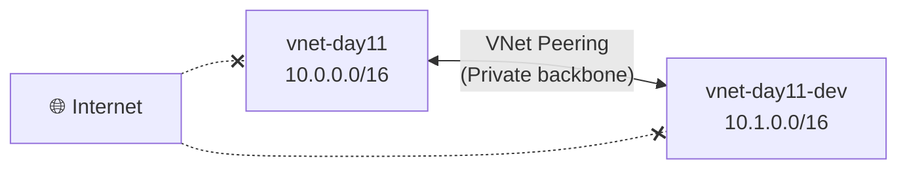
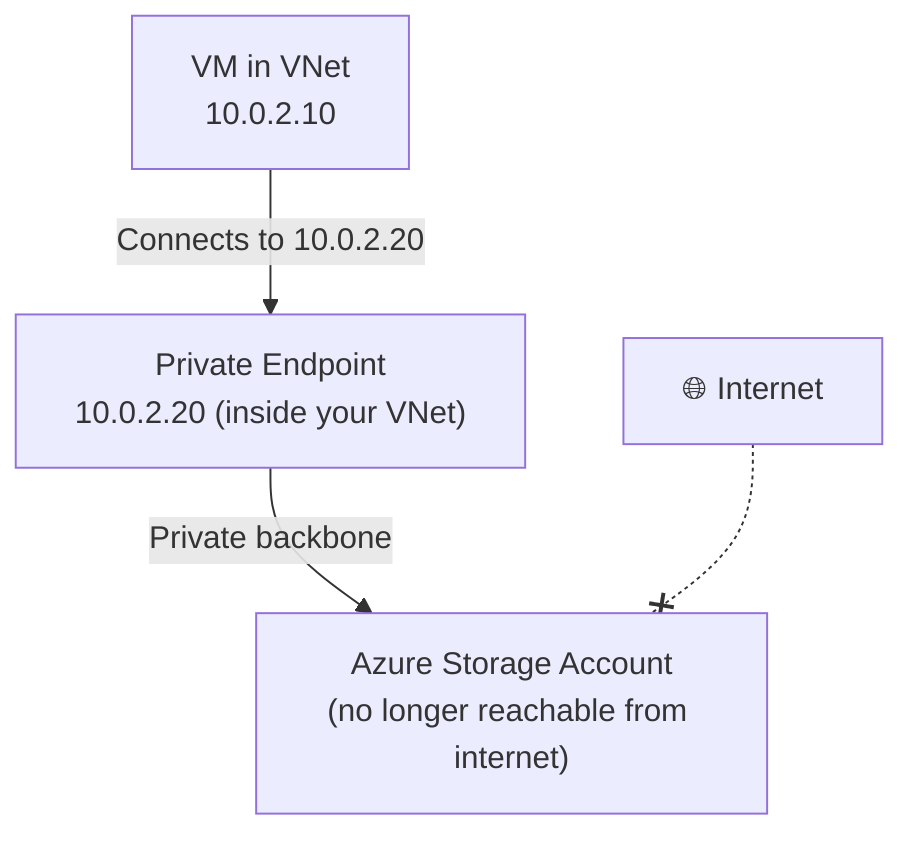
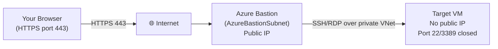
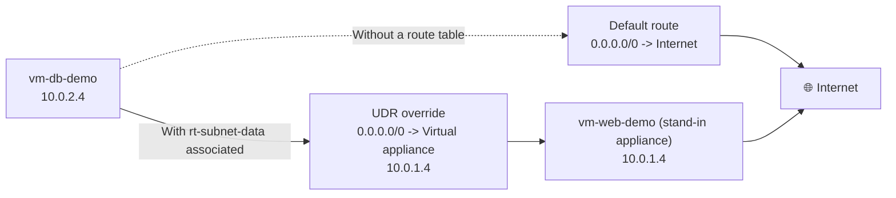

# Day 11 — VNet Advanced: Peering, Service & Private Endpoints, and Azure Bastion

**Phase 2 — Networking**

> Back in Day 10, you built a VNet with two subnets and an NSG controlling traffic — a complete, isolated network. But real Azure environments are rarely just one VNet, and they almost never talk to Azure services like Storage or SQL over the public internet if they can help it. And once your VMs are locked away inside private subnets, how do *you* — the administrator — actually get in to manage them? Today we answer all three of those questions: connecting separate VNets together with **VNet Peering**, reaching Azure PaaS services privately with **Service Endpoints** and **Private Endpoints**, and getting secure, browser-based access to your VMs with **Azure Bastion** — no public IP, no exposed SSH or RDP port required. To keep today's lab self-contained, we'll spin up a fresh VNet and a couple of test VMs from scratch rather than reaching back into Day 10's resources.

---

## What You'll Learn

- **VNet Peering** — connect two separate VNets privately, no internet, no gateway required
- Hands-on: build a new VNet with two subnets, then create a second VNet and peer the two together
- Hands-on: deploy two test VMs to use for the rest of today's demos
- **Service Endpoints vs Private Endpoints** — the two ways to securely connect to Azure services from inside a VNet
- Hands-on: enable a Service Endpoint, lock a storage account down to one subnet, and prove it from a VM inside vs. outside that subnet
- Hands-on: create a Private Endpoint for a storage account and verify the DNS resolution changes from inside a VM (small cost — instructor demo)
- **Azure Bastion** — browser-based VM access with no public IP and no exposed SSH or RDP port (💳 Paid)
- **Route Tables & User-Defined Routes (UDR)** — overriding Azure's default routing to send traffic through a firewall or network appliance instead
- Hands-on: building a custom route table and associating it with a subnet
- **Application Security Groups (ASGs)** — grouping VMs by role so NSG rules target a group, not a fragile IP address
- Hands-on: tagging today's VMs into ASGs and rewriting an NSG rule to use them

---

## Before We Begin

A mix of tiers today:

- **VNet Peering** is free within the same region. Cross-region (Global) peering has a small bandwidth charge — we're staying in one region, so this part is **✅ free**.
- **Service Endpoints** are **✅ free** — no additional charge at all.
- **Private Endpoints** cost roughly **$0.01/hour** (~$7.30/month if left running) plus a small data processing charge. We'll mark this **💳** and walk through deleting it immediately after.
- **Two test VMs** on `Standard_B1s` are **✅ free** — covered by the Free Tier's 750 B-series hours/month, as long as you stop/deallocate them when you're not actively using them.
- **Azure Bastion** Basic SKU runs approximately **$0.19/hr** — **💳 instructor demo**, delete immediately after.
- **Route Tables** are **✅ free** — no charge for the route table resource itself.
- **Application Security Groups** are **✅ free** — no additional charge at all.

---

## Part 1 — Build a Fresh VNet, Then Peer It With a Second VNet

### Setting Up Today's Playground

Everything today happens inside its own resource group so it's easy to find — and easy to clean up — when we're done.

**✅ Free Tier — follow along**

**Step 1 — Create the resource group:**

1. Search for **Resource groups** → **+ Create**.
2. **Resource group name:** `rg-day11-demo`
3. **Region:** East US
4. **Review + create** → **Create**.

**Step 2 — Create the VNet:**

1. Search for **Virtual networks** → **+ Create**.
2. On **Basics**:
   - **Resource group:** `rg-day11-demo`
   - **Virtual network name:** `vnet-day11`
   - **Region:** East US
3. Click **Next: IP Addresses**.
4. Set the address space to **`10.0.0.0/16`**.
5. Delete the default subnet and add two subnets instead — this mirrors the public/private split from Day 10, rebuilt fresh for today:
   - **subnet-app** → `10.0.1.0/24`
   - **subnet-data** → `10.0.2.0/24`
   - On each subnet's creation screen you'll see **Enable private subnet (no default outbound access)** — ticked by default. Since March 31, 2026, this is Azure's new default for every subnet in a newly created VNet: no implicit internet path out, unless you explicitly add one (a public IP on the resource, a NAT Gateway, or a Load Balancer outbound rule — the same three mechanisms from Day 10's NAT Gateway section). **Leave it ticked** — it's the secure, recommended setting, and we'll account for it as we go.
6. Click **Review + create**, then **Create**.

**Step 3 — Create an NSG and attach it to `subnet-app`:**

We'll reuse the same `Allow-HTTP` pattern you learned in Day 10's NSG section, built fresh here.

1. Search for **Network security groups** → **+ Create**.
2. **Resource group:** `rg-day11-demo`, **Name:** `nsg-subnet-app`, **Region:** East US → **Create**.
3. Open `nsg-subnet-app` → **Inbound security rules** → **+ Add**.
4. Fill in:
   - **Source:** Any
   - **Destination:** Any
   - **Service:** HTTP
   - **Action:** Allow
   - **Priority:** 100
   - **Name:** `Allow-HTTP`
5. Click **Add**.
6. Go to `nsg-subnet-app` → **Subnets** → **Associate** → **Virtual network:** `vnet-day11`, **Subnet:** `subnet-app` → **OK**.

### The Problem: Two Separate VNets

As your Azure environment grows, you'll often end up with more than one VNet. Maybe your company uses separate VNets per environment (dev, staging, prod). Maybe different teams each manage their own VNet. Maybe you have resources in two different regions.

By default, two VNets are completely isolated from each other — even if they're in the same subscription and the same region. A VM in `vnet-prod` cannot reach a VM in `vnet-dev` by default.

### VNet Peering — Private Connectivity Between VNets

**VNet Peering** lets two VNets communicate privately as if they were one network — no internet, no VPN tunnel, no gateway required. Traffic between peered VNets travels on Azure's private backbone network with low latency.



Two important points about VNet Peering:

**1. It is not transitive.** If VNet A is peered with VNet B, and VNet B is peered with VNet C, VNet A cannot reach VNet C. You need a direct peering between A and C as well.

**2. Address spaces cannot overlap.** Our `vnet-day11` uses `10.0.0.0/16`. If we want to peer it with another VNet, that VNet needs a *different* address space — say, `10.1.0.0/16`. If both used `10.0.0.0/16`, Azure wouldn't know which VNet to send the traffic to, and the peering would fail. This is exactly the kind of address-space planning we covered back in Day 9 — choosing non-overlapping CIDR blocks upfront saves you from a redesign later.

**VNet Peering is free within the same region.** Cross-region peering (Global VNet Peering) has a small bandwidth charge.

---

### Hands-On: Create a Second VNet and Peer It with `vnet-day11`

Unlike a single-VNet demo, peering needs two VNets to actually show — so let's build a second one and connect it.

**✅ Free Tier — follow along**

**Step 1 — Create the second VNet:**

1. In the Azure Portal, search for **Virtual networks** and click **+ Create**.
2. On the **Basics** tab:
   - **Resource group:** `rg-day11-demo` (same resource group as `vnet-day11`)
   - **Virtual network name:** `vnet-day11-dev`
   - **Region:** East US (must match `vnet-day11`'s region for this demo)
3. Click **Next: IP Addresses**.
4. Change the default address space to **`10.1.0.0/16`** — different from `vnet-day11`'s `10.0.0.0/16`, satisfying the non-overlap rule.
5. Leave the default subnet as-is (Azure names it `default`, with a range like `10.1.0.0/24`).
6. Click **Review + create**, then **Create**.

**Step 2 — Create the peering:**

1. Go to `vnet-day11` in the portal.
2. Click **Peerings** in the left menu, then **+ Add**.
3. You'll configure both directions of the peering in one screen:
   - **This virtual network's peering link name:** `peer-to-vnet-day11-dev`
   - **Remote virtual network's peering link name:** `peer-to-vnet-day11`
   - **Virtual network:** select `vnet-day11-dev`
4. Leave the default settings checked:
   - **Allow virtual network access** (both directions) — this is the core setting that lets traffic flow
   - **Allow forwarded traffic** — leave unchecked unless you have an NVA (network virtual appliance) routing traffic between VNets; not needed for this demo
   - **Allow gateway transit / Use remote gateways** — leave unchecked; these relate to sharing a VPN Gateway across peered VNets, which we'll touch on in a future networking topic
5. Click **Add**.

Azure provisions the peering in **both directions automatically** — you only had to configure it once, from `vnet-day11`'s side.

**Step 3 — Verify the peering:**

1. Still on `vnet-day11` → **Peerings**, you should see `peer-to-vnet-day11-dev` with **Peering status: Connected**.
2. Now go to `vnet-day11-dev` → **Peerings**. You'll see `peer-to-vnet-day11`, also **Connected** — created automatically as part of the same operation.

**How would you actually test this?** If you deployed a VM into `vnet-day11-dev`'s `default` subnet (`10.1.0.0/24`) and another VM into `vnet-day11`'s `subnet-data` (`10.0.2.0/24`), the two VMs could ping each other using their **private IPs** — `10.1.0.4` reaching `10.0.2.4`, for example — over Azure's private backbone, with no internet, no public IP, and no gateway involved on either side. We won't deploy extra VMs just for this (to keep costs and clutter down), but this is exactly the mechanism that lets a `vnet-prod` and `vnet-shared-services` VNet talk to each other privately in a real environment.

> **Cleanup note:** VNet Peering within the same region is free, so there's no cost pressure to remove `vnet-day11-dev` or the peering. Feel free to keep both for future demos — or delete `vnet-day11-dev` later if you want to tidy up; deleting a VNet automatically removes any peerings attached to it.

---

### Hands-On: Deploy Two Test VMs

We're about to lock a storage account down to a single subnet — and the best way to *prove* a network restriction is real is to actually try connecting from a VM that's allowed, and one that isn't. These two VMs will also carry us through Bastion, route tables, and ASGs later today.

**✅ Free Tier — `Standard_B1s` is covered by the Free Tier's 750 B-series hours/month**

**Step 1 — Deploy `vm-web-demo` into `subnet-app`:**

1. Search for **Virtual machines** → **+ Create** → **Azure virtual machine**.
2. Fill in:
   - **Resource group:** `rg-day11-demo`
   - **VM name:** `vm-web-demo`
   - **Region:** East US
   - **Image:** Ubuntu Server 24.04 LTS
   - **Size:** Standard_B1s
   - **Authentication:** SSH public key (or password for quick demo)
3. On the **Networking** tab:
   - **Virtual network:** `vnet-day11`
   - **Subnet:** `subnet-app`
   - **Public IP:** Create new (we'll remove it once Bastion is working later today)
   - **NIC network security group:** None (the subnet's `nsg-subnet-app` will handle it)
4. Click **Review + create**, then **Create**.

**Step 2 — Deploy `vm-db-demo` into `subnet-data`:**

1. Repeat the same steps with:
   - **VM name:** `vm-db-demo`
   - **Subnet:** `subnet-data`
   - **Public IP:** Create new — this VM represents a backend-only role and won't keep this public IP long-term, but we need it *temporarily* so we can SSH in directly and test storage connectivity before Bastion exists.
2. Click **Review + create**, then **Create**.

You now have two VMs: `vm-web-demo` (internet-facing role, in `subnet-app`) and `vm-db-demo` (backend role, in `subnet-data`) — both with a public IP for now so we can SSH straight in and test things. We'll strip the public IPs off both of them later today, once Bastion takes over as the access path.

> **Note on private subnets:** because both `subnet-app` and `subnet-data` were created with **no default outbound access** (the new default since March 31, 2026), each VM's instance-level public IP isn't just *inbound* access right now — it's also the *only* reason these VMs currently have outbound internet connectivity at all. Once we remove those public IPs later in this lab, neither VM will have an internet path unless something else provides one. Keep that in mind for the cleanup steps below — we'll call it out again when it matters.

---

## Part 2 — Service Endpoints vs Private Endpoints

### The Problem: PaaS Traffic Goes Over the Internet by Default

When you use Azure services like Azure Storage, Azure SQL, or Azure Key Vault from inside a VM, that traffic goes out over the public internet by default — even though both the VM and the service are technically in Azure. There are two ways to fix this: **Service Endpoints** and **Private Endpoints**. They solve the same problem differently.

### Service Endpoints

A **Service Endpoint** extends your VNet's identity to an Azure service. When you enable a Service Endpoint on a subnet for, say, Azure Storage, Azure Storage knows that traffic from that subnet is coming from a trusted VNet — and you can configure the storage account to only accept connections from that specific subnet.

**How it works:** Your VM still reaches the storage account using its public endpoint URL (`mystorageaccount.blob.core.windows.net`), but the traffic travels on Azure's internal network rather than the public internet. The storage account can then use a firewall rule to allow only connections from your VNet and block everything else.

**Key characteristic:** The service still has a public IP and a public endpoint. Service Endpoints don't make the service private — they make the *connection* private and give you a network-based access control.

### Private Endpoints

A **Private Endpoint** gives an Azure service a **private IP address directly inside your VNet**. Instead of reaching the service via its public URL, your VM connects to `10.0.2.20` (or whatever private IP it's assigned) and that connection stays entirely within your VNet — never touching the internet.

**How it works:** Azure creates a network interface inside your subnet with a private IP. That NIC is mapped to the Azure service. DNS is updated (via Private DNS Zones) so that the service's public hostname resolves to the private IP when queried from inside the VNet.



**Key characteristic:** The service gets a private IP inside your VNet. You can disable the public endpoint entirely. This is the most secure option.

### Which Should You Use?

| | Service Endpoint | Private Endpoint |
|---|---|---|
| Traffic path | Azure backbone (not internet) | Azure backbone (not internet) |
| Service gets a private IP | ❌ No | ✅ Yes |
| Can disable public access | Partially (via firewall) | ✅ Fully |
| DNS changes needed | ❌ No | ✅ Yes (Private DNS Zone) |
| Cost | Free | Small charge per endpoint |
| Best for | Simple scenarios, small teams | Production, compliance, maximum security |

> **General rule:** Use Private Endpoints for any service that stores sensitive data (databases, storage with PII, Key Vault). Service Endpoints are fine for internal tooling or non-sensitive data where you want network-level control without the operational overhead.

---

### Hands-On: Lock a Storage Account Down with a Service Endpoint

**✅ Free Tier — follow along**

**Step 1 — Create a test storage account:**

1. Search for **Storage accounts** → **+ Create**.
2. Fill in:
   - **Resource group:** `rg-day11-demo`
   - **Storage account name:** `lwmstoragenetdemo<yourname>` *(lowercase letters and numbers only, globally unique)*
   - **Region:** East US
   - **Performance/Redundancy:** leave defaults (Standard / LRS)
3. Click **Review + create**, then **Create**.

**Step 2 — Enable the Service Endpoint on the subnet:**

1. Go to `vnet-day11` → **Subnets** → click `subnet-data`.
2. Under **Service endpoints**, click the dropdown and select **Microsoft.Storage**.
3. Click **Save**.

**Step 3 — Restrict the storage account to that subnet:**

1. Go to your new storage account → **Networking** (under **Security + networking**).
2. Under **Public network access**, choose **Enabled from selected virtual networks and IP addresses**.
3. Click **+ Add existing virtual network**.
4. Select:
   - **Virtual networks:** `vnet-day11`
   - **Subnets:** `subnet-data` (you'll see a green checkmark confirming the Service Endpoint is enabled — Azure won't let you add a subnet that doesn't have the endpoint configured)
5. Click **Add**, then **Save**.

That's it. Now this storage account only accepts connections from `subnet-data` in `vnet-day11` (plus any IP addresses you explicitly allow under the same **Networking** blade). If you open the storage account's blob URL directly from your browser at home, you'll get an authorization error — your laptop isn't inside `vnet-day11`.

**Step 4 — Upload a test file and generate a SAS token:**

A network rule and a valid credential are two separate checks — both have to pass. To prove that, we need an actual file and an actual working SAS token, not just an unauthenticated request.

1. Go to your storage account → **Containers** (under **Data storage**) → **+ Container** → name it `demo-container` → **Create**.
2. Open `demo-container` → **Upload** → upload any small text file (e.g., create a local `hello.txt` containing "Service Endpoint demo" and upload that).
3. Click the uploaded blob → **Generate SAS**.
4. Set:
   - **Permissions:** Read
   - **Expiry:** leave the default (a few hours from now) — plenty of time for this demo
5. Click **Generate SAS token and URL**, then copy the **Blob SAS URL** at the bottom — this is a fully authenticated URL that, on its own, grants read access to that file.

**Step 5 — Prove it from the two VMs you already deployed:**

This is the part that makes the restriction real instead of theoretical. We'll hit that same SAS URL — same valid credential both times — from a VM that's allowed, then from one that isn't.

1. SSH into `vm-db-demo` using its public IP: `ssh azureuser@<vm-db-demo-public-ip>`.
2. Run:
   ```
   curl -i "<paste the Blob SAS URL>"
   ```
   Because `vm-db-demo` sits in `subnet-data` — the subnet you just added to the storage account's allow list — you get back `200 OK` and the actual contents of `hello.txt`. The SAS token is valid *and* the request comes from a trusted subnet, so it succeeds end to end.
3. Exit, then SSH into `vm-web-demo` instead: `ssh azureuser@<vm-web-demo-public-ip>`.
4. Run the exact same command with the exact same SAS URL:
   ```
   curl -i "<paste the Blob SAS URL>"
   ```
   This time you'll get back `403 This request is not authorized to perform this operation` — even though the SAS token is identical and perfectly valid. `subnet-app` was never added to the storage account's trusted subnets, so the network rule rejects the request before the SAS token is even evaluated.

Same VNet, same storage account, same valid SAS token — but only the subnet you explicitly trusted gets through. That's the key lesson: a Service Endpoint firewall rule isn't bypassable just by having working credentials; the network check and the auth check are independent, and both must pass.

> **Tip:** The **Networking** blade also has an **Exceptions** section with a checkbox for "Allow Azure services on the trusted services list to access this storage account" — this is what lets things like Azure Monitor or Azure Backup continue to function even when network access is restricted.

---

### Hands-On: Create a Private Endpoint for the Storage Account

**💳 Small cost (~$0.01/hr, ~$7.30/month if left running) — delete immediately after this demo**

Let's go one step further and give this same storage account a private IP address inside `vnet-day11`.

1. Go to your storage account → **Networking** → **Private endpoint connections** tab.
2. Click **+ Private endpoint**.
3. On **Basics**:
   - **Resource group:** `rg-day11-demo`
   - **Name:** `pe-storage-demo`
   - **Region:** East US
4. On **Resource**:
   - **Resource type:** `Microsoft.Storage/storageAccounts`
   - **Resource:** your storage account
   - **Target sub-resource:** `blob`
5. On **Virtual Network**:
   - **Virtual network:** `vnet-day11`
   - **Subnet:** `subnet-data`
6. On **DNS**:
   - Leave **Integrate with private DNS zone** set to **Yes**. Azure will automatically create (or reuse) a Private DNS Zone named `privatelink.blob.core.windows.net` and link it to `vnet-day11`.
7. Click **Review + create**, then **Create**.

Once deployed, go back to **Networking** → **Private endpoint connections**. You'll see `pe-storage-demo` listed with **Connection state: Approved** and a **private IP** from `subnet-data`'s range — something like `10.0.2.20`.

**What just happened?** A network interface with a private IP was created inside `subnet-data`, mapped directly to your storage account's blob service. Because of the Private DNS Zone integration, any VM inside `vnet-day11` that resolves `lwmstoragenetdemo<yourname>.blob.core.windows.net` will now get back the **private IP** (`10.0.2.20`) instead of the public one — meaning the connection never leaves your VNet.

**Step — Verify the DNS resolution from inside `vm-db-demo`:**

1. SSH into `vm-db-demo` again: `ssh azureuser@<vm-db-demo-public-ip>`.
2. Run:
   ```
   getent hosts lwmstoragenetdemo<yourname>.blob.core.windows.net
   ```
3. The hostname now resolves to a private IP in `subnet-data`'s range — something like `10.0.2.20` — instead of a public Azure Storage IP. The URL itself didn't change; only where it points changed, transparently, because of the Private DNS Zone link Azure created for you.

At this point, you could go back to the **Networking** blade and set **Public network access** to **Disabled** entirely, and the storage account would still be fully reachable from inside `vnet-day11` via the private endpoint — `vm-db-demo` would never notice the difference.

**Step — Clean up the Private Endpoint:**

Since this resource carries a small ongoing charge:

1. Go to your storage account → **Networking** → **Private endpoint connections**.
2. Select `pe-storage-demo` → **Remove**.
3. Optionally, also delete the **Private DNS zone** (`privatelink.blob.core.windows.net`) that Azure created, via **Private DNS zones** in the portal search — it costs a small amount per zone per month if left behind.

**Step — Remove `vm-db-demo`'s temporary public IP:**

We only gave `vm-db-demo` a public IP so we could SSH straight in and run these tests before Bastion existed. Now that we've proven both connections work, take it back off — `vm-db-demo` is a backend-only VM and shouldn't have internet-facing access at all.

1. Go to `vm-db-demo` → **Networking** → click its network interface → **IP configurations** → select **ipconfig1**.
2. Under **Public IP address**, choose **Disassociate** → **Save**.
3. Search for **Public IP addresses**, find the now-unattached IP that was on `vm-db-demo`, and delete it.

Because `subnet-data` was created with **no default outbound access**, this isn't just closing off inbound access — `vm-db-demo` now has no outbound internet path at all. That's fine here: its only job is talking to the storage account, and it does that over the **Private Endpoint** we just deployed (a private IP inside `subnet-data`, never touching the internet) rather than over a Service Endpoint route. If a real backend VM still needed genuine internet egress — to pull OS updates, for example — you'd attach a **NAT Gateway** to `subnet-data`, exactly as you did for `private-subnet` in Day 10.

---

## Part 3 — Azure Bastion

We'll reuse `vm-web-demo`, the VM you deployed back in Part 1, for this demo — it currently has a public IP, which is exactly the problem Bastion solves.

### The Problem With Public IPs on VMs

When you deploy a VM for management access, the classic approach is to give it a public IP and open port 22 (SSH) or port 3389 (RDP). This works — but it means your VM is exposed on the public internet. Bots actively scan the internet for open SSH and RDP ports, attempting brute-force logins constantly.

Even with strong passwords and key-based authentication, the fact that port 22 is open on a public IP is a real attack surface. In regulated industries, security teams often flag this as a compliance violation.

### Azure Bastion — Browser-Based VM Access

**Azure Bastion** is a fully managed PaaS service that lets you connect to VMs via a browser over HTTPS (port 443) — with **no public IP on the VM** and **no open port 22 or 3389**.

Here's how it works:

1. You deploy Azure Bastion into a dedicated subnet in your VNet called `AzureBastionSubnet` (the name is mandatory).
2. Bastion gets a public IP — but it's the *only* public-facing surface.
3. When you click **Connect → Bastion** in the Azure Portal, the portal communicates with the Bastion service, which then opens an RDP or SSH session to the VM over the private network.
4. The session runs inside your browser window — no SSH client or RDP client needed.



**Azure Bastion SKUs:**

| SKU | Cost | Features |
|---|---|---|
| **Basic** | ~$0.19/hr | SSH + RDP in browser, shareable link |
| **Standard** | ~$0.38/hr | All Basic features + file upload/download, audio support, custom ports, private-only Bastion |

For this demo, the Basic SKU is sufficient.

**Important requirements:**
- The subnet must be named `AzureBastionSubnet` exactly — capital A, capital B
- The subnet must be at least `/26` in size (Azure Bastion requires 64 addresses minimum) — recall from Day 9's CIDR table, `/26` gives you exactly 64 addresses
- You need to add `AzureBastionSubnet` to your existing VNet — not a separate VNet

---

### Hands-On: Deploy Azure Bastion and Connect to a VM

**💳 Paid — Instructor Demo (~$0.19/hr Basic SKU). Delete immediately after to minimise cost.**

**Step 1 — Add the AzureBastionSubnet to your VNet:**

1. Go to your `vnet-day11` VNet in the portal.
2. Click **Subnets** in the left menu.
3. Click **+ Subnet**.
4. Fill in:
   - **Name:** `AzureBastionSubnet` (exact spelling, exact casing — this is required)
   - **Subnet address range:** `10.0.3.0/26` (gives 64 addresses, the minimum for Bastion)
5. Click **Save**.

**Step 2 — Deploy Azure Bastion:**

1. In the portal, search for **Bastions** and click **+ Create**.
2. Fill in:
   - **Resource group:** `rg-day11-demo`
   - **Name:** `bastion-demo`
   - **Region:** East US
   - **Tier:** Basic
   - **Virtual network:** `vnet-day11`
   - **Subnet:** AzureBastionSubnet (auto-selected once you pick the VNet)
   - **Public IP address:** Create new, name it `pip-bastion-demo`
3. Click **Review + create**, then **Create**.

Bastion takes about 5 minutes to provision. While it's deploying, notice that you could remove the public IP from `vm-web-demo` and close ports 22 and 3389 on its NSG entirely — once Bastion is running, you no longer need them.

**Step 3 — Connect to your VM via Bastion:**

1. Go to `vm-web-demo`.
2. Click **Connect** in the left menu, then choose **Connect via Bastion**.
3. You'll see the Bastion connection panel:
   - **Authentication type:** SSH Private Key (or Password if you set one)
   - **Username:** azureuser
   - Enter your credentials
4. Click **Connect**.

A terminal window opens directly in your browser tab. You are now inside the VM — over HTTPS, through Bastion, with no public IP on the VM itself.

You can now remove the public IP from `vm-web-demo` and close port 22 entirely on `nsg-subnet-app`. The VM is accessible only through Bastion. From a security and compliance standpoint, this is significantly better than a public IP with port 22 open.

Remember, since `subnet-app` was also created with **no default outbound access**, removing this public IP doesn't just close off inbound SSH — it removes `vm-web-demo`'s outbound internet path too, the same as we saw with `vm-db-demo` earlier. Bastion only adds an *inbound* management path; it doesn't restore outbound internet access. That's the correct end state for this lab (the VM doesn't need to reach the internet for anything we've done today), but if you needed it to — say, for OS patching — you'd attach a NAT Gateway to `subnet-app`, just like Day 10.

**Step 4 — Clean up Bastion after the demo:**

Bastion charges by the hour. Delete it when you're done:

1. Search for **Bastions**, find `bastion-demo`, click **Delete**.
2. Also delete the `pip-bastion-demo` public IP to avoid any idle IP charges.

---

## Part 4 — Route Tables & User-Defined Routes (UDR)

### Azure's Hidden Default Routes

Every subnet you create already has routing happening behind the scenes, even though you've never configured a single route. Azure automatically populates each subnet with a set of **system routes**:

| Destination | Next Hop | What It Does |
|---|---|---|
| Traffic to another address inside the same VNet | **Local VNet** | Delivers it directly — this is why your `subnet-app` and `subnet-data` VMs can already reach each other |
| Traffic to a peered VNet's address space | **VNet Peering** | Routes it across the peering connection — this is what made Part 1's peering work without you configuring any routes yourself |
| Everything else (`0.0.0.0/0`) | **Internet** | Sends it out to the public internet |

These system routes are invisible — you never see them in a "Route Tables" blade unless you go looking — but they're exactly what's been making your VMs reachable (or not) this entire course.

### When the Default Isn't Good Enough

Sometimes you need traffic to take a different path than Azure's default. The classic example: you've deployed a firewall or network virtual appliance (NVA) into your VNet, and you want **all** outbound traffic from a subnet to pass through that appliance for inspection first, instead of going straight to the internet. Azure has no way of knowing you want this unless you tell it explicitly.

A **Route Table** is a resource you create and populate with your own routes — **User-Defined Routes (UDR)** — then associate with one or more subnets. Once associated, your custom routes take priority over Azure's system routes for any destination they cover.

Each route has:

| Property | What it does |
|---|---|
| **Address prefix** | The destination CIDR block this route applies to (e.g. `0.0.0.0/0` for "everything") |
| **Next hop type** | Where to actually send matching traffic |

**Next hop types you can choose:**

| Next Hop Type | What It Means |
|---|---|
| **Virtual appliance** | Send traffic to a specific private IP — typically a firewall/NVA VM |
| **Virtual network gateway** | Send traffic to a VPN or ExpressRoute gateway |
| **Virtual network** | Force traffic to stay within the VNet's routing, even for ranges that might otherwise go elsewhere |
| **Internet** | Send straight to the internet (the default for `0.0.0.0/0` unless you override it) |
| **None** | Drop the traffic entirely — a deliberate black hole, useful for blocking a specific range |



### Hands-On: Build a Route Table and Override the Default Path

**✅ Free Tier — the route table resource itself is free; we're not deploying a real firewall appliance, just demonstrating the override mechanism**

**Step 1 — Create the route table:**

1. Search for **Route tables** → **+ Create**.
2. Fill in:
   - **Resource group:** `rg-day11-demo`
   - **Region:** East US
   - **Name:** `rt-subnet-data`
   - **Propagate gateway routes:** No (leave default)
3. **Review + create** → **Create**.

**Step 2 — Add a custom route:**

1. Go to `rt-subnet-data` → **Routes** → **+ Add**.
2. Fill in:
   - **Route name:** `force-via-appliance`
   - **Destination type:** IP Addresses
   - **Destination IP addresses/CIDR ranges:** `0.0.0.0/0` (every destination)
   - **Next hop type:** Virtual appliance
   - **Next hop address:** `10.0.1.4` (use the private IP of `vm-web-demo` as a stand-in "appliance" — purely to demonstrate the mechanic; it isn't actually configured to forward traffic)
3. Click **Add**.

**Step 3 — Associate the route table with `subnet-data`:**

1. Go to `rt-subnet-data` → **Subnets** → **Associate**.
2. **Virtual network:** `vnet-day11`, **Subnet:** `subnet-data`.
3. Click **OK**.

From this point on, any resource in `subnet-data` that tries to reach the internet has its traffic directed toward `10.0.1.4` first, instead of going straight out — exactly what you'd want if `10.0.1.4` were a real firewall VM with IP forwarding enabled and routing software installed. We haven't configured `vm-web-demo` to actually forward anything, so outbound internet access from `subnet-data` would now silently fail — which is precisely the point: **UDR changes the path traffic takes, it doesn't make sure something is listening at the other end.** That's on you to configure if you build this for real.

**Step 4 — Clean up the override:**

Since this UDR has no real appliance behind it, remove the association so it doesn't interfere with later demos:

1. Go to `rt-subnet-data` → **Subnets** → select `subnet-data` → **Remove**.
2. Optionally delete `rt-subnet-data` entirely if you're not continuing to experiment with it.

> **Exam tip:** A Route Table with a `0.0.0.0/0` route pointing at a virtual appliance is the standard building block behind "force tunneling" — sending all subnet egress through a firewall, proxy, or NVA for inspection and logging.

---

## Part 5 — Application Security Groups (ASGs)

### The Problem With IP-Based NSG Rules

Look back at the `Allow-HTTP` rule you created earlier today on `nsg-subnet-app` — its **Destination** is `Any`. That means *any* resource you ever drop into `subnet-app` automatically receives inbound HTTP traffic, whether you intended that or not. You could narrow the destination to a specific private IP, but IPs change — rebuild a VM, and it can come back with a different address, silently breaking your rule.

An **Application Security Group (ASG)** solves this by letting you group VMs by **role** — `web`, `database`, `app-tier` — and write NSG rules against the *group*, not against an IP address or a subnet. Add a VM to the group, and it inherits every rule that references that group; remove it, and those rules no longer apply. The VM's actual IP is irrelevant.

> **Important:** an ASG is not a firewall by itself — it does nothing on its own. It's a label that an NSG rule can reference as a **source** or **destination**, exactly like you'd otherwise type in a CIDR block. All VMs referenced together in one NSG rule (e.g., as both source and destination ASGs) must belong to the same VNet.

### Hands-On: Group Your VMs and Rewrite the NSG Rule

**✅ Free Tier**

This picks up the two VMs you built in Part 3 today: `vm-web-demo` and `vm-db-demo`. If you stopped/deallocated them, start them back up (or just reattach the ASGs — that works on a stopped VM's NIC too).

**Step 1 — Create two ASGs:**

1. Search for **Application security groups** → **+ Create**.
2. Fill in:
   - **Resource group:** `rg-day11-demo`
   - **Name:** `asg-web`
   - **Region:** East US
3. **Review + create** → **Create**.
4. Repeat with **Name:** `asg-db` — same resource group and region.

`asg-web` represents anything internet-facing; `asg-db` represents anything backend-only — mirroring the `subnet-app` / `subnet-data` split we built in Part 1.

**Step 2 — Add your VMs to the right ASG:**

1. Go to `vm-web-demo` → **Networking** → select its network interface → **Application security groups** → **Add application security groups** → select `asg-web` → **Save**.
2. Go to `vm-db-demo` → its NIC → **Application security groups** → add `asg-db`.

Both VMs are now tagged by role, independent of which subnet or IP they happen to have.

**Step 3 — Rewrite `Allow-HTTP` to target `asg-web` instead of `Any`:**

1. Go to `nsg-subnet-app` → **Inbound security rules** → open `Allow-HTTP`.
2. Change **Destination** from `Any` to **Application security group**, then select `asg-web`.
3. **Save**.

The rule now reads "allow inbound HTTP **only to VMs tagged `asg-web`**" — if you deploy a second VM into `subnet-app` tomorrow and forget to tag it, it simply won't receive HTTP traffic, even though it's in the right subnet. That's the safety net ASGs give you over plain subnet-based rules.

**Step 4 — (Optional) Write a role-to-role rule:**

A common real-world pattern: "only my web tier may talk to my database tier, on the database port." Try adding this rule to a new NSG attached to `subnet-data`:

- **Source:** Application security group → `asg-web`
- **Destination:** Application security group → `asg-db`
- **Service:** custom, port 1433 (SQL) or 3306 (MySQL) — whatever your backend uses
- **Action:** Allow
- **Priority:** 100

This single rule enforces "web talks to database, nothing else does" — and it keeps working even as VMs in either group are added, removed, or rebuilt with new IPs.

### Step 5 — Clean Up

**✅ Free Tier — but stop/deallocate or delete VMs you're done with to conserve your free-tier hours**

1. Select both VMs in **Virtual machines**.
2. Click **Stop** to deallocate them (keeps the disks for later, stops compute billing) — or **Delete** if you're fully done with these demos and don't need them anymore.
3. If you delete the VMs, also check **Disks**, **Network interfaces**, and **Public IP addresses** in `rg-day11-demo` for any orphaned resources left behind, and delete those too.
4. ASGs themselves cost nothing to leave behind, but if you deleted the VMs, the now-empty `asg-web` and `asg-db` aren't doing anything useful — delete them too if you're tidying up, or keep them for a future demo.
5. If you're fully done with today's lab, you can delete the whole `rg-day11-demo` resource group in one step to remove everything at once — VNets, VMs, storage account, NSGs, and ASGs included.

---

## Summary

Let's bring it all together. Here's what you covered today:

**VNet Peering** connects two separate VNets on Azure's private backbone — no internet, no gateway, low latency. You built `vnet-day11` (`10.0.0.0/16`) and `vnet-day11-dev` (`10.1.0.0/16`) and peered them in a single operation that configured both directions automatically. Remember: peering is non-transitive, and address spaces must not overlap — exactly the CIDR planning discipline from Day 9.

**Service Endpoints** and **Private Endpoints** are the two ways to securely reach Azure services from inside your VNet. Service Endpoints keep traffic on the Azure backbone and let you restrict a service's firewall to specific subnets — free, and you used one to lock a storage account down to `subnet-data`. Private Endpoints go further, giving the service its own private IP inside your VNet via a small additional charge — letting you disable public access entirely.

**Azure Bastion** removes the need for public IPs and open SSH/RDP ports on your VMs altogether. Browser-based access over HTTPS, through a managed Bastion host in a dedicated `AzureBastionSubnet`. More secure, compliant, and no extra software needed.

**Route Tables and User-Defined Routes (UDR)** let you override Azure's invisible default routing — you built `rt-subnet-data` with a `0.0.0.0/0` route pointing at a virtual appliance, associated it with `subnet-data`, and saw that UDR only changes the *path* traffic takes, not whether anything is configured to handle it at the other end.

Finally, you used **Application Security Groups** to tag today's VMs by role (`asg-web`, `asg-db`) and rewrote an NSG rule to target the group instead of `Any` or a raw IP — a safer, more maintainable way to write firewall rules that survives VMs being added, removed, or rebuilt.

### What's Next

You now have a complete picture of core Azure networking: addressing fundamentals (Day 9), building a VNet with subnets and NSGs (Day 10), and connecting that VNet to other networks and services securely while controlling routing and tagging VMs by role (today). Coming up next in this course: **Azure DNS** gets its own dedicated day — covering Public DNS Zones (hosting your domain's records in Azure) and Private DNS Zones (internal name resolution inside a VNet, which you got a preview of today through the private endpoint's automatic DNS integration). After that, we move on to **Load Balancer & VM Scale Sets** — taking the VNets and subnets you've built and distributing traffic across multiple VMs.

---

## Key Takeaways

- **VNet Peering** is private, low-latency connectivity between VNets — non-transitive and requires non-overlapping address spaces; free within the same region
- Creating a peering from one VNet automatically creates the matching peering on the other side
- **Service Endpoints** keep traffic on the Azure backbone and let you restrict a PaaS resource's firewall to specific subnets — free
- **Private Endpoints** give an Azure service a private IP inside your VNet and integrate with Private DNS Zones so the public hostname resolves privately — small ongoing cost, most secure option
- **Azure Bastion** requires a subnet named `AzureBastionSubnet` with at least `/26` (64 addresses, per the CIDR table from Day 9) — once deployed, VMs no longer need public IPs or open SSH/RDP ports
- Since March 31, 2026, new VNet subnets default to **private (no default outbound access)** — removing a VM's public IP now removes its outbound internet path too, not just inbound exposure. If a VM still needs to reach the internet, attach a **NAT Gateway** (Day 10) instead of relying on a public IP
- Always delete Private Endpoints and Bastion (plus its public IP) when done with a demo — both charge on an ongoing basis
- Every subnet has invisible **system routes** by default (local VNet, peering, internet) — a **Route Table** with **User-Defined Routes (UDR)** lets you override them, e.g. forcing all egress through a firewall/NVA via a `0.0.0.0/0` route with next hop type "Virtual appliance"
- A UDR only changes the path traffic takes — it's on you to make sure something is actually configured to handle traffic at the next hop
- **Application Security Groups (ASGs)** group VMs by role so NSG rules can target "all web VMs" or "all database VMs" instead of a specific IP or subnet — rules keep working as VMs are added, removed, or rebuilt
- An ASG does nothing by itself — it's only a label an NSG rule can reference as a source or destination; all ASGs referenced in one rule must be in the same VNet
