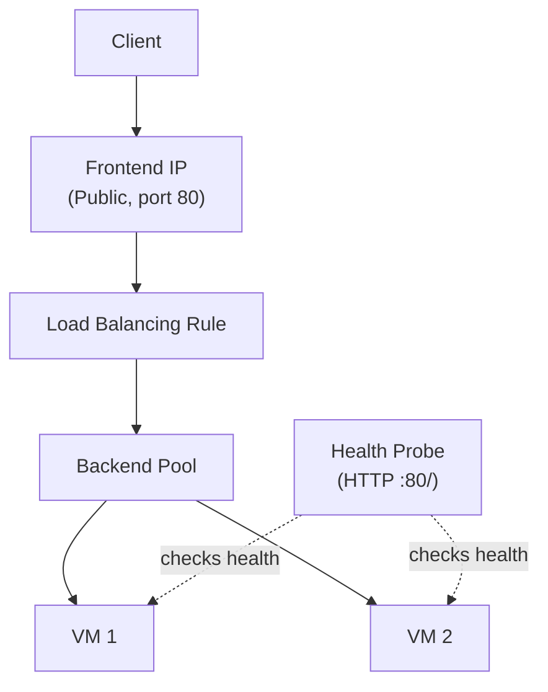
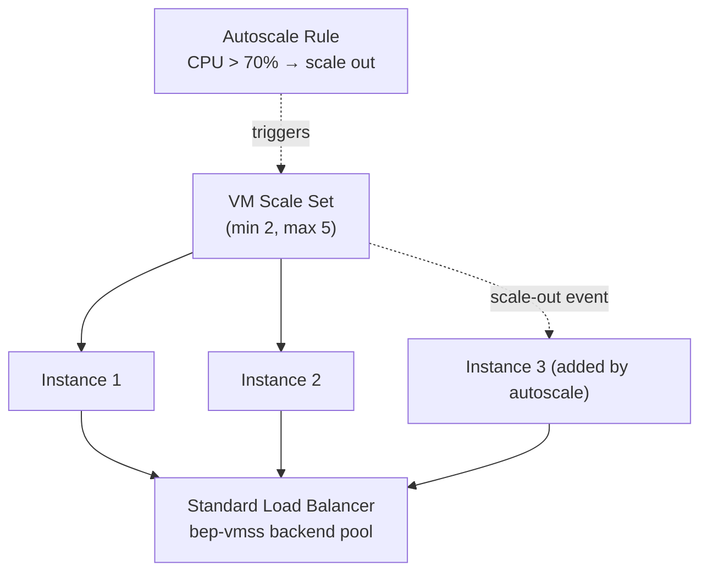

# Day 12 — Azure Load Balancer & VM Scale Sets: Distributing Traffic at Scale

**Phase 3 — Networking**

> Every VM you've deployed so far in this course has been a single box. It has one public IP, it does one job, and if it goes down — or simply gets overwhelmed by traffic — your application goes down with it. That's fine for a lab. It's not fine for anything real. Today we fix both halves of that problem: **Azure Load Balancer**, which spreads incoming traffic across multiple VMs so no single machine is a bottleneck or a single point of failure, and **VM Scale Sets (VMSS)**, which let Azure automatically add and remove VMs based on actual demand instead of you guessing capacity up front. Put together, this is the standard pattern behind almost every scalable compute workload in Azure — and it's a heavily tested area on both the **AZ-104 (Administrator)** and **AZ-305 (Solutions Architect)** exams, so we'll call out exam-relevant details as we go. As with Day 11, today's lab builds its own VNet and resources from scratch so it's fully self-contained.

---

## What You'll Learn

- **Azure Load Balancer** — Layer 4 (TCP/UDP) traffic distribution: frontend IPs, backend pools, health probes, load balancing rules, and inbound NAT rules
- Hands-on: build a resource group and VNet, deploy two plain VMs by hand, and wire up a Standard Load Balancer in front of them so you understand every moving part before automation takes over
- Public vs Internal Load Balancers, and SKU differences (Basic vs Standard — and why Basic no longer exists as an option)
- **VM Scale Sets (VMSS)** — managing a fleet of identical VMs as a single resource, Uniform vs Flexible orchestration modes
- Hands-on: build a VMSS with an integrated Standard Load Balancer, install a web server fleet-wide with a custom script extension, and prove traffic is actually being distributed
- **Autoscale** — scale-out and scale-in rules driven by real metrics, and watching a scale event happen live
- How exam questions frame Load Balancer vs Application Gateway, and the decision points the AZ-104/AZ-305 exams like to test

---

## Before We Begin

A mostly-paid lab today — both Load Balancer (Standard SKU) and VM Scale Set instances carry a cost. We'll delete everything at the end.

- **Standard Load Balancer**: ~$0.025/hour for the load balancer resource itself, plus ~$0.005/hour per load balancing rule and a small per-GB data processing charge. **💳 Paid**, but only a few cents for a short lab session.
- **VM Scale Set instances** on `Standard_B1s`: same billing as any VM. The Free Tier's 750 B-series hours/month can cover a couple of instances for a short demo, but running several VMSS instances simultaneously alongside other VMs you may have left running elsewhere can exceed that allowance fast — budget for **💳 small paid usage** today.
- **Public IP addresses**: a Standard SKU public IP costs a small hourly amount once it's no longer attached to a running resource — we'll clean these up at the end.
- Everything else (the VNet, subnets, NSGs, autoscale rules themselves) is **✅ free**.

> **A note on Basic Load Balancer:** if you've seen older tutorials mention a free "Basic" SKU, it no longer exists as a deployment option — Microsoft retired Basic Load Balancer on **September 30, 2025**. Every Load Balancer you create today, and from now on, is **Standard SKU**. This matters for the exam: Standard SKU is secure by default (closed unless you explicitly allow traffic via an NSG) and requires VMs in its backend pool to have Standard SKU public IPs or no public IP at all — mixing Basic and Standard resources together simply isn't possible anymore.

---

## Part 1 — Why You Need a Load Balancer

### The Problem: One VM Is a Single Point of Failure

Imagine you've built a web app on a single VM. Two things will eventually go wrong:

1. **Traffic outgrows the VM.** One `Standard_B1s` VM can only serve so many concurrent requests before response times degrade or the VM falls over entirely.
2. **The VM fails.** Hardware issues, OS crashes, a bad deployment — when there's only one VM, any failure is a full outage.

The fix for both is the same: **run more than one VM**, and put something in front of them that spreads traffic across all of them and stops sending traffic to any VM that's unhealthy. That "something" is **Azure Load Balancer**.

### Azure Load Balancer — Layer 4 Traffic Distribution

Azure Load Balancer operates at **Layer 4** of the OSI model — it works with TCP and UDP, routing based on IP addresses and ports. It has no awareness of HTTP, cookies, URL paths, or anything above the transport layer. (That's the job of **Application Gateway**, which we'll cover in a future day — Layer 4 vs Layer 7 is exactly the line between the two services, and a favorite distinction on the exams.)

**How traffic gets distributed:** Azure Load Balancer uses a **5-tuple hash** to decide which backend VM gets a given connection:

```
(Source IP, Source Port, Destination IP, Destination Port, Protocol)
```

Because the hash is calculated per-connection, the same client will usually land on the same backend VM for the duration of one TCP connection, but a new connection (even from the same client) can land on a different VM. There's no central "traffic cop" making smart decisions — it's a deterministic hash, which is why Load Balancer can operate at such high throughput with very low latency.

### The Building Blocks

Every Azure Load Balancer is made of four pieces:

| Component | What it does |
|---|---|
| **Frontend IP configuration** | The IP address clients connect to — public (internet-facing) or private (internal to a VNet) |
| **Backend pool** | The group of VMs (or VMSS instances) that receive distributed traffic |
| **Health probe** | A periodic check (TCP or HTTP/HTTPS) against each backend VM; any VM that fails the probe is automatically pulled out of rotation until it passes again |
| **Load balancing rule** | Ties it together — "traffic arriving on frontend port X, protocol Y, gets sent to backend port Z, using health probe P" |

There's a fifth, optional piece:

| Component | What it does |
|---|---|
| **Inbound NAT rule** | Forwards a specific frontend port to a specific *individual* backend VM — used for direct management access (e.g., SSH to VM #2 specifically), bypassing the load-balanced pool entirely |



### Public vs Internal Load Balancer

- A **Public Load Balancer** has a public frontend IP — it's how internet traffic reaches your backend VMs. This is what we're building today.
- An **Internal Load Balancer (ILB)** has a private frontend IP from inside your VNet — used to distribute traffic *between tiers*, e.g. a web tier load-balancing requests to an internal app tier, with no public exposure at all.

> **Exam tip:** if a scenario describes load-balancing traffic that should never touch the public internet — e.g., between an app tier and a database tier inside the same VNet — that's an Internal Load Balancer, not a Public one. Same component, different frontend IP type.

### Session Persistence

By default, Load Balancer has **no session persistence (None)** — each new connection can land anywhere, based on the 5-tuple hash. You can also configure **Client IP** affinity (also called source IP affinity), which forces all connections from the same client IP to the same backend VM. This matters for applications that store session state locally on each VM instead of in a shared store like Redis — without persistence, a stateful app could send a user's second request to a different VM that knows nothing about their session.

---

### Hands-On: Build the Lab Network and Two Plain VMs

**✅ Free Tier — networking and the VMs themselves are within free-tier limits**

Before we let VM Scale Sets automate everything, let's build a Load Balancer by hand in front of two ordinary VMs — this is the only way to actually see every component (frontend IP, backend pool, health probe, rule) as a distinct, individually-configured piece, the way the exam expects you to understand them.

**Step 1 — Create the resource group and VNet:**

1. Search for **Resource groups** → **+ Create** → name it `rg-day12-demo`, region **East US** → **Create**.
2. Search for **Virtual networks** → **+ Create**.
   - **Resource group:** `rg-day12-demo`
   - **Name:** `vnet-day12`
   - **Region:** East US
3. **Next: IP Addresses** → set the address space to `10.0.0.0/16`, replace the default subnet with **subnet-app** → `10.0.1.0/24`.
4. **Review + create** → **Create**.

**Step 2 — Create an NSG allowing HTTP and SSH, attach it to `subnet-app`:**

1. Search for **Network security groups** → **+ Create** → **Resource group:** `rg-day12-demo`, **Name:** `nsg-day12`, region East US → **Create**.
2. Open `nsg-day12` → **Inbound security rules** → **+ Add** → **Service:** HTTP, **Priority:** 100, **Name:** `Allow-HTTP` → **Add**.
3. Add a second rule: **Service:** SSH, **Priority:** 110, **Name:** `Allow-SSH` → **Add**.
4. Go to **Subnets** → **Associate** → **Virtual network:** `vnet-day12`, **Subnet:** `subnet-app` → **OK**.

**Step 3 — Deploy two plain VMs (no public IP — they'll only be reachable through the Load Balancer):**

1. Search for **Virtual machines** → **+ Create** → **Azure virtual machine**.
   - **Resource group:** `rg-day12-demo`
   - **VM name:** `vm-web-1`
   - **Region:** East US
   - **Image:** Ubuntu Server 24.04 LTS
   - **Size:** Standard_B1s
   - **Authentication:** SSH public key (or password)
2. On **Networking**: **Virtual network:** `vnet-day12`, **Subnet:** `subnet-app`, **Public IP:** **None** (these VMs will only be reachable through the Load Balancer we're about to build), **NIC network security group:** None.
3. On **Advanced**, scroll to **Custom data** and paste this cloud-init script so the VM is web-serving the moment it boots:
   ```yaml
   #cloud-config
   package_update: true
   packages:
     - nginx
   runcmd:
     - echo "Hello from $(hostname)" > /var/www/html/index.html
   ```
4. **Review + create** → **Create**.
5. Repeat for a second VM named `vm-web-2` — same settings, same custom data (its `$(hostname)` will print `vm-web-2` instead, so you can tell them apart later).

**Step 4 — Build the Standard Load Balancer:**

1. Search for **Load balancers** → **+ Create**.
   - **Resource group:** `rg-day12-demo`
   - **Name:** `lb-day12`
   - **Region:** East US
   - **SKU:** Standard
   - **Type:** Public
2. On **Frontend IP configuration** → **+ Add a frontend IP**:
   - **Name:** `fe-day12`
   - **Public IP address:** Create new → name `pip-lb-day12`, SKU Standard
3. On **Backend pools** → **+ Add a backend pool**:
   - **Name:** `bep-day12`
   - **Virtual network:** `vnet-day12`
   - Under **IP version: IPv4**, click **+ Add** and select both `vm-web-1` and `vm-web-2`
4. On **Inbound rules** → **+ Add a load balancing rule**:
   - **Name:** `lbr-http`
   - **Frontend IP address:** `fe-day12`
   - **Backend pool:** `bep-day12`
   - **Health probe:** click **Create new** → **Name:** `probe-http`, **Protocol:** HTTP, **Path:** `/`, **Port:** 80, **Interval:** 5 seconds
   - **Port:** 80 → **Backend port:** 80
   - **Session persistence:** None
5. **Review + create** → **Create**.

**Step 5 — Add an inbound NAT rule to reach `vm-web-2` directly:**

1. Go to `lb-day12` → **Inbound NAT rules** → **+ Add**.
2. **Name:** `nat-ssh-vm2`, **Target virtual machine:** `vm-web-2`, **Network IP configuration:** its only NIC, **Frontend port:** `50022`, **Backend port:** `22`.
3. **OK**.

**Step 6 — Test it:**

1. Go to `lb-day12` → **Overview**, copy the **Public IP address**.
2. From your local machine, run `curl http://<public-ip>` repeatedly (or refresh in a browser several times). You'll see the response alternate between `Hello from vm-web-1` and `Hello from vm-web-2` — that's the 5-tuple hash spreading separate connections across the backend pool.
3. SSH directly to `vm-web-2` specifically — bypassing the pool entirely — using the inbound NAT rule's frontend port: `ssh -p 50022 azureuser@<public-ip>`.

You've now manually assembled every component the exam will ask about: a frontend IP, a backend pool, a health probe, a load balancing rule, and an inbound NAT rule for direct access to one specific VM.

> **Exam tip:** if a health probe fails for a VM, Load Balancer stops sending it *new* traffic immediately, but it does **not** terminate that VM's existing connections. Health probes affect new connection placement only.

---

## Part 2 — VM Scale Sets (VMSS)

### The Problem With Managing VMs by Hand

What you just did — building two identical VMs and registering them with a Load Balancer — doesn't scale. If traffic doubles, you'd manually create a third VM, configure it identically, and manually add it to the backend pool. If traffic drops at 2 AM, those VMs sit there costing money for no reason. **VM Scale Sets** automate all of that.

### What a VM Scale Set Is

A **VM Scale Set (VMSS)** is a single Azure resource that represents a *group* of identical VM instances. Instead of managing N separate VM resources, you manage one VMSS resource and tell it how many instances you want — or let autoscale decide.

**Orchestration modes:**

| Mode | What it means | Best for |
|---|---|---|
| **Uniform** | Every instance is identical — same image, same size, deployed from one model | Stateless, horizontally-scaled workloads: web servers, batch processing nodes |
| **Flexible** | Mix of VM sizes and configurations within the same scale set, instances behave more like individually manageable VMs | Workloads needing instance-level customization, or mixing VM sizes/Spot and on-demand instances together |

> **Exam tip:** Microsoft now recommends **Flexible** orchestration for new deployments in most scenarios (it supports features Uniform doesn't, like mixing VM sizes), but **Uniform** is still very much alive and is what most "classic" exam scenarios and existing course material describe — know that both exist and know the differentiator (identical fleet vs flexible/mixed fleet) rather than assuming one has fully replaced the other.

### Autoscale

The entire point of VMSS is **autoscale**: Azure adds or removes instances automatically based on rules you define, instead of you manually resizing the fleet.

- **Scale out** — add instances when load increases (e.g., average CPU > 70% for 5 minutes)
- **Scale in** — remove instances when load drops (e.g., average CPU < 30% for 10 minutes)
- Rules can be based on **metrics** (CPU, memory, custom Application Insights metrics, queue length) or a **fixed schedule** (e.g., scale to 1 instance overnight, 5 instances during business hours)
- You define a **minimum**, **maximum**, and **default** instance count — autoscale will never go below the minimum or above the maximum, no matter what the metrics say

### Update Policy and Overprovisioning

- **Update policy** controls how changes to the scale set's model (a new OS image, a new custom script extension version) roll out to existing instances:
  - **Manual** — you trigger updates yourself, instance by instance
  - **Automatic** — Azure updates all instances immediately
  - **Rolling** — Azure updates instances in batches, keeping the majority of the fleet healthy and serving traffic throughout the rollout
- **Overprovisioning** (Uniform mode only): when scaling out, Azure briefly creates *more* VMs than you asked for, keeps the ones that come up healthy fastest, and deletes the rest. This protects a scale-out operation from being delayed or failed by one slow or unhealthy VM creation.

### Integration with Load Balancer

This is the piece that makes VMSS genuinely hands-off: when you create a VMSS with an attached Load Balancer (or attach one afterward), **every instance the scale set creates is automatically registered into the Load Balancer's backend pool** — and automatically removed when an instance is deleted during scale-in. You never touch the backend pool manually again.



---

### Hands-On: Build a VM Scale Set with an Integrated Load Balancer

**💳 Paid — VMSS instance hours and the Standard Load Balancer it creates**

We'll build this as its own self-contained VMSS, with Azure creating a fresh Standard Load Balancer for it during the wizard — keeping it cleanly separate from the `lb-day12` you wired up by hand in Part 1.

**Step 1 — Create the Scale Set:**

1. Search for **Virtual machine scale sets** → **+ Create**.
   - **Resource group:** `rg-day12-demo`
   - **Scale set name:** `vmss-day12`
   - **Region:** East US
   - **Orchestration mode:** Uniform
   - **Image:** Ubuntu Server 24.04 LTS
   - **Size:** Standard_B1s
   - **Authentication:** SSH public key
2. On **Instance count**, set:
   - **Initial instance count:** 2
3. On **Disks**, leave defaults.
4. On **Networking**:
   - **Virtual network:** `vnet-day12`
   - **Subnet:** `subnet-app`
   - **Load balancing options:** Azure load balancer
   - **Select a load balancer:** Create new → **Name:** `lb-vmss-day12`, **Type:** Public, **SKU:** Standard
   - **Backend pool:** Create new → `bep-vmss-day12`
   - **Health probe:** Create new → **Protocol:** HTTP, **Port:** 80, **Path:** `/`
5. On **Scaling**:
   - **Scaling policy:** leave **Manual** for now — we'll add a custom autoscale rule in Step 3
   - **Minimum/maximum instances:** Minimum `2`, Maximum `5`
6. On **Advanced** → **Custom data**, paste the same cloud-init script from Part 1:
   ```yaml
   #cloud-config
   package_update: true
   packages:
     - nginx
   runcmd:
     - echo "Hello from $(hostname)" > /var/www/html/index.html
   ```
7. **Review + create** → **Create**.

**Step 2 — Verify traffic distribution:**

1. Go to `vmss-day12` → **Overview**. Note the **public IP address** of `lb-vmss-day12` (visible from the scale set's Overview page, or by going to **Load balancers** directly).
2. Run `curl http://<public-ip>` repeatedly — the hostname in the response alternates between your two scale set instances, exactly as it did with the manual setup in Part 1, except this time you never touched a backend pool yourself.

**Step 3 — Configure autoscale rules:**

1. Go to `vmss-day12` → **Scaling** (under **Settings**).
2. Switch from **Manual scale** to **Custom autoscale**.
3. Under the default scale condition, click **+ Add a rule**:
   - **Metric name:** Percentage CPU
   - **Operator:** Greater than, **Threshold:** 70, **Duration:** 5 minutes
   - **Action:** Increase count by 1
4. Add a second rule:
   - **Metric name:** Percentage CPU
   - **Operator:** Less than, **Threshold:** 30, **Duration:** 10 minutes
   - **Action:** Decrease count by 1
5. Set **Instance limits**: **Minimum:** 2, **Maximum:** 5, **Default:** 2.
6. **Save**.

**Step 4 — Manually trigger and watch a scale-out:**

Waiting for real CPU load is slow for a demo, so let's force it:

1. Go to `vmss-day12` → **Scaling** → temporarily set **Default** (and minimum) to `3`, **Save**.
2. Go to **Instances** (under **Settings**) and watch a third instance appear — status moves from **Creating** to **Running** over roughly a minute, and it shows up in `lb-vmss-day12`'s backend pool automatically with zero manual steps.
3. Refresh `curl http://<public-ip>` a few times — you'll now see responses from all three instances.
4. Set the minimum back down to `2` afterward and **Save** — autoscale will scale back in once the extra instance is idle past your scale-in rule's duration.

> **Exam tip:** autoscale rules act on **aggregated metrics across the whole scale set** (e.g., *average* CPU across all instances), not any single instance. A scenario describing "one instance is overloaded but the rest are idle" is not a textbook autoscale trigger — that's a sign of an uneven load distribution problem, not a capacity problem.

**Step 5 — Clean up:**

Both the Load Balancer and VMSS instances bill continuously:

1. Go to `rg-day12-demo` → **Delete resource group** (this removes the VNet, both NSG-protected lab VMs, `lb-day12` and its public IP, the VMSS and its instances, `lb-vmss-day12` and its public IP — everything from today, in one step).
2. Confirm by typing the resource group name, then **Delete**.

---

## Load Balancer vs Application Gateway — A Preview

You'll meet **Application Gateway** properly in a future day, but it's worth previewing the decision point now, because exam questions love to test it:

| | Load Balancer | Application Gateway |
|---|---|---|
| OSI Layer | Layer 4 (TCP/UDP) | Layer 7 (HTTP/HTTPS) |
| Routing decisions based on | IP + port (5-tuple hash) | URL path, host header, cookies |
| SSL termination | No | Yes |
| Web Application Firewall (WAF) | No | Yes (optional add-on) |
| Typical use | Raw TCP/UDP workloads, or as the backend for VMSS | Web applications needing path-based routing, SSL offload, or WAF protection |

> **Exam tip:** if a question mentions routing based on URL path (`/api/*` to one pool, `/images/*` to another), cookie-based session affinity, or SSL termination/offload, the answer is **Application Gateway**, not Load Balancer — those are Layer 7 capabilities Load Balancer simply doesn't have.

---

## Summary

**Azure Load Balancer** operates at Layer 4, distributing TCP/UDP traffic across a backend pool using a 5-tuple hash. You built one by hand — a frontend IP, a backend pool, a health probe, and a load balancing rule — plus an inbound NAT rule to reach one specific VM directly. Since September 30, 2025, Standard SKU is the only option; there's no more Basic SKU to choose between.

**VM Scale Sets** turn a fleet of identical VMs into a single manageable resource. Uniform orchestration deploys identical instances from one model; Flexible orchestration allows mixed VM sizes and configurations. When a VMSS is attached to a Load Balancer, every instance registers and deregisters from the backend pool automatically as the fleet scales — no manual pool management, ever again.

**Autoscale** is what makes this genuinely automatic: rules based on CPU (or other metrics) trigger scale-out and scale-in within a minimum/maximum instance range you define, and you watched a scale-out happen live, with the new instance picked up by the Load Balancer with zero manual steps.

### What's Next

Coming up: **VPN Gateway & ExpressRoute** — connecting your Azure VNet privately to on-premises networks, the other major networking topic in this phase. After that, we round out the phase with **Azure DNS**, **Application Gateway & WAF** (where today's Layer 4 vs Layer 7 preview gets its full treatment), and **Traffic Manager, Front Door & CDN** for global traffic routing.

---

## Key Takeaways

- Azure Load Balancer is **Layer 4** — it routes based on a **5-tuple hash** (source/destination IP, source/destination port, protocol) and has no awareness of HTTP, paths, or cookies
- The four core components are **frontend IP**, **backend pool**, **health probe**, and **load balancing rule**; **inbound NAT rules** are an optional fifth piece for direct access to one specific backend VM
- **Standard SKU** is the only Load Balancer SKU available since Basic was retired on September 30, 2025 — Standard is secure-by-default (NSG required to allow traffic) and requires Standard SKU public IPs on backend VMs
- **Public Load Balancer** = internet-facing frontend IP; **Internal Load Balancer** = private VNet frontend IP for tier-to-tier traffic that should never touch the internet
- Health probe failures stop *new* connections to a VM — they don't terminate existing ones
- **VM Scale Sets** manage a fleet of VMs as one resource — **Uniform** mode for identical instances, **Flexible** mode for mixed sizes/configurations
- A VMSS attached to a Load Balancer **auto-registers and auto-deregisters** instances from the backend pool as it scales — no manual backend pool management
- **Autoscale** rules act on aggregated metrics across the whole scale set (e.g., average CPU), trigger scale-out/scale-in within a minimum/maximum instance range, and can also run on a fixed schedule
- **Overprovisioning** (Uniform mode) creates extra VMs during scale-out and keeps only the fastest-healthy ones, protecting against a single slow VM delaying the whole scale event
- Load Balancer vs Application Gateway is a Layer 4 vs Layer 7 decision: anything involving URL-path routing, SSL termination, or WAF means Application Gateway, not Load Balancer
