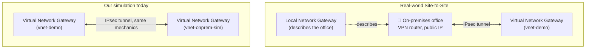

# Day 12 — VPN Gateway & ExpressRoute: Connecting Azure to the Outside World

**Phase 3 — Networking**

> Every VNet you've built so far — `vnet-demo`, `vnet-dev` — has been entirely self-contained inside Azure. Real organizations don't live entirely inside Azure, though. They have an existing office, a data center full of servers that aren't moving anytime soon, or employees working from home who need access to internal resources. All of that needs to talk to Azure **privately and securely** — not by punching holes in NSGs and exposing things to the public internet. Today we cover the two ways Azure bridges your network to the outside world: **VPN Gateway**, an encrypted tunnel over the internet, and **ExpressRoute**, a dedicated private circuit that never touches the internet at all. And because none of us have a spare office building lying around for this demo, we're going to build something every learner can actually do: a **Point-to-Site VPN straight from your own laptop**, and a **simulated Site-to-Site connection** using a second VNet standing in for "the office."

---

## What You'll Learn

- **Hybrid networking** — why and when organizations connect their existing network to Azure
- **Azure VPN Gateway** — the managed resource that terminates encrypted tunnels into your VNet
- **Site-to-Site VPN** vs **Point-to-Site VPN** vs **VNet-to-VNet** — three connection types, one underlying gateway resource
- Hands-on: deploy a real VPN Gateway and connect to it from **your own laptop** — no on-premises network required
- Hands-on: simulate a Site-to-Site connection using a second VNet playing the role of "on-premises"
- **ExpressRoute** — what a dedicated private circuit actually is, and a guided portal tour (no physical circuit required)
- **Azure Virtual WAN** — the managed, large-scale evolution of all of this, briefly, for exam awareness

---

## Before We Begin

This is the most expensive day so far in terms of *what's running while you work*, even though the per-hour rate is modest:

- **VPN Gateway** bills **continuously by the hour** the moment it's deployed, regardless of SKU and regardless of whether any traffic flows through it — roughly in the range of a low double-digit dollar amount per month if left running, with the meter ticking from the second it finishes provisioning. **💳 Paid (Instructor Demo)** — students should watch this part rather than build it on a budget-conscious account, unless you're comfortable monitoring the cost closely.
- Both gateways used in today's hands-on (one for `vnet-demo`, one for the simulated "on-prem" VNet) take **30–45 minutes each to provision**. We'll kick off the first one and keep teaching while it deploys.
- **ExpressRoute** requires an actual physical circuit from a connectivity provider — something no individual learner or instructor account can spin up on demand. Today's ExpressRoute section is a **guided conceptual tour of the portal only** — we will not click the final "Create" button on a circuit.
- **Delete every gateway, public IP, and the simulated VNet immediately after this demo.** This is the single most important cleanup instruction in the course so far — an unattended VPN Gateway will quietly bill for as long as it exists.

---

## Part 1 — Hybrid Networking: Why Bridge Azure to "Outside"

### The Problem

So far, "outside the VNet" has meant one thing: the public internet. Anything not inside `vnet-demo` was just... the internet, reached the same way a random website is reached.

But most real organizations have something else entirely: an existing network that predates their move to Azure. A head office. A data center with file servers and an on-prem Active Directory domain controller that isn't going anywhere soon. Branch offices. Employees working from home who need to reach an internal application that was never designed to be exposed publicly.

**Hybrid networking** is the practice of connecting that existing network to Azure so resources on both sides can talk to each other using **private IP addresses**, as if they were on the same network — without ever routing that traffic over the public, unencrypted internet in the clear.

### The Three Ways to Bridge Azure to "Outside"

| Connectivity | How it works | Privacy | Typical cost | Setup time |
|---|---|---|---|---|
| **Public internet** | Resources expose a public IP, traffic flows over the internet | None (unless you add your own encryption, e.g. HTTPS) | Free (just the public IP) | Instant |
| **VPN Gateway** | Encrypted IPsec/IKE tunnel built on top of the public internet | Encrypted, but still physically traverses the internet | Moderate, billed hourly | Minutes to deploy, ~30–45 min to provision |
| **ExpressRoute** | A dedicated, physical, private circuit from a connectivity provider directly into Azure's network | Fully private — packets never touch the public internet | High — circuit + provider fees | Days to weeks (physical provisioning) |

Today's demo focuses on VPN Gateway, because it's the only one of the three you can actually stand up yourself, on demand, with nothing but an Azure subscription.

---

## Part 2 — Azure VPN Gateway: Core Concepts

### What Is a VPN Gateway, Really?

An **Azure VPN Gateway** is a managed resource — really a pair of VMs Azure operates for you — deployed into a special, mandatory subnet in your VNet called `GatewaySubnet`. Its entire job is to terminate **IPsec/IKE VPN tunnels**: encrypted connections from somewhere else into your VNet.

Three resources work together to make a VPN connection happen:

| Resource | What it represents |
|---|---|
| **Virtual Network Gateway** | The Azure side of the tunnel — lives in `GatewaySubnet`, has its own public IP |
| **Local Network Gateway** | Describes the *other* side of a Site-to-Site tunnel — its public IP and its address space (used when the other side is a real on-premises device) |
| **Connection** | Ties two gateways together with a shared key (pre-shared key / PSK) and actually establishes the tunnel |

### Three Connection Types, One Gateway Resource

**1. Site-to-Site (S2S)** — connects an entire on-premises network (an office, a data center) to a VNet. The on-premises side has its own VPN-capable router or firewall appliance with a public IP. You describe that device to Azure using a **Local Network Gateway**, then create a **Connection** between your Virtual Network Gateway and that Local Network Gateway.

**2. Point-to-Site (P2S)** — connects a **single device** (your laptop) directly to a VNet, using a VPN client. No on-premises hardware, no router, no office required — just a piece of software on your laptop and a certificate or Azure AD sign-in. This is the one every single viewer of this course can actually do for real, today, regardless of whether they have any "on-premises" network at all.

**3. VNet-to-VNet** — connects two Azure VNets to each other over an encrypted IPsec tunnel, using the *same* Virtual Network Gateway resource type on both ends instead of a Local Network Gateway. This isn't normally how you'd connect two VNets in the same Azure environment (that's what VNet Peering from Day 11 is for) — but it uses the exact same mechanics as Site-to-Site, which makes it the perfect stand-in for simulating "on-premises" when you don't actually have an office network. We'll use this today.



### VPN Gateway SKUs

| SKU | Generation | Typical use |
|---|---|---|
| **Basic** | Legacy — being retired, avoid for new deployments | Don't use this; it lacks features and Microsoft is phasing it out |
| **VpnGw1** | Generation 2 | Smallest current-generation SKU — what we'll use today |
| **VpnGw2 – VpnGw5** | Generation 2 | Progressively higher throughput and more supported tunnels, for production hybrid workloads |

Higher SKUs cost more per hour but support more site-to-site tunnels and higher aggregate throughput. For learning purposes, `VpnGw1` is the right choice — it's the cheapest current-generation SKU available.

### Active-Active vs Active-Passive

By default, a VPN Gateway deploys as **active-passive** — one instance handles traffic, the other stands by for failover. **Active-active** uses both instances simultaneously for higher throughput and resilience, at extra cost. Leave the default (active-passive disabled / not checked) for this demo.

---

## Hands-On: Deploy a VPN Gateway Into `vnet-demo`

**💳 Paid (Instructor Demo) — bills hourly from the moment it finishes provisioning; delete immediately after this video**

### Step 1 — Add a `GatewaySubnet` to `vnet-demo`

The name is mandatory and case-sensitive, exactly like `AzureBastionSubnet` was in Day 11.

1. Go to `vnet-demo` → **Subnets** → **+ Subnet**.
2. Fill in:
   - **Name:** `GatewaySubnet` (Azure recognizes this name automatically and offers it as a quick-pick)
   - **Subnet address range:** `10.0.4.0/27` — doesn't overlap with `public-subnet` (`10.0.1.0/24`), `private-subnet` (`10.0.2.0/24`), or `AzureBastionSubnet` (`10.0.3.0/26`) from earlier days
3. Click **Save**.

> Microsoft recommends sizing `GatewaySubnet` at `/27` or larger, even though smaller technically works — a larger subnet gives you room if you ever add ExpressRoute alongside your VPN Gateway (which requires its own gateway type to coexist in the same subnet).

### Step 2 — Create the Virtual Network Gateway

1. Search for **Virtual network gateways** → **+ Create**.
2. On **Basics**:
   - **Resource group:** `rg-networking-demo`
   - **Name:** `vgw-demo`
   - **Region:** East US
   - **Gateway type:** VPN
   - **SKU:** VpnGw1
   - **Generation:** Generation2
   - **Virtual network:** `vnet-demo`
   - **Gateway subnet address range:** confirms `10.0.4.0/27` (already created)
   - **Public IP address:** Create new — **Name:** `pip-vgw-demo`, **SKU:** Standard
   - **Active-active mode:** Disabled
3. Click **Review + create** → **Create**.

This takes **30–45 minutes**. Don't wait idle — move straight into setting up Point-to-Site configuration (Step 3 below) and start the second gateway for the Site-to-Site simulation in parallel, so both are provisioning at the same time.

---

## Hands-On: Point-to-Site VPN — Connect *Your Laptop*, No On-Premises Network Needed

This is the part that directly solves "I don't have an office network to demo this with." Point-to-Site doesn't need one — it connects a single device (yours) straight into the VNet.

**💳 Paid (Instructor Demo, since it depends on the gateway above) — but conceptually, this is the one piece of today's lab a free-tier student could realistically reproduce on their own account if they're comfortable with the gateway's running cost for a short test window**

### Step 3 — Configure Point-to-Site on the Gateway

Once `vgw-demo` finishes provisioning:

1. Go to `vgw-demo` → **Point-to-site configuration** → **Configure now**.
2. **Address pool:** `172.16.201.0/24` — this is the range your laptop will be assigned an address *from* once connected. It must not overlap with `vnet-demo` (`10.0.0.0/16`), `vnet-dev` (`10.1.0.0/16`), or anything else in your environment.
3. **Tunnel type:** OpenVPN (SSL) — works across Windows, macOS, and Linux with the Azure VPN Client.
4. **Authentication type:** Azure certificate.

### Step 4 — Generate Certificates

Point-to-Site with certificate authentication needs a **root certificate** (uploaded to Azure, used to validate clients) and a **client certificate** (installed on your laptop, signed by the root).

1. On a Windows machine, open **PowerShell as Administrator** and generate a self-signed root certificate:
   ```powershell
   $cert = New-SelfSignedCertificate -Type Custom -KeySpec Signature `
     -Subject "CN=P2SRootCert" -KeyExportPolicy Exportable `
     -HashAlgorithm sha256 -KeyLength 2048 `
     -CertStoreLocation "Cert:\CurrentUser\My" -KeyUsageProperty Sign -KeyUsage CertSign
   ```
2. Generate a client certificate signed by that root:
   ```powershell
   New-SelfSignedCertificate -Type Custom -DnsName P2SChildCert -KeySpec Signature `
     -Subject "CN=P2SChildCert" -KeyExportPolicy Exportable `
     -HashAlgorithm sha256 -KeyLength 2048 `
     -CertStoreLocation "Cert:\CurrentUser\My" `
     -Signer $cert -TextExtension @("2.5.29.37={text}1.3.6.1.5.5.7.3.2")
   ```
3. Export the root certificate's **public key** (`.cer`, Base64-encoded) — you'll paste this into the Azure Portal. Do **not** upload the private key.
4. Install the **client certificate** on your laptop (it lands in the certificate store automatically from the command above) — this is what proves your laptop's identity when it connects.

> If you're on macOS or Linux, the same idea applies using `openssl` to generate a root and client certificate pair — the Microsoft Learn documentation has the exact commands. The concept is identical: a root cert Azure trusts, and a client cert your device presents.

### Step 5 — Upload the Root Certificate and Save

1. Back in the Portal, on the **Point-to-site configuration** page, under **Root certificates**:
   - **Name:** `P2SRootCert`
   - **Public certificate data:** paste the Base64 content of the exported `.cer` file
2. Click **Save**.

### Step 6 — Download and Install the VPN Client

1. Once saved, click **Download VPN client** at the top of the Point-to-site configuration page. This gives you a configuration package matched to your tunnel type.
2. Install the **Azure VPN Client** (available from the Microsoft Store on Windows, or the Mac App Store on macOS).
3. Import the downloaded configuration profile into the Azure VPN Client.

### Step 7 — Connect and Prove It Works

1. Open the Azure VPN Client, select the imported profile, and click **Connect**. Your client certificate authenticates you automatically.
2. Once connected, your laptop is assigned an address from `172.16.201.0/24` and now has an encrypted tunnel straight into `vnet-demo`.
3. **The test that matters:** open a terminal and try to SSH directly to `vm-private-linux`'s **private IP** (`10.0.2.4`, from Day 10) — `ssh azureuser@10.0.2.4`. It connects. Directly. From your laptop. No jump box, no public IP on that VM, no Bastion.

Think about what just happened: in Day 10, that exact same private IP was provably unreachable from your laptop — you tested it and watched it time out. Now it works, because your laptop is, for all networking purposes, **inside the VNet**. That's the entire value of Point-to-Site VPN: it gives a remote device a virtual presence on a private network it was never physically part of — exactly the "single remote worker, no office" scenario this section opened with.

---

## Hands-On: Simulating Site-to-Site With a Second VNet

A true Site-to-Site VPN needs a real router or firewall appliance on the other end, sitting in an actual office or data center. We don't have one — so we build a second VNet to **play that role**, and connect to it exactly the way you'd connect to a real Site-to-Site peer, just substituting a Virtual Network Gateway for a Local Network Gateway.

**💳 Paid (Instructor Demo) — a second gateway, billing independently from the first; provision this in parallel with Step 2 above to save time**

### Step 8 — Create the "On-Premises" Stand-In VNet

1. **Virtual networks** → **+ Create**.
2. **Resource group:** `rg-networking-demo`, **Name:** `vnet-onprem-sim`, **Region:** East US.
3. **Address space:** `10.2.0.0/16` — distinct from `vnet-demo` (`10.0.0.0/16`) and `vnet-dev` (`10.1.0.0/16`).
4. Add a subnet: **Name:** `default`, range `10.2.1.0/24`.
5. Add a second subnet: **Name:** `GatewaySubnet`, range `10.2.4.0/27`.
6. **Review + create** → **Create**.

### Step 9 — Create the Second Virtual Network Gateway

1. **Virtual network gateways** → **+ Create**.
2. **Name:** `vgw-onprem-sim`, **Gateway type:** VPN, **SKU:** VpnGw1, **Generation:** Generation2.
3. **Virtual network:** `vnet-onprem-sim`.
4. **Public IP address:** Create new — **Name:** `pip-vgw-onprem-sim`, Standard SKU.
5. **Review + create** → **Create**. Another 30–45 minutes.

### Step 10 — Connect the Two Gateways

Once both `vgw-demo` and `vgw-onprem-sim` show as fully provisioned:

1. Go to `vgw-demo` → **Connections** → **+ Add**.
2. Fill in:
   - **Name:** `demo-to-onprem-sim`
   - **Connection type:** VNet-to-VNet
   - **First virtual network gateway:** `vgw-demo` (pre-filled)
   - **Second virtual network gateway:** `vgw-onprem-sim`
   - **Shared key (PSK):** choose a strong shared secret, e.g. `D3moSh@redKey2026` — write it down, you'll need the identical value on the other side
3. Click **OK**.
4. Repeat from `vgw-onprem-sim`'s side: **Connections** → **+ Add**, **Connection type:** VNet-to-VNet, **Second virtual network gateway:** `vgw-demo`, same shared key.
5. Wait a few minutes, then check **Connections** on both gateways — status should move from **Connecting** to **Connected**.

### Step 11 — What a *Real* Site-to-Site Setup Would Look Like Instead

Walk through this conceptually — don't build it, since there's no real device to point it at:

1. Search for **Local network gateways** → **+ Create**.
2. You'd fill in:
   - **Name:** something like `lng-headoffice`
   - **IP address:** the on-premises router/firewall's **public IP** (a real, internet-routable address belonging to the office)
   - **Address space:** the on-premises network's private CIDR block, e.g. `192.168.50.0/24` — this tells Azure "traffic destined for these addresses should go through this tunnel"
3. Back on `vgw-demo` → **Connections** → **+ Add**, you'd choose **Connection type: Site-to-site (IPsec)** instead of VNet-to-VNet, and select this Local Network Gateway as the destination.
4. The on-premises router would need matching IPsec/IKE configuration pointing back at `vgw-demo`'s public IP, with the same shared key.

Notice the pattern: it's the **same Connection resource**, the **same shared-key concept**, the **same IPsec tunnel underneath**. The only thing that changes between our simulation and a real deployment is what's on the *other* end — a second Azure VNet gateway today, a physical router with a public IP in the real world. Everything else you just configured transfers directly.

### Step 12 — Clean Up (Do This Immediately)

This is the expensive part of the course — don't let it run unattended.

1. Delete both **Connections** (`demo-to-onprem-sim` on each side).
2. Delete both **Virtual network gateways**: `vgw-demo` and `vgw-onprem-sim`. Each deletion itself takes several minutes — be patient and confirm both are gone.
3. Delete both **Public IP addresses**: `pip-vgw-demo` and `pip-vgw-onprem-sim`.
4. Delete the **`vnet-onprem-sim`** VNet entirely — you don't need it again.
5. Optionally remove the `GatewaySubnet` from `vnet-demo` if you're not planning to revisit VPN Gateway later in the course.

---

## Part 3 — ExpressRoute (Conceptual Tour — No Demo)

### What ExpressRoute Actually Is

**ExpressRoute** is a **dedicated, private network connection** between your on-premises network and Azure, provisioned through a **connectivity provider** (a telecom or network partner Microsoft works with). Unlike VPN Gateway, ExpressRoute traffic **never touches the public internet** — it travels over a physical circuit that exists solely for your organization's traffic (or a partitioned slice of shared infrastructure, depending on the model).

This is why ExpressRoute exists even though VPN Gateway is cheaper and faster to set up: some organizations need **guaranteed bandwidth, lower and more consistent latency, and SLA-backed reliability** that a connection riding over the public internet — even an encrypted one — simply cannot promise. Regulatory or compliance requirements in some industries also mandate that certain traffic never traverse the public internet at all.

### Why We're Not Building One

ExpressRoute requires an actual physical circuit ordered through a connectivity provider, landing in a real peering location — something that takes **days to weeks** to provision and isn't something any individual learner or instructor account can spin up for a video. This section is a guided tour of what you'd see in the portal if you were ordering one for real — we will look, but not click the final **Create**.

### A Guided Tour of the ExpressRoute Blade

**✅ Free Tier — exploration only, we will not complete circuit creation**

1. Search for **ExpressRoute circuits** in the portal → **+ Create**.
2. On **Basics**, point out the fields without filling in real values:
   - **Create new circuit or Connect to Direct Port:** most organizations choose "Create new" (a circuit through a provider); "Direct Port" is for organizations large enough to want a dedicated physical port into Microsoft's network (**ExpressRoute Direct**) — massive bandwidth, big-enterprise territory.
   - **Provider:** a dropdown of Microsoft's connectivity partners (this varies by region) — this is the company that physically runs the circuit to your location.
   - **Peering Location:** the physical facility where your circuit meets Microsoft's network — typically a major data center hub near you.
   - **Bandwidth:** options ranging from 50 Mbps up to 10 Gbps (sometimes higher with Direct) — chosen based on the organization's needs.
   - **SKU:** **Local**, **Standard**, or **Premium** — Premium adds global connectivity across Microsoft's backbone and a higher route limit.
   - **Billing model:** **Metered** (pay per GB egress) or **Unlimited** (flat rate, unlimited egress) — a cost trade-off based on expected traffic volume.
3. Click **Cancel** (do not proceed to **Review + create**) — this avoids any chance of an actual order being placed with a provider.

### Peering Types

Once a circuit exists, you configure one or both of:

| Peering Type | Purpose |
|---|---|
| **Private Peering** | Connects your on-premises network to your Azure VNets (the equivalent of what VPN Gateway does, but over the dedicated circuit) |
| **Microsoft Peering** | Connects your network directly to Microsoft's public SaaS services — Microsoft 365, Dynamics 365, and Azure PaaS services with public endpoints — without going over the internet |

### Worth Knowing for the Exam

- **ExpressRoute Global Reach** lets you connect two on-premises sites *to each other* through Microsoft's backbone, using their existing ExpressRoute circuits — effectively turning Microsoft's network into your WAN backbone between offices.
- An ExpressRoute connection into a VNet also uses a dedicated subnet and gateway — same `GatewaySubnet` concept as VPN Gateway, but with **Gateway type: ExpressRoute** instead of VPN. A VNet can have both an ExpressRoute gateway and a VPN gateway coexisting (useful as a VPN failover path if the dedicated circuit goes down) — which is exactly why Microsoft recommends sizing `GatewaySubnet` at `/27` or larger, as we noted back in Step 1.

---

## Part 4 — Azure Virtual WAN (Brief Overview)

As an organization grows from one office to dozens of branches, manually managing a web of individual VPN and ExpressRoute connections becomes unmanageable. **Azure Virtual WAN** is Microsoft's answer: a managed hub-and-spoke networking service where Azure operates the hubs, and branches, VPN users, and ExpressRoute circuits all connect into those hubs rather than into individually managed gateways you maintain yourself.

This is genuinely a large topic in its own right — full mesh connectivity, automated route propagation, integrated firewall and routing policies — and outside the depth we can give it today. For now, know it exists, know it's the answer to "I have 50 branch offices and this is getting out of hand," and recognize the term if it comes up on the exam: **Virtual WAN sits above VPN Gateway and ExpressRoute, automating what you just did by hand today across many sites at once.**

---

## Summary

Let's bring it all together. Here's what you covered today:

**Hybrid networking** connects an organization's existing network — an office, a data center, remote workers — to Azure privately, instead of relying solely on the public internet. **VPN Gateway** does this with an encrypted IPsec/IKE tunnel over the internet; **ExpressRoute** does it with a dedicated, private physical circuit that never touches the internet at all.

You deployed a real **Virtual Network Gateway** into `vnet-demo`'s `GatewaySubnet`, then proved **Point-to-Site VPN** by connecting your own laptop directly into the VNet with a certificate and the Azure VPN Client — no on-premises network required, and you watched a previously-unreachable private IP (`10.0.2.4`) become directly reachable the moment your laptop joined the network. You then simulated **Site-to-Site** by standing up a second VNet (`vnet-onprem-sim`) and connecting its gateway to `vgw-demo`'s using a **VNet-to-VNet connection** — the same Connection resource, shared-key mechanics, and IPsec tunnel a real office's VPN router would use, just with a second Azure VNet playing the office's role instead of a Local Network Gateway.

Finally, you toured **ExpressRoute** conceptually — a dedicated circuit through a connectivity provider, ordered but never actually provisioned in this demo — and briefly met **Azure Virtual WAN** as the managed, large-scale evolution of everything you built by hand today.

### What's Next

In **Day 13 — Load Balancer & VM Scale Sets**, we shift from connecting networks together to distributing traffic *within* a network — taking the VNets and subnets you've built across this entire phase and spreading incoming requests across multiple VMs for scale and resilience.

---

## Key Takeaways

- **VPN Gateway** is a managed resource in a mandatory `GatewaySubnet` that terminates encrypted IPsec/IKE tunnels — it bills hourly from the moment it's deployed, regardless of traffic
- **Site-to-Site** connects an entire on-premises network (via a Local Network Gateway describing the remote router) to a VNet; **Point-to-Site** connects a single device directly, with no on-premises hardware at all; **VNet-to-VNet** connects two Azure VNets using the same gateway-and-connection mechanics
- Point-to-Site VPN is the answer when there's no "on-premises network" to speak of — it makes your own device a first-class member of the VNet, certificates and all
- A VNet-to-VNet connection is mechanically identical to Site-to-Site under the hood — only the resource on the "other side" (a Local Network Gateway vs. a second Virtual Network Gateway) differs, which is why it's a valid stand-in for teaching Site-to-Site without real hardware
- **ExpressRoute** is a dedicated private circuit through a connectivity provider — higher cost and slower to provision (days to weeks), but fully private and SLA-backed; Private Peering reaches your VNets, Microsoft Peering reaches Microsoft's SaaS/PaaS services directly
- **Azure Virtual WAN** is the managed, hub-and-spoke evolution of VPN Gateway and ExpressRoute for organizations with many sites
- Delete every gateway, connection, public IP, and the simulated VNet immediately after this kind of demo — VPN Gateway is one of the few resources in this course that bills meaningfully just for existing
