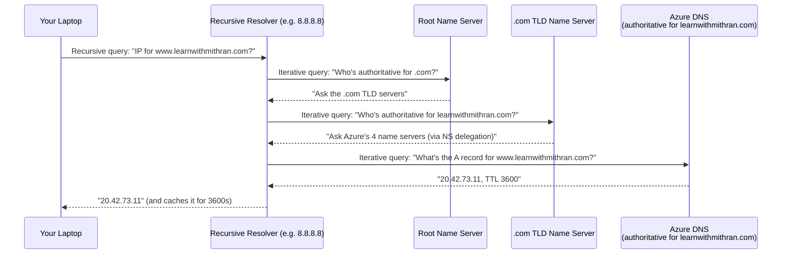
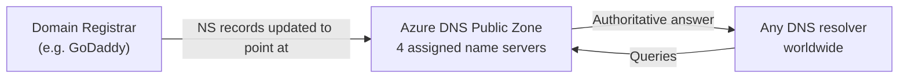
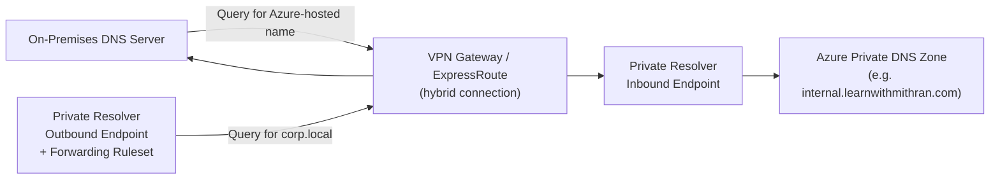

# Day 13 — Azure DNS: Public & Private Zones

**Phase 3 — Networking**

> Every single day of this course, you've been typing hostnames without thinking twice about it — `portal.azure.com`, `mystorageaccount.blob.core.windows.net`, `google.com`. Every one of those names has to turn into an IP address before your computer can actually talk to anything. Today we open up that translation layer and put Azure in charge of it — both for the outside world finding *your* domain, and for your own VMs finding *each other* by name instead of by a private IP you'll forget in a week. By the end of today, you'll host a public domain's DNS records in Azure, give your VNet its own internal phonebook that updates itself, and understand the hybrid resolution service (Azure DNS Private Resolver) that's now the modern, fully-managed way to bridge Azure and on-premises DNS — no custom DNS VMs required.

---

## What You'll Learn

- **DNS fundamentals** — what a hostname-to-IP lookup actually does, and why every cloud platform needs a DNS service
- **How DNS resolution actually works** — the full recursive lookup chain from your browser, to a recursive resolver, to root servers, to `.com`'s TLD servers, to Azure — walked through step by step with a real example
- **DNS record types** — A, AAAA, CNAME, MX, TXT, NS, SOA, and what each one is actually for
- **TTL (Time to Live)** — how long resolvers cache an answer, the trade-off between "fast and cheap" and "changes propagate quickly," and a worked migration-cutover example showing exactly when to lower and raise it
- **Azure DNS Public Zones** — hosting a domain's records at global scale, and delegating a real domain to Azure via NS records at your registrar
- **Alias records** — Azure's DNS enhancement that keeps a record pointed at a resource (not just an IP), even after the resource's IP changes
- **DNSSEC** — signing a public zone so resolvers can cryptographically verify your DNS answers haven't been tampered with
- Hands-on: deploy a real Ubuntu VM running nginx, create a Public DNS Zone, add A/CNAME/MX/TXT records pointing at it, and query Azure's name servers directly to prove resolution works
- **Live example:** actually delegating a real, registered domain (`learnwithmithran.com`, bought at GoDaddy) to that same zone and watching a browser load the nginx page through the real domain, end to end
- **Azure DNS Private Zones** — internal-only DNS that resolves inside a VNet (or across several, once linked)
- **VNet links & autoregistration** — link a Private Zone to a VNet and every VM gets a hostname automatically, no manual record-keeping
- Hands-on: build a fresh VNet and VM, create a Private Zone, link it, and prove autoregistration + manual records both resolve correctly
- **Azure's built-in DNS resolver (`168.63.129.16`)** — what every VM uses out of the box, and exactly what it can and can't resolve
- **Azure DNS Private Resolver** — the modern, fully managed hybrid DNS bridge between Azure and on-premises networks (💳 conceptual walkthrough + portal tour)
- Exam framing: where Azure DNS sits in AZ-104 (Domain 4 — Implement and Manage Virtual Networking) and AZ-305

---

## Before We Begin

DNS is one of the cheapest services in all of Azure. Today is almost entirely **✅ free tier**, with one **💳 instructor-only** section near the end.

- **Azure DNS Public Zone:** roughly **$0.50/month** per zone, plus a small per-query charge (roughly $0.40 per million queries for the first billion queries/month). At the volume we'll generate today, this is effectively **✅ free** — a few cents at most. Delete the zone when you're done if you want to avoid even that. This zone happens to be named after a domain (`learnwithmithran.com`, bought at GoDaddy) that only the instructor owns, but creating and using the zone itself is identical, and free, regardless of whether you own the name you type in.
- **Delegating that zone to the real domain at GoDaddy** (the last step of Part 2's hands-on) is a **💳 instructor demo** for that reason alone — not because of any extra Azure cost, just because it needs a domain only the instructor owns. You don't need your own domain to get everything else from today's lesson.
- **Azure DNS Private Zone:** same pricing shape as a Public Zone — **✅ effectively free** for a demo.
- **DNS records** (A, CNAME, MX, TXT, etc.) inside a zone: **✅ free** — no per-record charge.
- **Alias records:** **✅ free** — no additional charge over a normal record.
- **DNSSEC signing:** **✅ free** — no extra charge to sign a zone.
- **Two test VMs** (`Standard_B1s` each — one running nginx in Part 2, one in Part 3): **✅ free** — both comfortably covered by the Free Tier's 750 B-series hours/month, shared across everything you deploy that month.
- **Azure DNS Private Resolver:** billed per inbound and outbound endpoint, roughly **$180/month per endpoint** (prorated to the hour if deleted early), plus a small charge per forwarding ruleset. A minimum working setup needs both an inbound and an outbound endpoint, so this is a real recurring cost — **💳 instructor demo only**. We'll tour the portal and explain the architecture rather than leave it running. Always check the [Azure DNS pricing page](https://azure.microsoft.com/en-us/pricing/details/dns/) for current rates before deploying this yourself.

---

## Part 1 — DNS Fundamentals

### The Problem DNS Solves

Every device on a network is ultimately reachable only by an IP address — `20.42.73.11`, or `2603:1030:c02::9`. But nobody wants to memorize IP addresses, and worse, IP addresses change: a server gets rebuilt, a service migrates to a new region, a load balancer gets replaced. If everyone had hard-coded the old IP address, everything breaks.

**DNS (Domain Name System)** is the phonebook that solves both problems. It maps a human-readable hostname (`www.learnwithmithran.com`) to whatever IP address currently answers for it. Change the IP, update one DNS record, and every client that looks up the hostname gets routed to the new address — without anyone needing to know an IP address ever changed.

This lookup — hostname in, IP address out — is called **DNS resolution**, and the process happens every single time you open a browser, SSH into a VM by hostname, or an app calls out to an API.

### DNS Record Types

A DNS zone is made up of individual **records**, each one answering a specific type of question. These are the types you'll use constantly in Azure (and everywhere else DNS is used):

| Record Type | What It Answers | Example |
|---|---|---|
| **A** | "What IPv4 address does this hostname point to?" | `www.learnwithmithran.com` → `20.42.73.11` |
| **AAAA** | "What IPv6 address does this hostname point to?" | `www.learnwithmithran.com` → `2603:1030:c02::9` |
| **CNAME** | "This hostname is really just an alias for another hostname" | `blog.learnwithmithran.com` → `learnwithmithran.azurewebsites.net` |
| **MX** | "Where should email for this domain be delivered?" | `learnwithmithran.com` → mail server, with a priority value |
| **TXT** | Arbitrary text — most commonly used for domain ownership verification (Microsoft 365, Google Workspace) and SPF/DKIM email authentication | `v=spf1 include:spf.protection.outlook.com -all` |
| **NS** | "Which name servers are authoritative for this zone?" — this is the record that makes delegation work | 4 Azure-assigned name servers |
| **SOA** | Start of Authority — administrative metadata about the zone itself (primary name server, zone version/serial number, refresh/retry timers) | Created automatically, rarely edited by hand |

Every zone gets an **SOA** and a set of **NS** records automatically the moment you create it — you don't add those yourself.

### How DNS Resolution Actually Works, Step by Step

Every time you type a hostname into a browser, it doesn't turn into an IP address by magic — it walks through a specific chain of servers, each holding one piece of the answer, until something *authoritative* finally responds. Let's trace the exact path for `www.learnwithmithran.com`, assuming this is the very first time anyone, anywhere, has looked it up (a "cold cache").

Two kinds of query happen along this chain:

- **Recursive query** — "Give me the final answer, I don't care how many hops it takes you." This is the query your laptop or phone sends to its configured resolver.
- **Iterative query** — "Here's my best answer; if you need more, ask that server next." This is how the recursive resolver talks to root, TLD, and authoritative servers — each one hands back a referral, not the final answer.



Step by step, in plain language:

1. **Browser/OS cache check.** Before any network traffic happens at all, your browser and operating system check their own local DNS cache. If a still-valid (within-TTL) answer for `www.learnwithmithran.com` is already sitting there from a previous lookup, it's returned instantly — zero network round trips, zero servers involved.
2. **Ask the recursive resolver.** Cache miss? Your device sends a recursive query to whichever resolver it's configured to use — your ISP's resolver, or a public one like Google's `8.8.8.8` or Cloudflare's `1.1.1.1`. This resolver now does all the remaining legwork on your behalf.
3. **Resolver asks a root name server.** If the resolver's own cache is also cold, it starts at the very top of the DNS hierarchy: one of the 13 logical **root name servers**. The root server has never heard of `learnwithmithran.com` specifically, but it knows who's authoritative for `.com` — so it refers the resolver there.
4. **Resolver asks a `.com` TLD name server.** The TLD server doesn't know `www.learnwithmithran.com`'s IP either — but it does hold the **NS records** for `learnwithmithran.com`, which is exactly the delegation you set up by pointing your registrar's nameserver settings at Azure (Part 2). So it refers the resolver to Azure's four name servers.
5. **Resolver asks Azure DNS directly.** This is the first server in the whole chain that's actually **authoritative** for the zone — it holds the real record. Azure answers with the A record's value (`20.42.73.11`) and its **TTL** (say, 3600 seconds).
6. **Resolver caches the answer, then replies.** The recursive resolver stores that answer for 3600 seconds and hands it back to your device, which may cache it too. Everyone else using that same resolver (e.g., everyone on the same ISP) who looks up `www.learnwithmithran.com` in the next hour gets the cached answer instantly — none of steps 3–5 happen again until the TTL expires.

That's the entire chain, and it's exactly why **delegation** (Part 2) and **TTL** (next) matter so much: delegation is what makes step 4 point at Azure at all, and TTL is what determines how often steps 3–5 have to repeat, versus how much of the internet is running on a cached — and possibly stale — answer.

### TTL — Time to Live

Every DNS record has a **TTL**, measured in seconds, telling any resolver that caches the answer how long it's allowed to keep using that cached answer before asking again.

- **Short TTL** (e.g., 60 seconds): changes propagate almost immediately, but every resolver has to re-query far more often, which increases load and (on Azure) increases your per-query billing.
- **Long TTL** (e.g., 86400 seconds / 24 hours): far fewer repeat queries, cheaper and faster for everyone downstream — but if you need to change the record (say, during a migration or an incident), it can take up to that long for every cached resolver worldwide to pick up the new value.

**Practical pattern:** keep a long TTL during steady-state operation, and deliberately lower it in the days *before* a planned migration or cutover, so the eventual real change propagates fast. Raise it back up again afterward.

#### Worked Example: Changing an IP Without Breaking Anyone

Say `www.learnwithmithran.com`'s A record has been sitting at TTL `86400` (24 hours) for months, pointing at `20.42.73.11`. You're migrating to a new VM at `40.90.23.5` this Thursday.

If you just changed the IP on Thursday and left the TTL at 86400, here's what actually happens: every resolver that cached the *old* IP any time in the previous 24 hours keeps serving `20.42.73.11` — some visitors could keep hitting the decommissioned VM for up to a full day after cutover, because their resolver has no reason to ask again until its cached copy expires.

The standard fix:

1. **Two days before cutover (Tuesday):** lower the TTL on the existing record to `300` (5 minutes) — leave the IP unchanged for now.
2. **Wait at least one full day.** This guarantees every resolver worldwide has, at some point, re-queried and picked up the new, short TTL — so nobody is still holding a stale 24-hour cache entry.
3. **Thursday — perform the actual cutover:** update the IP to `40.90.23.5`. Because the TTL is now only 300 seconds, resolvers refresh within 5 minutes of their existing cache expiring. Instead of "up to 24 hours to fully propagate," you're looking at "essentially done in under 5 minutes."
4. **Once the new VM is confirmed stable** (say, the following Monday): raise the TTL back to `86400`. There's no reason to keep every resolver on Earth re-querying every 5 minutes once things are stable again — and on Azure DNS, more queries means a (small) increase in your per-query billing.

#### Typical TTL Values in Practice

| TTL | Seconds | When You'd Use It |
|---|---|---|
| 1 minute | 60 | Active migration/cutover window, or a record behind DNS-based failover (e.g. Traffic Manager) that needs to react fast if an endpoint goes down |
| 5 minutes | 300 | The "lowered ahead of a planned change" TTL — short enough to propagate fast, long enough not to hammer your query count |
| 1 hour | 3600 | Sensible default for most records during steady-state — Azure's own portal defaults new records to this |
| 24 hours | 86400 | Stable, rarely-changing records — MX records, SOA, records for services that never move |
| 48 hours | 172800 | Occasionally seen on NS records at the registrar level — outside Azure's control, but it's exactly why *nameserver* changes (as opposed to individual record changes) can take the longest to propagate globally |

Notice how this ties directly back to the resolution chain from the previous section: a resolver only repeats steps 3–5 (root → TLD → authoritative) once its cached copy's TTL has expired. Shrink the TTL, and you shrink how long any single resolver can keep serving a stale answer — at the cost of it asking Azure more often.

---

## Part 2 — Azure DNS Public Zones

### What a Public Zone Is

An **Azure DNS Public Zone** hosts the DNS records for a domain (or subdomain) at global scale, on Microsoft's globally distributed, anycast name server network. When you create a zone in Azure, Azure automatically assigns it **four name servers** and generates the **NS** and **SOA** records for you.

To make the rest of the internet actually use Azure as the authority for your domain, you go to your **domain registrar** (GoDaddy, Namecheap, wherever you bought the domain) and update the domain's NS records to point at the four name servers Azure gave you. This is called **delegation** — you're telling the global DNS system, "stop asking the registrar's default name servers about this domain; ask Azure instead."



You do **not** need to own or delegate a real domain to follow today's hands-on demo — Azure lets you create a zone for any name you type in, and you can query its assigned name servers directly to prove resolution works, without touching a registrar at all. To make that as concrete as possible, we're going to point today's DNS record at a genuine Ubuntu VM running nginx, so you can actually watch a browser load a page through it — not just prove an IP address resolves — and then, as a bonus, delegate a real registered domain to it for real.

### Alias Records

A normal **A record** points at a static IP address you type in by hand. That's a problem for Azure resources whose IP can change — a Public IP that gets reassigned, a Traffic Manager profile, an Azure Front Door endpoint, or a CDN endpoint. If the underlying IP changes and your A record still has the old one hard-coded, your domain silently breaks.

An **Alias record** solves this by pointing at the *Azure resource itself*, not its current IP. Azure keeps the record's answer in sync automatically whenever the resource's IP changes — no manual updates, ever.

Alias records also solve the classic **"zone apex" problem**: a CNAME record is not allowed at the root of a domain (`learnwithmithran.com` itself, as opposed to `www.learnwithmithran.com`) — that's a rule baked into the DNS specification itself, not an Azure limitation. But an Alias record *is* allowed at the zone apex, so it's the standard way to point a naked domain straight at a Front Door endpoint, a Traffic Manager profile, or a Public IP.

| | Normal Record (A/CNAME) | Alias Record |
|---|---|---|
| Points at | A static IP or hostname you type in | An Azure resource (Public IP, Traffic Manager, Front Door, CDN) |
| Updates automatically if the resource's IP changes | ❌ No — you must edit it manually | ✅ Yes |
| Allowed at the zone apex (root domain) | Only A/AAAA; CNAME is not allowed at the apex | ✅ Yes |
| Extra cost | None | None |

### DNSSEC — Cryptographically Signed DNS

Plain DNS has a well-known weakness: a resolver has no way to *prove* an answer it received actually came from the real authoritative source and wasn't tampered with in transit (a class of attack known as DNS spoofing/cache poisoning). **DNSSEC (Domain Name System Security Extensions)** fixes this by cryptographically signing every record in a zone, so a validating resolver can verify the answer's authenticity and integrity before trusting it.

Azure Public DNS supports signing a zone with DNSSEC directly in the portal:

1. Signing the zone generates a **Zone Signing Key (ZSK)**, using ECDSA P-256/SHA-256.
2. Azure produces a **DS (Delegation Signer) record**.
3. You publish that DS record at your **domain registrar**, alongside your existing NS delegation — this is what tells the parent zone (and the rest of the internet) to trust your zone's signatures.
4. Azure automatically rotates (rolls over) the signing key on an ongoing basis — you don't manage key rotation by hand.

There's no extra charge to sign a zone with DNSSEC. It's a one-way trust upgrade for any domain that's internet-facing and cares about tamper-proofing its own DNS answers.

---

### Hands-On: Deploy a Real Web Server, Host Its DNS in Azure, and Delegate a Real Domain

**Mostly ✅ Free Tier — you'll deploy a genuine Ubuntu VM running nginx and host its DNS in Azure. The final step, delegating a real domain at a registrar, is 💳 Instructor Demo (it needs `learnwithmithran.com`, registered at GoDaddy) — everything before it works identically with any name you type in, owned or not.**

**Step 1 — Create the resource group:**

1. Search for **Resource groups** → **+ Create**.
2. **Resource group name:** `rg-day13-demo`
3. **Region:** East US
4. **Review + create** → **Create**.

**Step 2 — Deploy an Ubuntu VM running nginx:**

This VM is the real thing our DNS record is going to point at — once it's up, you'll be able to open a browser and actually watch it serve a page, instead of only proving an IP address resolves.

1. Search for **Virtual machines** → **+ Create** → **Azure virtual machine**.
2. Fill in:
   - **Resource group:** `rg-day13-demo`
   - **VM name:** `vm-web-day13`
   - **Region:** East US
   - **Image:** Ubuntu Server 24.04 LTS
   - **Size:** Standard_B1s
   - **Authentication:** SSH public key (or password)
   - **Public inbound ports:** Allow selected ports → **SSH (22)**, **HTTP (80)**
3. On **Networking**, leave the auto-created VNet/subnet as-is, and confirm **Public IP** is set to **Create new** — this VM needs a real, internet-reachable address for the DNS record to mean anything.
4. On **Advanced**, scroll to **Custom data** and paste this cloud-init script so nginx is installed and serving the moment the VM boots:
   ```yaml
   #cloud-config
   package_update: true
   packages:
     - nginx
   runcmd:
     - echo "<h1>Hello from learnwithmithran.com — served by $(hostname)</h1>" > /var/www/html/index.html
   ```
5. **Review + create** → **Create**.
6. Once deployed, copy the VM's **public IP address** from its Overview page, and browse to `http://<vm-public-ip>` — confirm you see the nginx page *before* touching DNS at all. This isolates "is the server actually working" from "is DNS pointing at it correctly," which is exactly how you'd debug a real outage.

**Step 3 — Create the Public DNS Zone:**

1. Search for **DNS zones** → **+ Create**.
2. Fill in:
   - **Resource group:** `rg-day13-demo`
   - **Name:** `learnwithmithran.com` *(this is the real domain we'll delegate for real in Step 7 — if you don't own a domain yourself, any name works exactly the same way through Step 6; only the actual registrar delegation needs real ownership)*
   - **Resource group location:** East US
3. **Review + create** → **Create**.

Once it's deployed, open the zone. You'll immediately see two records already created for you: an **NS** record listing four Azure-assigned name servers, and an **SOA** record. Note down the four name servers — you'll use them directly in a moment, and again at the registrar later.

**Step 4 — Add an A record pointing at your real VM:**

1. Click **+ Record set**.
2. Fill in:
   - **Name:** `www`
   - **Type:** A
   - **TTL:** 3600 (1 hour)
   - **IP address:** the **real public IP** of `vm-web-day13` from Step 2 — not a placeholder this time
3. Click **Add**.

**Step 5 — Add a CNAME, MX, and TXT record (same record types as before, illustrative values):**

1. **CNAME:** **Name:** `blog`, **Type:** CNAME, **TTL:** 3600, **Alias:** `learnwithmithran.com` *(pointing at the zone's own apex, just to demonstrate a CNAME hop — in a real setup this would point at another hostname entirely, like an App Service default hostname)* → **Add**.
2. **MX:** **Name:** `@` (the zone apex), **Type:** MX, **TTL:** 3600, **Mail Exchange:** `mail.learnwithmithran.com`, **Preference:** 10 → **Add**.
3. **TXT:** **Name:** `@`, **Type:** TXT, **TTL:** 3600, **Value:** `v=spf1 -all` *(a real SPF record would list your actual mail providers — this is a placeholder showing the format)* → **Add**.

**Step 6 — Query Azure's name servers directly (no registrar needed):**

Because delegation only matters for the *rest of the internet* finding your zone automatically, you can always query Azure's assigned name servers **directly** to prove your records resolve — this works whether or not you own the domain you typed in, and it's exactly how you'd debug delegation issues on a real domain too.

1. Open **Cloud Shell** (or any terminal with `nslookup`/`dig`).
2. Run, substituting one of the four name servers you noted in Step 3:
   ```
   nslookup -type=A www.learnwithmithran.com <name-server-from-your-zone>
   ```
3. You'll get back `vm-web-day13`'s real public IP — proof that Azure is correctly answering for records inside this zone, entirely independent of whether any registrar points at it yet. If you don't actually own the domain you typed in, this is as far as you can take it — and that's fine, you've already proven the exact mechanism a real delegation relies on.

**Step 7 — Delegate at GoDaddy, then watch it resolve for real:**

**💳 Instructor Demo — needs a domain actually registered somewhere. For this course, that's `learnwithmithran.com` at GoDaddy, not yet pointed at anything, so there's no existing email or website to break.**

1. Log into GoDaddy → **My Products** → find `learnwithmithran.com` → **DNS** → **Nameservers**.
2. Choose **Change Nameservers** → **Enter my own nameservers (custom)**.
3. Enter all **four** name servers Azure assigned in Step 3 — GoDaddy will accept as few as two, but use all four Azure gave you.
4. Save. GoDaddy will warn that this hands off DNS management for the domain entirely — that's expected, and exactly the point: Azure is now authoritative for `learnwithmithran.com`.
5. Wait for propagation — governed by the **TTL on the `.com` TLD's own NS delegation**, typically up to 48 hours though often much faster in practice. This is the one TTL in the whole chain that neither you nor Azure controls; it belongs to the registry operating `.com`.
6. Once it's propagated, open a plain browser tab — no name server override, no `nslookup`, nothing clever — and go to **http://www.learnwithmithran.com**. You should see the exact same nginx page you already confirmed at the raw IP in Step 2, now served through a real, publicly delegated domain name, resolved by the exact chain traced earlier in this Part: your resolver → root → `.com` TLD → Azure → this VM.

That's the complete loop, closed for real: a genuine web server, its DNS hosted in Azure, delegated from a real registrar, resolving through the exact same recursive chain every visitor on Earth uses for every domain — not a shortcut, the real thing.

**Step 8 — Clean up:**

1. Stop/deallocate or delete `vm-web-day13` if you're done experimenting — but if you delegated a real domain to it, remember that leaves `www` pointing at a dead IP until you update the A record or redeploy the VM.
2. Keep the DNS zone around if you want to keep building on it later (a Public Zone at this volume is effectively free) — or delete the whole `rg-day13-demo` resource group in one step to remove everything.

---

## Part 3 — Azure DNS Private Zones

### The Problem: Public DNS Doesn't Help Inside a VNet

Everything in Part 2 was about the *outside world* finding your domain. But what about your own VMs finding *each other*? By default, VMs inside a VNet only know each other by private IP — `10.0.1.4`, `10.0.2.10`. Hard-coding those into scripts, connection strings, or config files is exactly the fragile pattern DNS exists to avoid.

An **Azure DNS Private Zone** is a DNS zone that only resolves for VNets you explicitly **link** to it. It never touches the public internet and isn't reachable by anyone outside those linked VNets.

### VNet Links and Autoregistration

Linking a Private Zone to a VNet is a two-part decision:

| Option | What It Does |
|---|---|
| **VNet link (registration link)** | Connects the Private Zone to the VNet so resources in that VNet can *resolve* records in the zone |
| **Enable autoregistration** | Additionally, every VM deployed into that VNet automatically gets its own **A record** created in the zone — no manual record-keeping required |

With autoregistration on, deploy a new VM into the linked VNet and within moments it has a resolvable hostname like `vm-web-demo.internal.learnwithmithran.com` — Azure created that record for you, and will remove it automatically if the VM is deleted.

You can link the **same Private Zone to multiple VNets** — a common pattern for a shared "internal services" zone (like `internal.learnwithmithran.com` hosting a shared database hostname) that several application VNets all need to resolve, even though only one of those VNets has autoregistration enabled for it.

### Azure's Built-In DNS Resolver

Every VM in Azure, by default, is configured to use Azure's own DNS resolver at the well-known address **`168.63.129.16`**. Out of the box, with zero configuration, this resolver can answer for:

- Public internet hostnames (`google.com`, `github.com`) — forwarded out to the public internet
- Azure service hostnames (`*.blob.core.windows.net`, `*.database.windows.net`, etc.)
- Any **Private DNS Zone records** linked to that VM's VNet

This is exactly why, back on Day 11, a VM could resolve `google.com` *and* a Private Endpoint's private IP without you configuring a single DNS setting yourself — `168.63.129.16` was already handling all of it.

### Custom DNS — When the Built-In Resolver Isn't Enough

Sometimes you need a VNet to resolve names that Azure's built-in resolver has no way of knowing about — most commonly, hostnames that only exist in your **on-premises** DNS server, as part of a hybrid network. In that scenario, you can point a VNet's DNS settings at your own custom DNS server(s) instead of `168.63.129.16` — but doing so naively means you *lose* automatic resolution of Private DNS Zones and Azure service hostnames, unless that custom DNS server is configured to conditionally forward those queries back to Azure.

This exact problem — "I need one DNS system that correctly answers for Azure Private Zones *and* my on-premises zones, without me hand-building and patching forwarding VMs myself" — is precisely what **Azure DNS Private Resolver** (Part 4, next) was built to solve.

---

### Hands-On: Create a Private Zone, Link It, and Prove Autoregistration

**✅ Free Tier — follow along. Builds a fresh VNet and VM, kept separate from any earlier day's resources.**

**Step 1 — Create a fresh VNet:**

1. Search for **Virtual networks** → **+ Create**.
2. Fill in:
   - **Resource group:** `rg-day13-demo`
   - **Name:** `vnet-day13`
   - **Region:** East US
3. **Next: IP Addresses** → set address space to `10.0.0.0/16`, with a single subnet `subnet-demo` at `10.0.1.0/24`.
4. **Review + create** → **Create**.

**Step 2 — Deploy one test VM into it:**

1. Search for **Virtual machines** → **+ Create** → **Azure virtual machine**.
2. Fill in:
   - **Resource group:** `rg-day13-demo`
   - **VM name:** `vm-dns-demo`
   - **Region:** East US
   - **Image:** Ubuntu Server 24.04 LTS
   - **Size:** Standard_B1s
   - **Authentication:** SSH public key (or password)
3. On **Networking**: **Virtual network:** `vnet-day13`, **Subnet:** `subnet-demo`, **Public IP:** Create new (so we can SSH straight in for this demo).
4. **Review + create** → **Create**.

**Step 3 — Create the Private DNS Zone:**

1. Search for **Private DNS zones** → **+ Create**.
2. Fill in:
   - **Resource group:** `rg-day13-demo`
   - **Name:** `internal.learnwithmithran.com`
3. **Review + create** → **Create**.

**Step 4 — Link it to `vnet-day13` with autoregistration:**

1. Open `internal.learnwithmithran.com` → **Virtual network links** → **+ Add**.
2. Fill in:
   - **Link name:** `link-vnet-day13`
   - **Virtual network:** `vnet-day13`
   - **Enable auto registration:** ✅ Yes
3. Click **OK**.

Within a minute or two, go back to the zone's **Overview** — you'll see a new **A record** for `vm-dns-demo`, created automatically, with `vm-dns-demo`'s private IP as the value. Nobody typed that in.

**Step 5 — Add a manual A record:**

Not everything you want to resolve is a VM Azure auto-registers — sometimes you want a friendly name for a fixed private IP (a database endpoint, an on-prem-facing service, anything static).

1. Click **+ Record set**.
2. Fill in:
   - **Name:** `db`
   - **Type:** A
   - **TTL:** 3600
   - **IP address:** `10.0.2.10` *(a placeholder — nothing is actually listening here, we're only proving the record resolves)*
3. Click **Add**.

**Step 6 — Verify all three resolution paths from inside the VM:**

1. SSH into `vm-dns-demo`: `ssh azureuser@<vm-dns-demo-public-ip>`.
2. Run each of these and compare the results:
   ```
   nslookup vm-dns-demo.internal.learnwithmithran.com
   ```
   Resolves to `vm-dns-demo`'s own private IP — the **autoregistered** record, created with zero manual effort.
   ```
   nslookup db.internal.learnwithmithran.com
   ```
   Resolves to `10.0.2.10` — the **manual** record you just added.
   ```
   nslookup google.com
   ```
   Resolves normally to a public IP — proving the same built-in resolver (`168.63.129.16`) is transparently handling both your Private Zone *and* the public internet, with no configuration required on the VM itself.

That's the complete picture: one resolver, three different kinds of answers, and you never touched a DNS setting on the VM.

**Step 7 — Clean up:**

1. Stop/deallocate or delete `vm-dns-demo` if you're done experimenting.
2. Keep `internal.learnwithmithran.com` and `vnet-day13` around if you want to build on this later — both are effectively free at this scale — or delete the whole `rg-day13-demo` resource group in one step to remove everything.

---

## Part 4 — Azure DNS Private Resolver (Hybrid DNS)

### The Problem It Solves

Before this service existed, bridging DNS between Azure and an on-premises network meant standing up your own DNS forwarder — typically a VM running Windows DNS or BIND, configured with conditional forwarding rules, that you had to patch, scale, and keep highly available yourself. It worked, but it was infrastructure you owned and maintained just to answer DNS queries correctly.

**Azure DNS Private Resolver** replaces that VM entirely with a fully managed, highly available PaaS service. It reached **General Availability in June 2025**, and is now the Microsoft-recommended way to handle hybrid DNS resolution — no custom DNS server, no patching, no scaling to manage.

### How It's Built

A Private Resolver is deployed inside a VNet and is built from two independent pieces:

| Component | What It Does |
|---|---|
| **Inbound endpoint** | Gives the resolver a private IP inside your VNet that *on-premises* DNS servers can forward queries to — this is how an on-prem DNS server asks Azure to resolve an Azure Private Zone record |
| **Outbound endpoint** | Paired with a **DNS forwarding ruleset** — a set of rules like "for `corp.local`, forward to `10.100.0.5`" — that lets *Azure* forward specific domain queries back out to your on-premises DNS servers |



The two endpoints are independent — you can deploy just an inbound endpoint if on-premises only ever needs to *ask* Azure things, or just an outbound endpoint if Azure only ever needs to *ask* on-premises things, or both for full two-way resolution.

> **Where this connects to hybrid networking:** a Private Resolver's inbound/outbound endpoints are only useful for actual on-premises traffic once there's a network path between Azure and on-premises in the first place — that's exactly the job of **VPN Gateway** or **ExpressRoute**, which this course covers as its own dedicated day a little further on. Today's goal is understanding what the Private Resolver does and how it's built; wiring it into a live hybrid connection is a natural next step once that hybrid tunnel exists.

### Hands-On: Tour the Private Resolver Blade

**💳 Instructor demo only — real deployment runs roughly $180/month per endpoint. We'll walk the portal, not leave anything running.**

1. Search for **DNS Private Resolvers** → **+ Create**.
2. Walk through the **Basics** tab: resource group, region, and the VNet it will attach to (a resolver's VNet needs a dedicated, empty `/28` subnet for each endpoint type — inbound and outbound each need their own subnet, similar to Azure Bastion's dedicated-subnet requirement from Day 11).
3. On the **Inbound Endpoints** tab, show how you'd assign it a subnet and a private IP allocation method (static or dynamic).
4. On the **Outbound Endpoints** tab, show the pairing with a **DNS Forwarding Ruleset** — explain that a ruleset is a separate resource containing individual rules (domain name → target DNS servers), and that the same ruleset can be linked to multiple VNets.
5. Close out without deploying, to avoid the ongoing charge — this is a "know the architecture and be able to describe it on an exam or in a design conversation" topic for most learners, not a daily-use lab resource.

---

## Summary

Let's bring it all together. Today you covered the two sides of Azure DNS — the world reaching you, and your resources reaching each other.

Along the way you traced the full **DNS resolution chain** — browser/OS cache, recursive resolver, root name servers, `.com` TLD servers, and finally Azure's authoritative name servers — and saw exactly where **TTL** governs how long each hop's cached answer stays trustworthy, including a worked migration-cutover example showing when to lower a TTL and when to raise it back.

**Azure DNS Public Zones** host your domain's records at global scale, on Azure's anycast name server network. Every zone gets NS and SOA records automatically; delegating a real domain means updating your registrar's name servers to point at Azure's four — but you can always query Azure's name servers directly to verify records, delegated or not. Today you proved that against something real: you stood up an actual Ubuntu VM running nginx, pointed a Public DNS Zone's A record at its genuine public IP, verified it against Azure's own name servers, then delegated the real, GoDaddy-registered `learnwithmithran.com` and watched a browser load that same nginx page through the fully delegated domain — the entire recursion chain, end to end, not a shortcut. **Alias records** solve the zone-apex and "IP keeps changing" problems by pointing at an Azure resource instead of a static value, and **DNSSEC** lets you cryptographically sign a zone so resolvers can verify your answers haven't been tampered with — at no extra cost.

**Azure DNS Private Zones** give your VNet internal name resolution that never touches the public internet. Link a zone to a VNet, flip on autoregistration, and every VM gets a hostname with zero manual record-keeping — exactly what you proved with `vm-dns-demo` today, alongside a manually created record and normal public resolution, all served transparently by Azure's built-in resolver at `168.63.129.16`.

Finally, **Azure DNS Private Resolver** — GA since June 2025 — is the modern, fully managed replacement for hand-rolled DNS forwarder VMs in hybrid scenarios. Inbound endpoints let on-premises ask Azure; outbound endpoints plus forwarding rulesets let Azure ask on-premises. It's infrastructure you'll wire into a real VPN Gateway or ExpressRoute connection once that hybrid tunnel exists — which is exactly where this course picks the thread back up.

### What's Next

You now have a complete picture of Azure-native DNS: hosting a public domain, giving your VNet its own internal phonebook, and the managed bridge for hybrid resolution. **VPN Gateway & ExpressRoute** — the hybrid connectivity layer that a Private Resolver's endpoints ultimately ride on top of — is being held for a dedicated future session, since it's genuinely more advanced and deserves room to breathe rather than being rushed in right after today. Coming up next in the meantime: **Traffic Manager, Front Door, CDN & WAF** — global traffic routing and edge delivery, including Alias records pointed straight at a Front Door endpoint, tying directly back into what you learned about Alias records today.

---

## Key Takeaways

- **DNS** maps human-readable hostnames to IP addresses so nothing ever has to hard-code an address that might change
- Core record types: **A/AAAA** (hostname → IP), **CNAME** (hostname → hostname), **MX** (mail routing), **TXT** (verification/SPF/DKIM), **NS** (delegation), **SOA** (zone metadata) — NS and SOA are created automatically
- **DNS resolution** is a chain, not a single lookup: browser/OS cache → recursive resolver → root name servers → TLD name servers → the authoritative name servers (Azure, once delegated) — each hop is skipped if a still-valid cached answer already exists
- **TTL** controls the cache/propagation trade-off — lower it before a planned change (e.g., a migration cutover), raise it back up after; shorter TTL means faster propagation but more resolver queries (and slightly higher Azure DNS billing)
- **Azure DNS Public Zones** get four Azure-assigned name servers automatically; delegating a real domain means pointing your registrar's NS records at them — but you can query Azure's name servers directly to verify records without ever delegating
- **Live example:** an A record was pointed at a real Ubuntu VM running nginx, then `learnwithmithran.com` (registered at GoDaddy) was actually delegated to that same Azure Public DNS Zone — proving, by loading the nginx page in a plain browser at `www.learnwithmithran.com`, that the full resolution chain works end-to-end, not just against Azure's own name servers
- **Alias records** point at an Azure resource (Public IP, Traffic Manager, Front Door, CDN) instead of a static value, auto-updating if the resource's IP changes, and are the only record type allowed at a zone's apex besides A/AAAA
- **DNSSEC** cryptographically signs a zone (free to enable) — publish the generated DS record at your registrar to complete the trust chain
- **Azure DNS Private Zones** resolve only inside VNets you explicitly link to them — link + enable **autoregistration** and every VM gets a hostname automatically, with zero manual record-keeping
- The same Private Zone can be linked to multiple VNets — common for a shared internal-services zone
- Every VM uses Azure's built-in resolver at **`168.63.129.16`** by default, which transparently handles public internet names, Azure service hostnames, and any linked Private Zone records
- **Custom DNS** on a VNet is how you point resolution at on-premises DNS servers for hybrid scenarios — but you lose automatic Private Zone/Azure-service resolution unless that custom server conditionally forwards those queries back to Azure
- **Azure DNS Private Resolver** (GA June 2025) is the fully managed replacement for hand-built DNS forwarder VMs — an **inbound endpoint** lets on-premises query Azure; an **outbound endpoint** plus a **DNS forwarding ruleset** lets Azure query on-premises; each endpoint costs roughly $180/month, so this is a 💳 design-and-understand topic for most learners rather than a resource to leave running
- This is AZ-104 **Domain 4 (Implement and Manage Virtual Networking)** territory, and comes up in AZ-305 as part of hybrid network design — know the record types, autoregistration behavior, and the inbound/outbound endpoint split cold
