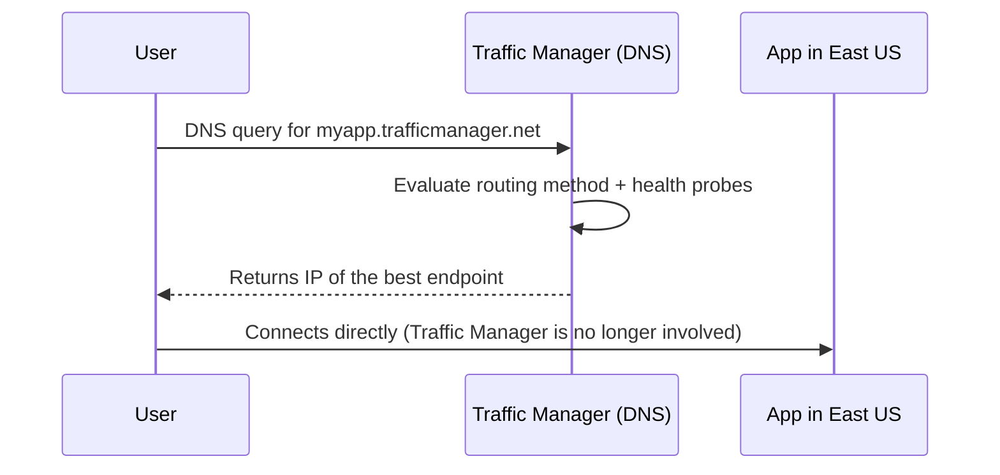

# Day 14 — Traffic Manager, Front Door, CDN & WAF

**Phase 3 — Networking**

> Every service you've built so far in this course lives in one region. That's fine until your users don't — a user in Singapore hitting a web app that only exists in East US is going to feel every millisecond of that round trip, and if East US ever has a bad day, that user has no fallback at all. Today we go global. You'll route users to the best endpoint anywhere in the world using nothing but DNS, put a globally distributed edge network in front of your application that caches content and terminates SSL closer to your users, and wrap the whole thing in a managed firewall that blocks common web attacks before they ever reach your backend. Along the way, we'll also deal with something very current: two of the classic services this topic used to be built on — Azure CDN (classic) and Azure Front Door (classic) — have been closed to new deployments since August 15, 2025, so everything we build today uses the modern, unified replacement.

---

## What You'll Learn

- **Azure Traffic Manager** — a DNS-based global load balancer that never sits in your data path
- Traffic Manager's six routing methods: Performance, Priority, Weighted, Geographic, Subnet, MultiValue
- Hands-on: build a Traffic Manager profile with two endpoints, then force a failover and watch DNS respond
- **Azure Front Door (Standard/Premium)** — Microsoft's global Application Delivery Network: edge caching, global HTTP(S) load balancing, SSL offload, and WAF, all in one service
- Why **Azure CDN (classic)** and **Front Door (classic)** are both in retirement, and why Front Door Standard/Premium is now the answer to "I need a CDN" *and* "I need global routing"
- Hands-on: build a Front Door Standard profile in front of a static website, and prove edge caching is real via the `X-Cache` response header
- **Web Application Firewall (WAF)** — the OWASP Core Rule Set, Detection vs. Prevention mode, custom rules, and the Bot Manager rule set
- Why **WAF Policy** is now the only way to configure WAF — and why the old inline WAF config on Application Gateway is gone
- Hands-on: attach a WAF Policy to your Front Door profile, review Detection mode logs, then flip to Prevention mode and prove a SQL injection attempt gets blocked
- Exam framing: how AZ-104 and AZ-305 expect you to choose between Traffic Manager, Front Door, and Application Gateway (Day 12)

---

## Before We Begin

Everything meaningful today has a real cost — this is a **💳 instructor-demo-heavy day**. Delete everything at the end.

- **Azure Traffic Manager:** a small monthly charge per DNS zone (roughly $0.54/month) plus a small charge per million DNS queries received. At demo volume, a few cents. **💳**
- **Two backend endpoints for Traffic Manager** (two B1s VMs, one per region): this is the real cost driver, not Traffic Manager itself. **💳**
- **Azure Front Door (Standard tier):** billed on a consumption model — a base platform fee plus usage (data transfer, requests, routing rules). Budget roughly $35–$40/month if left running for a full month; a short demo session costs a small fraction of that. **💳**
- **WAF Policy attached to Front Door Standard/Premium:** included in the Front Door Standard/Premium price — no separate WAF charge on these tiers. **💳** (bundled into the Front Door cost above)
- **Blob Storage static website** (today's Front Door origin): **✅ free** at this scale — same static website hosting feature from Day 7.

We're deliberately **not** creating a standalone "Azure CDN (classic)" resource today — as of August 15, 2025, Azure no longer allows new classic CDN profiles or new custom domains on existing ones, so building one from scratch would teach you a dead end. Front Door Standard is where that functionality lives now.

---

## Part 1 — Azure Traffic Manager

### The Problem: One Region Is a Single Point of Failure — Even for Multi-VM Apps

Back on Day 12, you made a single region resilient — spreading traffic across multiple VMs with a Load Balancer, and across multiple availability zones. But what happens if the *entire region* has an outage? Every VM behind that Load Balancer goes down with it. To survive a regional outage, you need presence in more than one region — and a way to route users to whichever region is actually healthy.

### What Traffic Manager Is

**Azure Traffic Manager** is a **DNS-based global load balancer**. The critical thing to understand: Traffic Manager does not sit in the path of your traffic at all. It only answers DNS queries.



Once Traffic Manager hands back an IP address, the user's browser connects **directly** to that endpoint — Traffic Manager is completely out of the picture for the actual request/response traffic. That's why it adds effectively zero latency overhead: it's pure DNS resolution, not a proxy.

### The Six Routing Methods

| Method | How It Chooses | Typical Use Case |
|---|---|---|
| **Performance** | Lowest network latency from the user's location, based on Microsoft's latency tables | The default choice for a global, multi-region active-active app |
| **Priority** | Send everything to a primary endpoint; fail over to secondary only if primary is unhealthy | Active/passive disaster recovery |
| **Weighted** | Distribute traffic by a ratio you set (e.g., 80/20) | Gradual rollouts, canary testing across regions |
| **Geographic** | Route by the user's country/region | Data residency and compliance requirements |
| **Subnet** | Route specific source IP ranges to specific endpoints | Corporate IP range → internal/staging backend |
| **MultiValue** | Return several healthy endpoint IPs in one DNS answer; the client picks | Simple client-side failover without another DNS round trip |

### Endpoints and Health Probes

Traffic Manager can point at **Azure endpoints** (App Service, VMs behind a Load Balancer, another Traffic Manager profile nested underneath), or **external endpoints** — any public IP or FQDN, even outside Azure entirely.

A **health probe** runs continuously against every endpoint on a path/port/interval you configure. The moment an endpoint fails its probe, Traffic Manager stops returning that endpoint's IP in DNS answers — traffic is steered away from it automatically, with no manual intervention.

**TTL matters here too** (remember Day 13): Traffic Manager DNS responses use a short TTL — typically 30–300 seconds — specifically so that when a failover happens, resolvers around the world stop caching the dead endpoint's IP quickly.

---

### Hands-On: Build a Traffic Manager Profile and Force a Failover

**💳 Instructor demo — two VMs in different regions are the real cost driver here**

We're using plain VMs as endpoints instead of App Service. The reason matters: Traffic Manager never rewrites the `Host` header, so a request still arrives at the origin addressed to `lwm-tm-demo.trafficmanager.net`. App Service's shared front-end routes by hostname, so it needs that Traffic Manager hostname explicitly bound as a **custom domain** on the app — a binding that Free tier can't do at all, and that's fussy to set up even on Basic tier. A VM has no such routing layer in front of it — Traffic Manager just resolves to its public IP directly, so there's nothing to bind.

**Step 1 — Create two VMs in different regions:**

1. Search for **Virtual machines** → **+ Create** → **Azure virtual machine**.
2. Fill in:
   - **Resource group:** `rg-day14-demo`
   - **Name:** `lwm-tm-india`
   - **Region:** Central India
   - **Image:** Ubuntu Server (latest LTS)
   - **Size:** B1s
   - **Inbound ports:** allow HTTP (80) and SSH (22)
3. **Review + create** → **Create**.
4. Repeat with **Name:** `lwm-tm-centralus`, **Region:** Central US.
5. Once each VM is running, connect via SSH and install a web server with a distinct page so routing is visually obvious:
   ```bash
   sudo apt update && sudo apt install -y nginx
   echo "Hello from Central India" | sudo tee /var/www/html/index.nginx-debian.html
   ```
   (On `lwm-tm-centralus`, use `"Hello from Central US"` instead.)

**Step 2 — Give each VM's public IP a DNS name label (this is the FQDN step):**

Traffic Manager's "Public IP address" endpoint type works by pointing DNS at the IP's FQDN, not the raw IP — so the public IP resource **must** have a DNS name label before Traffic Manager will let you pick it. This is almost certainly the "asking for an FQDN" prompt you hit.

1. Open the VM `lwm-tm-india` → **Networking** → click the public IP resource link (e.g. `lwm-tm-india-ip`).
2. Go to **Settings → Configuration**.
3. Under **DNS name label**, enter something unique, e.g. `lwm-tm-india-<yourname>`.
4. **Save** — this generates an FQDN like `lwm-tm-india-<yourname>.centralindia.cloudapp.azure.com`.
5. Repeat for `lwm-tm-centralus`'s public IP with a label like `lwm-tm-centralus-<yourname>`.

**Step 3 — Create the Traffic Manager profile:**

1. Search for **Traffic Manager profiles** → **+ Create**.
2. Fill in:
   - **Name:** `lwm-tm-demo` (this becomes `lwm-tm-demo.trafficmanager.net`)
   - **Routing method:** Performance
   - **Resource group:** `rg-day14-demo`
3. **Create**.

**Step 4 — Add both VM public IPs as endpoints:**

1. Open `lwm-tm-demo` → **Endpoints** → **+ Add**.
2. **Type:** Azure endpoint, **Target resource type:** Public IP address, select `lwm-tm-india-ip` (now selectable because it has a DNS name label / FQDN) → **Add**.
3. Repeat for `lwm-tm-centralus-ip`.

**Step 5 — Verify routing:**

1. Open `lwm-tm-demo.trafficmanager.net` in a browser — you'll land on whichever region's VM is closest to you, based on the Performance routing method, and see its distinct "Hello from..." page.
2. Check **Endpoints** in the portal — both should show **Monitor status: Online**.

**Step 6 — Force a failover and watch it happen:**

1. Go to `lwm-tm-india` → **Stop** (deallocate).
2. Back in `lwm-tm-demo` → **Endpoints**, wait for the health probe interval to elapse (default 30 seconds) — `lwm-tm-india-ip` flips to **Degraded**.
3. Refresh `lwm-tm-demo.trafficmanager.net` — you now see the Central US page instead, automatically, with no DNS record edited by hand.
4. Start `lwm-tm-india` back up when you're done to restore normal routing.

**Step 7 — Clean up:**

Delete `rg-day14-demo`'s VMs when finished with this part, or leave them running into Part 2 if you want a live origin to point Front Door at (optional).

---

## Part 2 — Azure Front Door: The Modern Global Front End

### Front Door vs. Traffic Manager

Traffic Manager only ever answers DNS — it never touches your actual HTTP traffic. **Azure Front Door** is different: it's an **Application Delivery Network (ADN)** that sits directly **in the data path**. Requests are received at one of Microsoft's global edge Points of Presence (PoPs) using anycast routing, and Front Door itself talks to your backend (called an **origin**) on your behalf.

Because it's in the path, Front Door can do things Traffic Manager fundamentally cannot:

| | Traffic Manager | Front Door |
|---|---|---|
| Sits in the data path | ❌ No — DNS only | ✅ Yes |
| Can cache content at the edge | ❌ No | ✅ Yes |
| Can terminate SSL at the edge | ❌ No | ✅ Yes |
| Can attach a WAF | ❌ No | ✅ Yes |
| Works for any protocol | ✅ Yes (DNS is protocol-agnostic) | HTTP/HTTPS only |
| Adds latency overhead | Effectively none | Small (one extra hop through the edge), offset by caching and anycast routing |

### An Important Current Reality: Classic Is Retiring

This is genuinely current, not just textbook theory — as of **August 15, 2025**, Microsoft stopped allowing **new profile creation and new custom domains** on both **Azure Front Door (classic)** and **Azure CDN Standard from Microsoft (classic)**. Existing managed TLS certificates on classic profiles were auto-renewed one last time and remain valid only until **April 14, 2026** — after that, anything not migrated loses its certificate. Full retirement dates are **March 31, 2027** (Front Door classic) and **September 30, 2027** (CDN classic).

The practical result: **Azure Front Door Standard or Premium tier is now the only starting point for new deployments** — and it has absorbed the CDN use case entirely. There's no reason to reach for a separate "Azure CDN" resource anymore; a Front Door Standard profile *is* your CDN, plus global load balancing, plus WAF, in one resource.

| | Front Door Standard | Front Door Premium |
|---|---|---|
| Edge caching, compression, anycast routing | ✅ | ✅ |
| Managed rule sets (WAF) | Basic managed rules | Full managed rule sets + Bot Manager |
| Private Link to your origin | ❌ | ✅ |
| Best for | Cost-sensitive caching + global routing | Security-sensitive workloads needing private origins |

> A separate note on **Azure CDN from Edgio** (the old Verizon-branded CDN offering): that product shut down entirely on **January 15, 2025** after its parent company's business closure — any workloads still on it were force-migrated by Microsoft. If you ever see `azureedge.net` in older documentation or an existing customer's setup, that's the legacy signal to migrate immediately.

### Key Front Door Features

- **Anycast edge routing** — your request lands at whichever of Microsoft's edge PoPs is closest to the user, not necessarily your origin's region
- **Caching** — static content (images, JS, CSS) is cached at the edge; only cache misses and dynamic requests reach your origin
- **SSL offload** — TLS is terminated at the edge; Front Door manages certificates for you (or bring your own)
- **WAF integration** — the same WAF Policy resource you'll build in Part 3 attaches directly to a Front Door profile
- **Session affinity** — pin a user to the same origin across requests
- **Health probes + automatic failover** — an unhealthy origin is removed from rotation, same concept as Traffic Manager but enforced in-path instead of via DNS
- **URL rewrite/redirect** — force HTTP → HTTPS, rewrite paths, before the request ever reaches your origin
- **Origins** — App Service, Storage static websites, VMs, Application Gateway, or any public endpoint

### When to Use What

| Scenario | Use |
|---|---|
| Pure DNS-level global failover, any protocol, zero added latency | **Traffic Manager** |
| Global HTTP(S) delivery with edge caching, SSL offload, and WAF | **Front Door** |
| Layer 7 routing (URL path/host header) **within** a single region | **Application Gateway** (Day 12) |
| Need Front Door's global reach *and* Application Gateway's regional path-based routing | Chain them — Front Door in front, Application Gateway as one of its origins |

---

### Hands-On: Put Front Door Standard in Front of a Static Website

**💳 Instructor demo — Front Door Standard has a real ongoing cost even at low usage**

**Step 1 — Reuse or create a Storage static website origin:**

1. If you still have a storage account with static website hosting enabled from Day 7, you can reuse it. Otherwise: create a storage account → **Static website** (under **Data management**) → **Enable** → upload a simple `index.html`.
2. Note the **Primary endpoint** URL shown — this is today's origin.

**Step 2 — Create the Front Door profile:**

1. Search for **Front Door and CDN profiles** → **+ Create**.
2. Choose **Front Door** (not "CDN Standard from Microsoft (classic)" or "CDN from Edgio" — both greyed-out or flagged for retirement in the portal).
3. **Tier:** Standard.
4. Fill in:
   - **Resource group:** `rg-day14-demo`
   - **Name:** `lwm-frontdoor-demo`
   - **Endpoint name:** `lwm-fd-demo` (becomes `lwm-fd-demo.azurefd.net`)
   - **Origin type:** Storage static website, select your storage account
5. **Review + create** → **Create**. Provisioning takes a few minutes.

**Step 3 — Verify edge caching is real:**

1. Browse to `https://lwm-fd-demo.azurefd.net`. You should see your `index.html` content.
2. Open browser dev tools → **Network** tab → reload the page and inspect the response headers on the request.
3. Look for the `X-Cache` header: `TCP_MISS` means this request went all the way to your origin; `TCP_HIT` means it was served straight from the edge cache, without touching your storage account at all. Reload a couple of times and watch it flip from miss to hit.

**Step 4 — Clean up (or keep running into Part 3):**

Keep `lwm-frontdoor-demo` running if you're continuing straight into the WAF hands-on next — otherwise delete it to stop the ongoing charge.

---

## Part 3 — Web Application Firewall (WAF)

### The Problem: Your Backend Trusts Every Request That Reaches It

By default, nothing stands between the internet and your application's code except your own application logic. A malicious request — a SQL injection payload in a query string, a cross-site scripting payload in a form field — travels the exact same path as a legitimate one, all the way to your backend, unless something inspects it first.

### What WAF Is

A **Web Application Firewall (WAF)** inspects every incoming HTTP(S) request against a set of known attack signatures **before** it's forwarded to your origin. On Azure, the same WAF engine attaches to two different places: **Azure Front Door** (global edge) and **Application Gateway** (regional, from Day 12) — via a shared resource type called a **WAF Policy**.

### The OWASP Core Rule Set (CRS)

WAF ships with the **Default Rule Set (DRS)**, based on the industry-standard **OWASP Core Rule Set**, covering the OWASP Top 10 categories out of the box:

- SQL injection
- Cross-Site Scripting (XSS)
- Remote Code Execution
- Local File Inclusion / Remote File Inclusion
- HTTP protocol violations and anomalies
- PHP injection attacks
- Session fixation

Microsoft layers its own **Microsoft Threat Intelligence Collection** rules on top of the base OWASP set, updated continuously as new attack patterns are observed across Microsoft's global traffic.

### Detection Mode vs. Prevention Mode

| Mode | Behavior | When to Use |
|---|---|---|
| **Detection** | Logs every request that matches an attack signature, but lets it through | Rolling out WAF for the first time — see what *would* be blocked before you commit to blocking it, avoiding false-positive outages |
| **Prevention** | Actively blocks matching requests and returns an error to the client | Production, once you've reviewed Detection-mode logs and tuned out false positives |

### Custom Rules and Bot Protection

Beyond the managed rule set, a WAF Policy supports:

- **Custom rules** — block or allow by IP address, geography, request rate (rate limiting), or custom match conditions you define yourself
- **Bot Manager rule set** — a separate managed rule set that classifies incoming traffic into **Bad**, **Good**, and **Unknown** bot categories, letting you take different actions per category (e.g., block Bad bots outright, allow Good bots like search engine crawlers, challenge Unknown traffic). Known-bad bot signatures are updated multiple times a day from Microsoft's threat intelligence feeds.

### An Important Current Change: WAF Policy Is Now the Only Way

If you've seen older Application Gateway tutorials showing WAF configured **inline**, directly on the gateway resource itself — that path is gone. Microsoft discontinued new inline WAF configuration on Application Gateway WAF_v2 on **March 15, 2025**. Every new WAF deployment, on both Application Gateway and Front Door, now goes through a standalone **WAF Policy** resource, which you create once and can attach to multiple gateways or Front Door profiles at the same time — a cleaner model than configuring the same rules separately on every resource.

This pairs with something you already learned on Day 12: **Application Gateway v1 fully retired on April 28, 2026.** Between that and the WAF Policy change, there's now exactly one supported path for Layer 7 security on Azure: **Application Gateway (or Front Door) Standard_v2/Premium, protected by a WAF Policy resource** — no legacy variants remain.

---

### Hands-On: Attach a WAF Policy to Front Door and Prove It Blocks an Attack

**💳 Instructor demo — WAF Policy is included in the Front Door Standard cost from Part 2, no separate charge**

**Step 1 — Create the WAF Policy:**

1. Search for **WAF policies (Web Application Firewall)** → **+ Create**.
2. Fill in:
   - **Policy for:** Front Door (global)
   - **Resource group:** `rg-day14-demo`
   - **Name:** `lwm-waf-policy-demo`
   - **Policy state:** Enabled
   - **Mode:** **Detection** (start here, exactly as recommended above)
3. On the **Managed rules** tab, confirm the **Default Rule Set** is enabled.
4. **Review + create** → **Create**.

**Step 2 — Associate the WAF Policy with your Front Door endpoint:**

1. Open `lwm-frontdoor-demo` → **Security** (under **Settings**) → **+ Add**.
2. Select `lwm-waf-policy-demo` and associate it with your Front Door endpoint's domain.
3. **Add**.

**Step 3 — Generate a suspicious request and review Detection mode logs:**

1. In a browser, append a simple SQL-injection-style payload to your Front Door URL's query string, e.g.:
   `https://lwm-fd-demo.azurefd.net/?id=1' OR '1'='1`
2. Because the policy is in **Detection** mode, the request still succeeds (you'll get your normal page back) — but go to `lwm-waf-policy-demo` → **Diagnostics** / **Logs** (or Log Analytics if you've wired one up) and confirm the request was flagged as a matched SQL injection rule, without being blocked.

**Step 4 — Switch to Prevention mode and confirm the attack is blocked:**

1. Go to `lwm-waf-policy-demo` → **Overview** (or **Policy settings**) → change **Mode** to **Prevention** → **Save**.
2. Repeat the exact same request from Step 3.
3. This time, you get back an HTTP error (typically `403 Forbidden`) generated by the WAF itself — the request never reaches your storage account origin at all.

**Step 5 — Clean up:**

1. Delete `lwm-waf-policy-demo`, `lwm-frontdoor-demo`, and the Traffic Manager profile/VMs from Part 1.
2. Check for any leftover storage accounts, VMs, disks, or public IPs in `rg-day14-demo` — or delete the whole resource group in one step to remove everything built today.

---

## Summary

Today you built the "make it global" layer of Azure networking, and dealt with a real, current platform shift along the way.

**Azure Traffic Manager** is a pure DNS-based global load balancer — it never touches your actual traffic, just answers DNS queries using one of six routing methods (Performance, Priority, Weighted, Geographic, Subnet, MultiValue), backed by continuous health probes that steer traffic away from unhealthy endpoints automatically. You proved this yourself by stopping an App Service and watching Traffic Manager fail over without touching a single DNS record by hand.

**Azure Front Door** sits directly in the data path at Microsoft's global edge, combining anycast routing, edge caching, SSL offload, and WAF in one service — and as of today, it's also the direct replacement for the standalone Azure CDN product, since both Azure CDN (classic) and Front Door (classic) stopped accepting new profiles and domains on August 15, 2025, with full retirement dates set for 2027. You built a Front Door Standard profile in front of a static website and proved edge caching was real by watching `X-Cache` flip from `TCP_MISS` to `TCP_HIT`.

**Web Application Firewall (WAF)**, built on the OWASP Core Rule Set plus Microsoft's own threat intelligence rules, inspects every request before it reaches your origin. You built a **WAF Policy** — now the only supported way to configure WAF, on both Front Door and Application Gateway — started it in Detection mode to see what would be blocked, then flipped to Prevention mode and proved a SQL injection attempt was stopped cold at the edge.

### What's Next

You now have the complete global-scale picture: Traffic Manager for DNS-level failover across any protocol, Front Door for HTTP-aware global delivery with caching and security, and Application Gateway (Day 12) for regional Layer 7 routing — all protected by the same WAF Policy model. That closes out the core of Phase 3's networking arc. **VPN Gateway & ExpressRoute** — connecting your Azure networks privately to on-premises infrastructure — remains deferred to its own future session, since it's a genuinely more advanced, hybrid-networking topic that deserves dedicated room rather than being squeezed in here. From here, the course moves into Phase 4: **Azure Functions & Serverless**.

---

## Key Takeaways

- **Traffic Manager** is DNS-only global load balancing — it never sits in the data path, adds effectively zero latency, and works for any protocol, not just HTTP
- Traffic Manager's six routing methods: **Performance** (lowest latency), **Priority** (active/passive failover), **Weighted** (ratio-based), **Geographic** (compliance/data residency), **Subnet** (source IP-based), **MultiValue** (multiple healthy IPs in one answer)
- **Azure Front Door** sits in the data path at Microsoft's global edge — anycast routing, edge caching, SSL offload, and WAF, all in one service
- **Both Azure CDN (classic) and Azure Front Door (classic) stopped accepting new profiles/domains on August 15, 2025** — full retirement is March 31, 2027 (Front Door classic) and September 30, 2027 (CDN classic); **Azure Front Door Standard/Premium is now the starting point for both use cases**
- **Azure CDN from Edgio** (formerly Verizon) shut down entirely on January 15, 2025 — a legacy signal to migrate immediately if you ever encounter it
- Front Door Premium adds full managed rule sets, Bot Manager, and Private Link to your origin over Standard
- **WAF** inspects every request against the **OWASP Core Rule Set** plus Microsoft's threat intelligence rules — start in **Detection mode** to see what would be blocked, then switch to **Prevention mode** to actually block it
- **WAF Policy** is now the only supported way to configure WAF on both Front Door and Application Gateway — inline WAF config on Application Gateway was discontinued March 15, 2025, and Application Gateway v1 itself fully retired April 28, 2026
- **Bot Manager rule set** classifies traffic into Bad/Good/Unknown bot categories with independently configurable actions per category
- Decision framework: **Traffic Manager** for protocol-agnostic DNS failover, **Front Door** for global HTTP delivery + caching + security, **Application Gateway** for regional Layer 7 routing — and they can be chained, with Front Door in front of an Application Gateway origin, for global reach plus regional path-based routing
