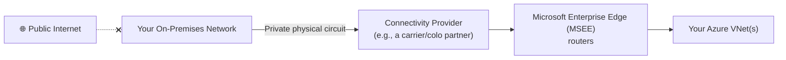

# Day 15 — VPN Gateway & ExpressRoute

**Phase 3 — Networking**

> Everything we've built across this entire networking phase has assumed one thing: all your resources live inside Azure. But almost no real company starts from zero — they already have an office, a data center, servers that aren't going anywhere anytime soon. Today we answer the question every one of those companies eventually asks: "how do I connect what I already have to Azure, securely, without routing sensitive traffic across the open internet unprotected?" That's called **hybrid networking**, and Azure gives you two very different ways to do it — **VPN Gateway**, an encrypted tunnel over the public internet, and **ExpressRoute**, a private dedicated circuit that never touches the internet at all. I don't have a real office network to plug into for this course, and neither do most of you — so today's hands-on is built entirely around techniques that prove the real mechanics using nothing but Azure resources and, for one demo, your own laptop standing in as "the remote site." That's not a simulation — it's the exact same configuration a real hybrid connection uses; the only thing missing is an actual building on the other end.

---

## What You'll Learn

- **Hybrid networking** — why organizations connect existing infrastructure to Azure instead of moving everything at once
- **Azure VPN Gateway** — encrypted IPsec/IKE tunnels over the public internet, and the two connection types it supports: **Site-to-Site** and **Point-to-Site**
- **VPN Gateway SKUs** — the current, zone-redundant SKU lineup (**VpnGw1AZ–VpnGw5AZ**), and why the legacy Basic/Standard/High Performance SKUs are gone as of mid-2026
- Hands-on: build a real **Site-to-Site-style VPN connection** using two Azure VNets standing in for "Azure" and "on-premises" — the exact same Local Network Gateway configuration you'd use for a real office, minus the physical building
- Hands-on: connect **your own laptop** to a VNet with a real **Point-to-Site VPN**, using the Azure VPN Client and Microsoft Entra ID authentication — no on-premises network required, because P2S was never about a site to begin with
- **ExpressRoute** — a private, dedicated circuit through a connectivity provider that never touches the public internet
- **ExpressRoute Direct**, **FastPath**, peering types, and circuit pricing models
- **Azure Virtual WAN** — Microsoft's managed hub-and-spoke networking fabric for connecting many sites and circuits at global scale
- Exam framing: how AZ-104 and AZ-305 expect you to choose between VPN Gateway, ExpressRoute, and Virtual WAN

---

## Before We Begin

This is one of the more expensive days in the course, and almost everything is **💳 instructor demo**.

- **VPN Gateway (VpnGw1AZ, the entry-level current SKU):** roughly **$0.20–$0.30/hour** (check the [VPN Gateway pricing page](https://azure.microsoft.com/en-us/pricing/details/vpn-gateway/) for your region — Microsoft has been actively lowering AZ-SKU prices to encourage migration off retired legacy SKUs). Provisioning takes **30–45 minutes** — we'll explain the architecture while it deploys.
- **Two VPN Gateways for the Site-to-Site-style demo:** double the above, since we're building both "sides" entirely in Azure.
- **Point-to-Site:** no separate charge beyond the VPN Gateway itself already being deployed — you're reusing one side of the gateway you already built.
- **ExpressRoute circuit:** requires a physical circuit from a connectivity provider — genuinely not something you or I can spin up for a demo. **💳 conceptual walkthrough + portal tour only**, no real circuit ordered.
- **Azure Virtual WAN:** billed per virtual hub deployed plus data processing — **💳 portal tour only** today.

Given the cost and 30–45 minute provisioning time, this entire day is realistically a **watch-and-understand** day for Free Tier students, with the option to follow along on a paid subscription if you want the real hands-on experience.

---

## Part 1 — Hybrid Networking: Why Connect to Anything Outside Azure?

### The Problem

Every VNet you've built this course has been fully self-contained. But real organizations almost always have something that already exists: an office network, a data center, a legacy application that can't move yet, or compliance requirements that keep certain data on-premises permanently. **Hybrid networking** is the practice of connecting that existing infrastructure to Azure so both sides can reach each other privately — as if they were one network.

Azure gives you two fundamentally different ways to build that connection:

| | VPN Gateway | ExpressRoute |
|---|---|---|
| **Path** | Encrypted tunnel over the public internet | Private, dedicated circuit via a connectivity provider — never touches the internet |
| **Setup time** | Minutes to provision the gateway itself | Days to weeks — requires ordering a physical circuit |
| **Cost** | Lower — pay for the gateway by the hour | Higher — port fees + circuit costs |
| **Bandwidth** | Capped by SKU, shared with internet-style variability | Higher, more consistent, SLA-backed |
| **Best for** | Quick setup, smaller offices, dev/test, backup path for ExpressRoute | High-bandwidth, latency-sensitive, regulatory/compliance-driven connectivity |

You'll see both again shortly, but the core idea to hold onto: **VPN Gateway is software-defined and internet-based; ExpressRoute is physical and private.**

---

## Part 2 — Azure VPN Gateway

### What It Is

An **Azure VPN Gateway** is a managed resource that sits inside a dedicated subnet in your VNet (called `GatewaySubnet` — the same mandatory-name pattern you saw with Azure Bastion's `AzureBastionSubnet` back on Day 11) and establishes an **encrypted IPsec/IKE tunnel** between Azure and whatever is on the other end.

There are two distinct connection types, and they solve genuinely different problems:

| Connection Type | Connects | Typical Use |
|---|---|---|
| **Site-to-Site (S2S)** | An entire remote network (an office, a data center — anything with its own VPN device) to an Azure VNet | Permanently linking a whole office network to Azure |
| **Point-to-Site (P2S)** | A single device (a laptop, a workstation) directly to an Azure VNet | An individual remote worker or administrator needing VNet access, with no office network involved at all |

That distinction matters enormously for today's lab: **P2S was never about connecting "a site"** — it connects one device, which is exactly why it's the one part of this topic that needs zero on-premises infrastructure to demo for real.

### VPN Gateway SKUs — What Changed in 2026

This is genuinely current, not textbook trivia. For years, Azure VPN Gateway offered a cheap **Basic** SKU and a set of legacy **Standard/High Performance** SKUs, none of which supported availability-zone redundancy. That's over:

- The **Basic SKU** (and any gateway still using a **Basic-SKU public IP**) had its retirement pushed back multiple times, and is now fully retired as of **the end of June 2026**.
- The legacy **Standard** and **High Performance** SKUs were deprecated on **June 30, 2026** — Microsoft auto-migrated any that were still running to their zone-redundant equivalents (Standard → **VpnGw1AZ**, High Performance → **VpnGw2AZ**).
- The **only SKUs you can deploy today** are the zone-redundant **VpnGw1AZ through VpnGw5AZ** lineup — every new gateway is inherently resilient across availability zones, something the old SKUs never offered.

| SKU | Max S2S Tunnels | Aggregate Throughput | BGP Support |
|---|---|---|---|
| **VpnGw1AZ** | 250 | ~650 Mbps | ✅ |
| **VpnGw2AZ** | 500 | ~1 Gbps | ✅ |
| **VpnGw3AZ** | 1000 | ~1.25 Gbps | ✅ |
| **VpnGw4AZ / VpnGw5AZ** | 2000+ | 2.5 Gbps+ | ✅ |

> **Exam tip:** if you see an older exam question or tutorial referencing "Basic SKU VPN Gateway," treat it as historical — as of mid-2026 it no longer exists as a deployable option. Always reach for a **VpnGw*AZ** SKU on any new deployment.

### Point-to-Site Authentication — Also Modernized

Point-to-Site used to lean heavily on certificate-based authentication (generate a root cert, generate client certs, distribute them manually). That still works, but the modern, recommended path is **Microsoft Entra ID authentication** — sign in with the same Entra ID credentials from Day 18, which means **Conditional Access and MFA** apply to VPN access exactly like they do to everything else in your tenant. Azure also now provides a **Microsoft-registered App ID** for the Azure VPN Client, meaning you skip the manual Entra app-registration step that used to be required — configure the gateway to use the published Audience value, and your tenant can use it immediately.

**Protocol support:** OpenVPN (SSL/TLS-based, works from Windows, Mac, Linux, iOS, Android) and IKEv2 are the current, actively supported protocols for the Azure VPN Client. If you're on Linux, note that the **Azure VPN Client for Linux is retiring on August 31, 2026** — worth knowing if you're building a hybrid access plan today.

---

### Hands-On: Site-to-Site-Style VPN — Two VNets Standing In for "Azure" and "On-Premises"

**💳 Instructor demo — two VPN Gateways, real cost, ~30–45 min provisioning each**

Here's the trick: a **Site-to-Site connection** is really just "my VPN Gateway talks to a device with a public IP on the other end, described to Azure as a **Local Network Gateway** resource." Azure doesn't actually care whether that other end is a physical office router or another Azure VPN Gateway — the configuration is identical either way. So instead of needing a real office, we'll build **two VNets, each with its own VPN Gateway**, and connect them to each other. This is Microsoft's own documented **VNet-to-VNet** pattern, and it exercises the exact same Local Network Gateway / Connection resources a real hybrid setup uses.

**Step 1 — Create two non-overlapping VNets:**

1. Search for **Virtual networks** → **+ Create**.
2. **Resource group:** `rg-day15-demo`, **Name:** `vnet-azure-side`, **Region:** East US, **Address space:** `10.0.0.0/16`, subnet `subnet-demo` at `10.0.1.0/24`.
3. Repeat with **Name:** `vnet-onprem-side`, **Region:** East US, **Address space:** `192.168.0.0/16`, subnet `subnet-demo` at `192.168.1.0/24` — deliberately non-overlapping, exactly like real on-premises ranges must be relative to your Azure VNets.

**Step 2 — Add a `GatewaySubnet` to each VNet:**

1. Open `vnet-azure-side` → **Subnets** → **+ Gateway subnet** (Azure provides a dedicated button for this exact subnet name).
2. Accept the default range (typically a `/27` or larger).
3. Repeat for `vnet-onprem-side`.

**Step 3 — Deploy a VPN Gateway into each VNet:**

1. Search for **Virtual network gateways** → **+ Create**.
2. Fill in:
   - **Name:** `vgw-azure-side`
   - **Region:** East US
   - **Gateway type:** VPN
   - **VPN type:** Route-based
   - **SKU:** VpnGw1AZ
   - **Virtual network:** `vnet-azure-side`
   - **Public IP:** Create new, name it `pip-vgw-azure-side` (Standard SKU, zone-redundant)
3. **Review + create** → **Create**. This takes **30–45 minutes** — start the second one in parallel rather than waiting.
4. Repeat with **Name:** `vgw-onprem-side`, same SKU, attached to `vnet-onprem-side`, public IP `pip-vgw-onprem-side`.

**Step 4 — Create Local Network Gateways (each side describing "the other network"):**

A **Local Network Gateway** is how Azure represents whatever's on the far end of a Site-to-Site tunnel — normally your office's public IP and address range. Here, we'll point each side's Local Network Gateway at the *other VNet's* gateway.

1. Search for **Local network gateways** → **+ Create**.
2. Fill in:
   - **Name:** `lng-onprem-side` (this represents `vnet-onprem-side`, as seen from the Azure side)
   - **IP address:** the public IP of `pip-vgw-onprem-side` (note it once that gateway finishes deploying)
   - **Address space:** `192.168.0.0/16`
3. **Review + create** → **Create**.
4. Repeat with **Name:** `lng-azure-side`, **IP address:** the public IP of `pip-vgw-azure-side`, **Address space:** `10.0.0.0/16`.

**Step 5 — Create the connections (both directions):**

1. Open `vgw-azure-side` → **Connections** → **+ Add**.
2. Fill in:
   - **Connection type:** Site-to-site (IPsec)
   - **Local network gateway:** `lng-onprem-side`
   - **Shared key (PSK):** type any strong shared secret — e.g., `Demo-PSK-2026!` — and use the **exact same value** on both sides; this is the pre-shared key both gateways use to authenticate the tunnel
3. **Add**.
4. Open `vgw-onprem-side` → **Connections** → **+ Add**, mirroring the same configuration: **Local network gateway:** `lng-azure-side`, same **shared key**.

**Step 6 — Verify the tunnel comes up:**

1. Give it a few minutes, then open either connection's **Overview** page.
2. **Status** should read **Connected**, with **Ingress/Egress** byte counters ticking upward as BGP keepalives and health checks pass.

**Step 7 — Prove it with a real VM:**

1. Deploy one small VM into `subnet-demo` in `vnet-azure-side` (`Standard_B1s`, no public IP needed) and one into `subnet-demo` in `vnet-onprem-side`.
2. From one VM, ping the other's private IP (`192.168.1.4`, for example). A successful reply proves traffic is flowing through the encrypted Site-to-Site tunnel, across two completely separate VNets that would otherwise have no route to each other at all.

This is the complete mechanic behind a real Site-to-Site connection to an actual office — the only difference in a real deployment is that `lng-onprem-side` would point at your office firewall's public IP instead of another Azure VPN Gateway, and the office-side device (not Azure) would hold the matching configuration.

**Step 8 — Clean up:**

VPN Gateways bill by the hour regardless of traffic — delete both (`vgw-azure-side`, `vgw-onprem-side`), both Local Network Gateways, both public IPs, and the two VNets when you're done, or delete the whole `rg-day15-demo` resource group in one step.

---

### Hands-On: Point-to-Site — Connect Your Own Laptop, No Office Required

**💳 Instructor demo — reuses one VPN Gateway; genuinely practical with just your own machine**

This is the one demo today that was never about a "site" in the first place — P2S connects a single device, and your own laptop is a perfectly legitimate example of that device. No office, no second location, no pretending required.

**Step 1 — Configure Point-to-Site on an existing gateway:**

You can reuse `vgw-azure-side` from the previous demo if it's still running, or deploy a fresh VpnGw1AZ gateway for this alone.

1. Open the gateway → **Point-to-site configuration** → **Configure now**.
2. **Address pool:** `172.16.0.0/24` (the range Azure hands out to connecting clients — must not overlap your VNet's own range).
3. **Tunnel type:** OpenVPN (IKEv2).
4. **Authentication type:** Microsoft Entra ID.
5. Fill in your tenant's **Entra ID**, **Audience** (use Azure's published Microsoft-registered App ID/Audience value for the Azure VPN Client, so you skip manual app registration entirely), and **Issuer** (`https://sts.windows.net/<your-tenant-id>/`).
6. **Save**.

**Step 2 — Download and install the Azure VPN Client:**

1. Back on **Point-to-site configuration**, click **Download VPN client** — this gives you a generated profile package pre-configured for your gateway.
2. Install the **Azure VPN Client** app (Windows or macOS) and import the downloaded profile.

**Step 3 — Connect:**

1. Open the Azure VPN Client, select the imported profile, and click **Connect**.
2. You'll be prompted to sign in with your Microsoft Entra ID credentials — if Conditional Access or MFA is configured on your tenant, it applies here exactly as it would signing into the Azure Portal.
3. Once connected, your laptop is issued an IP from the `172.16.0.0/24` pool and now has a private route into the VNet.

**Step 4 — Prove it:**

1. From your laptop's terminal, ping the private IP of the VM you deployed in `vnet-azure-side` earlier.
2. A successful reply means your own physical machine — wherever you're sitting right now — is privately reachable from, and to, an Azure VNet, over an encrypted tunnel, authenticated with your Entra ID identity. No office network, no VPN appliance, no physical hardware anywhere in this picture.

**Step 5 — Disconnect and clean up:**

1. Disconnect in the Azure VPN Client.
2. Remove the Point-to-Site configuration from the gateway if you're done, and proceed to delete the gateway itself as part of Step 8 above if you haven't already.

---

## Part 3 — ExpressRoute

### What It Is

**ExpressRoute** is a **private, dedicated network connection** between your on-premises network (or a colocation facility) and Azure, provisioned through a **connectivity provider** — it never touches the public internet at all.

Because the traffic never crosses the public internet, ExpressRoute gives you **higher, more consistent bandwidth**, **lower and more predictable latency**, and an **SLA** — at the cost of a much longer setup time (ordering and provisioning a physical circuit genuinely takes days to weeks) and significantly higher price.

### Peering Types

| Peering Type | What It Connects To |
|---|---|
| **Private Peering** | Your VNets — the equivalent of what VPN Gateway does, but over a private circuit instead of an internet tunnel |
| **Microsoft Peering** | Microsoft's public services directly — Microsoft 365, Azure PaaS public endpoints — without traversing the internet |

### ExpressRoute Direct

**ExpressRoute Direct** lets large customers connect **directly** into Microsoft's global network at the physical layer, via dedicated **10, 100, or 400 Gbps port pairs** at a Microsoft Enterprise Edge (MSEE) site — skipping the connectivity provider entirely for organizations that need that scale. It supports active-active connectivity across the port pair for resilience.

### FastPath — Bypassing the Gateway for Performance

By default, ExpressRoute traffic flows through your VNet's ExpressRoute gateway before reaching your VMs — that gateway can become a bottleneck at very high throughput. **FastPath** routes network traffic from on-premises **directly to VMs**, bypassing the gateway's data path entirely, dramatically improving throughput and latency for eligible configurations. On 100/400-Gbps ExpressRoute Direct circuits, FastPath now supports up to 100 Gbps of connectivity to a single availability zone. There's also a newer (limited-GA) capability enabling FastPath to work with **Private Link** connectivity over ExpressRoute Direct circuits for specific high-scale scenarios — worth knowing exists, even if it's not something a beginner will configure directly.

### Pricing Model

ExpressRoute circuits are billed one of two ways:

- **Metered Data plan:** a monthly port/circuit fee, plus a charge per GB of outbound data transferred.
- **Unlimited Data plan:** a single higher fixed monthly fee that includes all inbound and outbound data transfer.

ExpressRoute Direct itself is billed as a **flat port-pair fee**, with individual circuits provisioned within that port capacity billed separately on top.

### Hands-On: Portal Tour (No Physical Circuit)

**💳 Conceptual walkthrough only — a real circuit requires an actual connectivity provider and cannot be demoed**

1. Search for **ExpressRoute circuits** → **+ Create**, and walk through the **Create ExpressRoute circuit** blade: provider selection, peering location, bandwidth, and the Metered vs. Unlimited data plan choice — without completing the purchase.
2. Show the **ExpressRoute Direct** creation blade separately, pointing out the port-pair bandwidth options (10/100/400 Gbps) and where FastPath and Private Link options would surface once a real circuit exists.
3. Emphasize the **provisioning workflow**: after creating the circuit resource in Azure, you (or your connectivity provider) must also authorize and activate it in the provider's own system before the circuit goes live — this is why ExpressRoute timelines are measured in weeks, not minutes.

---

## Part 4 — Azure Virtual WAN

### What It Is

**Azure Virtual WAN** is Microsoft's fully managed hub-and-spoke networking service, designed for organizations with **many** branch offices, VPN connections, and ExpressRoute circuits that would otherwise require you to manually build and maintain a mesh of individual gateways and connections yourself.

A **Virtual WAN hub** is a Microsoft-managed VNet that can simultaneously host VPN Gateway connections (Site-to-Site and Point-to-Site), ExpressRoute connections, and VNet-to-VNet connections — all managed as one unified routing domain, with Microsoft handling the underlying gateway infrastructure and route propagation for you.

**Why it exists:** if you're a large enterprise with 50 branch offices, building 50 individual VPN Gateway connections and manually managing routes between all of them doesn't scale. Virtual WAN turns that into a hub-and-spoke model where every site connects to the hub once, and the hub handles routing everywhere else automatically.

### Hands-On: Portal Tour

**💳 Portal tour only — billed per virtual hub and data processed, not something to leave running for a demo**

1. Search for **Virtual WANs** → **+ Create**, and walk through creating a Virtual WAN resource and its first **hub**.
2. Show where you'd attach a **VPN site**, an **ExpressRoute circuit**, or a **VNet connection** to that hub — pointing out that this is the same Site-to-Site and Point-to-Site VPN configuration from Part 2, just orchestrated centrally instead of gateway-by-gateway.
3. Close out without deploying, to avoid the ongoing per-hub charge.

---

## Summary

Today closed out the hybrid networking picture — connecting Azure to whatever already exists outside it, without needing an actual office network to prove any of it.

**VPN Gateway** builds encrypted IPsec tunnels over the public internet, in two flavors: **Site-to-Site** for connecting an entire remote network, and **Point-to-Site** for connecting a single device. You proved Site-to-Site's exact mechanics using two Azure VNets standing in for "Azure" and "on-premises," connected via Local Network Gateways and a shared key — the identical configuration a real office deployment uses. You then proved Point-to-Site for real, connecting your own laptop over an encrypted tunnel authenticated with Microsoft Entra ID, no on-premises network involved at all. Along the way, you learned that the old Basic/Standard/High Performance VPN Gateway SKUs are fully retired as of mid-2026 — every new gateway today is a zone-redundant **VpnGw*AZ** SKU.

**ExpressRoute** is the private, dedicated alternative — a physical circuit through a connectivity provider that never touches the internet, offering higher and more consistent bandwidth with an SLA, at the cost of weeks of provisioning time and a much higher price. **ExpressRoute Direct** and **FastPath** push that further for organizations that need raw port-level scale and gateway-bypass performance.

**Azure Virtual WAN** wraps both VPN and ExpressRoute connectivity into a single, Microsoft-managed hub-and-spoke fabric — the right answer once you have too many sites and circuits to manage as individual gateways.

### What's Next

You've now covered the complete Azure networking phase: addressing fundamentals, VNets and NSGs, peering and private connectivity, load balancing and global routing, DNS, and hybrid connectivity to the outside world. From here, the course moves into Phase 4: **Azure Functions & Serverless** — shifting from "how traffic moves" to "how your code runs without you managing a server at all."

---

## Key Takeaways

- **Hybrid networking** connects existing on-premises infrastructure to Azure — via **VPN Gateway** (encrypted internet tunnel) or **ExpressRoute** (private dedicated circuit)
- **Site-to-Site (S2S)** connects an entire remote network to a VNet; **Point-to-Site (P2S)** connects a single device — and only P2S can be demoed for real without any on-premises infrastructure, since it was never about a "site"
- A **Local Network Gateway** represents whatever's on the far end of a Site-to-Site tunnel — Azure doesn't care whether that's a physical office router or another Azure VPN Gateway, which is exactly why a VNet-to-VNet setup exercises the real mechanics
- **VPN Gateway SKUs are fully zone-redundant now** — Basic SKU (and Basic-SKU public IPs) retired end of June 2026; legacy Standard/High Performance SKUs deprecated the same date and auto-migrated to VpnGw1AZ/VpnGw2AZ; only **VpnGw1AZ–VpnGw5AZ** are deployable today
- **Point-to-Site now favors Microsoft Entra ID authentication** over manual certificates — bringing Conditional Access and MFA to VPN access, with a Microsoft-registered App ID removing the old manual app-registration step
- The **Azure VPN Client for Linux retires August 31, 2026** — plan accordingly if Linux P2S clients are part of your design
- **ExpressRoute** never touches the public internet — **Private Peering** reaches your VNets, **Microsoft Peering** reaches Microsoft's public services directly
- **ExpressRoute Direct** offers dedicated 10/100/400 Gbps port pairs directly into Microsoft's network; **FastPath** bypasses the ExpressRoute gateway for direct-to-VM performance, now supporting up to 100 Gbps to a single availability zone on high-bandwidth Direct circuits
- **Azure Virtual WAN** is Microsoft's managed hub-and-spoke alternative to manually building and maintaining individual gateways per site — the right tool once you have many branches, VPN connections, and ExpressRoute circuits to manage together
- Exam framing: VPN Gateway for quick, cheaper, internet-based hybrid connectivity; ExpressRoute for high-bandwidth, low-latency, SLA-backed private connectivity; Virtual WAN for centrally managing either at scale across many sites
