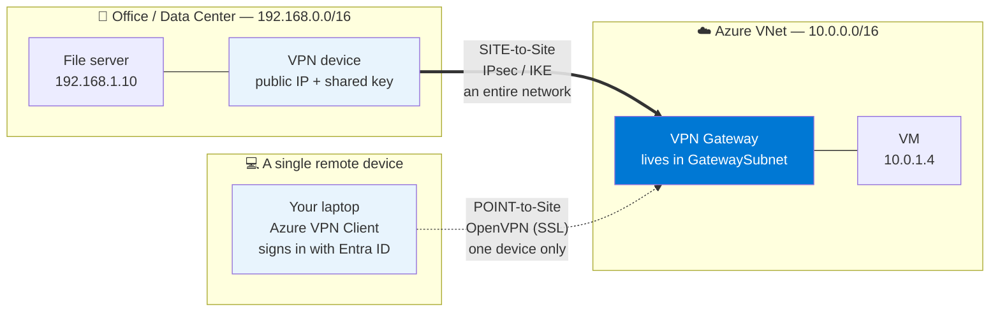
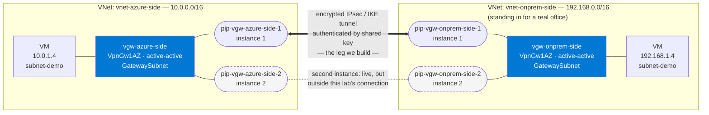
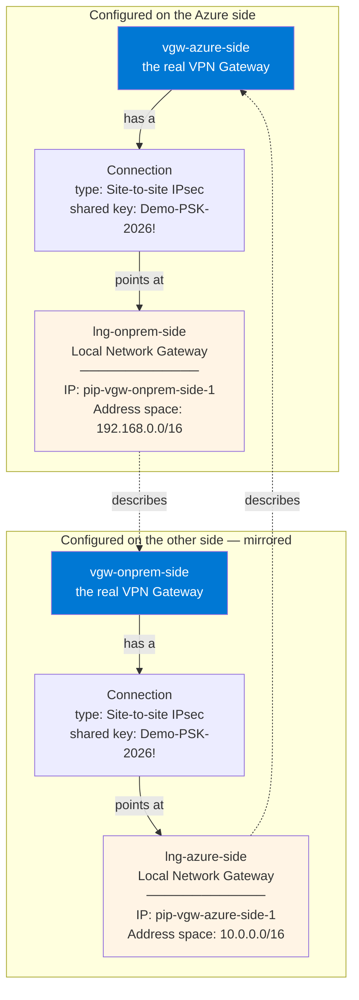
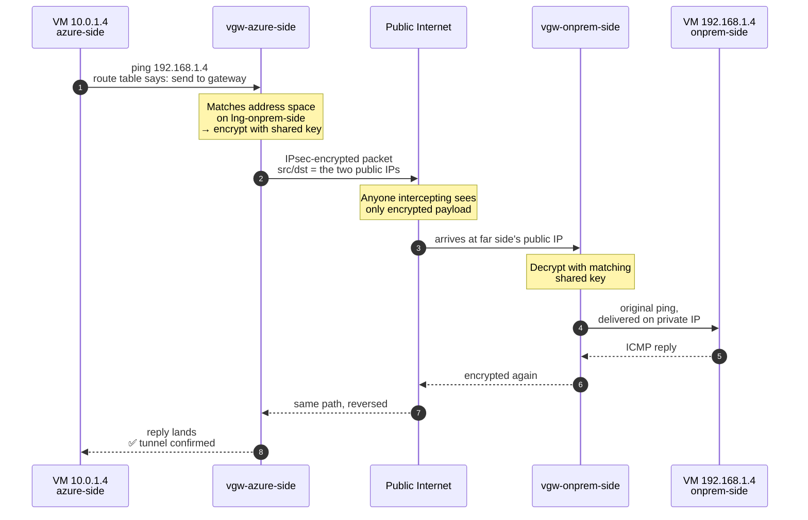
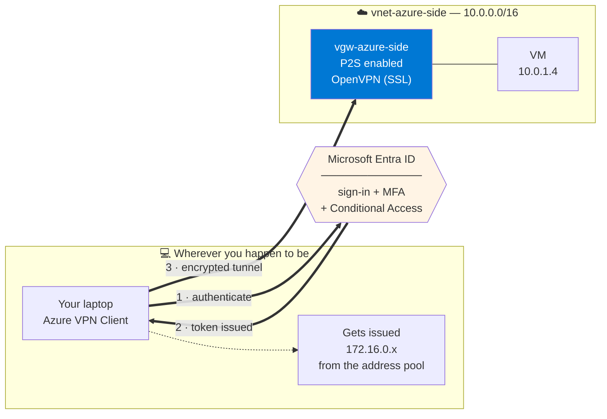
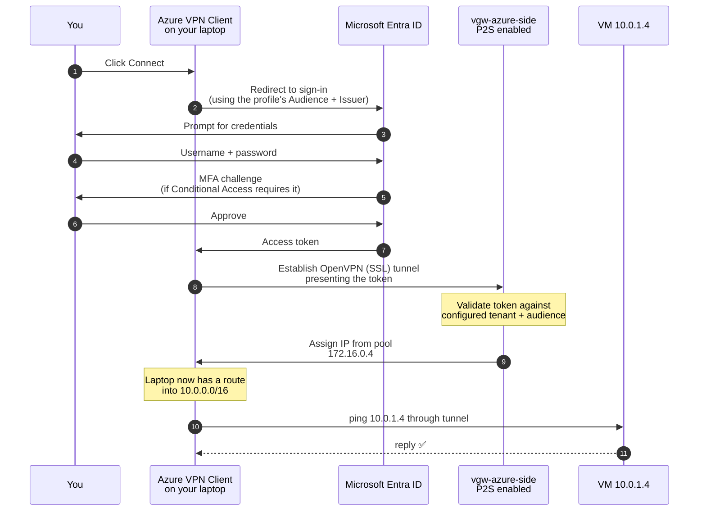
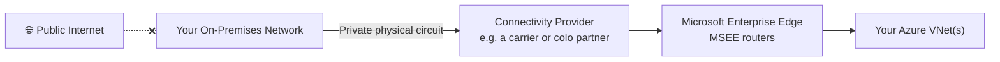

# Day 15 — VPN Gateway & ExpressRoute

**Phase 3 — Networking**

> Everything we've built across this entire networking phase has assumed one thing: all your resources live inside Azure. But almost no real company starts from zero — they already have an office, a data center, servers that aren't going anywhere anytime soon. Today we answer the question every one of those companies eventually asks: "how do I connect what I already have to Azure, securely, without routing sensitive traffic across the open internet unprotected?" That's called **hybrid networking**, and Azure gives you two very different ways to do it — **VPN Gateway**, an encrypted tunnel over the public internet, and **ExpressRoute**, a private dedicated circuit that never touches the internet at all. I don't have a real office network to plug into for this course, and neither do most of you — so today's hands-on is built entirely around techniques that prove the real mechanics using nothing but Azure resources and, for one demo, your own laptop standing in as "the remote site." That's not a simulation — it's the exact same configuration a real hybrid connection uses; the only thing missing is an actual building on the other end.

---

## What You'll Learn

- **Hybrid networking** — why organizations connect existing infrastructure to Azure instead of moving everything at once
- **Azure VPN Gateway** — encrypted IPsec/IKE tunnels over the public internet, and the two connection types it supports: **Site-to-Site** and **Point-to-Site**
- **VPN Gateway SKUs** — the current, zone-redundant SKU lineup (**VpnGw1AZ–VpnGw5AZ**), the two **generations** they come in, and where the legacy Standard/High Performance and non-AZ SKUs went during the 2025–2026 consolidation
- Hands-on: build a real **Site-to-Site-style VPN connection** using two Azure VNets standing in for "Azure" and "on-premises" — the exact same Local Network Gateway configuration you'd use for a real office, minus the physical building
- Hands-on: connect **your own laptop** to a VNet with a real **Point-to-Site VPN**, using the Azure VPN Client and Microsoft Entra ID authentication — no on-premises network required, because P2S was never about a site to begin with
- **ExpressRoute** — a private, dedicated circuit through a connectivity provider that never touches the public internet
- **ExpressRoute Direct**, **FastPath**, peering types, and circuit pricing models
- **Azure Virtual WAN** — Microsoft's managed hub-and-spoke networking fabric for connecting many sites and circuits at global scale
- Exam framing: how AZ-104 and AZ-305 expect you to choose between VPN Gateway, ExpressRoute, and Virtual WAN

---

## Before We Begin

This is one of the more expensive days in the course, and almost everything is **💳 instructor demo**.

- **VPN Gateway (VpnGw1AZ, the entry-level current SKU):** roughly **$0.20–$0.30/hour** (check the [VPN Gateway pricing page](https://azure.microsoft.com/en-us/pricing/details/vpn-gateway/) for your region — Microsoft has been actively lowering AZ-SKU prices to encourage migration off the retiring non-AZ SKUs). Microsoft's own guidance is that provisioning takes **45 minutes or more** — we'll explain the architecture while it deploys. Budget **90–120 minutes** for the full Site-to-Site lab end to end.
- **Public IP addresses:** an active-active gateway needs **two Standard SKU public IPs**, and Standard public IPs are billed hourly. It's a small charge next to the gateway itself, but it's twice as many meters running.
- **Two VPN Gateways for the Site-to-Site-style demo:** double the above, since we're building both "sides" entirely in Azure.
- **Point-to-Site:** no separate charge beyond the VPN Gateway itself already being deployed — you're reusing one side of the gateway you already built.
- **ExpressRoute circuit:** requires a physical circuit from a connectivity provider — genuinely not something you or I can spin up for a demo. **💳 conceptual walkthrough + portal tour only**, no real circuit ordered.
- **Azure Virtual WAN:** billed per virtual hub deployed plus data processing — **💳 portal tour only** today.

Given the cost and 30–45 minute provisioning time, this entire day is realistically a **watch-and-understand** day for Free Tier students, with the option to follow along on a paid subscription if you want the real hands-on experience.

---

## Part 1 — Hybrid Networking: Why Connect to Anything Outside Azure?

### The Problem

Every VNet you've built this course has been fully self-contained. But real organizations almost always have something that already exists: an office network, a data center, a legacy application that can't move yet, or compliance requirements that keep certain data on-premises permanently. **Hybrid networking** is the practice of connecting that existing infrastructure to Azure so both sides can reach each other privately — as if they were one network.

Azure gives you two fundamentally different ways to build that connection:

| | VPN Gateway | ExpressRoute |
|---|---|---|
| **Path** | Encrypted tunnel over the public internet | Private, dedicated circuit via a connectivity provider — never touches the internet |
| **Setup time** | Minutes to provision the gateway itself | Days to weeks — requires ordering a physical circuit |
| **Cost** | Lower — pay for the gateway by the hour | Higher — port fees + circuit costs |
| **Bandwidth** | Capped by SKU, shared with internet-style variability | Higher, more consistent, SLA-backed |
| **Best for** | Quick setup, smaller offices, dev/test, backup path for ExpressRoute | High-bandwidth, latency-sensitive, regulatory/compliance-driven connectivity |

You'll see both again shortly, but the core idea to hold onto: **VPN Gateway is software-defined and internet-based; ExpressRoute is physical and private.**

---

## Part 2 — Azure VPN Gateway

### What It Is

An **Azure VPN Gateway** is a managed resource that sits inside a dedicated subnet in your VNet (called `GatewaySubnet` — the same mandatory-name pattern you saw with Azure Bastion's `AzureBastionSubnet` back on Day 11) and establishes an **encrypted IPsec/IKE tunnel** between Azure and whatever is on the other end.

There are two distinct connection types, and they solve genuinely different problems:

| Connection Type | Connects | Typical Use |
|---|---|---|
| **Site-to-Site (S2S)** | An entire remote network (an office, a data center — anything with its own VPN device) to an Azure VNet | Permanently linking a whole office network to Azure |
| **Point-to-Site (P2S)** | A single device (a laptop, a workstation) directly to an Azure VNet | An individual remote worker or administrator needing VNet access, with no office network involved at all |

That distinction matters enormously for today's lab: **P2S was never about connecting "a site"** — it connects one device, which is exactly why it's the one part of this topic that needs zero on-premises infrastructure to demo for real.

Here's both connection types on one picture. Notice that **the VPN Gateway is the same resource in both cases** — one gateway can serve Site-to-Site and Point-to-Site connections simultaneously. What changes is what's on the other end of the tunnel, and how that other end proves who it is:

Read it this way: **Site-to-Site is a permanent, always-on link between two networks**, authenticated by a shared key configured on a physical device that someone installed in a building. **Point-to-Site is an on-demand link from one machine**, authenticated by a person signing in. That's why S2S needs hardware and P2S needs only an app.

### VPN Gateway SKUs — What Changed in 2025–2026

This is genuinely current, not textbook trivia. Azure has spent the last two years consolidating a messy SKU portfolio down to one clean family, and the dates matter because half the tutorials online still show the old options:

- The legacy **Standard** and **High Performance** SKUs were deprecated in **June 2026**. Microsoft auto-migrated any that were still running to their zone-redundant equivalents — Standard → **VpnGw1AZ**, High Performance → **VpnGw2AZ**.
- The **non-AZ VpnGw1–VpnGw5** SKUs are on their way out too. You haven't been able to create a new one since **November 1, 2025**, and they retire on **September 30, 2026**. Existing ones stopped accepting configuration changes once the rollout reached them.
- That leaves the zone-redundant **VpnGw1AZ through VpnGw5AZ** lineup as what you actually deploy — every new gateway is resilient across availability zones, something the old SKUs never offered. In regions that don't yet have availability zones you can still deploy an AZ SKU; it stays regional until the region catches up.
- **The Basic SKU is *not* retired** — this trips people up constantly, because a *different* Basic thing is retiring. The **Basic SKU public IP address** is being deprecated (end of June 2026 for VPN gateways), and every new gateway must use a **Standard** public IP. The Basic *gateway* SKU still exists — it's just **not offered in the portal at all** any more. If you ever genuinely need it, you create it with PowerShell or the Azure CLI. It's dev/test only: no BGP, no active-active, no IPv6, no RADIUS, and 100 Mbps.

Every AZ SKU also comes in a **Generation**, and this catches people out in the portal — the Generation dropdown filters which SKUs you can pick:

| Generation | SKU | Max S2S / VNet-to-VNet Tunnels | Max P2S (IKEv2/OpenVPN) | Aggregate Throughput | BGP |
|---|---|---|---|---|---|
| **Generation 1** | **VpnGw1AZ** | 30 | 250 | 650 Mbps | ✅ |
| **Generation 1** | **VpnGw2AZ** | 30 | 500 | 1 Gbps | ✅ |
| **Generation 1** | **VpnGw3AZ** | 30 | 1000 | 1.25 Gbps | ✅ |
| **Generation 2** | **VpnGw2AZ** | 30 | 500 | 1.25 Gbps | ✅ |
| **Generation 2** | **VpnGw3AZ** | 30 | 1000 | 2.5 Gbps | ✅ |
| **Generation 2** | **VpnGw4AZ** | 100 | 5000 | 5 Gbps | ✅ |
| **Generation 2** | **VpnGw5AZ** | 100 | 10000 | 10 Gbps | ✅ |

Three things to read off that table, because they're all exam-relevant and all commonly misremembered:

- **Tunnel counts and client counts are different numbers.** A VpnGw1AZ supports **30** Site-to-Site tunnels but **250** Point-to-Site clients. People quote the 250 as a tunnel count all the time; it isn't. If you genuinely need more than **100** S2S tunnels, Microsoft's answer isn't a bigger gateway — it's **Virtual WAN**, which we cover in Part 4.
- **VpnGw1AZ only exists in Generation 1.** If your Generation dropdown says Generation 2, VpnGw1AZ simply won't appear in the SKU list. That's not a bug, and we'll hit it live in the demo.
- **Generation 2 is faster at the same SKU name.** A Generation 2 VpnGw3AZ does 2.5 Gbps; the Generation 1 VpnGw3AZ does 1.25 Gbps. Same name, double the throughput.

> **Exam tip:** if you see an older exam question or tutorial telling you to pick "Basic" or plain "VpnGw2" in the portal, treat it as historical — the portal only offers **VpnGw*AZ** SKUs now. Always reach for an AZ SKU on any new deployment.

### Point-to-Site Authentication — Also Modernized

Point-to-Site used to lean heavily on certificate-based authentication (generate a root cert, generate client certs, distribute them manually). That still works, but the modern, recommended path is **Microsoft Entra ID authentication** — sign in with the same Entra ID credentials from Day 17, which means **Conditional Access and MFA** apply to VPN access exactly like they do to everything else in your tenant. Azure also now provides a **Microsoft-registered App ID** for the Azure VPN Client, meaning you skip the manual Entra app-registration step that used to be required — configure the gateway to use the published Audience value and your tenant can use it immediately, with no Cloud App Administrator consent step at all.

That older manual registration path still functions, but it has an end date: **manually registered Azure VPN Clients retire on March 31, 2028** in Azure Public Cloud (March 31, 2029 for Government and 21Vianet). Anything you build today should use the Microsoft-registered App ID.

**Protocol support — read this carefully, because it's a common exam trap.** The Azure VPN Client connecting with **Microsoft Entra ID authentication requires the OpenVPN (SSL) tunnel type**. IKEv2 is a perfectly valid tunnel type on a VPN Gateway, but it authenticates with certificates or RADIUS — *not* Entra ID. So "Entra ID sign-in" and "IKEv2" are mutually exclusive choices, and the portal will happily let you configure a combination that never connects.

**Client platforms:** the Azure VPN Client is supported on **Windows** (10 and 11, on x64/x86/ARM64) and **macOS**. The **Azure VPN Client for Linux was a preview and retires on August 31, 2026** — if Linux P2S clients are in your design, you need a different plan.

### Two Recent Additions Worth Knowing About

Both landed in 2026 and neither shows up in older tutorials, so they're easy currency points for you:

- **Site-to-Site certificate authentication.** A shared key isn't your only option for S2S any more — you can authenticate the tunnel with **digital certificates** instead of a PSK. Same tunnel, better key management story for organizations that already run a PKI. We'll still use a PSK in the lab because it's the clearer teaching path.
- **Point-to-Site user groups and per-group address pools.** You can now assign **different client address pools to different Entra ID groups**. Contractors land in one range, full-time staff in another, and your NSGs and route tables can then treat those ranges differently. That's a genuinely powerful pattern: network-level segmentation driven purely by group membership in Entra ID.

---

### Hands-On: Site-to-Site-Style VPN — Two VNets Standing In for "Azure" and "On-Premises"

**💳 Instructor demo — two VPN Gateways, real cost, 45+ min provisioning each**

Here's the trick: a **Site-to-Site connection** is really just "my VPN Gateway talks to a device with a public IP on the other end, described to Azure as a **Local Network Gateway** resource." Azure doesn't actually care whether that other end is a physical office router or another Azure VPN Gateway — the configuration is identical either way. So instead of needing a real office, we'll build **two VNets, each with its own VPN Gateway**, and connect them with a **Site-to-Site connection** in exactly the way you'd connect a real building.

**One honest clarification before we start.** Azure *does* have a purpose-built **VNet-to-VNet** connection type for joining two Azure VNets — you pick it from the same Connections blade, tick **Establish bidirectional connectivity**, and it creates both connections at once. It's faster, and if your only goal were "make these two VNets talk," that's what you'd use. But it hides the Local Network Gateway entirely — Azure creates one behind the scenes that you can't see or edit. We're deliberately taking the **Site-to-Site** route instead, because the Local Network Gateway *is* the concept you need for real hybrid networking and for the exam. Microsoft's own guidance says the same thing: use the site-to-site steps when you need control over the local network gateway. I'll show you the VNet-to-VNet shortcut on screen so you know it exists, then we'll build the version that teaches you something.

**This is what we're about to build** — keep this picture in mind as we go through the steps, because every resource in it maps to one step below:

**Step 1 — Create two non-overlapping VNets:**

1. Search for **Virtual networks** → **+ Create**.
2. **Resource group:** `rg-day15-demo`, **Name:** `vnet-azure-side`, **Region:** East US, **Address space:** `10.0.0.0/16`, subnet `subnet-demo` at `10.0.1.0/24`.
3. Repeat with **Name:** `vnet-onprem-side`, **Region:** East US, **Address space:** `192.168.0.0/16`, subnet `subnet-demo` at `192.168.1.0/24` — deliberately non-overlapping, exactly like real on-premises ranges must be relative to your Azure VNets.

**Step 2 — Add a `GatewaySubnet` to each VNet:**

There used to be a dedicated **+ Gateway subnet** button here. It's gone — the flow is now unified with normal subnet creation, and you get `GatewaySubnet` by declaring the subnet's *purpose*:

1. Open `vnet-azure-side` → **Subnets** → **+ Subnet**.
2. For **Subnet purpose**, select **Virtual Network Gateway** from the dropdown. Watch the **Name** field — it auto-fills to `GatewaySubnet` and locks. That's Azure enforcing the mandatory name for you.
3. Set the range to `10.0.255.0/27`. Microsoft's guidance is **/27 or larger** (/26, /25). Don't be clever and squeeze it into a /29 — some gateway features and future SKU migrations need the headroom, and an undersized gateway subnet is a documented cause of failed migrations later.
4. Leave everything else alone and click **Add**.
5. Repeat for `vnet-onprem-side`, using `192.168.255.0/27`.

⚠️ **Never attach an NSG to `GatewaySubnet`.** It's not supported and it will make your gateway misbehave in ways that are miserable to diagnose. This is one of the few places in Azure networking where the answer is genuinely "don't."

**Step 3 — Deploy a VPN Gateway into each VNet:**

1. Search for **Virtual network gateways** → **+ Create**.
2. On the **Basics** tab, fill in:
   - **Name:** `vgw-azure-side`
   - **Region:** East US (must match the VNet)
   - **Gateway type:** VPN
   - **SKU:** VpnGw1AZ
   - **Generation:** **Generation 1**
   - **Virtual network:** `vnet-azure-side`
   - **Subnet:** should auto-populate with the `GatewaySubnet` you just created

   > 🛑 **Pause here on camera — this is the gotcha from the SKU table.** If you set **Generation** to Generation 2 first, **VpnGw1AZ disappears from the SKU dropdown**, because VpnGw1AZ only exists in Generation 1. Students will think the portal is broken. Show it happening deliberately: pick Generation 2, watch VpnGw1AZ vanish, switch back to Generation 1, watch it return. Microsoft's own tutorials use **VpnGw2AZ + Generation 2** — that's the more production-typical pairing, and it's what you'd choose if cost weren't a factor. We're on VpnGw1AZ purely because it's the cheapest thing that can do this lab, and we're building two of them.

3. Still on **Basics**, fill in the **Public IP address** section:
   - **Public IP address:** Create new, named `pip-vgw-azure-side-1`
   - **Public IP address SKU:** auto-selected as **Standard** (Basic public IPs are being retired — this is no longer a choice, and that's a good thing)
   - **Assignment:** **Static** (auto-selected)
   - **Availability zone:** **Zone-redundant**
   - **Enable active-active mode:** **Enabled**. Microsoft recommends this for any production gateway, and it's why the blade then asks you for a **second** public IP. Note that it is *not* the default — a VPN Gateway is active-standby unless you explicitly turn this on, so you have to reach for it.
   - **Second public IP address:** Create new, named `pip-vgw-azure-side-2`, also **Zone-redundant**
   - **Configure BGP:** **Disabled** (if you ever enable it, the default ASN is 65515)
   - **Enable Key Vault Access:** **Disabled**
4. **Review + create** → **Create**. Microsoft's stated time is **45 minutes or more** — start the second gateway in parallel rather than waiting, or you'll be sitting here for an hour and a half.
5. Repeat with **Name:** `vgw-onprem-side`, same SKU and generation, attached to `vnet-onprem-side`, public IPs `pip-vgw-onprem-side-1` and `pip-vgw-onprem-side-2`.

Once both are deployed, grab the addresses from each gateway's **Properties** page (not Overview — it's under **Settings** → **Properties**). An active-active gateway lists **two** public IPs there, one per instance. You'll need them in the next step.

**Why two public IPs? Active-active vs. active-standby.**

Every VPN Gateway is really **two** VM instances under the hood — you never see them, and the gateway is billed as one resource either way. What this setting controls is what the second instance *does*:

- **Active-standby** (the default) — one instance carries all traffic, one sits idle. If the active one fails or Azure patches it, the standby takes over, which causes a brief interruption: short for planned maintenance, longer for an unplanned failure. One public IP, one tunnel. Worth knowing: for **Point-to-Site** clients, a failover **disconnects them** and they have to reconnect manually.
- **Active-active** (what we're deploying) — **both** instances carry traffic simultaneously, each with its own public IP and its own tunnel to the far end, and in a region with availability zones they're zone-redundant. Azure spreads traffic across both tunnels at once. Lose an instance, lose a zone, or lose one tunnel, and the other keeps forwarding. This is what you want for anything business-critical, and it's what Microsoft recommends for every new gateway.

So the second public IP isn't a mistake or an upsell — it's the address of the second live gateway instance. Both are real, both are reachable, and both will build tunnels.

⚠️ **The corollary that people miss:** because both instances are active, the device on the far end has to be configured to accept **two** tunnels, one per Azure instance. Microsoft is blunt about this — *"if you establish a tunnel to only one gateway VM instance, the connection will go down during maintenance."* In a real deployment you check whether your office firewall even supports that; if it doesn't, you deliberately choose active-standby instead. This is a genuine design decision, not a checkbox.

The one wrinkle to keep in your head for the next step: a **Local Network Gateway describes exactly one endpoint**. It cannot describe a two-IP far end on its own.

**Step 4 — Create Local Network Gateways (each side describing "the other network"):**

A **Local Network Gateway** is how Azure represents whatever's on the far end of a Site-to-Site tunnel — normally your office's public IP and address range. Here, we'll point each side's Local Network Gateway at the *other VNet's* gateway.

Remember the wrinkle: an LNG describes **one** endpoint, but each of our gateways now has two addresses. **We're going to use the `-1` address on each side and leave the `-2` address out of the lab.** That's not a workaround — it's exactly how Azure models "my active-active gateway talks to a single remote VPN device." Both of your local instances will still build tunnels toward that one remote address, so you get redundancy on your own side. I'll show you what full redundancy on *both* sides would look like right after.

1. Search for **Local network gateways** → **+ Create**.
2. On the **Basics** tab, fill in:
   - **Name:** `lng-onprem-side` (this represents `vnet-onprem-side`, as seen from the Azure side)
   - **Region:** East US
   - **Endpoint:** **IP address** — then enter the address of `pip-vgw-onprem-side-1`
   - **Address space:** `192.168.0.0/16`
3. Leave the **Advanced** tab alone (that's where BGP settings live).
4. **Review + create** → **Create**.
5. Repeat with **Name:** `lng-azure-side`, endpoint IP = the address of `pip-vgw-azure-side-1`, **Address space:** `10.0.0.0/16`.

**Say a word about that `Endpoint` dropdown** — it's a genuinely useful real-world detail. Your other choice is **FQDN (Fully Qualified Domain Name)**, and it exists for offices whose ISP hands them a *dynamic* public IP. Instead of an address that goes stale, you point the LNG at a Dynamic DNS name and Azure resolves it. Three caveats if you use it: Azure takes only the **first IPv4 address** returned (so the name must resolve to a single address), it caches DNS for about **5 minutes**, and if you have several LNGs using FQDNs they must all resolve to *different* addresses. IPv6 isn't supported here.

⚠️ **Write down which IP you used on each side.** With four public IPs floating around, mixing up a `-1` and a `-2` is the single most common reason a connection in this lab sits at **Connecting** forever.

**What full dual-redundancy would look like in production** (worth describing on camera, not worth building here): you'd create a *second* Local Network Gateway on each side — `lng-onprem-side-2` pointing at `pip-vgw-onprem-side-2` — and a *second* Connection bound to it. Four LNGs and four Connections across both sides, yielding a full mesh where any single gateway instance, tunnel, or availability zone can drop without interrupting traffic. In a real hybrid setup this is the same pattern, except the second address belongs to your **second on-premises VPN device** sitting in a different rack or building. We're building one leg of that mesh because one leg teaches the entire concept.

**Step 5 — Create the connections (both directions):**

Creating a connection is a proper two-tab wizard now, not a three-field pop-out — so don't go looking for a quick **Add** button that finishes the job.

1. Open `vgw-azure-side` → **Connections** → **+ Add**. This opens the **Create connection** page.
2. On the **Basics** tab:
   - **Connection type:** **Site-to-site (IPsec)**
   - **Name:** `conn-azure-to-onprem`
   - **Region:** East US
3. Click **Next : Settings >**. On the **Settings** tab:
   - **Virtual network gateway:** `vgw-azure-side` (pre-filled)
   - **Local network gateway:** `lng-onprem-side`
   - **Shared key (PSK):** type a strong shared secret — e.g., `Demo-PSK-2026!` — and use the **exact same value** on both sides. Microsoft's recommendation for real deployments is at least **32 characters** mixing upper, lower, digits and symbols. This is the pre-shared key both gateways use to authenticate the tunnel.
   - **IKE Protocol:** **IKEv2**
   - Leave the rest at their defaults, and know what they are, because students will ask: **Use Azure Private IP Address** (unchecked), **Enable BGP** (unchecked), **FastPath** (unchecked — that's an ExpressRoute feature we discuss in Part 3), **IPsec/IKE policy: Default**, **Use policy based traffic selector: Disable**, **DPD timeout: 45** seconds, **Connection Mode: Default** (which side may initiate the tunnel).
   - **NAT Rules Associations:** leave both Ingress and Egress at **0 selected**.
4. **Review + create** → **Create**.
5. Now mirror it from the other side: open `vgw-onprem-side` → **Connections** → **+ Add**, name it `conn-onprem-to-azure`, **Local network gateway:** `lng-azure-side`, and the **same shared key**.

> If the **Shared key** field doesn't render on the Settings tab for you — it occasionally doesn't, depending on the connection type — create the connection anyway, then open it and set the key on its **Authentication** page. That's also where you go to rotate a PSK later.

**How those four resources actually relate** — this is the part that trips everyone up, so here it is drawn out. The key insight: a **Local Network Gateway is not a gateway at all.** It's a *description* of the far end — nothing more than an endpoint (a public IP or FQDN) and an address range written down as an Azure resource. The **Connection** is what binds your real gateway to that description:

The dashed arrows are the thing to internalise: `lng-onprem-side` **describes** the gateway on the other side. In a real deployment, that dashed arrow points at your office firewall instead — and the entire right-hand box stops being Azure resources and becomes configuration your network team enters into that firewall by hand. **The Azure side does not change at all.** That's why this lab teaches the real skill.

**Step 6 — Verify the tunnel comes up:**

1. Give it a few minutes, then open the gateway's **Connections** page.
2. Watch the status walk through **Unknown → Connecting → Succeeded**. Don't let the wording throw you: the connection *resource* reports **Succeeded**, while the **Connections** list column shows **Connected**. Both mean the tunnel is up — students always ask which one is "real."
3. Click into the connection and check **Data in** and **Data out** on the Essentials pane. Non-zero and climbing means traffic is genuinely crossing the tunnel, not just that the resource deployed cleanly.

**Step 7 — Prove it with a real VM:**

1. Deploy one small VM into `subnet-demo` in `vnet-azure-side` (`Standard_B1s`, no public IP needed) and one into `subnet-demo` in `vnet-onprem-side`.
2. From one VM, ping the other's private IP (`192.168.1.4`, for example). A successful reply proves traffic is flowing through the encrypted Site-to-Site tunnel, across two completely separate VNets that would otherwise have no route to each other at all.

**Follow that ping packet end to end** — this is what your successful reply actually proves happened:

Two details worth calling out on camera: the packet crosses **the public internet** — this is not a private circuit, which is exactly the distinction we'll draw against ExpressRoute in Part 3. And the VMs themselves know nothing about any of this. Neither VM has a public IP, neither has VPN software installed, and neither was configured for the tunnel. **Routing and encryption happen entirely at the gateway layer**, which is the whole point of doing it this way instead of installing VPN clients on every server.

This is the complete mechanic behind a real Site-to-Site connection to an actual office — the only difference in a real deployment is that `lng-onprem-side` would point at your office firewall's public IP instead of another Azure VPN Gateway, and the office-side device (not Azure) would hold the matching configuration.

**Step 8 — Clean up:**

VPN Gateways bill by the hour regardless of traffic — delete both connections, both gateways (`vgw-azure-side`, `vgw-onprem-side`), both Local Network Gateways, **all four public IPs** (`pip-vgw-azure-side-1/-2`, `pip-vgw-onprem-side-1/-2` — active-active means twice as many to clean up, and the `-2` addresses are easy to forget because nothing in the lab ever referenced them), and the two VNets when you're done. Standard public IPs bill hourly whether or not anything is attached to them, so orphaned `-2` addresses quietly keep costing you. Deleting the whole `rg-day15-demo` resource group in one step catches all of it and is the safer habit.

---

### Hands-On: Point-to-Site — Connect Your Own Laptop, No Office Required

**💳 Instructor demo — reuses one VPN Gateway; genuinely practical with just your own machine**

This is the one demo today that was never about a "site" in the first place — P2S connects a single device, and your own laptop is a perfectly legitimate example of that device. No office, no second location, no pretending required.

**What we're building this time.** Compare it against the Site-to-Site picture above and notice everything that's *missing*: no second VNet, no Local Network Gateway, no shared key, no device with a static public IP. Your laptop can be on hotel wifi with an address that changes every hour, and it still works — because P2S doesn't identify you by IP address, it identifies you by **who you sign in as**:

That middle box is the whole reason Entra ID authentication is the recommended path. With certificate-based P2S, revoking someone's access means managing a certificate revocation list. With Entra ID, you disable their account — or just remove them from a group — and their VPN access is gone at the next connection attempt, alongside their access to everything else. **Identity becomes the single control point**, which is the theme that Day 17 picks up in full.

**Step 1 — Configure Point-to-Site on an existing gateway:**

You can reuse `vgw-azure-side` from the previous demo if it's still running, or deploy a fresh VpnGw1AZ gateway for this alone. Two prerequisites worth stating out loud: the gateway **can't be a Basic SKU** and **must be route-based** — Entra ID authentication is unsupported on both. You'll also need your **Entra tenant ID** to hand.

1. Open the gateway → **Point-to-site configuration** → **Configure now**.
2. **Address pool:** `172.16.0.0/24` — the range Azure hands out to connecting clients. It must not overlap your VNet's range or the network you're dialling in *from*. The minimum size is a **/29** for active-standby gateways and a **/28** for active-active ones; a /24 gives us plenty of room.
3. **Tunnel type:** **OpenVPN (SSL)**. ← This one is not optional. Entra ID authentication only works over OpenVPN. If you pick IKEv2 here, the portal will save happily and the client will never connect.
4. **Authentication type:** **Microsoft Entra ID**.
5. Fill in the three Entra fields exactly:
   - **Tenant:** `https://login.microsoftonline.com/<your-tenant-id>` — note it's a **URL**, not a bare GUID, and it must **not** end in a backslash.
   - **Audience:** `c632b3df-fb67-4d84-bdcf-b95ad541b5c8` — this is the Microsoft-registered Azure VPN Client App ID. It's the same value in Azure Public, Government, Germany and 21Vianet, and using it is what lets you skip app registration entirely. A gateway can hold **only one** Audience value.
   - **Issuer:** `https://sts.windows.net/<your-tenant-id>/` — **the trailing slash is mandatory.** Leave it off and the connection fails with an error that tells you nothing useful.
6. **Ignore the "Grant administrator consent for Azure VPN client application" link.** It's a leftover for the old manually-registered app. With the Microsoft-registered Audience above, you don't need consent and you don't need the Cloud App Administrator role — that's precisely the step this approach removes.
7. **Save.** Give it a few minutes to apply.

> If your portal still says "Azure Active Directory" instead of "Microsoft Entra ID" on this blade, that's fine — Microsoft is still working through the rename, and the fields behave identically.

**Step 2 — Download and install the Azure VPN Client:**

1. Back on **Point-to-site configuration**, click **Download VPN client**. It takes a couple of minutes to generate, then downloads a zip named after your gateway.
2. Extract it and open the **AzureVPN** folder — the file that matters is **`azurevpnconfig.xml`**. That single file holds every setting the client needs, and it's what you'd distribute to your users by email or Intune. It contains no secrets: each user still has to sign in with their own valid Entra ID credentials.
3. Install the **Azure VPN Client** app (**Windows 10/11 or macOS** — remember the Linux client retires August 31, 2026) and import `azurevpnconfig.xml`.

**Step 3 — Connect:**

1. Open the Azure VPN Client, select the imported profile, and click **Connect**.
2. You'll be prompted to sign in with your Microsoft Entra ID credentials — if Conditional Access or MFA is configured on your tenant, it applies here exactly as it would signing into the Azure Portal.
3. Once connected, your laptop is issued an IP from the `172.16.0.0/24` pool and now has a private route into the VNet.

**Step 4 — Prove it:**

1. From your laptop's terminal, ping the private IP of the VM you deployed in `vnet-azure-side` earlier.
2. A successful reply means your own physical machine — wherever you're sitting right now — is privately reachable from, and to, an Azure VNet, over an encrypted tunnel, authenticated with your Entra ID identity. No office network, no VPN appliance, no physical hardware anywhere in this picture.

**The full connection sequence**, from clicking Connect to a working ping:

Step 5 is the one to pause on while recording. **An MFA prompt appearing during a VPN connection is the entire value proposition in a single screen** — the same Conditional Access policies protecting your portal sign-in are now protecting network-level access to your VNet. That was simply not achievable with certificate-based VPN authentication.

**Step 5 — Disconnect and clean up:**

1. Disconnect in the Azure VPN Client.
2. Remove the Point-to-Site configuration from the gateway if you're done, and proceed to delete the gateway itself as part of Step 8 above if you haven't already.

---

## Part 3 — ExpressRoute

### What It Is

**ExpressRoute** is a **private, dedicated network connection** between your on-premises network (or a colocation facility) and Azure, provisioned through a **connectivity provider** — it never touches the public internet at all.

Because the traffic never crosses the public internet, ExpressRoute gives you **higher, more consistent bandwidth**, **lower and more predictable latency**, and an **SLA** — at the cost of a much longer setup time (ordering and provisioning a physical circuit genuinely takes days to weeks) and significantly higher price.

### Peering Types

| Peering Type | What It Connects To |
|---|---|
| **Private Peering** | Your VNets — the equivalent of what VPN Gateway does, but over a private circuit instead of an internet tunnel |
| **Microsoft Peering** | Microsoft's public services directly — Microsoft 365, Azure PaaS public endpoints — without traversing the internet |

### ExpressRoute Direct

**ExpressRoute Direct** lets large customers connect **directly** into Microsoft's global network at the physical layer, via dedicated **10, 100, or 400 Gbps port pairs** at a Microsoft Enterprise Edge (MSEE) site — skipping the connectivity provider entirely for organizations that need that scale. It supports active-active connectivity across the port pair for resilience. Two practical notes: **400 Gbps is only available at a limited set of peering locations and requires enrollment**, and you must register your subscription for ExpressRoute Direct before the option appears at all.

You then carve individual **circuits** out of that port capacity, and the available circuit sizes depend on the port pair: 1/2/5/10 Gbps on a 10-Gbps pair, 5/10/40/100 Gbps on a 100-Gbps pair, and up to 400 Gbps on a 400-Gbps pair. Compare that with a provider circuit, which tops out at 10 Gbps — that gap is the whole reason ExpressRoute Direct exists.

### FastPath — Bypassing the Gateway for Performance

By default, ExpressRoute traffic flows through your VNet's ExpressRoute gateway before reaching your VMs — that gateway can become a bottleneck at very high throughput. **FastPath** routes network traffic from on-premises **directly to VMs**, bypassing the gateway's data path entirely, dramatically improving throughput and latency for eligible configurations.

FastPath is available in all Azure public cloud regions and works with both provider circuits and ExpressRoute Direct, but it has a hard prerequisite worth memorising: it requires a **high-end ExpressRoute gateway SKU** — **Ultra Performance**, **ErGw3AZ**, **ErGwScale with at least 10 scale units**, or a Virtual WAN ExpressRoute gateway with at least 5 scale units (where it's simply on by default for Direct circuits). You can't bolt FastPath onto a small gateway.

Several of the more advanced FastPath features are **ExpressRoute Direct only** — VNet peering over FastPath, User-Defined Routes over FastPath, and IPv6. And **Private Link / private endpoints over FastPath** is in **limited GA**: it requires enrolling through a form, deployment takes 4–6 weeks after approval, and it's restricted to a specific list of regions and services (Storage, Key Vault, Cosmos DB, and third-party Private Link services). In that Private Link configuration on 100- or 400-Gbps Direct circuits, FastPath supports up to **100 Gbps to a single availability zone**. None of this is beginner configuration — but knowing FastPath has a gateway-SKU floor and a Direct-only feature tier is exactly the kind of detail AZ-305 likes.

### Pricing Model

ExpressRoute circuits are billed one of two ways:

- **Metered Data plan:** a monthly port/circuit fee, plus a charge per GB of outbound data transferred.
- **Unlimited Data plan:** a single higher fixed monthly fee that includes all inbound and outbound data transfer.

ExpressRoute Direct itself is billed as a **flat port-pair fee**, with individual circuits provisioned within that port capacity billed separately on top.

### Hands-On: Portal Tour (No Physical Circuit)

**💳 Conceptual walkthrough only — a real circuit requires an actual connectivity provider and cannot be demoed**

1. Search for **ExpressRoute circuits** → **+ Create**, and walk through the **Create ExpressRoute circuit** blade: provider selection, peering location, bandwidth, and the Metered vs. Unlimited data plan choice — without completing the purchase.
2. Show the **ExpressRoute Direct** creation blade separately, pointing out the port-pair bandwidth options (10/100/400 Gbps) and where FastPath and Private Link options would surface once a real circuit exists.
3. Emphasize the **provisioning workflow**: after creating the circuit resource in Azure, you (or your connectivity provider) must also authorize and activate it in the provider's own system before the circuit goes live — this is why ExpressRoute timelines are measured in weeks, not minutes.

---

## Part 4 — Azure Virtual WAN

### What It Is

**Azure Virtual WAN** is Microsoft's fully managed hub-and-spoke networking service, designed for organizations with **many** branch offices, VPN connections, and ExpressRoute circuits that would otherwise require you to manually build and maintain a mesh of individual gateways and connections yourself.

A **Virtual WAN hub** is a Microsoft-managed VNet that can simultaneously host VPN Gateway connections (Site-to-Site and Point-to-Site), ExpressRoute connections, and VNet-to-VNet connections — all managed as one unified routing domain, with Microsoft handling the underlying gateway infrastructure and route propagation for you.

**Why it exists:** if you're a large enterprise with 50 branch offices, building 50 individual VPN Gateway connections and manually managing routes between all of them doesn't scale. Virtual WAN turns that into a hub-and-spoke model where every site connects to the hub once, and the hub handles routing everywhere else automatically.

### Hands-On: Portal Tour

**💳 Portal tour only — billed per virtual hub and data processed, not something to leave running for a demo**

1. Search for **Virtual WANs** → **+ Create**, and walk through creating a Virtual WAN resource and its first **hub**.
2. Show where you'd attach a **VPN site**, an **ExpressRoute circuit**, or a **VNet connection** to that hub — pointing out that this is the same Site-to-Site and Point-to-Site VPN configuration from Part 2, just orchestrated centrally instead of gateway-by-gateway.
3. Close out without deploying, to avoid the ongoing per-hub charge.

---

## Summary

Today closed out the hybrid networking picture — connecting Azure to whatever already exists outside it, without needing an actual office network to prove any of it.

**VPN Gateway** builds encrypted IPsec tunnels over the public internet, in two flavors: **Site-to-Site** for connecting an entire remote network, and **Point-to-Site** for connecting a single device. You proved Site-to-Site's exact mechanics using two Azure VNets standing in for "Azure" and "on-premises," connected via Local Network Gateways and a shared key — the identical configuration a real office deployment uses. You then proved Point-to-Site for real, connecting your own laptop over an encrypted OpenVPN tunnel authenticated with Microsoft Entra ID, no on-premises network involved at all. Along the way, you learned where the SKU portfolio landed after two years of consolidation: the legacy Standard and High Performance SKUs retired in June 2026, the non-AZ VpnGw1–5 SKUs retire in September 2026, and every gateway you create in the portal today is a zone-redundant **VpnGw*AZ** SKU in one of two generations.

**ExpressRoute** is the private, dedicated alternative — a physical circuit through a connectivity provider that never touches the internet, offering higher and more consistent bandwidth with an SLA, at the cost of weeks of provisioning time and a much higher price. **ExpressRoute Direct** and **FastPath** push that further for organizations that need raw port-level scale and gateway-bypass performance.

**Azure Virtual WAN** wraps both VPN and ExpressRoute connectivity into a single, Microsoft-managed hub-and-spoke fabric — the right answer once you have too many sites and circuits to manage as individual gateways.

### What's Next

You've now covered the complete Azure networking phase: addressing fundamentals, VNets and NSGs, peering and private connectivity, load balancing and global routing, DNS, and hybrid connectivity to the outside world. From here, the course moves into Phase 4: **Azure SQL Database and the managed database family** — shifting from "how traffic moves" to "where your data actually lives, and who runs the database engine for you."

---

## Key Takeaways

- **Hybrid networking** connects existing on-premises infrastructure to Azure — via **VPN Gateway** (encrypted internet tunnel) or **ExpressRoute** (private dedicated circuit)
- **Site-to-Site (S2S)** connects an entire remote network to a VNet; **Point-to-Site (P2S)** connects a single device — and only P2S can be demoed for real without any on-premises infrastructure, since it was never about a "site"
- A **Local Network Gateway** represents whatever's on the far end of a Site-to-Site tunnel — Azure doesn't care whether that's a physical office router or another Azure VPN Gateway, which is exactly why joining two VNets with the site-to-site flow exercises the real mechanics. Its **Endpoint** can be an **IP address or an FQDN** (for offices on dynamic IPs). Azure's dedicated **VNet-to-VNet** connection type is quicker for VNets but hides the LNG entirely
- **The portal only offers zone-redundant AZ SKUs now** — legacy Standard/High Performance retired **June 2026** (auto-migrated to VpnGw1AZ/VpnGw2AZ); non-AZ VpnGw1–5 blocked from creation since **Nov 1, 2025** and retiring **Sept 30, 2026**. The **Basic gateway SKU is *not* retired** — it's just PowerShell/CLI-only; what's retiring is the **Basic public IP**
- **Know your SKU numbers:** VpnGw1AZ–3AZ carry **30** S2S tunnels, VpnGw4AZ/5AZ carry **100** — the 250/500/1000 figures are **P2S client** limits, not tunnels. Past 100 tunnels the answer is **Virtual WAN**. **VpnGw1AZ exists only in Generation 1**, and Generation 2 is faster at the same SKU name
- **Active-active mode is recommended but not the default** — a gateway is active-standby unless you enable it. It asks for **two Standard public IPs**, one per live instance, and the far-end device must accept **two tunnels** or you lose the benefit during maintenance. A **Local Network Gateway describes only one endpoint**, so full dual-redundancy means one LNG and one Connection per far-side address
- **Point-to-Site now favors Microsoft Entra ID authentication** over manual certificates — bringing Conditional Access and MFA to VPN access, with the Microsoft-registered App ID (`c632b3df-fb67-4d84-bdcf-b95ad541b5c8`) removing the old manual app-registration and admin-consent steps. Manually registered clients retire **March 31, 2028**
- **Entra ID authentication requires the OpenVPN (SSL) tunnel type** — IKEv2 authenticates with certificates or RADIUS, never Entra ID. Picking the wrong tunnel type saves fine and then never connects
- The **Azure VPN Client runs on Windows and macOS**; the **Linux client retires August 31, 2026** — plan accordingly if Linux P2S clients are part of your design
- **ExpressRoute** never touches the public internet — **Private Peering** reaches your VNets, **Microsoft Peering** reaches Microsoft's public services directly
- **ExpressRoute Direct** offers dedicated 10/100/400 Gbps port pairs directly into Microsoft's network (400 Gbps needs enrollment and limited locations), versus a 10 Gbps ceiling on provider circuits; **FastPath** bypasses the ExpressRoute gateway for direct-to-VM performance but requires a high-end gateway SKU (Ultra Performance, ErGw3AZ, or ErGwScale with 10+ units), and its Private Link support is **limited GA by enrollment only**
- **Azure Virtual WAN** is Microsoft's managed hub-and-spoke alternative to manually building and maintaining individual gateways per site — the right tool once you have many branches, VPN connections, and ExpressRoute circuits to manage together
- Exam framing: VPN Gateway for quick, cheaper, internet-based hybrid connectivity; ExpressRoute for high-bandwidth, low-latency, SLA-backed private connectivity; Virtual WAN for centrally managing either at scale across many sites
