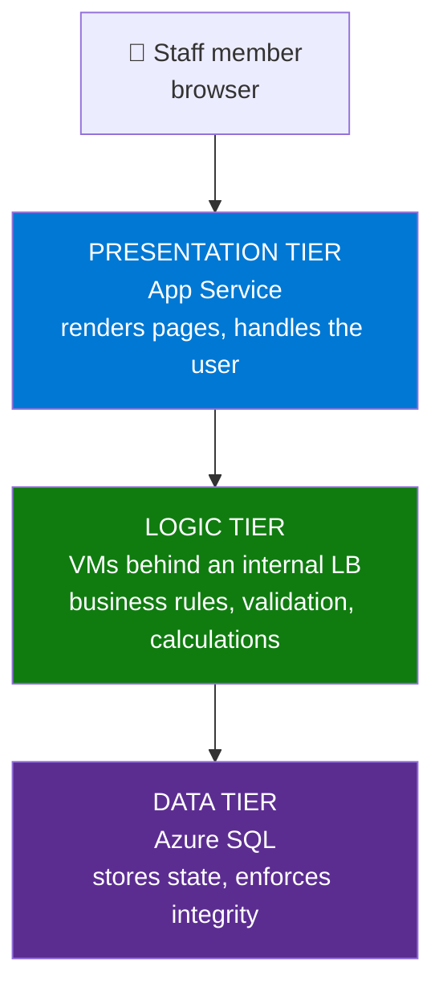

# Day 20 — Capstone: Build a Complete Three-Tier Application

**Phase 9 — Capstone Project**

> Nineteen days. Virtual machines, web apps, storage accounts, virtual networks, subnets, network security groups, load balancers, DNS zones, a SQL database, users and roles, a key vault, and a monitoring workspace. Every one of those was a lesson, and every one of them ended with a cleanup step — so today we start from an **empty subscription** and build every piece again, from scratch, and this time they work together. Today we stop learning services and start **building a system**. One brief, one architecture, one continuous build — and at the end of it a real application where a person opens a browser, sees data that came from a database **no one on the internet can reach**, served by machines that have **no public IP addresses**, using a password that exists in **exactly one place** and is typed into **no configuration screen anywhere**. This is the video where all nineteen days become one thing.

---

!!! danger "This is a project video, and it is long on purpose"
    Every other day in this course is capped at two hours. **This one is not.** Expect around **three and a half hours**, in four phases, with break markers where you can safely stop and come back.

    **Don't skim it.** Each phase depends on the one before, and unlike every other day, stopping halfway leaves you with an application that doesn't run. Use the chapter markers, take the breaks where I tell you to, and finish it.

    If you only have an hour today, watch **Phase One** — Parts 1 to 4 are pure architecture, there's no portal at all, and they're the part that actually makes you an architect rather than someone who can click.

---

## What You'll Learn

**Phase One — Design (no portal)**

- How to read a requirement and turn it into an architecture — the part interviews are actually about
- Why three tiers, and what each one is genuinely for
- **Six real decisions**, each argued both ways, each with a price attached
- Address planning and naming, done properly, before a single resource exists

**Phase Two — Network and data tier**

- A VNet carved into four planned subnets, with a budget alert set before anything billable exists
- NSGs and ASGs that make it three tiers instead of one flat network — including **the default rule that quietly undoes your work**
- A brand-new Azure SQL database on the free offer, then **public network access switched off entirely**, reachable only through a private endpoint
- **Three proofs** that the database really is private

**Phase Three — App tier and web tier**

- **Why a VM with no public IP now has no internet at all**, and the NAT gateway that fixes it
- Two VMs across two availability zones, built by `cloud-init`, with no public IPs
- **Azure Bastion Developer SKU — free**, and why Day 11's ~$0.19/hour is no longer the only option
- An internal load balancer, a health probe, and what happens when a backend dies
- **App Service VNet integration** — the one new concept today, and the glue that makes PaaS and IaaS one application
- Watching the web tier fail *before* integration, then work *after*

**Phase Four — Secrets, names, monitoring, hardening**

- The connection string moves into Key Vault and gets read **two different ways** — a Key Vault reference on PaaS, an IMDS token on IaaS
- Private DNS so the app tier has a name instead of an IP
- One workspace collecting every tier, and KQL that follows a single request across all three
- Alerts that fire while you watch, on purpose
- **An honest list of everything still wrong with this architecture, with prices** — the senior skill
- Secure Score reading your own decisions back to you, then a complete cleanup

---

## Before We Begin

### What today costs

Most of this build is free. Three things are not, and I'd rather you saw the numbers now than found them on an invoice.

| Component | Cost | Today |
|---|---|---|
| VNet, subnets, NSGs, ASG, private DNS zone | **Free** (a private DNS zone is ~$0.50/month) | ✅ |
| 2 × `Standard_B1s` VMs | **Free account: 750 B1s hours/month.** Otherwise ~$0.012/hr each | ✅ |
| Azure SQL `db-lwm-expenses` | **Free offer** — created fresh in Part 7 | ✅ |
| **Azure Bastion Developer SKU** | **Free** | ✅ |
| Key Vault (Standard) | No base fee; operations $0.03 per 10,000 | ✅ |
| Log Analytics + Application Insights | Inside the **5 GB per billing account per month** free grant | ✅ |
| **App Service plan, Basic B1** | ~**$0.018/hr** (~$13/month) | ⚠️ **Not free.** Free F1 cannot do VNet integration |
| **Internal Load Balancer** (Standard) | ~$0.025/hr + ~$0.005/hr per rule ≈ **$0.72/day** | ⚠️ small but constant |
| **NAT Gateway** | ~$0.045/hr + $0.045/GB ≈ **$1.10/day** | ⚠️ small but constant |
| **Private endpoint** | ~$0.01/hr ≈ **$0.25/day** + tiny data processing | ⚠️ small but constant |
| **A four-hour build, everything running, deleted at the end** | **≈ $0.35** | ✅ |
| **The same build left running for a week** | **≈ $16** | ⚠️ |
| Application Gateway + WAF instead of the internal load balancer | ~$0.246/hr + capacity units ≈ **$180+/month** | 💳 discussed in Part 20, never deployed |

!!! warning "Four meters run continuously, and none of them sleep"
    The serverless database auto-pauses when nobody uses it. **The App Service plan, the load balancer, the NAT gateway and the private endpoint do not.** They bill by the hour from creation to deletion whether you're watching or not.

    That is exactly why **Part 5 sets a budget alert before creating anything billable**, and why **Part 22 deletes everything**. If you have to stop mid-build, deallocate both VMs and stop the App Service — that parks most of it at around a dollar a day — but the honest advice is: **block out an afternoon and finish it.**

**There are no 💳 instructor-only steps today.** Every single thing we build, you can build.

### Set this up first

- **Nothing from earlier days.** Every resource today — including the SQL server and database — is created from scratch, inside one resource group, purely for this project. If you still have leftovers from previous days, leave them alone; nothing here touches them.
- **The Azure SQL free offer still available on your subscription.** Each subscription gets up to **10** free-offer databases, so an old Day 16 database doesn't block you — but if the *Apply offer* banner doesn't appear in Part 7, that's the first thing to check.
- A region you've been using consistently. **Everything today must be in one region** — VNet, VMs, App Service plan and SQL server. An App Service plan cannot integrate with a VNet in a different region.
- Roughly **four hours**, or two sessions with the break marker in between.

!!! tip "One habit that will save you today"
    Open the portal in **two browser tabs**. One stays on the resource group so you can watch things appear; the other does the work. Most confusion in a long build comes from losing track of where you are.

---

## The Architecture

Here is everything we're building. Screenshot this — we'll come back to it at the end of every phase.

```text
                              Internet
                                  │
                                  ▼
        ┌─────────────────────────────────────────────────┐
        │  WEB TIER — presentation                        │
        │  app-lwm-capstone-<name>   App Service B1       │
        │  system-assigned managed identity               │
        │  app setting = @Microsoft.KeyVault(...)         │
        └───────────────────┬─────────────────────────────┘
                            │ regional VNet integration (outbound)
                            │ snet-web-integration   10.20.1.0/26
                            ▼
        ┌─────────────────────────────────────────────────┐
        │  APP TIER — business logic                      │
        │  lb-app-internal   10.20.2.100  (private only)  │
        │     ├── vm-app-1   zone 1   no public IP        │
        │     └── vm-app-2   zone 2   no public IP        │
        │  snet-app  10.20.2.0/24   +  NAT gateway out    │
        └───────────────────┬─────────────────────────────┘
                            │ nsg-data: only snet-app may reach :1433
                            ▼
        ┌─────────────────────────────────────────────────┐
        │  DATA TIER — state                              │
        │  db-lwm-expenses on sql-lwm-cap-<name>          │
        │  PUBLIC NETWORK ACCESS: DISABLED                │
        │  private endpoint in snet-data  10.20.3.0/24    │
        │  privatelink.database.windows.net DNS zone      │
        └─────────────────────────────────────────────────┘

   Secrets       kv-lwm-cap-<name>   — one secret, two identities read it
   Management    Azure Bastion Developer SKU (free) — no public IP on any VM
   Monitoring    law-lwm-capstone + appi-lwm-capstone — every tier reports in
   Reserved      10.20.0.0/26 — AzureBastionSubnet, if Bastion is ever upgraded
```

---

## PHASE ONE — DESIGN

> **No portal for the next four parts.** If you're following along with a hand on the mouse, take it off. This is the part of the job that happens on a whiteboard, and it's the part that separates an architect from a very fast clicker.

### Part 1 — The Requirement, and Where Every Service Came From

#### The brief

Here's the request, and it's written the way real requests arrive — in plain language, from someone who doesn't know Azure:

> *"We need an internal expenses app. Staff log in on a web page, submit claims and see their history. The data goes in a SQL database. Three things matter to us: **the database must not be reachable from the internet**, two people on our team need to administer it **without sharing a login**, and we need to **know when it breaks** — we found out about the last outage from a customer. Keep the running cost sensible."*

That's it. That's the whole brief. Four requirements hiding in five sentences:

| What they said | What it actually means in Azure |
|---|---|
| "A web page… the data goes in SQL" | Three tiers: presentation, logic, data |
| "Not reachable from the internet" | Private endpoint, public network access disabled, NSGs |
| "Two people, without sharing a login" | Entra ID users and **RBAC**, not a shared admin account |
| "Know when it breaks" | Diagnostic settings, a Log Analytics workspace, alert rules |
| "Keep the cost sensible" | Every choice gets priced, and a budget alert exists from minute one |

**Notice what the brief does not say.** It doesn't say "use Kubernetes." It doesn't say "microservices." It doesn't mention a single Azure service by name — because the person asking doesn't know any, and **it isn't their job to know.** Translating that paragraph into resources *is* the job, and doing it with the smallest set of services that satisfies every line is what "good architecture" means.

#### Everything we're about to use, and the day that taught it

This is the part I want to land before we touch anything. **There is no new material in this capstone** — with exactly one exception, which I'll flag when we get to it.

| Service / concept | Taught on | Doing what today |
|---|---|---|
| Resource groups, locks, budgets, Cost analysis | Day 2 | Container, protection, and the money guardrail |
| Linux VMs, sizing, `cloud-init` | Day 3 | The app tier |
| Three-tier architecture, Nginx | Day 4 | The shape of the whole thing, and the web server |
| Availability zones | Day 5 | Two app VMs that don't share a datacentre |
| App Service, plans, ZIP deploy, app settings | Day 6 | The web tier |
| VNets, subnets, NSGs, ASGs | Day 10 | Four subnets and the rules between them |
| Private endpoints, Bastion, NAT gateway | Day 11 | Private SQL, VM access, outbound internet |
| Load Balancer (internal), health probes | Day 12 | Spreading traffic across the app tier |
| Private DNS zones, A records | Day 13 | Giving the app tier a name |
| Azure SQL, the free offer | Day 16 | The data tier |
| Entra ID, RBAC, managed identity | Day 17 | Who can administer it, and how machines authenticate |
| Key Vault, references, data-plane roles | Day 18 | The one place the password lives |
| Log Analytics, diagnostic settings, KQL, alerts | Day 19 | Knowing when it breaks |
| Defender for Cloud Secure Score | Day 18 | Grading our own work at the end |

**The one new thing:** **App Service regional VNet integration** (Part 13). Day 6 never reached it, and there is no way to connect a PaaS web tier to VMs inside a VNet without it. It gets a proper explanation rather than a quick click.

!!! tip "Say this in an interview and watch the room change"
    *"A capstone isn't new material — it's judgement applied to material you already have."*

    Nobody is impressed that you can create a VNet. They're interested in **why you chose /24 for the app subnet, why the load balancer is internal, and what you'd do differently with a real budget.** That's Part 3, and it's the most valuable twenty minutes in this video.

---

### Part 2 — Why Three Tiers, and What Each One Is For

Day 4 drew the one-tier, two-tier and three-tier diagrams. Let's make that concrete now, because this is the architecture we're committing to.



#### Why split at all?

You *could* build this as one VM running everything — web server, business logic and SQL Server, all on one box. It would work. Plenty of small applications are exactly that. So why is nobody recommending it?

**Three reasons, and the third is the one that matters most:**

**1. Each tier scales differently.** A web tier gets hammered at 9am when everyone opens the app, and the load is cheap to serve — HTML and CSS. The logic tier does real work per request. The data tier scales worst of all, because you can't just add copies of a database and expect it to behave. If they live on one machine, you have to size that machine for the worst case of all three at once, and you pay for that around the clock.

**2. Each tier fails differently.** Nginx crashing is a five-second restart. A database running out of space is a completely different emergency. When they share a machine, every failure is everyone's failure — and a memory leak in your web code can take your database down with it.

**3. Each tier deserves a different blast radius.** This is the security argument and it's the strongest one. Ask: *what can someone reach if they fully compromise this thing?*

| If an attacker owns… | On one VM | On our three tiers |
|---|---|---|
| The web tier | The database, on localhost, with the credentials in the config file | An App Service with no data, no business rules, and a managed identity scoped to **one secret in one vault** |
| The app tier | Everything | A VM with no public IP, that can reach port 1433 and nothing else |
| The data tier | Everything | The data — which is bad, but they had to get through the other two first |

**The thing to say out loud:** the only component exposed to the internet is the one holding **no data and no business rules**. Everything valuable is behind at least one more door. That's not paranoia; that's the entire point of tiering, and it's why "the database must not be reachable from the internet" is the line in the brief that drives the most decisions.

#### Tiers are a logical idea, not a physical one

One clarification that trips beginners up in interviews. **A "tier" is a role, not a machine type.** Our presentation tier is PaaS with no server we can see. Our logic tier is two VMs we patch ourselves. Our data tier is a managed database. Three tiers, three completely different hosting models — and that's normal.

You'll also hear **"layer"** used for the same idea. Strictly, *layers* are how the code is organised and *tiers* are how it's deployed. In everyday conversation people use them interchangeably; if an interviewer draws that distinction, now you know it.

---

### Part 3 — Six Decisions, Argued Both Ways

Here it is — the part that makes this a capstone. Six real choices. For each one I'll give you the case for both options and then the decision **and its price**, because an architecture decision without a number attached is an opinion.

#### Decision 1 — Web tier: App Service or a VM?

**For a VM:** total control. Any runtime, any OS package, any web server config. If the app needs something unusual installed, a VM will do it and a PaaS service might not.

**For App Service:** no OS to patch, no web server to configure, deployment slots, built-in TLS certificates, autoscale on a slider, and a free HTTPS endpoint on day one. You write code, you don't run servers.

> **Decision: App Service, Basic B1, ~$13/month.** The web tier is the most boring, most standard component in the whole system — serve pages, call an API. Boring and standard is exactly where managed services win. **We use B1 rather than the free F1 tier for one specific reason: F1 cannot do VNet integration**, and without VNet integration the web tier cannot reach a private IP. That's the whole cost justification in one sentence.

#### Decision 2 — App tier: one VM, an availability set, or availability zones?

**One VM:** cheapest, and Azure gives a single-VM SLA of **99.9%** if it uses premium storage. That's about 43 minutes of allowed downtime a month, and *any* maintenance reboot is a full outage.

**Availability set:** two VMs in different racks in one datacentre — **99.95%**. Protects against rack-level and host-level failure, not against the building.

**Availability zones:** two VMs in physically separate datacentres in the same region — **99.99%**. Protects against a whole datacentre going dark.

> **Decision: two VMs, zones 1 and 2. Cost: the same as two VMs anywhere — zones themselves are free.** This is the rare case where the best answer costs nothing extra, so there's no reason to choose worse. Do note that cross-zone traffic can carry a small data charge, and that zones only exist in regions that support them — if yours doesn't, an availability set is the fallback.

#### Decision 3 — Load balancer: internal or public?

**Public:** a public IP in front of the app tier. Simple to test — you can curl it from your laptop.

**Internal:** a private frontend IP inside the VNet. Nothing outside the VNet can reach it at all, and you can only test it from inside.

> **Decision: internal, ~$0.72/day.** The app tier serves exactly one client — the web tier — and the web tier is inside the VNet once it's integrated. A public frontend would be an internet-facing door that nothing needs to use. Yes, it makes testing slightly harder. That is the correct trade.

#### Decision 4 — Database access: firewall rules, service endpoint, or private endpoint?

**Firewall rules:** keep public access on, allow specific IPs. Free. But the server is still resolvable and reachable on the internet — you're relying on a list.

**Service endpoint:** free. The subnet reaches SQL over the Azure backbone rather than the public internet, and SQL accepts traffic from that subnet. But the SQL server still has a public endpoint and a public DNS name.

**Private endpoint:** ~$0.25/day. SQL gets a **private IP inside your subnet**. Public network access can then be **switched off entirely** — the server stops accepting anything from the internet at all.

> **Decision: private endpoint, and public access disabled.** The brief said "must not be reachable from the internet." A service endpoint is genuinely good and genuinely free, but it does not satisfy that sentence literally — the public endpoint still exists. Twenty-five cents a day is the price of being able to say *"it is not reachable,"* rather than *"it is reachable but filtered."* For a one-line requirement like that, pay it.

#### Decision 5 — The connection string: app setting or Key Vault?

**App setting:** simple. Encrypted at rest. But anyone with Contributor on the app can read it in the portal, there's no audit trail of who read it, no expiry, and if five apps use it you have five copies.

**Key Vault:** one copy, identity-based access, every read logged, rotation possible without redeploying anything.

> **Decision: Key Vault, effectively free.** Day 18's entire argument. And because a Key Vault reference in an app setting is resolved by the platform, **the application code doesn't change at all** — it reads an environment variable and never learns Key Vault exists.

#### Decision 6 — One resource group or several?

**Several** — network in one, app in another, data in a third — is the production pattern. Different teams own different lifecycles, and you can scope RBAC per group.

**One** is simpler to reason about and, critically for us, **deletes in a single action.**

> **Decision: one resource group, `rg-lwm-capstone`.** This is a lab that must be cleanly removable at the end, and one group makes that a single click instead of a scavenger hunt. In production I'd split it — and I'd put the **vault in its own group**, for the exact reason Day 18 gave: Contributor on a resource group containing a vault is, effectively, access to that vault's data.

!!! tip "This table is your interview answer"
    | Question | Your answer |
    |---|---|
    | "Why App Service and not a VM?" | No OS to manage for a standard workload; B1 because **F1 can't do VNet integration** |
    | "Why two VMs?" | 99.99% zonal SLA, and **zones cost nothing extra** |
    | "Why an internal load balancer?" | The only client is inside the VNet; a public frontend would be a door nothing uses |
    | "Why a private endpoint over a service endpoint?" | The requirement was *not reachable*, not *filtered* — only a private endpoint lets you disable public access |
    | "Why Key Vault over an app setting?" | One copy, identity-based access, audit trail, rotation without redeploying |
    | "Why one resource group?" | Lab cleanliness. **In production, split them — and isolate the vault.** |

---

### Part 4 — Address Planning and Naming

Two things that look like bureaucracy and are actually load-bearing. You do them **before** you create anything, because both are painful to change afterwards.

#### The address space

We take **`10.20.0.0/16`** for the VNet. That's 65,536 addresses — far more than we need, and that's deliberate. Address space is free, and running out of it is one of the most expensive mistakes in cloud networking, because **you cannot shrink or move a subnet that has resources in it.**

Why `10.20`? Because `10.0.0.0/16` is what every tutorial uses, including ours on Day 10, and the day you need to peer two VNets together, identical address spaces make it **impossible** — peering requires non-overlapping ranges. Picking a deliberate, documented range per environment is a habit worth forming now.

Here's the plan, written out before we build it:

| Subnet | Range | Usable | Purpose | Why this size |
|---|---|---|---|---|
| `AzureBastionSubnet` | `10.20.0.0/26` | 59 | **Reserved, not created today** | Bastion requires exactly this name and a **/26 minimum**. We reserve it so a future upgrade from the free Developer SKU doesn't require re-planning |
| `snet-web-integration` | `10.20.1.0/26` | 59 | App Service VNet integration | Must be **empty**, **delegated** to `Microsoft.Web/serverFarms`, and used by nothing else. The hard minimum is /28, but Microsoft recommends **/26** — one IP per plan instance, doubled during scale operations, plus headroom for platform upgrades |
| `snet-app` | `10.20.2.0/24` | 251 | The two app VMs | Generous on purpose — this is the tier most likely to grow, and a /24 leaves room for a scale set later |
| `snet-data` | `10.20.3.0/24` | 251 | The SQL private endpoint | A private endpoint needs one address. The /24 is for future private endpoints — storage, the vault, Service Bus — all of which belong in a data subnet |

!!! note "Azure takes five addresses from every subnet — remember Day 9"
    In `10.20.2.0/24`, you don't get 256 usable addresses, you get **251**. Azure reserves five in every subnet:

    - `.0` — network address
    - `.1` — the default gateway
    - `.2` and `.3` — Azure DNS mapping
    - `.255` — broadcast

    That's why a /29 (8 addresses) only gives you 3 usable ones, and why anything smaller than a /29 is rejected outright. **Our load balancer frontend will be `10.20.2.100`** — comfortably outside the reserved range, and a memorable round number, which matters when you're typing it into config for two hours.

#### Naming

A convention is worth having for one reason: **six months from now, in a subscription with 300 resources, you need to know what something is from its name alone.** Ours is `<type>-<project>-<detail>`:

| Resource | Name | Note |
|---|---|---|
| Resource group | `rg-lwm-capstone` | |
| Virtual network | `vnet-capstone` | |
| NSGs | `nsg-app`, `nsg-data` | Named for the subnet they protect |
| Application security group | `asg-app-tier` | |
| NAT gateway | `nat-app-tier` (+ `pip-nat-app`) | |
| VMs | `vm-app-1`, `vm-app-2` | |
| Load balancer | `lb-app-internal` | The word *internal* is doing real work here |
| App Service plan / app | `asp-lwm-capstone` / `app-lwm-capstone-<yourname>` | **The app name is globally unique** — it becomes `<name>.azurewebsites.net` |
| Key Vault | `kv-lwm-cap-<yourname>` | **Globally unique**, 3–24 characters, so the short form |
| Log Analytics / App Insights | `law-lwm-capstone` / `appi-lwm-capstone` | |
| SQL logical server / database | `sql-lwm-cap-<yourname>` / `db-lwm-expenses` | **The server name is globally unique** — it becomes `<name>.database.windows.net` |
| Private endpoint | `pe-sql-capstone` | |
| Private DNS zone | `lwm.internal` | |

!!! warning "Three names in this build are globally unique across all of Azure"
    The **App Service name**, the **Key Vault name** and the **SQL server name**. All three become DNS names, so `app-lwm-capstone` is almost certainly already taken by somebody. **Append something personal** — that's what `<yourname>` means every time you see it today.

    And from Day 18: a deleted vault **keeps its name reserved** for the whole soft-delete retention period. If you re-run this lab next month and the vault name is refused, that's why — Part 22 purges it deliberately.

> **BREAK MARKER 1.** That's the entire design: four subnets, three tiers, six decisions with prices attached, and a naming convention. Everything from here is building it. If you're splitting this over two sittings, this is the natural place to stop — **nothing exists yet, so nothing is billing you.**

---

## PHASE TWO — THE NETWORK AND THE DATA TIER

### Part 5 — A Budget, a Resource Group, and the VNet

We start with the budget. Not because it's exciting, but because **a budget alert set after the spending starts is a receipt, not a control.**

#### Hands-On: Set the Budget First ✅

1. Search **Cost Management** → **Cost Management + Billing** → **Cost Management** → **Budgets**. **✅**
2. **+ Add**. **Scope:** leave it at your subscription. **✅**
3. Fill it in: **✅**

   | Field | Value |
   |---|---|
   | **Name** | `budget-capstone` |
   | **Reset period** | Monthly |
   | **Creation date / Expiration date** | Leave the defaults |
   | **Budget amount** | `10` |

4. **Next**, then set alert conditions: **✅**

   | % of budget | Action |
   |---|---|
   | **50%** | Email |
   | **80%** | Email |
   | **100%** | Email |

5. Put your email address in **Alert recipients** and **Create**. **✅**

!!! note "Ten dollars is the point"
    Today's build costs about 35 cents. A $10 budget will never fire — and that's exactly what you want. If it *does* fire, something is running that you forgot about, and you'll hear about it at $5 instead of at $150.

    Budget alerts are **free**, they're **subscription-wide**, and there is no good reason not to have one on every subscription you own. Note the honest limitation from Day 2: Azure cost data lags by **8–24 hours**, so a budget alert is an early warning, not a circuit breaker. It will not stop anything spending.

#### Hands-On: Create the Resource Group ✅

6. **Resource groups → + Create.** **Name:** `rg-lwm-capstone`. **Region:** your standard region. **Review + create → Create.** **✅**

   Remember from Day 2 that the resource group's region only stores its *metadata* — resources inside it can live anywhere. We're still going to put everything in one region today, because **App Service VNet integration requires the app and the VNet to be in the same region.**

#### Hands-On: Create the VNet and All Four Subnets ✅

We build all the subnets now, in one pass, from the plan in Part 4. Creating subnets up front is much less painful than retrofitting them around resources that already exist.

7. **Virtual networks → + Create.** **Resource group:** `rg-lwm-capstone`. **Name:** `vnet-capstone`. **Region:** same as everything else. **Next.** **✅**

8. On the **IP addresses** tab, **delete the default address space and subnet**, then **+ Add IPv4 address space** and enter `10.20.0.0/16`. **✅**

9. **+ Add a subnet** — first the app tier: **✅**

   | Field | Value |
   |---|---|
   | **Subnet purpose** | Default |
   | **Name** | `snet-app` |
   | **Starting address** | `10.20.2.0` |
   | **Size** | `/24 (256 addresses)` |

   Leave NAT gateway, NSG and route table blank — we attach those later, deliberately, so you see each one do its job.

10. **+ Add a subnet** again — the data tier: **Name** `snet-data`, **Starting address** `10.20.3.0`, **Size** `/24`. **✅**

11. **+ Add a subnet** once more — the integration subnet, and this one has an extra step: **✅**

    | Field | Value |
    |---|---|
    | **Name** | `snet-web-integration` |
    | **Starting address** | `10.20.1.0` |
    | **Size** | `/26 (64 addresses)` |
    | **Delegate subnet to a service** | **`Microsoft.Web/serverFarms`** |

    That delegation is the important bit. It hands the subnet to the App Service platform, which needs to inject network interfaces into it. Azure will apply this automatically during integration if you forget — but doing it now means the subnet shows up as available in the integration dropdown later, instead of you wondering why it's missing.

12. **Review + create → Create.** **✅**

13. When it deploys, open `vnet-capstone` → **Subnets** and check your work against the plan: **✅**

    | Name | Range | Available IPs | Delegated to |
    |---|---|---|---|
    | `snet-web-integration` | 10.20.1.0/26 | 59 | Microsoft.Web/serverFarms |
    | `snet-app` | 10.20.2.0/24 | 251 | — |
    | `snet-data` | 10.20.3.0/24 | 251 | — |

    **59 and 251, not 64 and 256.** There's Day 9's five reserved addresses, visible in the portal.

!!! warning "Don't put anything else in the integration subnet. Ever."
    `snet-web-integration` must stay **empty** apart from the App Service integration itself. No VMs, no private endpoints, no second app plan sharing it casually. An App Service plan can hold at most **two** VNet integrations, and each plan instance consumes an address from the subnet — which temporarily **doubles** during a scale operation.

    If you ever see an integration fail with a subnet error, the first two things to check are: **is it empty**, and **is it delegated.**

---

### Part 6 — NSGs: Making It Three Tiers Instead of One Flat Network

Right now you have a VNet with three subnets, and here's the thing nobody tells beginners: **those subnets do not isolate anything from each other.** A VM in `snet-app` can reach every address in `snet-data` on every port, because of a default rule we're about to look at. Subnets are an addressing construct. **The NSG rules are what make this a three-tier architecture** — without them it's one flat network drawn in three boxes.

#### The default rules, and the one that undoes your work

Every NSG arrives with six default rules you cannot delete. The three inbound ones, in priority order:

| Priority | Name | Effect |
|---|---|---|
| **65000** | `AllowVnetInBound` | **Allow all traffic from anywhere in the VNet, on any port** |
| 65001 | `AllowAzureLoadBalancerInBound` | Allow the load balancer's health probes |
| 65500 | `DenyAllInBound` | Deny everything else |

Read rule 65000 again. **It allows every VNet-internal connection by default.** So if you create an NSG with a single rule saying "allow the web subnet to reach port 80" and attach it, you have changed nothing — the app subnet was already reachable from everywhere inside the VNet, on all 65,535 ports.

**To actually tier a network, you need an explicit deny that sits at a lower priority number than 65000**, with your allows above it. Lower number wins. That's the rule shape we're building:

```text
100   Allow  web integration subnet  →  app tier      :80      ← the one thing that should work
110   Allow  AzureLoadBalancer       →  app tier      any      ← or the health probe fails
4000  Deny   VirtualNetwork          →  any           any      ← everything else inside the VNet
65000 Allow  VirtualNetwork          →  any           any      ← default, now unreachable
```

#### Hands-On: The Application Security Group ✅

Day 10 taught ASGs; this is where they earn their place. Instead of writing `10.20.2.0/24` into rules — which breaks the day someone re-addresses a subnet — we tag the NICs with a **role** and write rules against the role.

1. Search **Application security groups** → **+ Create**. **Resource group:** `rg-lwm-capstone`. **Name:** `asg-app-tier`. **Region:** same. **Review + create → Create.** **✅**

   That's the whole resource. An ASG is just a named, empty group — it has no settings. Its value appears when you use it as a source or destination in a rule.

#### Hands-On: Build `nsg-app` ✅

2. **Network security groups → + Create.** **Name:** `nsg-app`, resource group `rg-lwm-capstone`, same region. **Create.** **✅**
3. Open it → **Settings → Inbound security rules → + Add.** Create the first rule: **✅**

   | Field | Value |
   |---|---|
   | **Source** | IP Addresses |
   | **Source IP addresses/CIDR ranges** | `10.20.1.0/26` |
   | **Source port ranges** | `*` |
   | **Destination** | **Application security group** |
   | **Destination application security group** | `asg-app-tier` |
   | **Service** | HTTP |
   | **Destination port ranges** | `80` |
   | **Protocol** | TCP |
   | **Action** | Allow |
   | **Priority** | `100` |
   | **Name** | `Allow-Web-To-App-80` |

   Read that rule out loud: *"traffic from the App Service integration subnet may reach anything tagged as app tier, on port 80."* That's the web tier's permission, and nothing else has it.

4. **+ Add** the second rule — and this one is the rule people forget, then spend an hour debugging: **✅**

   | Field | Value |
   |---|---|
   | **Source** | **Service Tag** |
   | **Source service tag** | `AzureLoadBalancer` |
   | **Destination** | Any |
   | **Destination port ranges** | `*` |
   | **Protocol** | Any |
   | **Action** | Allow |
   | **Priority** | `110` |
   | **Name** | `Allow-LB-HealthProbe` |

    !!! danger "Forget this rule and your load balancer marks every VM unhealthy"
        Health probes don't come from another VM — they come from Azure's infrastructure address `168.63.129.16`, represented by the **`AzureLoadBalancer`** service tag. The default rule 65001 allows it, but **we're about to add a deny at priority 4000, and that deny would sit above the default.**

        Symptom when you get this wrong: the load balancer shows every backend as unhealthy, the VMs are demonstrably fine when you curl them locally, and nothing in the VM logs explains it. Remember the service tag and you'll save yourself the afternoon.

5. **+ Add** the third rule — the one that creates the tier boundary: **✅**

   | Field | Value |
   |---|---|
   | **Source** | **Service Tag** → `VirtualNetwork` |
   | **Destination** | Any |
   | **Destination port ranges** | `*` |
   | **Protocol** | Any |
   | **Action** | **Deny** |
   | **Priority** | `4000` |
   | **Name** | `Deny-All-VNet-Inbound` |

6. **Settings → Subnets → + Associate** → `vnet-capstone` / `snet-app` → **OK**. **✅**

#### Hands-On: Build `nsg-data` ✅

7. Create a second NSG called `nsg-data`, same resource group and region. **✅**
8. Inbound rule at priority `100`, named `Allow-App-To-SQL`: **✅**

   | Field | Value |
   |---|---|
   | **Source** | **Application security group** → `asg-app-tier` |
   | **Destination** | Any |
   | **Destination port ranges** | `1433` |
   | **Protocol** | TCP |
   | **Action** | Allow |

9. Inbound rule at priority `4000`, named `Deny-All-VNet-Inbound` — identical to the one on `nsg-app`. **✅**
10. **Associate** it with `snet-data`. **✅**

#### The trap: NSGs don't apply to private endpoints unless you say so

This one is genuinely obscure and it would silently ruin the data tier's security model, so we fix it before the private endpoint even exists.

!!! danger "By default, network policies are DISABLED on a subnet — and NSG rules do not filter private endpoint traffic"
    Straight from the documentation: *"By default, network policies are disabled for a subnet in a virtual network. To use network policies like user-defined routes and network security group support, network policy support must be enabled for the subnet."*

    In plain language: **you can attach a beautiful NSG to `snet-data`, and every rule in it will be ignored for traffic going to the private endpoint.** The endpoint would accept connections from anywhere in the VNet, regardless of what your rules say.

    This is not a bug — private endpoints were originally designed to be filtered at the source, not the destination. But it means **every "we locked the data subnet down with an NSG" claim is false unless someone ticked this box.**

11. **`vnet-capstone` → Subnets → `snet-data`.** In the edit pane, find **Network Policy for Private Endpoints** and tick **Network security groups**. (You can tick **Route tables** too; we don't need it today.) **Save.** **✅**

12. Verify the whole thing: **`nsg-data` → Settings → Network Manager → Effective security rules**, or from any NIC later. You should see your three rules sitting above the defaults, with `Deny-All-VNet-Inbound` at 4000 shadowing `AllowVnetInBound` at 65000. **✅**

!!! tip "The interview version of Part 6"
    *"How do you isolate tiers inside one VNet?"* → **NSGs with an explicit deny below priority 65000**, because `AllowVnetInBound` permits all intra-VNet traffic by default. Use **ASGs** as the source and destination so the rules survive re-addressing. And **enable network policies on any subnet holding private endpoints**, or the NSG won't apply to them at all.

---

### Part 7 — The Data Tier: SQL With No Public Endpoint

Now the piece the brief was really about. We don't have a database yet, so we build one — a brand-new logical server and database on the free offer, living in `rg-lwm-capstone` with everything else, so it disappears with the group at the end.

We'll create it the way Day 16 did — **public endpoint, your client IP allowed** — and prove it works from your laptop. Then we take it off the internet entirely, and watch that same test fail. Seeing it work first is what makes the failure mean something.

#### Hands-On: Create the SQL Server and Database ✅

1. **Azure SQL → + Create → SQL databases (Single database) → Create.** **✅**
2. **Basics:** **✅**

   | Field | Value |
   |---|---|
   | **Resource group** | `rg-lwm-capstone` |
   | **Database name** | `db-lwm-expenses` |
   | **Server** | **Create new** (next step) |

3. **Create new server:** **✅**

   | Field | Value |
   |---|---|
   | **Server name** | `sql-lwm-cap-<yourname>` — **globally unique**, it becomes `sql-lwm-cap-<yourname>.database.windows.net` |
   | **Location** | **the same region as `vnet-capstone`** — the private endpoint and the VNet must match |
   | **Authentication method** | **Use both SQL and Microsoft Entra authentication** |
   | **Set Microsoft Entra admin** | your own account |
   | **Server admin login** | `sqladmin` |
   | **Password** | something strong — **write it down**, it goes into the connection string in Part 16 |

   Click **OK**.

4. Back on Basics, click **Apply offer** on the *"Want to try Azure SQL Database for free?"* banner. **✅**

    !!! warning "No banner, no free database"
        If the banner isn't there, open **Compute + storage** and look for the free-offer option. If it genuinely isn't offered, your subscription has used all ten free-offer databases — delete an old one rather than creating a paid database. The free offer is what keeps the data tier at **$0** today.

5. **Want to use SQL elastic pool?** **No.** **Workload environment:** **Development**. **✅**
6. **Compute + storage:** confirm it shows **General Purpose — Serverless** with **auto-pause** enabled. Set **Behavior when free limit reached** to **Auto-pause the database until next month** — that makes an accidental bill impossible. **✅**
7. **Backup storage redundancy:** **Locally-redundant.** **✅**
8. **Networking** tab: **✅**

   | Field | Value |
   |---|---|
   | **Connectivity method** | **Public endpoint** — for now |
   | **Allow Azure services and resources to access this server** | **No** — Day 16 explained why it's wider than it sounds, and we won't need it |
   | **Add current client IP address** | **Yes** |
   | **Minimum TLS version** | 1.2 |

    !!! tip "Why not pick Private endpoint right here?"
        The wizard *can* create a private endpoint at the same time. We deliberately don't, for two reasons: we want to **see the database reachable first** so that disabling public access is a visible change, and the **Private access** tab on the server gives a cleaner walkthrough of the DNS integration in a moment.

9. **Additional settings:** **Use existing data → Sample.** That loads the AdventureWorksLT tables, so there's real data behind the app. **✅**
10. **Review + create → Create.** Two to four minutes. **✅**

#### Hands-On: Prove It Works From the Internet — Once ✅

11. Open **`db-lwm-expenses` → Query editor (preview)** and sign in with `sqladmin` and your password. **✅**
12. Run: **✅**

    ```sql
    SELECT TOP 5 FirstName, LastName, CompanyName FROM SalesLT.Customer;
    ```

    Five rows. **Remember this moment** — your laptop, over the public internet, reading data. In about sixty seconds, the exact same action will be refused.

#### What a private endpoint actually does

Three things happen when you create one, and understanding all three is what makes the DNS behaviour stop feeling like magic:

1. **A network interface is created in your subnet** with a private IP from `snet-data` — say `10.20.3.4`. That NIC belongs to the SQL server.
2. **A private link connection** is established between that NIC and the SQL service. Traffic to that IP is delivered to your database over Microsoft's backbone, never the public internet.
3. **A private DNS zone** called `privatelink.database.windows.net` is created and linked to your VNet, containing an A record that points your server's name at `10.20.3.4`.

Step 3 is the elegant part. Your connection string stays **exactly the same** — `sql-lwm-cap-<yourname>.database.windows.net`. From inside the VNet, that name now resolves to a private IP. From outside, it resolves to the public one, which we're about to switch off. **The application never knows anything changed.**

#### Hands-On: Disable Public Access ✅

13. Go to **SQL servers → `sql-lwm-cap-<yourname>`** — the *server*, not the database. **✅**
14. **Security → Networking → Public access** tab. **✅**
15. Set **Public network access** to **Disable**. Note what disappears: the client IP firewall rule you added five minutes ago greys out, because it's meaningless now. **Save.** **✅**

16. Prove it immediately, while it's fresh: go back to **`db-lwm-expenses` → Query editor (preview)** and sign in exactly as you did in step 11. **✅**

    **It fails**, with a message about public network access being disabled. Same laptop, same password, same query editor that returned five rows a minute ago. The portal's query editor connects from the internet like any other client, so it is now locked out — **including for you, the owner.** That is the requirement working as intended, and it's worth sitting with for a second: you have just made your own database unreachable from your own laptop.

#### Hands-On: Create the Private Endpoint ✅

17. Still on the server: **Security → Networking → Private access** tab → **+ Create a private endpoint**. **✅**
18. **Basics:** **✅**

    | Field | Value |
    |---|---|
    | **Resource group** | `rg-lwm-capstone` |
    | **Name** | `pe-sql-capstone` |
    | **Network interface name** | leave the generated default |
    | **Region** | same region as the VNet |

19. **Resource tab:** the target sub-resource is **`sqlServer`**. **✅**

    !!! note "Sub-resources are why one service can have several private endpoints"
        A storage account has `blob`, `file`, `queue`, `table`, `web` and `dfs` — each is a separate private endpoint. A SQL server has exactly one: `sqlServer`. When an exam question asks how many private endpoints a storage account needs for blobs *and* files, the answer is **two**.

20. **Virtual Network tab:** **Virtual network** `vnet-capstone`, **Subnet** `snet-data`. Leave **Dynamically allocate IP address** selected. **✅**
21. **DNS tab:** **Integrate with private DNS zone: Yes**. It will create `privatelink.database.windows.net` in `rg-lwm-capstone`. **✅**
22. **Review + create → Create.** It takes a minute or two. **✅**

#### Hands-On: Look at What Was Created ✅

23. Open `pe-sql-capstone` → **Overview**. Note the **private IP** — probably `10.20.3.4`, because `.0` to `.3` are reserved. **Write it down.** **✅**
24. Go to **Private DNS zones → `privatelink.database.windows.net` → Overview**. **✅**

    There's an **A record** for `sql-lwm-cap-<yourname>` pointing at that private IP. Nobody typed it — the DNS integration checkbox created it.

25. Click **Virtual network links** in that zone. There's a link to `vnet-capstone`, also created automatically. **This is the piece that makes the name resolve**: a private DNS zone only affects VNets that are linked to it. **✅**

!!! warning "The most common private endpoint failure is a DNS failure"
    When somebody says "the private endpoint isn't working," it is almost never the endpoint. It's DNS, and it's one of these three:

    - **The private DNS zone wasn't created or linked** to the VNet doing the lookup — so the name still resolves to the public IP, which is now refusing connections.
    - **The client uses a custom DNS server** (a domain controller, a firewall) that doesn't forward to Azure DNS, so it never sees the private zone.
    - **The client is in a peered VNet** that isn't linked to the zone. Peering carries traffic, **not DNS** — every VNet that needs to resolve the name needs its own link to the zone.

    Debugging order, always: `nslookup` first. If the name doesn't resolve to a private IP, stop looking at firewalls.

---

### Part 8 — Three Proofs That the Database Is Private

We can't finish these until the VMs exist — proof 2 and 3 need a machine inside the VNet — so this part is the **contract for Part 10**. I'm putting it here, in the data tier, because this is where it belongs conceptually, and because I want you thinking about *how you would prove it* before you see me do it.

**"It's private" is a claim. Here's how you make it a fact:**

| # | Test | Run from | Expected result |
|---|---|---|---|
| 1 | Portal **Query editor** or SSMS | Your laptop, over the internet | ❌ **Refused** — public network access is disabled |
| 2 | `nslookup sql-lwm-cap-<yourname>.database.windows.net` | `vm-app-1`, inside the VNet | ✅ Resolves through `privatelink...` to **10.20.3.4** |
| 3 | `nc -zv sql-lwm-cap-<yourname>.database.windows.net 1433` | `vm-app-1`, inside the VNet | ✅ **Connection succeeded** |

Proof 1 you already did, in Part 7 step 16 — and you saw it succeed first in step 11, which is what makes the refusal convincing. Proofs 2 and 3 happen in Part 10, the moment we can get a shell on a VM.

!!! tip "Do the same nslookup from Cloud Shell to see the other half"
    Run `nslookup sql-lwm-cap-<yourname>.database.windows.net` in **Cloud Shell** — which is outside your VNet — and you'll get the **public** IP back. Same name, two answers, depending on which network you're asking from.

    That single comparison explains Azure Private Link better than any diagram. The name never changed. The answer did.

> **You are now here:** the network exists, it's properly segmented, and the data tier is genuinely private — provably so as soon as we have a machine to prove it from. Next we build that machine, and discover it can't reach the internet.

---

## PHASE THREE — THE APP TIER AND THE WEB TIER

### Part 9 — The App Tier VMs (and Why They Have No Internet)

#### The thing that will catch you out

Before we create a single VM, a change that has broken a lot of people's labs in the last year.

!!! danger "A new VM with no public IP has no internet access at all"
    For years, any Azure VM without a public IP still got outbound internet through something called **default outbound access** — an implicit, shared, unpredictable public IP that Azure gave you silently.

    **That is being retired.** Microsoft announced 30 September 2025, then extended it so that the new behaviour applies to API versions released after **31 March 2026**. The practical position today, September 2026, is:

    - **Existing VMs in existing VNets** keep their default outbound access.
    - **Any VM you create now** — including ours — **does not get it.**

    So a brand-new VM with no public IP, in a brand-new subnet, **cannot reach the internet**. Not for `apt update`, not for a package install, not to call Key Vault. `cloud-init` will sit there and fail, and the VM will boot perfectly with no web server on it and no obvious explanation.

The fix is an **explicit** outbound path, and you have three choices:

| Option | Cost | Verdict |
|---|---|---|
| **Give each VM a public IP** | ~$0.005/hr each | Works, but every VM becomes internet-*reachable* too. We specifically don't want that |
| **Load balancer outbound rules** | Included with the LB | Only works for VMs in a public LB's backend pool. Ours is internal, so no |
| **NAT gateway** ✅ | ~$0.045/hr + $0.045/GB | **Outbound only.** Nothing can initiate a connection inward. The correct answer |

A NAT gateway is the production answer for exactly our shape: machines that need to fetch updates and call Azure services, and must never be reachable from outside. You met it on Day 11 — here it stops being a demo and becomes load-bearing.

#### Hands-On: Create the NAT Gateway ✅

**Do this before the VMs**, so `cloud-init` has internet when they first boot.

1. Search **NAT gateways → + Create**. **✅**
2. **Basics:** resource group `rg-lwm-capstone`, **Name** `nat-app-tier`, same region, **Availability zone: No zone**, **Idle timeout** 4 minutes. **✅**
3. **Outbound IP** tab: **Public IP addresses → Create a new public IP address**, name it `pip-nat-app`. **✅**
4. **Subnet** tab: tick **`snet-app`**. **✅**
5. **Review + create → Create.** **✅**

   Every VM in `snet-app` now shares `pip-nat-app` for outbound traffic. Nothing on the internet can start a conversation with them — a NAT gateway is strictly one-directional, which is precisely why it's the right tool.

#### The cloud-init file

Day 3 introduced `cloud-init` — the standard way Linux VMs configure themselves on first boot. Ours installs Nginx and publishes two endpoints:

- **`/health`** — returns `OK`. This is what the load balancer probes.
- **`/api/info`** — returns JSON with the hostname, the availability zone, and whether SQL is reachable.

Copy this, **replace `<yourname>` with your SQL server name**, and keep it handy — you'll paste it into both VMs:

```yaml
#cloud-config
package_update: true
packages:
  - nginx
  - netcat-openbsd
  - jq
write_files:
  - path: /usr/local/bin/lwm-refresh-info
    permissions: '0755'
    content: |
      #!/bin/bash
      SQL_FQDN="sql-lwm-cap-<yourname>.database.windows.net"
      ZONE=$(curl -s -H Metadata:true "http://169.254.169.254/metadata/instance/compute/zone?api-version=2021-02-01&format=text")
      if nc -z -w 3 "$SQL_FQDN" 1433; then DB=true; else DB=false; fi
      mkdir -p /var/www/html/api
      printf '{"server":"%s","zone":"%s","db_reachable":%s,"checked":"%s"}\n' \
        "$(hostname)" "$ZONE" "$DB" "$(date -Is)" > /var/www/html/api/info
      echo OK > /var/www/html/health
runcmd:
  - systemctl enable --now nginx
  - /usr/local/bin/lwm-refresh-info
  - echo '*/5 * * * * root /usr/local/bin/lwm-refresh-info' > /etc/cron.d/lwm-info
```

Three things in there are worth pointing at:

- **`169.254.169.254`** is the **Instance Metadata Service** — a link-local address every Azure VM can query to learn about itself, with no credentials. That's where the zone number comes from, and in Part 16 the same endpoint hands us an authentication token.
- **`nc -z -w 3 ... 1433`** is our database reachability check. It opens a TCP connection to port 1433 and reports whether it succeeded. The cron entry re-runs it every five minutes.
- **`printf` into `/var/www/html/api/info`** writes a static JSON file that Nginx serves. No application framework, nothing to crash.

!!! note "Be honest about what this app is"
    This is a **web server serving a generated JSON file**, not a real API doing per-request database queries. That's deliberate: writing and deploying a database-backed application is a programming course, not an Azure course, and it would be the most fragile thing in a three-hour build.

    Everything **architecturally** real is real — the private path to SQL, the load balancing, the health probes, the identity, the isolation. The business logic is a placeholder. Say that plainly rather than implying otherwise.

#### Hands-On: Create `vm-app-1` ✅

6. **Virtual machines → + Create → Azure virtual machine.** **✅**
7. **Basics:** **✅**

   | Field | Value |
   |---|---|
   | **Resource group** | `rg-lwm-capstone` |
   | **Virtual machine name** | `vm-app-1` |
   | **Region** | your region |
   | **Availability options** | **Availability zone** |
   | **Availability zone** | **Zone 1** |
   | **Security type** | Standard (or Trusted launch — either is fine) |
   | **Image** | **Ubuntu Server 24.04 LTS — x64 Gen2** |
   | **Size** | **Standard_B1s** |
   | **Authentication type** | **Password** |
   | **Username** | `azureuser` |
   | **Password** | something strong — **write it down**, you need it for Bastion |
   | **Public inbound ports** | **None** |

    !!! tip "Why password auth here, when SSH keys are better?"
        SSH keys are the right answer in production and Day 3 showed them. Today we use a password purely because **Bastion Developer's browser login is one field instead of an uploaded private key**, and this build has enough moving parts already.

        In a real environment: SSH keys, or better, **Entra ID login for Linux VMs**, which removes local accounts entirely.

8. **Disks** tab: **Standard SSD** is fine. Nothing else to change. **✅**
9. **Networking** tab: **✅**

   | Field | Value |
   |---|---|
   | **Virtual network** | `vnet-capstone` |
   | **Subnet** | **`snet-app` (10.20.2.0/24)** |
   | **Public IP** | **None** |
   | **NIC network security group** | **None** |
   | **Delete public IP and NIC when VM is deleted** | ticked |
   | **Load balancing options** | None (we build the load balancer in Part 11) |

    **NIC network security group: None** is deliberate. `nsg-app` is attached to the *subnet*, so every NIC in it is already covered. A second NSG on the NIC would mean two rule sets evaluated in sequence, which is the single most confusing thing you can do to your future self debugging connectivity.

10. **Management** tab: turn **Boot diagnostics** on with a managed storage account — it's free and it's the only way to see the console if the VM won't boot. **✅**
11. **Advanced** tab: paste the whole `cloud-init` YAML into **Custom data**. **✅**

    !!! warning "Custom data, not User data"
        There are two boxes on this tab that look similar. **Custom data** is processed by `cloud-init` at first boot — that's the one we want. **User data** is just stored for the VM to read later; nothing runs it.

        Paste into the wrong box and the VM boots with no Nginx and no error.

12. **Review + create → Create.** **✅**

#### Hands-On: Create `vm-app-2` ✅

13. Repeat every step with exactly two differences: **Name** `vm-app-2`, **Availability zone: Zone 2**. Same subnet, same size, same image, same password, same `cloud-init`. **✅**

    Two identical machines in two physically separate datacentres. That's the 99.99% SLA from Part 3, and it cost nothing extra.

#### Hands-On: Tag Both NICs Into the ASG ✅

The `nsg-app` rules point at `asg-app-tier`, and nothing is in it yet — so right now those rules match nothing at all.

14. **`vm-app-1` → Networking → Network settings.** Click the NIC name → **Settings → Application security groups → Add application security groups** → tick `asg-app-tier` → **Add**. **✅**
15. Do the same for **`vm-app-2`**. **✅**
16. Back on `asg-app-tier`, check **Associated network interfaces** — both NICs should be listed. **✅**

    Now every rule that says "app tier" applies to exactly these two machines, and adding a third VM later is one tick rather than an NSG edit.

---

### Part 10 — Getting In With No Public IP (Bastion Developer, Free)

Both VMs are running and **neither has a public IP.** There's no SSH port to connect to from the internet, which is exactly the design — and it means we need Bastion.

Day 11 taught Bastion at **~$0.19/hour for the Basic SKU**, and flagged it as a paid demo you should delete immediately. That's no longer the only option.

#### The Developer SKU

**Azure Bastion Developer is free.** Rather than deploying a dedicated Bastion host into an `AzureBastionSubnet` in your VNet, it connects you through a **shared pool** that Azure operates. You get browser-based SSH and RDP to a VM with no public IP, at no cost.

| | **Developer (free)** | **Basic (~$0.19/hr)** | **Standard (~$0.38/hr)** |
|---|---|---|---|
| Cost | **Free** | Hourly | Hourly |
| Dedicated `AzureBastionSubnet` | **Not needed** | Required, /26 | Required, /26 |
| Concurrent connections | **One VM at a time** | Many | Many |
| Works across VNet peering | **No** | Yes | Yes |
| File transfer, custom ports, native client | No | Limited | Yes |
| Deployment time | **Seconds** | ~10 minutes | ~10 minutes |
| Suitable for production | **No** | Yes | Yes |

For a single-VNet lab where we connect to one machine at a time, the Developer SKU is a perfect fit. In production you'd use Basic or Standard — which is why Part 4 **reserved `10.20.0.0/26` for an `AzureBastionSubnet`** even though we won't create it today. The plan survives the upgrade.

!!! warning "Developer SKU isn't in every region"
    It's limited to a subset of regions. If you don't see it, you have two fallbacks: deploy **Bastion Basic** into the reserved `10.20.0.0/26` (and delete it at the end — it's ~$4.50/day), or temporarily attach a public IP to `vm-app-1`, SSH in, and dissociate it afterwards, which is the pattern Day 11 used.

#### Hands-On: Connect ✅

1. **`vm-app-1` → Connect → Connect via Bastion** (or from the VNet: **Connect → Bastion**). **✅**
2. Choose **Authentication Type: VM Password**, enter `azureuser` and your password, and click **Connect**. **✅**

   Bastion Developer deploys itself in seconds and a terminal opens **inside the browser tab.** No public IP, no open port 22, no VPN, no jump box you have to maintain.

#### Hands-On: Confirm cloud-init Actually Worked ✅

3. In that terminal: **✅**

   ```bash
   cloud-init status --wait
   curl -s localhost/health
   curl -s localhost/api/info
   ```

   You want `status: done`, then `OK`, then a line of JSON like:

   ```json
   {"server":"vm-app-1","zone":"1","db_reachable":true,"checked":"2026-09-23T10:41:07+00:00"}
   ```

    !!! danger "If `db_reachable` is false or Nginx isn't installed"
        Work through these in order — it's almost always one of the first two:

        | Symptom | Cause | Fix |
        |---|---|---|
        | No Nginx at all, `cloud-init status` shows error | **The NAT gateway wasn't ready when the VM booted**, so package install failed | Confirm `nat-app-tier` lists `snet-app`, then `sudo cloud-init clean --logs && sudo reboot` |
        | `db_reachable: false` | Wrong SQL FQDN in the script, or `nsg-data` is blocking | `cat /usr/local/bin/lwm-refresh-info` and check the name; confirm the NIC is in `asg-app-tier` |
        | `zone` is empty | The VM wasn't created in an availability zone | Cosmetic only — everything else still works |
        | Nothing in `/var/www/html/api/` | Pasted into **User data** instead of **Custom data** | Recreate the VM; it's faster than fixing it |

        The log to read is always `/var/log/cloud-init-output.log` — it shows every command and its output.

#### Hands-On: Proofs 2 and 3 From Part 8 ✅

Now we can finish what Part 8 started. Still in the Bastion terminal:

4. **Proof 2 — DNS resolves to a private address:** **✅**

   ```bash
   nslookup sql-lwm-cap-<yourname>.database.windows.net
   ```

   ```text
   Non-authoritative answer:
   sql-lwm-cap-<yourname>.database.windows.net
       canonical name = sql-lwm-cap-<yourname>.privatelink.database.windows.net.
   Name:   sql-lwm-cap-<yourname>.privatelink.database.windows.net
   Address: 10.20.3.4
   ```

   **Read that chain out loud.** The public name is a CNAME to the `privatelink` name, and the `privatelink` name resolves — via the private DNS zone linked to this VNet — to an address inside `snet-data`. That is the entire mechanism, visible in four lines.

5. **Proof 3 — the port actually answers:** **✅**

   ```bash
   nc -zv sql-lwm-cap-<yourname>.database.windows.net 1433
   ```

   ```text
   Connection to sql-lwm-cap-<yourname>.database.windows.net 1433 port [tcp/ms-sql-s] succeeded!
   ```

6. **The contrast that makes the point.** Open **Cloud Shell** (the `>_` icon in the portal, which runs *outside* your VNet) and run the same `nslookup`. **✅**

   You get a **public** IP back. Same name, different answer, because Cloud Shell isn't in a VNet linked to that private zone — and if you tried to connect, the server would refuse you anyway, because public network access is off.

   **Three proofs, done.** The database is reachable from inside your network and from nowhere else, and you didn't take anyone's word for it.

!!! tip "Optional: a real query with sqlcmd"
    `nc` proves the network path. If you want to prove the *database* answers, install the client:

    ```bash
    curl -sSL -O https://packages.microsoft.com/config/ubuntu/24.04/packages-microsoft-prod.deb
    sudo dpkg -i packages-microsoft-prod.deb && sudo apt-get update
    sudo ACCEPT_EULA=Y apt-get install -y mssql-tools18 unixodbc-dev
    /opt/mssql-tools18/bin/sqlcmd -S sql-lwm-cap-<yourname>.database.windows.net \
      -U sqladmin -P '<password>' -d db-lwm-expenses -C \
      -Q "SELECT TOP 5 FirstName, LastName, CompanyName FROM SalesLT.Customer"
    ```

    It's a couple of minutes of downloads, so it's optional on camera — but it's the difference between "the port is open" and "the database answered." And it's the same five customers your laptop read in Part 7, now arriving over a private IP from a machine your laptop can't even see.

---

### Part 11 — The Internal Load Balancer

Two VMs serving the same content, and right now nothing sits in front of them. The web tier would have to pick one by IP — and if it picked the one that's rebooting, the app is down. That's what a load balancer is for.

#### What makes it *internal*

Everything about a Standard Load Balancer is the same as Day 12 taught it, with one difference: **the frontend IP is a private address from your VNet instead of a public IP.** Same backend pools, same health probes, same rules. The frontend is the entire difference — and it means nothing outside the VNet can reach it at all.

Four components, and you'll configure them in this order:

| Component | Ours | What it does |
|---|---|---|
| **Frontend IP** | `10.20.2.100`, static, in `snet-app` | The address clients connect to |
| **Backend pool** | `bep-app-tier` → both VMs | Where traffic can go |
| **Health probe** | HTTP, port 80, path `/health` | Which backends are allowed to receive it |
| **Rule** | TCP 80 → 80, using that pool and probe | Ties the three together |

#### Hands-On: Create the Load Balancer ✅

1. **Load balancers → + Create.** **✅**
2. **Basics:** **✅**

   | Field | Value |
   |---|---|
   | **Resource group** | `rg-lwm-capstone` |
   | **Name** | `lb-app-internal` |
   | **Region** | your region |
   | **SKU** | **Standard** |
   | **Type** | **Internal** |
   | **Tier** | Regional |

   Note there's no Basic option worth choosing — Basic Load Balancer has been retired, as Day 12 covered.

3. **Frontend IP configuration** tab → **+ Add a frontend IP configuration**: **✅**

   | Field | Value |
   |---|---|
   | **Name** | `fe-app-internal` |
   | **Virtual network** | `vnet-capstone` |
   | **Subnet** | `snet-app` |
   | **Assignment** | **Static** |
   | **IP address** | `10.20.2.100` |
   | **Availability zone** | **Zone-redundant** |

    **Static, not dynamic.** We are about to hardcode this address into the web tier's configuration, and a dynamic address can change if the resource is recreated. **Zone-redundant** matters too: our VMs survive a zone failure, and a zonal load balancer in front of them would throw that away.

4. **Backend pools** tab → **+ Add**: **✅**

   | Field | Value |
   |---|---|
   | **Name** | `bep-app-tier` |
   | **Virtual network** | `vnet-capstone` |
   | **Backend Pool Configuration** | **NIC** |
   | **IP version** | IPv4 |

   Then **+ Add** under the resources list and tick **`vm-app-1`** and **`vm-app-2`**. **Save.** **✅**

5. **Inbound rules** tab → **+ Add a load balancing rule**: **✅**

   | Field | Value |
   |---|---|
   | **Name** | `rule-http-80` |
   | **Frontend IP address** | `fe-app-internal` |
   | **Backend pool** | `bep-app-tier` |
   | **Protocol** | TCP |
   | **Port** | 80 |
   | **Backend port** | 80 |
   | **Health probe** | **Create new** (below) |
   | **Session persistence** | **None** |
   | **Idle timeout** | 4 minutes |
   | **TCP reset** | **Enabled** |
   | **Floating IP** | Disabled |

6. In the **Create new** health probe pane: **✅**

   | Field | Value |
   |---|---|
   | **Name** | `probe-health` |
   | **Protocol** | **HTTP** |
   | **Port** | 80 |
   | **Path** | **`/health`** |
   | **Interval** | 5 seconds |

    !!! tip "HTTP probe, not TCP — and this is a real design point"
        A **TCP probe** only checks that something accepts a connection on port 80. Nginx can be alive and accepting connections while the application behind it is completely broken — and a TCP probe will happily keep sending traffic to it.

        An **HTTP probe** requests a path and requires a **200**. Point it at an endpoint that actually exercises the app, and a broken backend gets removed automatically.

        The mature version of this, worth knowing for interviews: a *deep* health endpoint that checks the app's own dependencies (can it reach the database?) versus a *shallow* one that just proves the process is up. Deep probes catch more, but a flapping dependency can eject every backend at once and take the whole service down. Most production systems run **shallow probes for the load balancer** and **deep checks for monitoring**.

7. **Review + create → Create.** **✅**

8. Once it deploys, open `lb-app-internal` → **Settings → Backend pools → `bep-app-tier`** and confirm both VMs are listed. Then **Monitoring → Insights** (or **Metrics → Health Probe Status**) and check both are healthy. Give it a minute. **✅**

    If both show unhealthy: the `AzureLoadBalancer` service tag rule from Part 6 is missing or sitting below your deny rule. That's the failure I promised you'd meet.

---

### Part 12 — Prove It Works, Then Break It On Purpose

A load balancer you haven't tested is a hope. Two tests: the happy path, then a failure.

#### Hands-On: Watch Traffic Spread ✅

1. Connect to **`vm-app-2`** via Bastion. (We're deliberately testing *from* one backend *through* the load balancer — a client inside the VNet is exactly what the web tier will be.) **✅**
2. Run: **✅**

   ```bash
   for i in $(seq 1 10); do curl -s http://10.20.2.100/api/info | jq -r .server; sleep 1; done
   ```

   ```text
   vm-app-1
   vm-app-2
   vm-app-1
   vm-app-1
   vm-app-2
   ...
   ```

   **Two names, alternating unevenly.** Azure's Standard Load Balancer uses a **five-tuple hash** — source IP, source port, destination IP, destination port, protocol — so each new connection lands on a backend deterministically but the distribution looks random over a small sample. It is not round robin, and knowing that distinction is a reliable interview question.

#### Hands-On: Kill a Backend ✅

3. Open a **second Bastion session to `vm-app-1`** and stop the web server: **✅**

   ```bash
   sudo systemctl stop nginx
   ```

4. Immediately go back to the `vm-app-2` session and run the loop again, for longer: **✅**

   ```bash
   for i in $(seq 1 20); do curl -s http://10.20.2.100/api/info | jq -r .server; sleep 1; done
   ```

   For the first few seconds you may see a failure or two — the probe hasn't noticed yet. Then **every single response says `vm-app-2`**. With a 5-second interval, the load balancer takes it out of rotation within roughly 10–15 seconds, and no client had to do anything.

5. Watch it in the portal: **`lb-app-internal` → Monitoring → Metrics → `Health Probe Status`**, split by backend IP. One line drops to 0 while the other stays at 100. **✅**

6. Bring it back: **✅**

   ```bash
   sudo systemctl start nginx
   ```

   Within about 10 seconds `vm-app-1` reappears in the responses. **Nobody intervened.** That is the difference between a load balancer and a DNS round-robin: the load balancer *checks*.

!!! tip "The sentence to remember from Part 12"
    **A load balancer without a health probe is a traffic splitter. The probe is what makes it a resilience feature.**

    A splitter sends a third of your users to a broken server, forever, until a human notices. The probe is the entire reason this is an availability improvement rather than just a distribution mechanism.

> **You are now here:** a private, zone-redundant, self-healing app tier in front of a private database. Everything works and **absolutely nobody can use it**, because there's still nothing on the internet. That's the web tier, and it's next.

---

### Part 13 — The Web Tier, and VNet Integration Properly Explained

This is the one genuinely new concept today, and it's the piece that turns three separate things into one application.

#### The problem, stated precisely

Our app tier lives at `10.20.2.100`. That's an **RFC 1918 private address** — it is not routable on the internet, and by design nothing outside `vnet-capstone` can reach it. An App Service, by default, runs on Microsoft's multi-tenant infrastructure with **no connection to your VNet at all**. Its outbound traffic goes out to the internet like any other internet client.

So a web app calling `http://10.20.2.100` will fail. Not "get refused" — **fail to route at all**, and hang until something times out.

**Regional VNet integration** is the fix. It gives the App Service plan's workers a virtual interface with an address **inside your integration subnet**, so outbound calls to private addresses are sent into your VNet instead of out to the internet.

#### Four facts to be precise about

| Fact | Detail |
|---|---|
| **Outbound only** | Integration lets your app *reach into* the VNet. It does **not** make the app privately reachable *from* the VNet. That's a **private endpoint**, which is a separate feature |
| **Requires Basic or higher** | Basic, Standard, Premium, Premium v2/v3/v4 and Elastic Premium. **Free F1 cannot do it.** That is the entire reason we're paying ~$13/month for B1 |
| **Same region** | The app and the VNet must be in the same region. No exceptions |
| **No extra charge** | The feature itself is free — you pay only for the plan tier |

!!! danger "Correcting two things I told you earlier in this course"
    Two of our own days have this wrong, and I'd rather correct it here than leave you with it:

    - **Day 6's App Service plan table** lists VNet integration as a **Premium** feature. It isn't — it's available from **Basic** upward.
    - **Day 18 Part 11** says Key Vault references over a firewall need "a Standard or higher App Service plan." Also wrong — **Basic is enough**.

    Both were true years ago and stopped being true. This is what happens with cloud courses, including this one, and it's why every day in this series now gets checked against current documentation before recording. When you read a tutorial, **check the date**, then check the doc.

#### The application

Two files, no dependencies, nothing to build. Create a folder called `webtier` with these:

**`server.js`**

```javascript
const http = require('http');

const PORT = process.env.PORT || 8080;
const API_URL = process.env.API_URL || 'http://10.20.2.100/api/info';

function getJson(url, timeoutMs = 5000) {
  return new Promise((resolve, reject) => {
    const req = http.get(url, (res) => {
      let body = '';
      res.on('data', (chunk) => (body += chunk));
      res.on('end', () => {
        try { resolve(JSON.parse(body)); } catch (e) { reject(e); }
      });
    });
    req.setTimeout(timeoutMs, () => req.destroy(new Error('timed out after ' + timeoutMs + ' ms')));
    req.on('error', reject);
  });
}

http.createServer(async (req, res) => {
  if (req.url === '/health') {
    res.writeHead(200, { 'Content-Type': 'text/plain' });
    return res.end('OK');
  }

  let panel;
  try {
    const info = await getJson(API_URL);
    panel = `<p class="ok">Reached the app tier</p>
             <dl>
               <dt>Served by</dt><dd>${info.server}</dd>
               <dt>Availability zone</dt><dd>${info.zone}</dd>
               <dt>Database reachable</dt><dd>${info.db_reachable}</dd>
               <dt>Checked at</dt><dd>${info.checked}</dd>
             </dl>`;
  } catch (err) {
    panel = `<p class="bad">Could NOT reach the app tier</p>
             <p>Tried <code>${API_URL}</code></p>
             <p>${err.message}</p>`;
  }

  const secret = process.env.DbConnection;
  const secretLine = secret
    ? `Connection string loaded from configuration: <code>${secret.slice(0, 20)}…</code> (${secret.length} characters)`
    : 'No connection string configured yet — that is Part 16.';

  res.writeHead(200, { 'Content-Type': 'text/html' });
  res.end(`<!DOCTYPE html>
<html lang="en"><head><meta charset="utf-8"><title>LWM Expenses</title>
<style>
 body{font-family:system-ui,Arial,sans-serif;background:#0b2545;color:#fff;margin:0;
      display:flex;min-height:100vh;align-items:center;justify-content:center}
 .card{background:rgba(255,255,255,.12);padding:32px 44px;border-radius:14px;max-width:640px}
 h1{margin:0 0 4px;font-size:1.7em} .sub{opacity:.75;margin:0 0 22px}
 .ok{color:#7ee787;font-weight:700} .bad{color:#ff9b9b;font-weight:700}
 dt{opacity:.7;font-size:.85em;margin-top:10px} dd{margin:0;font-size:1.15em}
 footer{margin-top:22px;font-size:.8em;opacity:.7;border-top:1px solid rgba(255,255,255,.2);padding-top:12px}
 code{background:rgba(0,0,0,.3);padding:2px 6px;border-radius:4px}
</style></head><body>
 <div class="card">
   <h1>LWM Expenses</h1>
   <p class="sub">Web tier &rarr; app tier &rarr; data tier</p>
   ${panel}
   <footer>${secretLine}</footer>
 </div>
</body></html>`);
}).listen(PORT);
```

**`package.json`**

```json
{
  "name": "lwm-webtier",
  "version": "1.0.0",
  "main": "server.js",
  "scripts": { "start": "node server.js" }
}
```

Select **both files** — not the folder — and zip them into `webtier.zip`. The two files must sit at the **root** of the zip; zipping the folder itself is the single most common ZIP-deploy mistake.

#### Hands-On: Create the App Service Plan and Web App ✅

1. **App Services → + Create → Web App.** **✅**
2. **Basics:** **✅**

   | Field | Value |
   |---|---|
   | **Resource group** | `rg-lwm-capstone` |
   | **Name** | `app-lwm-capstone-<yourname>` — **globally unique** |
   | **Publish** | Code |
   | **Runtime stack** | **Node 20 LTS** |
   | **Operating System** | **Linux** |
   | **Region** | **the same region as the VNet** |
   | **Pricing plan** | **Basic B1** (create a new plan called `asp-lwm-capstone`) |

    !!! warning "Do not pick Free F1 here"
        The portal will happily offer it, and everything will work right up until Part 13's integration step, where the option simply won't be available. **F1 cannot integrate with a VNet.** If you've already created the app on F1, **Scale up (App Service plan) → B1** fixes it without recreating anything.

3. **Monitoring** tab: set **Enable Application Insights** to **Yes** and let it create `appi-lwm-capstone` — we use it in Part 19. **✅**
4. **Networking** tab: leave everything default for now. **Review + create → Create.** **✅**

#### Hands-On: Deploy the Code ✅

5. Go to `https://app-lwm-capstone-<yourname>.scm.azurewebsites.net/ZipDeployUI` — the Kudu deployment console for your app. **✅**
6. **Drag `webtier.zip` onto the page.** It deploys in a few seconds and the log appears on the right. **✅**

    Prefer the command line? One line in Cloud Shell does the same thing:

    ```bash
    az webapp deploy --resource-group rg-lwm-capstone \
      --name app-lwm-capstone-<yourname> --src-path webtier.zip --type zip
    ```

7. Browse to `https://app-lwm-capstone-<yourname>.azurewebsites.net`. **✅**

   **Don't fix what you see next. That's Part 14.**

---

### Part 14 — Watch It Fail, Then Watch It Work

#### The failure

The page loads. The card is there. And it says:

```text
Could NOT reach the app tier
Tried http://10.20.2.100/api/info
timed out after 5000 ms
```

**Sit with that for a moment, because this is the most instructive screen in the whole build.** Everything is correct:

- The app tier is running — you curled it yourself in Part 12.
- The load balancer is healthy — you watched the probe.
- The NSG allows port 80 from the integration subnet.
- The web app has no bugs.

**And it still cannot connect**, because the App Service is not in your network. It tried to route `10.20.2.100` from Microsoft's shared infrastructure out to the internet, where that address means nothing, and gave up after five seconds.

!!! tip "This is the shape of most real Azure connectivity bugs"
    Every component healthy, nothing in any log, and the request just dies. When that happens, the question is almost never *"what's broken?"* — it's **"is there actually a network path between these two things?"**

    Ask that question first and you'll skip an hour of reading application logs that have nothing wrong in them.

#### Hands-On: Enable VNet Integration ✅

1. **`app-lwm-capstone-<yourname>` → Settings → Networking.** **✅**
2. Find the **Outbound traffic configuration** section, and next to **Virtual network integration** click the **Not configured** link. **✅**
3. On the **Virtual Network Integration** page, select **Add virtual network integration**. **✅**
4. Choose: **✅**

   | Field | Value |
   |---|---|
   | **Subscription** | yours |
   | **Virtual Network** | `vnet-capstone` |
   | **Subnet** | **`snet-web-integration`** |

   The dropdown only lists subnets in the **same region** that are **empty** and **available**. If `snet-web-integration` isn't there, one of those three is untrue — and the delegation you set in Part 5 is the usual culprit.

5. Click **Connect**. **The app restarts automatically.** **✅**

#### Hands-On: The Payoff ✅

6. Wait for the restart, then refresh the site. **✅**

   ```text
   Reached the app tier

   Served by            vm-app-2
   Availability zone    2
   Database reachable   true
   Checked at           2026-09-23T11:05:02+00:00
   ```

   **Refresh it a few more times** and watch `Served by` change between `vm-app-1` and `vm-app-2`.

**Look at what that single screen is telling you.** A public HTTPS request arrived at a platform-managed web tier. That tier reached *into* a private network and called a load balancer on a private IP. The load balancer picked a healthy VM in one of two datacentres. That VM reported it can reach a database that **refuses every connection from the internet**. Three tiers, three hosting models, one request — and the only thing on the public internet is the page you're looking at.

#### Hands-On: See the Private IP For Yourself ✅

7. Go to **Advanced Tools → Go** (Kudu) → **Environment** → scroll to the environment variables and find **`WEBSITE_PRIVATE_IP`**. **✅**

   It's an address from `10.20.1.0/26` — your integration subnet. That's the virtual interface the platform attached to the worker running your app. Your web tier now genuinely **has an address inside your network**.

8. Back on the app's **Networking** page, the Virtual network integration row now shows the VNet and subnet instead of *Not configured*. **✅**

!!! note "Application routing: private traffic only, or everything?"
    On the integration page there's a setting for **outbound internet traffic routing**.

    - **Off (default):** only **private traffic** (RFC 1918 — 10.x, 172.16–31.x, 192.168.x) goes through the VNet. Internet-bound traffic leaves directly from the app. This is what we want today.
    - **On (`Route All`):** *everything* goes through the VNet, so it's subject to your NSGs, route tables and NAT gateway. You'd enable this to force outbound traffic through a firewall, or to give the app a single predictable outbound IP.

    Turning it on without an outbound path in the VNet is a classic self-inflicted outage: the app suddenly can't reach the internet at all.

---

### Part 15 — Locking the Front Door

The web tier is now the **only** public surface in this architecture, which makes it the only thing an attacker can reach. Four settings, two minutes, and they're the ones a security review will ask about first.

#### Hands-On: Platform Settings ✅

1. **App Service → Settings → Configuration → General settings** tab. **✅**
2. Set these: **✅**

   | Setting | Value | Why |
   |---|---|---|
   | **HTTPS Only** | **On** | Redirects every HTTP request to HTTPS. Without it, someone can send credentials in clear text and the app will accept them |
   | **Minimum Inbound TLS Version** | **1.2** | 1.0 and 1.1 are deprecated and fail every compliance scan |
   | **FTP state** | **Disabled** | FTP and even FTPS are a deployment path nobody on this project uses. An unused door is still a door |
   | **Always On** | **On** | Stops the app being unloaded when idle. Free tier can't do this; B1 can |

3. **Save**, and accept the restart. **✅**

4. Test it: type `http://app-lwm-capstone-<yourname>.azurewebsites.net` (note the **http**) and watch it bounce to `https://`. **✅**

#### Access restrictions — read, don't apply

5. **Settings → Networking → Inbound traffic configuration → Public network access → Access restriction**. **✅**

   This is an allow/deny list evaluated **before your app runs**, on IP ranges, service tags, or an entire VNet subnet. A rule here is far cheaper and far safer than trying to filter in application code.

   **We're not adding one today** — this is a public staff-facing app, so restricting by IP would defeat the point. But two very common real patterns are worth naming:

   - **Corporate-only internal apps:** allow the office IP ranges and the VPN, deny everything else. Exactly our brief's "internal expenses app", if they had a fixed office network.
   - **Front Door or Application Gateway in front:** allow only the `AzureFrontDoor.Backend` service tag, so nobody can bypass the WAF by hitting the app's default hostname directly. **This is the one people forget**, and it makes an expensive WAF entirely optional for an attacker who reads DNS.

!!! warning "Your app has a public hostname you cannot remove"
    `app-lwm-capstone-<yourname>.azurewebsites.net` is permanent and publicly resolvable for the life of the app. Adding a custom domain **adds** a name; it doesn't remove that one.

    That's why Part 20 lists "the default hostname is still reachable" as a genuine outstanding gap, and why the access restriction above is the standard mitigation.

> **BREAK MARKER 2.** The application works end to end: browser → App Service → internal load balancer → VM → private database. If you're splitting this across two sittings, stop here — but **deallocate both VMs and stop the App Service first**, or you'll pay for idle infrastructure overnight.
>
> Everything from here makes it *production-shaped* rather than merely working.

---

## PHASE FOUR — SECRETS, NAMES, MONITORING AND HARDENING

### Part 16 — The Connection String Leaves the Config File

Look at the footer of your web page right now: *"No connection string configured yet."* Time to fix that — and to do it without the password ever appearing in a configuration screen.

Day 18 built this pattern on a throwaway app. Today it goes into a real architecture, **and we do it twice** — once the PaaS way and once the IaaS way — because those are the two shapes you'll meet in a job.

#### Hands-On: Create the Vault ✅

1. **Key vaults → + Create.** **✅**

   | Field | Value |
   |---|---|
   | **Resource group** | `rg-lwm-capstone` |
   | **Key vault name** | `kv-lwm-cap-<yourname>` — **globally unique**, 3–24 characters |
   | **Region** | same as everything else |
   | **Pricing tier** | Standard |
   | **Days to retain deleted vaults** | 90 |
   | **Purge protection** | **Disabled** |

    We leave purge protection off for exactly the reason Day 18 gave: **so cleanup in Part 22 actually works.** In production it goes on, and it can never come back off.

2. **Access configuration** tab: confirm the permission model is **Azure role-based access control**. It's the default since API version 2026-02-01. **Review + create → Create.** **✅**

3. **Give yourself data access.** Open the vault → **Access control (IAM) → + Add → Add role assignment → `Key Vault Secrets Officer` → Members → your own account → Review + assign.** **✅**

    !!! note "Yes, you have to grant this to yourself — even as Owner"
        Day 18's lesson, and this is where it bites in practice. **Owner is a control-plane role with no data permissions.** You can delete this vault; you cannot read a secret in it.

        The only reason an Owner *can* usually read secrets is that Owner includes `Microsoft.Authorization/*`, so it can assign itself the data role — which is exactly what you just did manually. Do it explicitly and the mental model stays honest.

#### Hands-On: Store the Connection String ✅

4. Get the real value: **SQL databases → `db-lwm-expenses` → Settings → Connection strings → ADO.NET** tab, and copy it. **✅**
5. Replace `{your_password}` with your actual SQL admin password. **✅**
6. **Vault → Objects → Secrets → + Generate/Import:** **✅**

   | Field | Value |
   |---|---|
   | **Upload options** | Manual |
   | **Name** | `DbConnectionString` — letters, digits and hyphens only, **no underscores** |
   | **Secret value** | paste the connection string |
   | **Set expiration date** | tick it, ~90 days out |

   **Create.** **✅**

#### Hands-On: The PaaS Way — Managed Identity and a Key Vault Reference ✅

7. **App Service → Settings → Identity → System assigned → Status: On → Save → Yes.** Copy the **Object (principal) ID** that appears. **✅**

   Entra ID has just created a service principal for your web app. Nobody generated a password, because there isn't one.

8. **Vault → Access control (IAM) → + Add → Add role assignment → `Key Vault Secrets User` → Next → Assign access to: Managed identity → + Select members → Managed identity: App Service → `app-lwm-capstone-<yourname>` → Review + assign.** **✅**

    **Least privilege, visible on camera:** *Secrets User*, not *Secrets Officer*, not *Administrator*, not Contributor. It can read secret values in this one vault and do nothing else anywhere in your subscription. That is the entire blast radius if the app is ever compromised.

9. **App Service → Settings → Environment variables → App settings → + Add:** **✅**

   | Field | Value |
   |---|---|
   | **Name** | `DbConnection` |
   | **Value** | `@Microsoft.KeyVault(VaultName=kv-lwm-cap-<yourname>;SecretName=DbConnectionString)` |

   **Apply → Apply.** The app restarts. **✅**

10. Wait a few seconds, then look at the app settings list. Next to `DbConnection` there's a **green tick** and the source reads **Key Vault Reference**. **✅**

11. Refresh the website. The footer now reads: **✅**

    ```text
    Connection string loaded from configuration: Server=tcp:sql-lwm-… (187 characters)
    ```

    **The application read a database password it has no credential for.** Click **Edit** on that app setting and confirm the only thing stored is the reference string. The password is not in the app, not in the zip, not in the portal, not in source control. It is in the vault, once.

    !!! danger "When the green tick is a red X"
        | Symptom | Cause | Fix |
        |---|---|---|
        | Red X, *reference not resolved* | No role assignment, or it hasn't propagated | Check the vault's IAM. **Wait ten minutes** — role assignments are not instant |
        | No icon at all, literal `@Microsoft.KeyVault(...)` shown on the page | Syntax error — the platform didn't recognise it | Check the spelling exactly; no spaces anywhere; correct vault name |
        | Worked, then stopped | Secret expired, disabled or deleted | Check the secret in the vault |
        | Works locally, fails after enabling the vault firewall | **Trusted services does not cover Key Vault references** | Day 18 Part 11. Needs VNet integration plus a service or private endpoint — which, now that we have B1 and integration, we could actually do |

12. Note what App Service is doing quietly: it **caches** the resolved value and refetches roughly **every 24 hours**. Rotate the secret and your running app keeps the old value until then — unless you change any app setting, which forces a restart and an immediate refetch. That caching isn't a limitation; it's the "don't call Key Vault on every request" rule from Day 18, implemented for you.

#### Hands-On: The IaaS Way — Managed Identity and IMDS ✅

The same idea on a virtual machine. There's no platform layer resolving references for you here, so the VM asks for a token itself — from the same `169.254.169.254` address that told it its availability zone in Part 9.

13. **`vm-app-1` → Security → Identity → System assigned → Status: On → Save.** Do the same for **`vm-app-2`**. **✅**
14. **Vault → IAM → + Add → Add role assignment → `Key Vault Secrets User` → Managed identity → Virtual machine → tick both VMs → Review + assign.** **✅**
15. Connect to `vm-app-1` via Bastion and run: **✅**

    ```bash
    TOKEN=$(curl -s -H "Metadata: true" \
      "http://169.254.169.254/metadata/identity/oauth2/token?api-version=2018-02-01&resource=https%3A%2F%2Fvault.azure.net" \
      | jq -r .access_token)

    curl -s -H "Authorization: Bearer $TOKEN" \
      "https://kv-lwm-cap-<yourname>.vault.azure.net/secrets/DbConnectionString?api-version=7.4" \
      | jq -r .value
    ```

    Out comes the connection string. **✅**

    Two curls. No password, no client secret, no certificate, no credential file. The first call asks the platform *"give me a token proving I am this VM's identity"* — and only code running **on that VM** can reach that address. The second presents the token to Key Vault, which checks your role assignment.

!!! tip "The interview answer this part buys you"
    *"How does an application authenticate to Azure services without storing credentials?"*

    **"A managed identity. On PaaS like App Service you enable it and use a Key Vault reference, so the platform resolves the secret before your code runs. On a VM you enable it and request a token from the Instance Metadata Service at 169.254.169.254, then call the service with that bearer token. Either way there is no credential to store, leak or rotate — the authorisation is a role assignment, not a password."**

    That answer, delivered like that, is worth more than any certification badge.

---

### Part 17 — Giving the App Tier a Name

`http://10.20.2.100` works, and it's a terrible thing to have in configuration. IP addresses in config files are how architectures ossify: change the load balancer and you're hunting through every app setting in the estate.

#### Hands-On: A Private DNS Zone for Internal Names ✅

1. **Private DNS zones → + Create.** Resource group `rg-lwm-capstone`, **Name** `lwm.internal`. **Create.** **✅**

    !!! note "Why `.internal` and not `.com`?"
        A private zone can be any name, including one you don't own — it only resolves inside VNets you link it to. But using a name you **don't** own publicly is risky: if it ever leaks outside the VNet, the lookup goes to the real internet and reaches somebody else's server.

        Use a name reserved for this (`.internal`, `.local`), or a subdomain of a domain you genuinely own (`azure.mycompany.com`). Never invent `mycompany.com` if it isn't yours.

2. Open the zone → **Virtual network links → + Add:** **✅**

   | Field | Value |
   |---|---|
   | **Link name** | `link-vnet-capstone` |
   | **Virtual network** | `vnet-capstone` |
   | **Enable auto registration** | **unticked** |

    Auto-registration would create A records for every VM automatically — useful for a server estate, unnecessary here, and it only handles VMs anyway. Our record points at a load balancer, which auto-registration would never create.

3. **+ Record set:** **✅**

   | Field | Value |
   |---|---|
   | **Name** | `api` |
   | **Type** | A |
   | **TTL** | 300 seconds |
   | **IP address** | `10.20.2.100` |

   You now have `api.lwm.internal` → the internal load balancer.

4. From a Bastion session on `vm-app-2`: **✅**

   ```bash
   nslookup api.lwm.internal
   curl -s http://api.lwm.internal/api/info | jq
   ```

#### Hands-On: Point the Web Tier at the Name ✅

5. **App Service → Settings → Environment variables → + Add:** **✅**

   | Field | Value |
   |---|---|
   | **Name** | `API_URL` |
   | **Value** | `http://api.lwm.internal/api/info` |

   **Apply → Apply.** **✅**

6. Refresh the website. **Still works** — and now the configuration contains a name, not an address. **✅**

    **That is a bigger deal than it looks.** The App Service is resolving a **private DNS zone that only exists inside your VNet**, from a platform service that lives outside it. That works because of a rule worth memorising: *once an app is integrated with a VNet, it uses that VNet's DNS — including every private zone linked to it.* Change the load balancer's IP tomorrow and you edit one DNS record, not every consumer.

#### Public DNS — how the custom domain works

We're not buying a domain on camera, but you should know the exact shape, because it's a standard interview question and a standard first-week task.

To put `expenses.yourcompany.com` in front of this app you create **two** records at your DNS provider — Azure DNS if the zone lives there, which Day 13 covered:

| Record | Name | Value | Purpose |
|---|---|---|---|
| **CNAME** | `expenses` | `app-lwm-capstone-<yourname>.azurewebsites.net` | Points the name at your app |
| **TXT** | `asuid.expenses` | the **Custom Domain Verification ID** from the app's *Custom domains* blade | Proves you own the domain |

Then **App Service → Custom domains → + Add custom domain**, and afterwards create a **free App Service Managed Certificate** for TLS, which auto-renews.

The TXT record is the part people miss. Without it Azure refuses the domain — otherwise anyone could point a CNAME at your app and serve their traffic from your infrastructure.

!!! warning "A root domain needs an A record or an alias, not a CNAME"
    `www.company.com` → CNAME, fine. `company.com` with no subdomain → **DNS does not allow a CNAME at a zone apex.** You need an **A record** pointing at the app's inbound IP (which can change), or — much better — an **Azure DNS alias record**, which tracks the resource automatically. That's Day 13's alias record earning its keep.

---

### Part 18 — One Workspace, Every Tier

Right now this architecture is invisible. If the app started throwing 500s ten minutes ago, nothing would tell you, and nothing is recording anything you could look at afterwards.

Day 19's rule applies to every tier we just built: **Azure collects metrics for free and logs for nobody unless you ask.** Diagnostic settings are how you ask.

#### Hands-On: The Workspace ✅

1. **Log Analytics workspaces → + Create.** Resource group `rg-lwm-capstone`, **Name** `law-lwm-capstone`, same region. **Review + create → Create.** **✅**

   One workspace for the whole application. That's the right instinct: **you cannot correlate across tiers if the tiers log to different places**, and the whole point of Part 19 is following one request across three of them.

#### Hands-On: Wire Up Every Tier ✅

Same pattern four times — **Monitoring → Diagnostic settings → + Add diagnostic setting** on each resource:

2. **App Service `app-lwm-capstone-<yourname>`:** **✅**

   | | |
   |---|---|
   | **Name** | `app-to-law` |
   | **Logs** | **HTTP logs** (`AppServiceHTTPLogs`), **App Service Console Logs**, **App Service Application Logs** |
   | **Metrics** | AllMetrics |
   | **Destination** | Send to Log Analytics workspace → `law-lwm-capstone` |

3. **Key Vault `kv-lwm-cap-<yourname>`:** name `kv-to-law`, tick **Audit Logs** (`AuditEvent`), same destination. **✅**

   This is the one that answers *"who read the production connection string, and when?"* — and it cannot be answered retroactively, which is why it goes on before you need it.

4. **Load balancer `lb-app-internal`:** name `lb-to-law`, tick **Load Balancer Health Event** and **AllMetrics**, same destination. **✅**

5. **SQL database `db-lwm-expenses`:** name `sql-to-law`, tick **Errors**, **Timeouts**, **Deadlocks** and **Basic** metrics, same destination. **✅**

6. Generate some traffic — refresh the website fifteen or twenty times, and hit a URL that doesn't exist (`/nope`) two or three times so there's something interesting in the logs. **✅**

!!! note "Give it five to fifteen minutes"
    First-time log flow is never instant. The tables have to be created and the pipeline has to warm up. If Part 19's queries come back empty, that is almost certainly why — it is not you doing it wrong.

!!! warning "Looking for NSG flow logs? They're gone."
    If you go hunting for flow logs on `nsg-app`, you'll find you can't create them. **Since 30 June 2025 no new NSG flow logs can be created, and NSG flow logs retire completely on 30 September 2027.**

    The replacement is **virtual network flow logs**, configured at the VNet level in **Network Watcher**, which cover everything in the VNet including subnets an NSG isn't attached to. Same telemetry, broader scope, one place. If you learned NSG flow logs from an older course — and ours mentions them — that's the update.

#### What all this costs

All of today's logging fits inside the **5 GB per billing account per month** free grant, comfortably. Two reminders from Day 19 that keep it that way:

- The grant is **per month**, not per day. The "5 GB a day is free" claim is wrong by a factor of about thirty and is one of Azure's most common surprise bills.
- **Ticking `AllMetrics` on everything out of habit inflates ingestion** for data that platform metrics already give you free for 93 days. Tick it when you specifically need metrics joined to logs, or kept for longer.

---

### Part 19 — Following One Request Across Three Tiers

Data's arriving. Now the skill that actually gets used at 2am.

#### Hands-On: Four Queries ✅

Open **`law-lwm-capstone` → Logs** and run these one at a time.

1. **What is the web tier serving, and how fast?** **✅**

   ```kusto
   AppServiceHTTPLogs
   | where TimeGenerated > ago(1h)
   | summarize Requests = count(), AvgMs = avg(TimeTaken) by CsUriStem, ScStatus
   | order by Requests desc
   ```

   Your `/` requests, your deliberate 404s on `/nope`, and the average time each took. **Note how slow `/` is** compared with a static page — every request makes an onward call to the app tier, and you're seeing that round trip.

2. **Any errors?** **✅**

   ```kusto
   AppServiceHTTPLogs
   | where TimeGenerated > ago(1h) and ScStatus >= 400
   | project TimeGenerated, CsUriStem, ScStatus, TimeTaken, CIp
   | order by TimeGenerated desc
   ```

3. **Who touched the vault?** — the audit question. **✅**

   ```kusto
   AzureDiagnostics
   | where ResourceType == "VAULTS" and TimeGenerated > ago(4h)
   | project TimeGenerated, OperationName, identity_claim_appid_g, ResultSignature, CallerIPAddress
   | order by TimeGenerated desc
   ```

   There's the App Service's managed identity performing `SecretGet`, and there's your own `SecretSet` from Part 16. **Every secret read, with the identity that made it.** That's the trail an auditor asks for, and it exists only because you enabled it fifteen minutes ago.

4. **Was the app tier healthy?** **✅**

   ```kusto
   AzureMetrics
   | where ResourceProvider == "MICROSOFT.NETWORK" and MetricName == "DipAvailability"
   | where TimeGenerated > ago(4h)
   | summarize avg(Average) by bin(TimeGenerated, 5m), Resource
   | render timechart
   ```

   If you still have Part 12's outage in the window, **you can see it** — the dip where `vm-app-1` failed its probes, and the recovery when you restarted Nginx. That's an incident reconstructed after the fact from data you didn't know you'd need.

#### Hands-On: Application Insights Draws Your Architecture ✅

5. **`appi-lwm-capstone` → Investigate → Application map.** **✅**

   Application Insights has been watching the web tier since Part 13, and the map shows the app plus its **outbound dependency** — the HTTP call to `api.lwm.internal`, with its call count and average duration. Nobody drew that. It was inferred from live traffic.

6. **Investigate → Failures** and **Performance**, then **Monitoring → Live metrics**. Refresh the site in another tab and watch requests appear in real time. **✅**

7. One query against the App Insights side: **✅**

   ```kusto
   requests
   | where timestamp > ago(1h)
   | summarize count(), avg(duration), percentile(duration, 95) by name, resultCode
   | order by count_ desc
   ```

!!! tip "Why the platform view and the application view are both needed"
    `AppServiceHTTPLogs` is what **the platform** saw: a request arrived, a status went back, it took this long. `requests` in Application Insights is what **the application** saw: this route, this dependency call, this exception, this stack trace.

    Most of the time they agree. **When they disagree, you've learned something important** — a request the platform logged but the app never saw is a platform-layer problem (a restart, a cold start, a failed Key Vault reference), not an application bug. Knowing which of the two to trust first is most of production debugging.

---

### Part 20 — Alerts, and an Honest Look at What's Still Wrong

Queries answer questions you thought to ask. **Alerts wake you up about the ones you didn't.**

#### Hands-On: The Action Group ✅

Every alert needs somewhere to send itself. Build that once and reuse it.

1. **Monitor → Alerts → Action groups → + Create.** **✅**

   | Field | Value |
   |---|---|
   | **Resource group** | `rg-lwm-capstone` |
   | **Action group name** | `ag-capstone-email` |
   | **Display name** | `CapstoneOps` (12 characters max — it's the SMS sender ID) |

2. **Notifications** tab: **Notification type: Email/SMS message/Push/Voice** → tick **Email**, enter your address, name it `ops-email`. **Review + create → Create.** **✅**

   **Email is free.** SMS and voice are charged per message, which is why Day 19 flagged them and why we're not using them.

#### Hands-On: Alert 1 — The App Tier Is Unhealthy ✅

This is the one that tells you a backend died. It's also the one we're going to fire on purpose.

3. **`lb-app-internal` → Monitoring → Alerts → + Create → Alert rule.** **✅**
4. **Condition → Health Probe Status (`DipAvailability`)**: **✅**

   | Field | Value |
   |---|---|
   | **Threshold** | Static |
   | **Aggregation type** | Average |
   | **Operator** | Less than |
   | **Threshold value** | `100` |
   | **Check every** | 1 minute |
   | **Lookback period** | 5 minutes |

5. **Actions:** select `ag-capstone-email`. **✅**
6. **Details:** name `alert-app-tier-unhealthy`, **Severity: 1 — Error**. **Create.** **✅**

   Read what that rule means: *"if the average health of the backend pool drops below 100% over five minutes, tell me."* One VM down is a degradation you want to know about even though the service is still up — which is exactly the alert people forget to build, because nothing is visibly broken.

#### Hands-On: Alert 2 — The Web Tier Is Throwing Errors ✅

7. **App Service → Monitoring → Alerts → + Create → Alert rule → Condition → `Http 5xx`:** **✅**

   | Field | Value |
   |---|---|
   | **Aggregation type** | Total |
   | **Operator** | Greater than |
   | **Threshold value** | `0` |
   | **Check every** | 1 minute |
   | **Lookback period** | 5 minutes |

8. Same action group, name it `alert-web-5xx`, **Severity 1**. **Create.** **✅**

#### Hands-On: Alert 3 — Somebody Deleted Something ✅

9. **Monitor → Alerts → + Create → Alert rule.** **Scope:** the resource group `rg-lwm-capstone`. **✅**
10. **Condition → see all signals → Activity Log → `Delete Virtual Machine (Microsoft.Compute/virtualMachines)`** — or use the broader *Administrative* category and filter on Delete operations. **✅**
11. Same action group, name `alert-resource-deleted`, **Severity 2**. **Create.** **✅**

    **Activity log alerts are completely free** — no per-rule charge at all. There's no reason not to have one of these on anything you care about.

#### Hands-On: Fire It ✅

12. Open Bastion sessions to **both** VMs and stop the web server on each: **✅**

    ```bash
    sudo systemctl stop nginx
    ```

13. Watch **`lb-app-internal` → Metrics → Health Probe Status** fall to 0, then check **Monitor → Alerts**. Within a few minutes `alert-app-tier-unhealthy` is **Fired**, and the email arrives. **✅**

14. Refresh the website while it's broken — the error card from Part 14 is back, this time for a genuine reason. **✅**

15. Start Nginx again on both VMs, and watch the alert **resolve itself** and send a resolved notification. **✅**

    ```bash
    sudo systemctl start nginx
    ```

!!! note "Why the 5xx alert didn't fire, and what that teaches"
    You broke the app tier and `alert-web-5xx` stayed quiet. That's not a bug in the alert — **our web tier catches the failure and renders an error page with HTTP 200.** As far as the platform is concerned, every request succeeded.

    That is a real and very common production blind spot: **an application that swallows its own failures is invisible to infrastructure monitoring.** The fix is in the code, not the alert — the `catch` branch should return a **503**:

    ```javascript
    res.writeHead(503, { 'Content-Type': 'text/html' });
    ```

    Redeploy with that change and repeat the test, and both alerts fire. Worth doing once, because the lesson underneath it is the point: **your monitoring is only as honest as the status codes your application returns.**

#### What is still wrong with this architecture

Here's the part that separates a senior engineer from someone who just finished a tutorial. **This build is good. It is not production.** Naming the gaps out loud, with prices, is the actual skill:

| Gap | Risk | The fix | Cost |
|---|---|---|---|
| **No WAF** | SQL injection, XSS and bot traffic reach the app directly | **Application Gateway v2 + WAF** in front, with an access restriction so only it can reach the app | ~$180+/month |
| **Single region** | A regional outage takes the whole app down | Second region + **Front Door** or Traffic Manager, plus SQL geo-replication | Roughly double, plus Front Door |
| **No autoscale** | 9am load spike degrades the service; 3am idle capacity is wasted | **VM Scale Set** for the app tier, autoscale rules on the App Service plan | Same or less, if tuned |
| **No backup** | A bad deployment or a dropped table is unrecoverable beyond SQL's own retention | **Azure Backup** + Recovery Services vault for the VMs; SQL already has PITR | A few dollars/month |
| **VMs patched by hand** | Unpatched CVEs on two internet-connected (outbound) machines | **Azure Update Manager**, maintenance windows | Free for Azure VMs |
| **No deployment slots** | Every deployment is a live deployment with no rollback | **Staging slot + swap** — B1 doesn't include slots, Standard does | ~$70/month for S1 |
| **Default hostname still public** | Anyone can bypass a future WAF by using `*.azurewebsites.net` | Access restriction allowing only `AzureFrontDoor.Backend` | Free |
| **Vault shares a resource group** | **Contributor on this group is effectively data access to the vault** | Put the vault in its own resource group | Free |
| **One admin** | Bus factor of one; no separation of duties | RBAC groups, PIM for standing access | PIM needs Entra P2 |
| **Everything built by clicking** | Unrepeatable, undocumented, and undiffable | **Bicep or Terraform** — and that's exactly where this course goes next | Free |

!!! tip "Say this in an interview and you'll sound three years more experienced than you are"
    Nobody expects a demo environment to be production-grade. **They expect you to know the difference.**

    *"This is a working three-tier architecture with private data access and no stored credentials. To take it to production I'd add a WAF in front, put the vault in its own resource group, move the app tier to a scale set, add backup and Update Manager, use deployment slots, and define all of it in Bicep. The WAF is the expensive one at roughly $180 a month, and I'd want a conversation about whether the traffic justifies it."*

    That is a senior answer. It costs nothing to be able to give it, and you can give it right now.

---

### Part 21 — Let Azure Grade Your Work

You've just told me what's wrong with your architecture. Now let's see whether Microsoft agrees — using the free tool from Day 18.

#### Hands-On: Secure Score ✅

1. Search **Microsoft Defender for Cloud → Overview**. Look at your **Secure Score**. **✅**
2. **Recommendations**, and filter to `rg-lwm-capstone`. **✅**

   Expect several of today's decisions handed straight back to you:

   | Likely recommendation | Our verdict |
   |---|---|
   | *Key vaults should have deletion protection enabled* | **True** — we disabled purge protection so cleanup works. Correct for a lab, wrong for production |
   | *Azure Key Vault should use RBAC permission model* | **Pass** — it's the default now |
   | *Private endpoint should be configured for Key Vault* | **True gap.** The vault is still publicly reachable (RBAC-protected, but reachable). ~$7.30/month to fix |
   | *Management ports of virtual machines should be protected* | **Pass** — no public IPs, Bastion only |
   | *Virtual machines should be migrated to new Azure Resource Manager resources* / *System updates should be installed* | Patching, which we named ourselves |
   | *Auditing on SQL server should be enabled* | **True gap** — we enabled diagnostics but not SQL auditing |
   | *App Service apps should only be accessible over HTTPS* | **Pass** — Part 15 |
   | *Subscriptions should have a contact email for security issues* | Free to fix, and everyone ignores it |

3. Open one recommendation and read its anatomy: description, affected resources, remediation steps, and often a **Fix** button that applies the change directly. **✅**

4. Click **Regulatory compliance** and look at your subscription against the default benchmark. **✅**

!!! note "Two things to remember about Defender for Cloud"
    **Free Foundational CSPM** gives you Secure Score, recommendations, asset inventory and the compliance view. **Paid Defender plans** add actual threat detection — *someone is attacking this vault* rather than *this vault is misconfigured*.

    And the change Day 18 flagged: **from 27 October 2026, Foundational CSPM becomes opt-in** and is no longer enabled by default on new subscriptions. If you're watching after that date and this screen is empty, that's why — enable the free plan and come back in a few hours.

!!! tip "The best free training in Azure"
    Working down this recommendations list on your own subscription will teach you more practical Azure security than any course, including this one — because every item is about something **you actually built**, and each one explains itself.

    And in an interview: *"how would you assess the security posture of an Azure environment you've just inherited?"* → **"Defender for Cloud's Secure Score, then work the recommendations by weight."**

---

### Part 22 — The Bill, the Cleanup, and What You've Actually Learned

#### Hands-On: Look at the Real Number ✅

1. **`rg-lwm-capstone` → Cost Management → Cost analysis.** Set the range to **Today** and group by **Service name**. **✅**

   Give it a few hours to be accurate — remember the 8–24 hour lag — but the shape is already visible: the load balancer, the NAT gateway, the App Service plan and the private endpoint are the line items. The VMs may be near zero on free-tier hours. The database is zero. The vault is a fraction of a cent.

   **A few hours of a complete three-tier production-shaped architecture costs less than a cup of coffee.** That's worth saying out loud, because "the cloud is expensive" usually means "somebody left something running."

#### Hands-On: Clean Up, In the Right Order ✅

2. **Remove the resource lock first.** `rg-lwm-capstone` → **Settings → Locks** → delete the lock. Nothing else will work until you do — which is the lock doing its job. **✅**

3. **Delete the resource group.** `rg-lwm-capstone` → **Delete resource group**, type the name, confirm. **✅**

   This takes several minutes and removes, in dependency order: the App Service and plan, the VMs and disks, the load balancer, the NAT gateway and its public IP, the private endpoint, the SQL database and its logical server, the NSGs, the ASG, the VNet, the workspace, App Insights, the vault and the private DNS zones.

    !!! warning "If the delete fails, it's almost always the integration subnet"
        A VNet with an integrated App Service can refuse to delete, because a **service association link** is still attached to `snet-web-integration`. Deleting the whole resource group usually sequences this correctly, but if it stalls: delete the **App Service** on its own first, then retry the group.

4. **Purge the vault.** Search **Key vaults → Manage deleted vaults**, find `kv-lwm-cap-<yourname>`, **Purge**. **✅**

   Day 18's trap, and it's why we left purge protection off. Deleting the resource group only **soft-deleted** the vault: it still exists, its **name is still reserved for 90 days**, and it may still bill you for stored content. This step is the one everybody skips and then wonders why the name is taken next month.

5. **Check the Bastion resource.** Bastion Developer deploys into your VNet, so it goes with the resource group — but confirm nothing is left behind under **Bastions**. **✅**

6. **Delete the budget** if you don't want it, though I'd keep it: **Cost Management → Budgets → `budget-capstone`**. **✅**

7. **Confirm the subscription is back to empty.** **All resources** should show nothing from today — in particular, no **SQL servers** and no **Private endpoints**. Because every single thing was built inside `rg-lwm-capstone`, one delete removed the whole system. **✅**

    That's Decision 6 paying off. Nothing today depended on anything outside the group, so there's nothing outside it to forget.

#### The interview and exam quick reference

| If you're asked… | The answer is… |
|---|---|
| "Walk me through a three-tier architecture on Azure" | **App Service (web) → internal load balancer + VMs (logic) → Azure SQL behind a private endpoint (data)**, one VNet, one subnet per tier, NSGs between them |
| "How do you isolate subnets from each other?" | NSGs with an **explicit deny below priority 65000**, because `AllowVnetInBound` permits all intra-VNet traffic by default |
| "Why use ASGs instead of IP ranges in rules?" | Rules follow the **role**, not the address — they survive re-addressing and scaling |
| "NSG on a subnet with a private endpoint does nothing. Why?" | **Network policies are disabled by default** on a subnet. Enable them for NSGs or the rules are ignored for private endpoint traffic |
| "How do you make a database unreachable from the internet?" | **Private endpoint + disable public network access.** A service endpoint or firewall rule is not the same claim |
| "Private endpoint isn't working" | It's **DNS**, nine times out of ten. Check the private DNS zone exists and is **linked to the VNet doing the lookup** |
| "My new VM has no internet and no public IP" | **Default outbound access is retired.** Add a **NAT gateway**, a public IP, or LB outbound rules |
| "How do you reach a VM with no public IP?" | **Azure Bastion.** The **Developer SKU is free** — one VM at a time, no peering, dev/test only |
| "Public or internal load balancer?" | Internal when the only clients are inside the VNet. Same everything, **private frontend IP** |
| "What makes a load balancer a resilience feature?" | The **health probe**. Without it, it's a traffic splitter that happily feeds a broken backend |
| "Zones or availability set?" | **Zones: 99.99%**, separate datacentres, no extra cost. Availability set: 99.95%, one datacentre |
| "How does App Service reach a private IP?" | **Regional VNet integration** — outbound only, **Basic tier or higher**, same region, no extra charge |
| "Inbound private access to an App Service?" | That's a **private endpoint**, not integration. Different feature, opposite direction |
| "How does an app authenticate with no stored credential?" | **Managed identity.** PaaS: a **Key Vault reference**. IaaS: a token from **IMDS at 169.254.169.254** |
| "Owner can't read a Key Vault secret. Why?" | Owner is **control plane**. Data access needs a data-plane role like **Key Vault Secrets User** |
| "Who read that secret last Tuesday?" | Key Vault **diagnostic settings → AuditEvent → Log Analytics**. Not on by default, not retroactive |
| "How do you correlate across tiers?" | **One Log Analytics workspace**, diagnostic settings on every resource, KQL across tables, App Insights for the app's own view |
| "NSG flow logs?" | **No new ones since 30 June 2025, retiring 30 September 2027.** Use **VNet flow logs** |
| "What would you add for production?" | **WAF, second region, autoscale, backup, patching, deployment slots, vault in its own resource group, and all of it in IaC** |

---

## Summary

Twenty days ago you didn't have an Azure account. Today you designed an architecture from a paragraph of plain English and built the whole thing.

**Phase One was the part that mattered most, and it had no portal in it.** A brief became four requirements, four requirements became a service list, and six decisions each got argued both ways and closed with a price. That is the job. Everything after it was execution.

**The network came before the resources**, because address space and naming are the two things you cannot change later. Four subnets, planned on a whiteboard, sized for what they'd hold — including a `/26` reserved for a Bastion we didn't even deploy.

**Then the lesson that keeps repeating: the default is open.** `AllowVnetInBound` means subnets don't isolate anything until you write a deny rule beneath it. Network policies mean an NSG doesn't filter a private endpoint until you tick a box. Neither is intuitive, both are the difference between a real boundary and a drawing of one.

**The data tier proved itself three ways**, because "it's private" is a claim and `nslookup` returning `10.20.3.4` is a fact. The same name resolved to a private address inside the VNet and a public one from Cloud Shell — that single comparison is Azure Private Link explained completely.

**The app tier taught resilience the only way it can be taught: by breaking it.** Two VMs in two datacentres, a health probe every five seconds, one `systemctl stop`, and fifteen seconds later every request going to the survivor with nobody intervening.

**The web tier was the moment it all became one system** — and it was the *failure* that taught more than the success. Every component healthy, and the request still died, because there was no network path. VNet integration built the path, and one refresh turned three architectures into one application.

**Then the two ideas that make this employable rather than just working.** No credential anywhere: a managed identity and a role assignment, resolved by the platform on PaaS and by a token request on IaaS. And nothing invisible: every tier reporting into one workspace, four queries that reconstruct an incident you caused yourself, and an alert that fired while you watched.

**Finally, the honest part.** You listed what's still wrong with your own architecture, with prices, before Defender for Cloud listed most of the same things back at you. Knowing the gap between *working* and *production* — and what closing it costs — is the difference between someone who finished a tutorial and someone worth hiring.

### What's Next

Everything you built today, you built **by clicking**. It works, and it is unrepeatable. There's no record of what you did beyond your own memory, no way to review a change before it happens, no way to build an identical environment for testing, and no way for a colleague to see what you changed or why.

That's where the course goes next: **Azure DevOps** — boards, repos and pipelines — and then **Infrastructure as Code** with Bicep and Terraform, where this entire architecture becomes a file you can diff, review, version and deploy in minutes.

Day 17 gave your applications identities. Day 18 gave them secrets. Day 19 gave you visibility. **Today gave you a system.** Next, we make building it repeatable.

---

## Key Takeaways

**Design**

- **A capstone is judgement applied to known material.** Translating a plain-English brief into services *is* the architect's job — the person asking will never name a single Azure service.
- **Three tiers exist so that each one scales, fails and is attacked differently.** The strongest argument is blast radius: the only public component holds no data and no business rules.
- **Every decision needs a price attached.** An architecture choice without a number is an opinion.
- **Plan addressing and naming before you create anything.** Subnets cannot be resized once populated, and `10.0.0.0/16` in every environment makes future peering impossible.
- **Azure reserves five addresses in every subnet** — a /24 gives you 251.

**Network**

- **`AllowVnetInBound` (priority 65000) permits all intra-VNet traffic.** Tiering requires an explicit **deny below that number**, with your allows above it.
- **Always allow the `AzureLoadBalancer` service tag**, or every health probe fails and every backend shows unhealthy.
- **Use ASGs, not IP ranges**, so rules describe roles and survive re-addressing.
- **NSGs don't filter private endpoints until network policies are enabled on the subnet** — a silent, total gap in a security model people think they have.
- **Default outbound access is retired.** A new VM with no public IP has **no internet**. Use a **NAT gateway** for outbound-only access.

**Compute and connectivity**

- **Availability zones give 99.99% and cost nothing extra.** Availability sets give 99.95% within one datacentre.
- **An internal load balancer is a public one with a private frontend** — everything else is identical.
- **The health probe is what makes a load balancer a resilience feature.** Prefer HTTP over TCP; a TCP probe can't tell that the app behind the port is broken.
- **Azure Bastion Developer SKU is free** — one VM at a time, no VNet peering, dev/test only. Basic and Standard remain the production answer.
- **App Service VNet integration is outbound only, needs Basic or higher, must be same-region, and costs nothing extra.** Inbound private access is a **private endpoint** — a different feature.
- **An integrated app uses the VNet's DNS**, including every private zone linked to it.

**Data, identity and secrets**

- **Private endpoint + public access disabled** is the only configuration that satisfies "not reachable from the internet." A service endpoint still leaves a public endpoint.
- **Private endpoint problems are DNS problems.** `nslookup` first, always.
- **Managed identity + a data-plane role is the credential-free pattern.** Key Vault reference on PaaS; an IMDS token on a VM.
- **Owner cannot read a secret.** Control plane and data plane are separate — assign **Key Vault Secrets User**, nothing broader.
- **App Service caches Key Vault references for ~24 hours**; any config change forces an immediate refetch.

**Operations**

- **Metrics are free; logs are collected for nobody until you create a diagnostic setting.** The audit trail cannot be recovered retroactively.
- **One workspace per application**, or you cannot correlate across tiers.
- **The Log Analytics free grant is 5 GB per billing account per month** — not per day.
- **Activity log alerts are free.** Metric alerts get 10 free time series.
- **An application that swallows its own failures is invisible to infrastructure monitoring.** Your alerts are only as honest as your status codes.
- **NSG flow logs are gone** — no new ones since 30 June 2025, full retirement 30 September 2027. Use **VNet flow logs**.

**Cost and cleanup**

- **Four meters never sleep:** the App Service plan, the load balancer, the NAT gateway and the private endpoint. The database auto-pauses; they don't.
- **Set the budget before you create anything billable** — and remember cost data lags 8–24 hours, so it's a warning, not a brake.
- **Deleting a resource group only soft-deletes a key vault.** Purge it, or the name stays reserved for 90 days.
- **A complete three-tier architecture costs about 35 cents for an afternoon.** Cloud bills come from things left running, not from things built.


